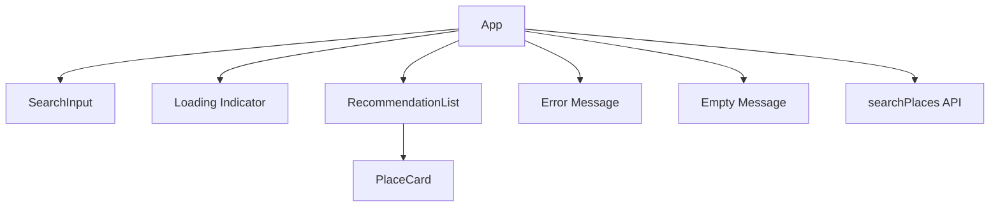
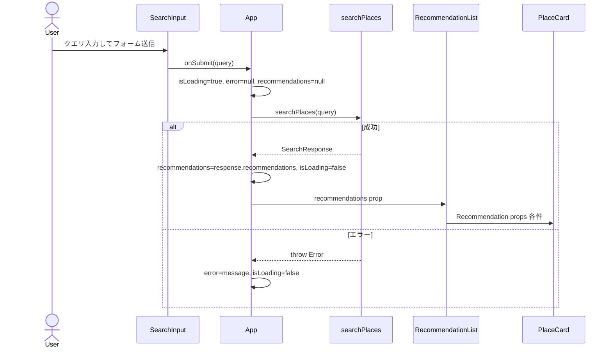

# 技術設計書: App.tsx 統合

## Overview

`App.tsx` 統合フィーチャーは、Chunk 7〜9 で実装済みの `searchPlaces` API クライアント・`SearchInput`・`PlaceCard` を `App.tsx` に組み合わせ、レストラン検索のエンドツーエンド UI フローを提供する。対象ファイルは `App.tsx`（トップレベル統合）・`RecommendationList.tsx`（表示分離）・`App.test.tsx`（統合テスト）の 3 点である。

**Purpose**: 自然文によるレストラン検索から AI 推薦結果のカード一覧表示までの一貫したユーザー体験を実現する。
**Users**: レストランを探すエンドユーザーおよびフロントエンドを保守する開発者が対象となる。
**Impact**: スキャフォールドのみの `App.tsx` に状態管理ロジックとコンポーネント統合を追加し、動作する検索 UI を提供する。

### Goals

- 検索 → ローディング → 結果表示（またはエラー・空状態）の完全な UI フローを実装する
- 既存の `SearchInput`・`PlaceCard`・`searchPlaces` の型契約を変更せずにトップレベルで統合する
- TypeScript strict モードでコンパイルエラーのない実装を保証する
- Vitest + Testing Library によるコアシナリオの統合テストカバレッジを確保する

### Non-Goals

- CSS / スタイリング（デザインシステム未定義）
- ルーティング（SPA 単一ページ構成）
- グローバル状態管理ライブラリの導入（Redux / Zustand 等）
- 非同期キャンセル（AbortController）の実装（P1 リスクとして記録、今フェーズ対象外）
- 検索履歴・お気に入り機能（将来検討）

## Requirements Traceability

| 要件 | 概要 | コンポーネント | インターフェース | フロー |
|------|------|--------------|---------------|-------|
| 1.1 | SearchInput レンダリング | App | SearchInputProps | - |
| 1.2 | タイトル見出し表示 | App | - | - |
| 1.3 | クエリ送信受信 | App | handleSearch | 検索フロー |
| 1.4 | onSubmit コールバック渡し | App | SearchInputProps.onSubmit | - |
| 2.1 | searchPlaces 呼び出し | App | searchPlaces | 検索フロー |
| 2.2 | isLoading / recommendations / error 状態管理 | App | AppState | - |
| 2.3 | ローディング開始時のリセット | App | AppState | 検索フロー |
| 2.4 | 成功時の状態更新 | App | AppState | 検索フロー |
| 2.5 | エラー時の状態更新 | App | AppState | 検索フロー |
| 2.6 | 前回結果のクリア | App | AppState | 検索フロー |
| 3.1 | ローディングインジケーター表示 | App | AppState | - |
| 3.2 | isLoading を SearchInput へ渡す | App | SearchInputProps.isLoading | - |
| 3.3 | 完了時にインジケーター非表示 | App | AppState | - |
| 4.1 | PlaceCard レンダリング | RecommendationList | Recommendation | - |
| 4.2 | Recommendation props 渡し | RecommendationList | PlaceCardProps | - |
| 4.3 | リスト構造でレンダリング | RecommendationList | - | - |
| 4.4 | 一意 key プロパティ | RecommendationList | - | - |
| 5.1 | エラーメッセージ表示 | App | AppState | 検索フロー |
| 5.2 | エラー時は結果を非表示 | App | AppState | - |
| 5.3 | 新規検索時にエラークリア | App | AppState | 検索フロー |
| 6.1 | 未検索時は何も表示しない | App | AppState | - |
| 6.2 | 空状態メッセージ表示 | App | AppState | - |
| 6.3 | 空状態と結果を同時非表示 | App | AppState | - |
| 7.1 | import 宣言 | App | - | - |
| 7.2 | RecommendationList への委譲 | RecommendationList | RecommendationListProps | - |
| 7.3 | TypeScript strict 準拠 | App, RecommendationList | - | - |
| 7.4 | 関数コンポーネント実装 | App, RecommendationList | - | - |
| 8.1 | Vitest + Testing Library 使用 | App.test.tsx | - | - |
| 8.2 | 成功シナリオ検証 | App.test.tsx | vi.mock | - |
| 8.3 | エラーシナリオ検証 | App.test.tsx | vi.mock | - |
| 8.4 | ローディング状態検証 | App.test.tsx | - | - |
| 8.5 | pnpm test --run で全テストパス | App.test.tsx | - | - |

## Architecture

### Existing Architecture Analysis

現在の `App.tsx` はスキャフォールドのみであり、`<h1>Restaurant Discovery</h1>` を描画する最小限の関数コンポーネントとして実装されている。以下のビルディングブロックが確定済みで変更なく再利用できる。

- **SearchInput**: `onSubmit: (query: string) => void` と `isLoading?: boolean` を受け取るフォームコンポーネント
- **PlaceCard**: `Recommendation` 型をスプレッドした Props を受け取るカードコンポーネント
- **searchPlaces**: `POST /api/search` を呼び出し `SearchResponse` を返す非同期関数。HTTP エラー時は `Error` を throw する

### Architecture Pattern & Boundary Map



**Architecture Integration**:
- 選択パターン: コンポーネント構成 + ローカル状態管理（React 関数コンポーネント + useState）
- ドメイン境界: App がオーケストレーションと状態管理を担当し、RecommendationList が表示ロジックを担当する
- 保持する既存パターン: SearchInput の `onSubmit` / `isLoading` 契約、PlaceCard の `Recommendation` スプレッド Props
- 新規コンポーネントの根拠: RecommendationList は単一責任原則に従い App.tsx から表示ロジックを分離するために導入する（要件 7.2）
- Steering 準拠: `src/components/` 配置・関数コンポーネント・TypeScript strict・pnpm test

### Technology Stack

| レイヤー | 選択 / バージョン | 本フィーチャーにおける役割 | 備考 |
|---------|-----------------|--------------------------|------|
| Frontend | React 19 + TypeScript 5 | コンポーネント実装・型定義 | `strict: true` 必須 |
| Test | Vitest 3 + Testing Library | 統合テスト | globals 有効、setup.ts で jest-dom 初期化済み |

新規の外部ライブラリ依存はない。

## System Flows



**Key Decisions**:
- ローディング開始時に `recommendations` と `error` を同時に null クリアすることで前回状態の残留を防ぐ（要件 2.3, 2.6, 5.3）
- 正常・エラー双方で `isLoading` を `false` に戻すことを保証し、ローディングインジケーターを確実に解除する（要件 3.3）

## Components and Interfaces

### コンポーネント概要

| コンポーネント | ドメイン / レイヤー | 役割 | 要件カバレッジ | 主要依存 (P0/P1) | 契約種別 |
|---|---|---|---|---|---|
| App | UI / オーケストレーター | 状態管理・コンポーネント統合 | 1.1〜1.4, 2.1〜2.6, 3.1〜3.3, 5.1〜5.3, 6.1〜6.3, 7.1, 7.3, 7.4 | SearchInput (P0), RecommendationList (P0), searchPlaces (P0) | State |
| RecommendationList | UI / プレゼンテーション | 推薦結果リスト表示 | 4.1〜4.4, 7.2, 7.3, 7.4 | PlaceCard (P0) | State |

### UI / オーケストレーター

#### App

| フィールド | 詳細 |
|-----------|------|
| Intent | アプリケーション状態を管理し SearchInput・RecommendationList・インライン表示要素を統合する |
| Requirements | 1.1, 1.2, 1.3, 1.4, 2.1, 2.2, 2.3, 2.4, 2.5, 2.6, 3.1, 3.2, 3.3, 5.1, 5.2, 5.3, 6.1, 6.2, 6.3, 7.1, 7.3, 7.4 |

**Responsibilities & Constraints**

- `isLoading`・`recommendations`・`error` の 3 フィールド状態を保持・更新する
- `searchPlaces` 呼び出しのライフサイクル（開始 / 成功 / エラー）を制御する
- 各レンダリング条件（アイドル / ローディング / 成功 / エラー / 空状態）を排他的に制御する

**Dependencies**

- Inbound: ユーザー操作 — SearchInput からのフォーム送信 (P0)
- Outbound: SearchInput — `onSubmit` / `isLoading` Props (P0)
- Outbound: RecommendationList — `recommendations` Props (P0)
- External: searchPlaces — バックエンド検索 API 呼び出し (P0)

**Contracts**: State [x]

##### State Management

**状態インターフェース**:

```typescript
interface AppState {
  isLoading: boolean;
  recommendations: Recommendation[] | null;
  error: string | null;
}
```

**初期値**: `{ isLoading: false, recommendations: null, error: null }`

**レンダリング条件テーブル**:

| 条件 | 表示内容 | 対応要件 |
|------|---------|---------|
| `recommendations === null && !isLoading && error === null` | タイトル + SearchInput のみ | 6.1 |
| `isLoading === true` | タイトル + SearchInput(disabled) + ローディングインジケーター | 3.1, 3.2 |
| `error !== null && !isLoading` | タイトル + SearchInput + エラーメッセージ（結果非表示） | 5.1, 5.2 |
| `recommendations !== null && recommendations.length === 0 && !isLoading && error === null` | タイトル + SearchInput + 空状態メッセージ | 6.2, 6.3 |
| `recommendations !== null && recommendations.length > 0 && !isLoading` | タイトル + SearchInput + RecommendationList | 4.1 |

**handleSearch 関数シグネチャ**:

```typescript
async function handleSearch(query: string): Promise<void>
```

- 事前条件: `query` は空白を除いた文字列（SearchInput 側でガード済み）
- 事後条件: `isLoading` が `false` になり、`recommendations` または `error` のいずれか一方が更新される
- 不変条件: 処理完了後（正常・エラー問わず）`isLoading` は `false` になる

**Implementation Notes**

- Integration: `searchPlaces` を try/catch/finally で囲み、`finally` ブロックで `setIsLoading(false)` を確実に実行する
- Validation: `isLoading === true` 時に `handleSearch` が再呼び出しされることは SearchInput の disabled 制御により自然にガードされる
- Risks: 非同期レース条件（前回の検索が遅延して返る）のリスクがあるが、新規検索開始時に `recommendations` を null クリアすることで表示の混在は防ぐ。完全な解決には AbortController が必要（P1 TODO、詳細は `research.md` 参照）

### UI / プレゼンテーション

#### RecommendationList

| フィールド | 詳細 |
|-----------|------|
| Intent | `Recommendation` 配列を受け取り `PlaceCard` のリストとしてレンダリングする |
| Requirements | 4.1, 4.2, 4.3, 4.4, 7.2, 7.3, 7.4 |

**Dependencies**

- Inbound: App — `recommendations` Props (P0)
- Outbound: PlaceCard — `Recommendation` スプレッド Props (P0)

**Contracts**: State [x]

##### State Management

**Props インターフェース**:

```typescript
interface RecommendationListProps {
  recommendations: Recommendation[];
}
```

**Implementation Notes**

- Integration: `<ul>` / `<li>` または等価のコンテナ構造でレンダリングし、各 `<li>` に `key={item.google_maps_url}` を設定する（`google_maps_url` はバックエンドが保証するユニーク識別子）
- Validation: 空配列（`recommendations.length === 0`）は App 側のレンダリング条件で RecommendationList 自体が非表示になるため、このコンポーネントは 1 件以上の配列のみ受け取る
- Risks: `google_maps_url` が重複した場合に key の衝突が発生するが、バックエンドの推薦ロジック上重複は発生しない前提とする

## Error Handling

### Error Strategy

フロントエンド UI 層の状態管理でエラーを捕捉し、ユーザー向けメッセージとして `error` 状態に設定する。エラー種別の詳細分類はこのフェーズでは対象外とし、汎用メッセージを表示する。

### Error Categories and Responses

**ネットワーク / HTTP エラー（searchPlaces throw）**:
- `searchPlaces` が throw した `Error` を catch し、`error` 状態にメッセージを設定する
- TypeScript strict モードでは `catch (e)` の `e` は `unknown` 型になるため、`e.message` への直接アクセスはコンパイルエラーになる。以下のガードパターンを使用する:
  ```typescript
  } catch (e) {
    setError(e instanceof Error ? e.message : '検索に失敗しました');
  }
  ```
- エラー表示中は RecommendationList を非表示にする（要件 5.2）
- 新規検索開始時に `error` を null にクリアする（要件 5.3）

**エラーと成功の排他制御**: `error !== null` の条件と `recommendations !== null` の条件は同時に `true` にならない（ローディング開始時に双方を null クリアするため）

### Monitoring

このフェーズでは外部エラー追跡（Sentry 等）は対象外とする。

## Testing Strategy

### 統合テスト（App.test.tsx）

Vitest + Testing Library を使用し、`searchPlaces` を `vi.mock` によるモジュールレベルモックで制御する。`mockResolvedValueOnce` / `mockRejectedValueOnce` でテストケースごとに戻り値を設定する。

**テストケース（要件 8.1〜8.5）**:

1. **成功シナリオ**: `searchPlaces` が正常レスポンスを返す場合、推薦店舗名が DOM に表示される（8.2）
2. **エラーシナリオ**: `searchPlaces` が `Error` を throw する場合、エラーメッセージが DOM に表示される（8.3）
3. **ローディング状態**: クエリ送信後、`searchPlaces` の解決前に SearchInput が disabled になる（8.4）
   - `mockResolvedValueOnce` は Promise をマイクロタスクキューで解決するため、通常の `expect` では解決前の状態を観察できない。解決しない pending Promise を返す mock を使用する:
     ```typescript
     let resolve!: () => void;
     vi.mocked(searchPlaces).mockReturnValueOnce(
       new Promise((res) => { resolve = () => res({ recommendations: [] }); })
     );
     fireEvent.submit(...);
     expect(input).toBeDisabled();   // ← loading 中を検証
     await act(async () => { resolve(); });
     expect(input).not.toBeDisabled(); // ← 完了後を検証
     ```
4. **空状態**: `searchPlaces` が空の `recommendations` 配列を返す場合、空状態メッセージが表示される
5. **全テストパス**: `docker compose exec frontend pnpm test --run` で全テストがパスする（8.5）

**テスト対象ファイル**:
- `frontend/src/App.test.tsx`（新規作成）

**テスト非対象**:
- RecommendationList 単体テスト（シンプルなプレゼンテーションコンポーネントのため App.test.tsx の統合テストでカバー）
