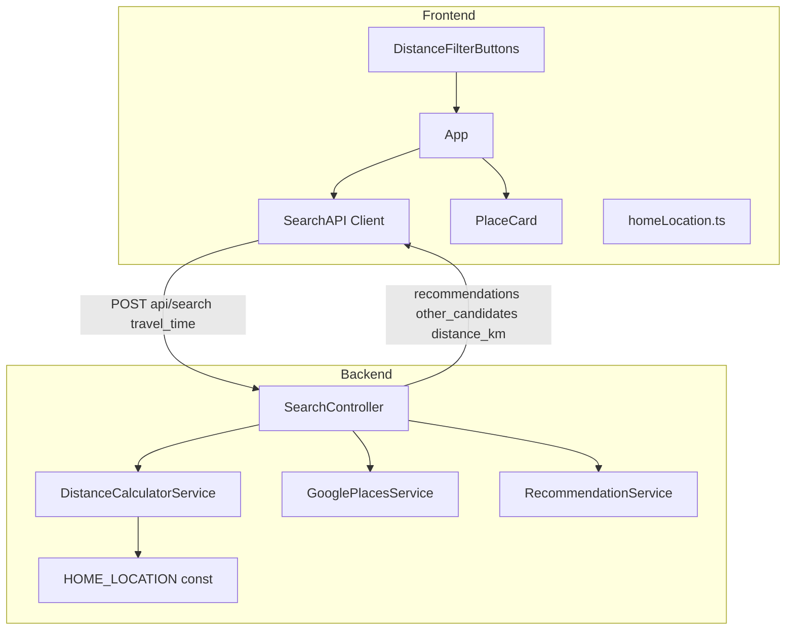
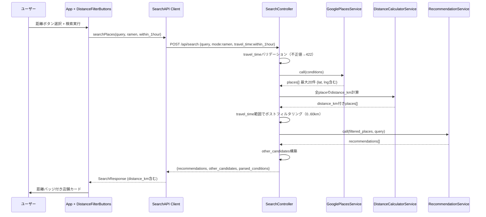

# 設計書

## Overview

距離フィルター機能は、ラーメン検索において新潟市外の店が大量ヒットする問題を解決する。ラーメンタブに移動時間ベースの距離フィルターボタン（30分以内/1時間以内/1時間以上2時間以内/距離指定なし）を追加し、選択された移動時間区分をバックエンドへ送信する。バックエンドはHaversine公式で自宅からの直線距離を計算し、指定範囲外の店舗をポストフィルタリングする。全ラーメン検索レスポンスに各店舗の直線距離（km）を付与し、フロントエンドの店舗カードに表示する。

**ユーザー**: ラーメン検索ユーザー（車移動前提で行ける範囲に絞り込みたい）  
**影響**: 既存の`SearchController`パイプライン（QueryParserService → GooglePlacesService → RecommendationService）に距離計算ステップとポストフィルタリングステップが追加される。`GooglePlacesService`は変更なし。

### Goals

- ラーメンタブ専用の移動時間フィルターUI（4択ラジオボタン方式）を提供する
- バックエンドが`travel_time`パラメータを受け取り、自宅からの直線距離でポストフィルタリングする
- 全ラーメン検索レスポンスに`distance_km`を付与し、各店舗カードに表示する

### Non-Goals

- 居酒屋モード・おまかせ・refineへの距離フィルター・距離表示の適用
- Google Places APIへのlocationBias/locationRestriction追加（ポストフィルタリングで代替）
- GPS・デバイス位置情報の取得
- 自宅位置のUI変更機能
- ルート距離（実走行距離）の使用

## Boundary Commitments

### This Spec Owns

- フロントエンド・バックエンドそれぞれの自宅位置設定ファイル（定数定義）
- `DistanceFilterButtons`コンポーネント（ラーメンタブ専用距離フィルターUI）
- `App.tsx`への`distanceFilter`ステート追加と検索への組み込み
- `SearchRequest`への`travel_time`パラメータ追加（型定義・APIクライアント）
- `SearchController`での`travel_time`バリデーション・距離計算・ポストフィルタリング
- `DistanceCalculatorService`（Haversine距離計算）
- `Candidate`型への`distance_km`追加とフロントエンドでの表示（`PlaceCard`拡張）

### Out of Boundary

- 居酒屋モード・おまかせ・refineへの距離機能拡張（refineの`distance_km`付与も本スペック対象外）
- `GooglePlacesService`のlocationBias変更（50km上限制限のため採用しない）
- 地図上の距離圏描画
- `distance_km`を軸としたソート機能

### Allowed Dependencies

- 既存`GooglePlacesService`（変更なし、後方互換性維持）
- 既存`RecommendationService`（変更なし。`place.merge(reason:)`が`distance_km`を自動保持する）
- 既存`App.tsx`状態管理パターン（同列で`distanceFilter`ステートを追加）
- 既存`PlaceCard`コンポーネント（`distance_km`表示フィールドを追加）

### Revalidation Triggers

- `TravelTime`値セットの変更（フロントUI・バックエンドバリデーション・`TRAVEL_TIME_RANGES`が影響を受ける）
- `Candidate`型スキーマの変更（refine等の他APIクライアントにも伝播）
- 自宅位置定数の変更（フロント`homeLocation.ts`とバックエンド`home_location.rb`を同時更新する必要あり）

## Architecture

### Existing Architecture Analysis

現在の検索パイプライン（`SearchController#create`）:

1. `QueryParserService` → 自然文を `{area, genre, price_level, keyword}` に変換
2. `GooglePlacesService` → テキストクエリでGoogle Places APIから最大20件取得。位置情報・半径は未使用。`lat`/`lng`はすでに取得済み
3. `RecommendationService` → `places_by_name`でlookupし`place.merge(reason:)`でフィールドを保持。`distance_km`を付与しておけば自動的に流れる
4. `SearchController` → `recommended_names`を除いた残りを`other_candidates`として構築

Place objectの現在の形式: `{name, rating, price_level, address, google_maps_url, lat, lng}`

### Architecture Pattern & Boundary Map



**設計方針**:
- `GooglePlacesService`は変更なし（locationBiasは50km上限のため採用しない。詳細は`research.md`参照）
- `DistanceCalculatorService`をステートレスサービスとして実装し、`SearchController`が`.new.call()`で呼び出す（既存Service Objectパターンと統一）
- フロントエンドは`App.tsx`に`distanceFilter`ステートを追加する（既存タブ管理パターンと同列）
- ポストフィルタリングが距離制限の唯一のhard constraint

### Technology Stack

| レイヤー | 選択 | 役割 |
|---------|------|------|
| Frontend / UI | React 19 + TypeScript strict | `DistanceFilterButtons`新規、`PlaceCard`拡張 |
| Frontend / Config | `src/config/homeLocation.ts`（新規） | 自宅位置定数 |
| Backend / Service | `DistanceCalculatorService`（新規） | Haversine直線距離計算 |
| Backend / Config | `config/initializers/home_location.rb`（新規） | `HOME_LOCATION`定数 |

## File Structure Plan

### Directory Structure

```
frontend/src/
├── config/
│   ├── omakaseAreas.ts           # 既存（変更なし）
│   └── homeLocation.ts           # [新規] 自宅緯度経度定数
├── types/
│   └── search.ts                 # [修正] TravelTime型追加・Candidateにdistance_km追加
├── api/
│   └── search.ts                 # [修正] travel_timeオプション引数追加
├── components/
│   ├── DistanceFilterButtons.tsx  # [新規] 距離フィルターラジオボタンUI
│   ├── PlaceCard.tsx             # [修正] distance_km表示追加
│   └── ...その他既存（変更なし）
└── App.tsx                       # [修正] distanceFilterステート・DistanceFilterButtons組み込み

backend/
├── config/initializers/
│   └── home_location.rb          # [新規] HOME_LOCATION定数
├── app/services/
│   └── distance_calculator_service.rb  # [新規] Haversine計算サービス
└── app/controllers/api/
    └── search_controller.rb      # [修正] travel_time検証・distance_km付与・ポストフィルタリング
```

### Modified Files

- `frontend/src/types/search.ts` — `TravelTime` union型と`Candidate#distance_km?: number | null`（optionalフィールド）を追加
- `frontend/src/api/search.ts` — `searchPlaces`にオプション`travelTime?: TravelTime`引数を追加
- `frontend/src/App.tsx` — `distanceFilter: TravelTime | null`ステート追加、ラーメンタブで`DistanceFilterButtons`表示、タブ切替時にリセット
- `frontend/src/components/PlaceCard.tsx` — `distance_km`の表示（`null`時は非表示）
- `backend/app/controllers/api/search_controller.rb` — `travel_time`バリデーション・`distance_km`付与・ポストフィルタリングの追加

## System Flows



**フロー上の決定事項**:
- `distance_km`はポストフィルタリング前に全件計算・付与する。`RecommendationService`の`place.merge(reason:)`が値を自動保持するため
- `travel_time`なしの場合: `distance_km`は付与するがフィルタリングはスキップ（要件5.2）
- `lat`/`lng`が`nil`のplaceは`distance_km: nil`とし、`travel_time`指定時は除外する（ソフト劣化）

## Requirements Traceability

| 要件 | 概要 | コンポーネント | インターフェース |
|------|------|----------------|-----------------|
| 1.1 | 自宅位置をapp設定として保持 | homeLocation.ts, HOME_LOCATION | - |
| 2.1 | ラーメンタブに距離フィルターボタン表示 | DistanceFilterButtons, App | DistanceFilterButtonsProps |
| 2.2 | 居酒屋タブでボタン非表示 | App | - |
| 2.3 | 選択ボタンのラジオ表示 | DistanceFilterButtons | DistanceFilterButtonsProps |
| 2.4 | ラーメン初期表示で「距離指定なし」選択 | App | - |
| 3.1 | フィルター選択時にtravel_timeを含む検索リクエスト | SearchAPI Client, App | SearchRequest |
| 3.2 | 「距離指定なし」時はtravel_time省略 | SearchAPI Client | SearchRequest |
| 4.1 | 距離パラメータ付きリクエストの検索範囲制限 | SearchController, DistanceCalculatorService | TRAVEL_TIME_RANGES |
| 4.2 | 距離パラメータなしは従来通りの検索 | SearchController | - |
| 4.3 | 無効な距離パラメータで422エラー | SearchController | - |
| 5.1 | レスポンスにdistance_km付与（推薦・候補） | SearchController, DistanceCalculatorService | Candidate |
| 5.2 | ラーメン全検索にdistance_km付与（フィルター有無不問） | SearchController | Candidate |
| 6.1 | 各店舗カードに距離表示 | PlaceCard | PlaceCardProps |

## Components and Interfaces

| コンポーネント | レイヤー | 役割 | 要件 | 主要依存 | 契約 |
|------------|---------|------|------|---------|------|
| homeLocation.ts | Frontend/Config | 自宅位置定数 | 1.1 | なし | State |
| DistanceFilterButtons | Frontend/UI | 距離フィルターUI | 2.1–2.4 | なし | State |
| App（拡張） | Frontend/Orchestration | distanceFilterステート管理 | 2.1–2.4, 3.1–3.2 | SearchAPI Client, DistanceFilterButtons | State |
| SearchAPI Client（拡張） | Frontend/API | travel_timeをリクエストに含める | 3.1–3.2 | fetch | API |
| PlaceCard（拡張） | Frontend/UI | distance_km表示 | 6.1 | なし | - |
| HOME_LOCATION | Backend/Config | 自宅位置定数 | 1.1 | なし | - |
| DistanceCalculatorService | Backend/Service | Haversine距離計算 | 5.1–5.2 | HOME_LOCATION | Service |
| SearchController（拡張） | Backend/Controller | travel_time検証・distance_km付与・フィルタリング | 4.1–4.3, 5.1–5.2 | DistanceCalculatorService, GooglePlacesService | API |

### Frontend / Config

#### homeLocation.ts

| フィールド | 詳細 |
|---------|------|
| Intent | 自宅緯度経度の静的定数。距離表示・フィルターのフロントエンド参照点 |
| Requirements | 1.1 |

**Contracts**: State [x]

##### State Management

```typescript
// frontend/src/config/homeLocation.ts
export const HOME_LOCATION = {
  lat: 37.9161,  // デフォルト: 新潟駅付近。変更時はbackend/config/initializers/home_location.rbも更新
  lng: 139.0364,
} as const;

export type HomeLocation = typeof HOME_LOCATION;
```

### Frontend / UI

#### DistanceFilterButtons

| フィールド | 詳細 |
|---------|------|
| Intent | ラーメンタブ専用の移動時間選択ボタン群（ラジオボタン方式） |
| Requirements | 2.1, 2.2, 2.3, 2.4 |

**Contracts**: State [x]

##### State Management

```typescript
// frontend/src/types/search.ts に定義
export type TravelTime = 'within_30min' | 'within_1hour' | '1_to_2_hours';

// frontend/src/components/DistanceFilterButtons.tsx
interface DistanceFilterButtonsProps {
  value: TravelTime | null;              // null = 距離指定なし
  onChange: (value: TravelTime | null) => void;
}
```

- State model: Controlled component（親が状態を保持）
- 4ボタン構成: "30分以内" (`within_30min`) / "1時間以内" (`within_1hour`) / "1時間以上2時間以内" (`1_to_2_hours`) / "距離指定なし" (`null`)

**Implementation Notes**:
- `App.tsx`が`activeTab === 'ramen'`の場合のみレンダリング（要件2.2はApp側が制御）
- 選択状態はTailwindで視覚的に区別（選択: 塗りつぶし、非選択: アウトライン）
- "距離指定なし"クリック時は`onChange(null)`を呼ぶ

#### PlaceCard（拡張）

| フィールド | 詳細 |
|---------|------|
| Intent | `distance_km`が`null`でない場合に距離バッジを表示する |
| Requirements | 6.1 |

**Implementation Notes**:
- 既存propsに`distance_km?: number | null`を追加（optionalフィールド、後方互換性あり）
- `distance_km != null`（loose equality）の場合のみ表示（例: "15.3 km"、小数点1桁）。`undefined`（居酒屋）と`null`（lat/lng欠損）の両方を非表示にする
- 居酒屋モードではレスポンスに`distance_km`フィールドが不在のため`undefined`となり非表示

### Frontend / Orchestration

#### App（拡張）

| フィールド | 詳細 |
|---------|------|
| Intent | distanceFilterステートの管理とDistanceFilterButtonsの組み込み |
| Requirements | 2.1–2.4, 3.1–3.2 |

**Contracts**: State [x]

##### State Management

```typescript
// 追加ステート（null = 距離指定なし）
const [distanceFilter, setDistanceFilter] = useState<TravelTime | null>(null);

// タブ切替時にリセット（既存handleTabChangeに追加）
setDistanceFilter(null);

// 検索実行時（activeTab === 'ramen'の場合のみ渡す）
searchPlaces(query, activeTab, activeTab === 'ramen' ? distanceFilter ?? undefined : undefined)
```

- ラーメンタブ初期表示時は`null`（「距離指定なし」が初期値、要件2.4）
- `distanceFilter`が`null`の場合、`travel_time`をAPIリクエストに含めない（要件3.2）

### Frontend / API

#### SearchAPI Client（拡張）

| フィールド | 詳細 |
|---------|------|
| Intent | travel_timeをオプション引数として受け取りリクエストボディに含める |
| Requirements | 3.1, 3.2 |

**Contracts**: API [x]

##### API Contract

型定義の変更（`frontend/src/types/search.ts`）:

```typescript
export type TravelTime = 'within_30min' | 'within_1hour' | '1_to_2_hours';

export interface Candidate {
  name: string;
  rating: number | null;
  price_level: string | null;
  address: string;
  google_maps_url: string;
  lat: number | null;
  lng: number | null;
  distance_km?: number | null;  // [追加] ラーメンモード時に数値、居酒屋はundefined（フィールド不在）
}
```

APIクライアントの変更（`frontend/src/api/search.ts`）:

```typescript
export async function searchPlaces(
  query: string,
  mode: 'izakaya' | 'ramen',
  travelTime?: TravelTime,
): Promise<SearchResponse>
```

| Method | Endpoint | Request | Response | Errors |
|--------|----------|---------|----------|--------|
| POST | /api/search | `{query: string, mode: string, travel_time?: TravelTime}` | SearchResponse | 422, 502 |

**Implementation Notes**:
- `travelTime`が`undefined`の場合、リクエストボディに`travel_time`キーを含めない（要件3.2）

### Backend / Config

#### HOME_LOCATION

| フィールド | 詳細 |
|---------|------|
| Intent | バックエンドにおける自宅位置の静的定数。距離計算・フィルタリングの起点 |
| Requirements | 1.1 |

```ruby
# backend/config/initializers/home_location.rb
HOME_LOCATION = {
  lat: 37.9161,  # デフォルト: 新潟駅付近。変更時はfrontend/src/config/homeLocation.tsも更新
  lng: 139.0364
}.freeze
```

Railsアプリ起動時にロードされ、全コントローラー・サービスから参照可能。

### Backend / Module

#### DistanceCalculatorService

| フィールド | 詳細 |
|---------|------|
| Intent | 2地点間のHaversine直線距離（km）を計算するステートレスサービス |
| Requirements | 5.1, 5.2 |

**Contracts**: Service [x]

##### Service Interface

```ruby
# backend/app/services/distance_calculator_service.rb
class DistanceCalculatorService
  EARTH_RADIUS_KM = 6371.0

  # @param home_lat [Float] 起点（自宅）緯度
  # @param home_lng [Float] 起点（自宅）経度
  # @param place_lat [Float] 目的地緯度
  # @param place_lng [Float] 目的地経度
  # @return [Float] 直線距離（km）
  def call(home_lat, home_lng, place_lat, place_lng)
    # Haversine formula
  end
end
```

- 呼び出し: `DistanceCalculatorService.new.call(home_lat, home_lng, place_lat, place_lng)`（既存Service Objectパターンと統一）
- 事前条件: 全引数がFloat（`nil`の場合は呼び出し元でnilチェック）
- 副作用なし、冪等、外部依存なし

### Backend / Controller

#### SearchController（拡張）

| フィールド | 詳細 |
|---------|------|
| Intent | travel_timeバリデーション・全placeへのdistance_km付与・ポストフィルタリング |
| Requirements | 4.1, 4.2, 4.3, 5.1, 5.2 |

**Contracts**: API [x]

##### API Contract

```ruby
# SearchController内の定数
TRAVEL_TIME_RANGES = {
  "within_30min" => { min_km: 0,  max_km: 30  },
  "within_1hour" => { min_km: 0,  max_km: 60  },
  "1_to_2_hours" => { min_km: 60, max_km: 120 }
}.freeze
```

| Method | Endpoint | Request | Response | Errors |
|--------|----------|---------|----------|--------|
| POST | /api/search | `{query, mode?, travel_time?}` | SearchResponse（distance_km含む） | 422（invalid travel_time）, 502（外部API失敗） |

**Responsibilities**:
1. `travel_time`が存在する場合: `TRAVEL_TIME_RANGES`のキーと照合し、不正値は422を返す
2. ラーメンモードの全places: `DistanceCalculatorService.new.call`で`distance_km`を付与（`lat`/`lng`が`nil`の場合は`nil`）
3. `travel_time`が存在する場合: `range[:min_km] <= distance_km && distance_km <= range[:max_km]`でポストフィルタリング（`distance_km: nil`のplaceは除外）
4. ポストフィルタリング後に`places.empty?`チェック（既存ガード節を移動・統合）

**Implementation Notes**:
- `distance_km`付与はラーメンモード（`mode == "ramen"`）のみ実施
- `RecommendationService`を呼ぶ前にフィルタリングを完了させる（AIが距離範囲外の店を推薦しない）
- ラーメンモードのplace hashに`:distance_km`キーを追加 → `place.merge(reason:)`で自動保持される
- `lat`/`lng`が`nil`のplaceは`distance_km: nil`としてログに記録し、`travel_time`指定時は除外（ソフト劣化）

## Data Models

### Data Contracts & Integration

**検索リクエスト（拡張後）**:
```json
{ "query": "濃厚ラーメン", "mode": "ramen", "travel_time": "within_1hour" }
```

**Candidateの拡張後スキーマ**（推薦店・候補店共通）:
```json
{
  "name": "麺屋 例",
  "rating": 4.2,
  "price_level": "PRICE_LEVEL_INEXPENSIVE",
  "address": "新潟市...",
  "google_maps_url": "https://...",
  "lat": 37.92,
  "lng": 139.05,
  "distance_km": 8.3
}
```

- ラーメンモード: `distance_km`は常に付与（`null`の可能性あり: `lat`/`lng`が`nil`の場合）
- 居酒屋モード: `distance_km`フィールドなし（フロントエンドではoptional型のため`undefined`、`!= null`ガードで非表示）
- refine: `distance_km`付与なし（本スペック対象外）

## Error Handling

### Error Categories and Responses

| エラー種別 | 条件 | レスポンス |
|---------|------|-----------|
| 422 Unprocessable | `travel_time`が`TRAVEL_TIME_RANGES`に存在しない値 | `{ error: "travel_time は within_30min, within_1hour, 1_to_2_hours のいずれかを指定してください" }` |
| 軟性劣化 | `lat`/`lng`が`nil`のplace | `distance_km: nil`として付与、`travel_time`指定時は除外（`Rails.logger.warn`で記録） |
| 502 Bad Gateway | Google Places API / OpenAI 失敗 | 既存`rescue_from`パターン（変更なし） |

## Testing Strategy

### Unit Tests（バックエンド）

1. `DistanceCalculatorService`: 既知2点間の距離精度検証（新潟駅 → 長岡駅 ≈ 37km）
2. `DistanceCalculatorService`: 同一地点の距離が0.0km
3. `SearchController` travel_timeバリデーション: 不正値で422を返す
4. `SearchController` ポストフィルタリング: `within_30min`で30km超の店舗が除外される
5. `SearchController` distance_km付与: ラーメンモードの全candidateに`distance_km`が含まれる
6. `SearchController` izakayaモード: `distance_km`フィールドなし

### Integration Tests（バックエンド）

1. `POST /api/search` (ramen, within_1hour): 60km超の店舗が除外される（WebMockでlat/lng固定）
2. `POST /api/search` (ramen, 距離指定なし): 全件返却、各candidateに`distance_km`あり
3. `POST /api/search` (ramen, 1_to_2_hours): 60km未満・120km超の店舗が除外される
4. `POST /api/search` (invalid travel_time): 422を返す
5. `POST /api/search` (izakaya): `distance_km`フィールドが含まれない

### Unit Tests（フロントエンド）

1. `DistanceFilterButtons`: 4ボタンが表示される
2. `DistanceFilterButtons`: ボタンクリックで`onChange`が正しい値で呼ばれる
3. `DistanceFilterButtons`: `value`に応じた選択スタイルが適用される
4. `PlaceCard`: `distance_km`が数値の場合に距離表示が出る
5. `PlaceCard`: `distance_km: null`の場合に距離表示なし

### E2E / UI Tests

1. ラーメンタブ選択時に距離フィルターボタンが表示され、居酒屋タブで非表示になる
2. 距離ボタン選択後に検索実行し、各店舗カードに距離が表示される
