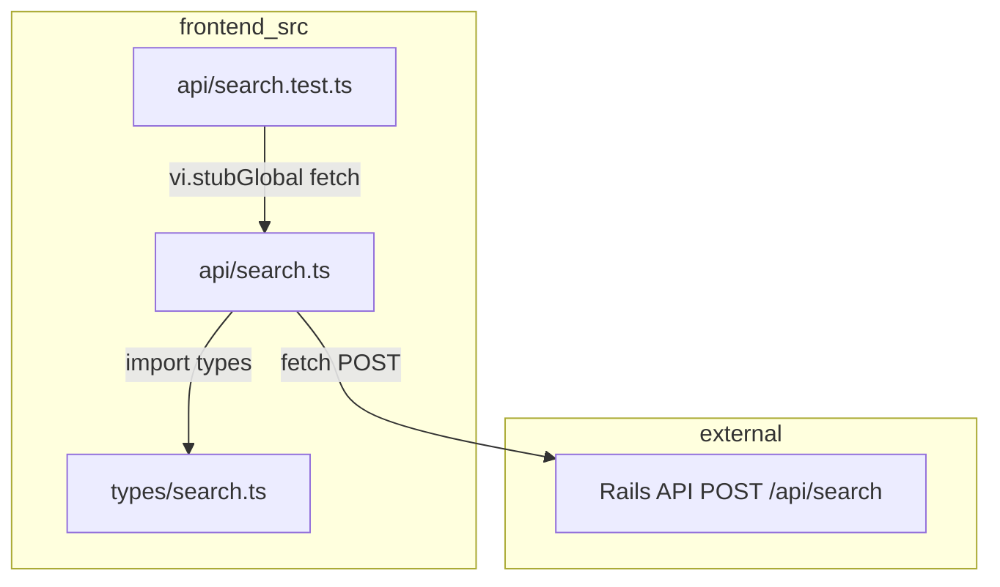
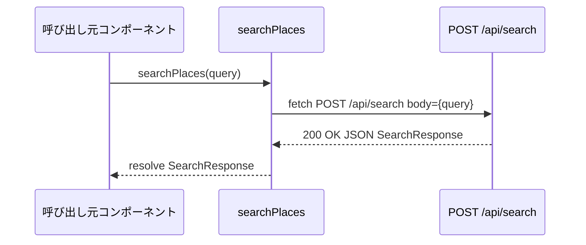
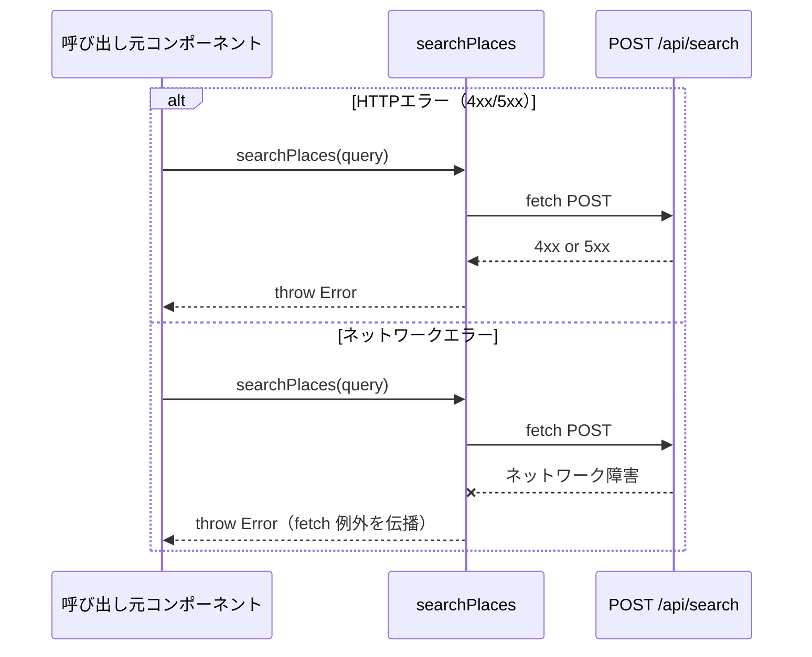

# Design Document: frontend-api-client

## Overview

本機能は、レストラン発見アプリのフロントエンドに **TypeScript 型定義** と **APIクライアント関数** を追加する。バックエンドの `POST /api/search` エンドポイントへの fetch 通信を一か所に集約し、Chunk 8〜10 のコンポーネント実装が型安全な API 呼び出しを行えるよう基盤を整える。

**Purpose**: フロントエンドとバックエンドの通信契約を TypeScript 型として明文化し、HTTP エラー・ネットワークエラーを統一的に例外として伝播させることで、呼び出し元が一貫したエラーハンドリングを実装できるようにする。

**Users**: Chunk 8 (SearchInput)・Chunk 9 (PlaceCard)・Chunk 10 (App.tsx) の実装者が `searchPlaces()` と型定義を利用する。

**Impact**: スキャフォールド段階の `frontend/src/` に `types/` と `api/` ディレクトリが新設される。既存の `App.tsx` / `main.tsx` には変更なし。

### Goals

- `SearchRequest` / `Recommendation` / `SearchResponse` 型を export し、後続コンポーネントの型安全性を保証する
- `searchPlaces(query)` 関数が `POST /api/search` を呼び出し、成功時に `SearchResponse` を resolve する
- HTTP 4xx/5xx・ネットワークエラー時は例外を throw し、呼び出し元に委ねる
- Vitest + fetch モックによる自動テストで動作を保証する

### Non-Goals

- Vite proxy 以外のCORS・認証設定（本機能スコープ外）
- エラー時のUI表示（Chunk 10 の責務）
- リクエストのキャッシュ・デバウンス（後続 Chunk で検討）
- `searchPlaces` 以外の API エンドポイント

---

## Requirements Traceability

| Requirement | Summary | Components | Interfaces | Flows |
|-------------|---------|------------|------------|-------|
| 1.1 | SearchRequest を export | TypeDefinitionsModule | TypeScript type export | — |
| 1.2 | strict モード準拠 | TypeDefinitionsModule | TypeScript type export | — |
| 2.1 | Recommendation の全フィールド定義 | TypeDefinitionsModule | TypeScript type export | — |
| 2.2 | null 許容（optional 不使用） | TypeDefinitionsModule | TypeScript type export | — |
| 3.1 | SearchResponse を export | TypeDefinitionsModule | TypeScript type export | — |
| 3.2 | parsed_conditions の null 許容 | TypeDefinitionsModule | TypeScript type export | — |
| 4.1 | searchPlaces シグネチャ | SearchApiClient | Service Interface | Normal Flow |
| 4.2 | POST /api/search への fetch | SearchApiClient | Service Interface | Normal Flow |
| 4.3 | JSON パース → SearchResponse | SearchApiClient | Service Interface | Normal Flow |
| 5.1 | 4xx/5xx で throw | SearchApiClient | Error Handling | Error Flow |
| 5.2 | 422 で throw | SearchApiClient | Error Handling | Error Flow |
| 6.1 | ネットワークエラーで throw | SearchApiClient | Error Handling | Error Flow |
| 6.2 | エラーを伝播（握りつぶし禁止） | SearchApiClient | Error Handling | Error Flow |
| 7.1–7.5 | Vitest テストカバレッジ | TestSuite | — | — |

---

## Architecture

### Architecture Pattern & Boundary Map

レイヤードモジュール構成を採用する。型定義層（`types/`）は何にも依存せず、APIクライアント層（`api/`）のみが型定義層に依存する。



**Architecture Integration**:
- Selected pattern: レイヤードモジュール — 型と HTTP 通信ロジックを分離し、後続コンポーネントが型だけを import できる構造
- Domain/feature boundaries: `types/` は pure type export（ランタイムコードなし）、`api/` は fetch ロジックのみ
- Existing patterns preserved: テストは `*.test.ts` をソースと同階層に配置（steering 準拠）
- New components rationale: `src/types/` と `src/api/` は app-design.md の設計に準拠して新設
- Steering compliance: TypeScript strict 準拠、`any` 型不使用、コロケーションテスト

### Technology Stack

| Layer | Choice / Version | Role in Feature | Notes |
|-------|-----------------|-----------------|-------|
| 言語 | TypeScript 5.9 (strict) | 型定義・APIクライアント実装 | `noUnusedLocals`, `noUnusedParameters` 有効 |
| HTTP | Native fetch (Web API) | `POST /api/search` の送受信 | 追加ライブラリ不要。jsdom で利用可能 |
| テスト | Vitest 3.2 + jsdom 26 | fetch モック・アサーション | globals 有効、`vi.stubGlobal` でモック |
| Dev Proxy | Vite 6 `server.proxy` | `/api` → `http://backend:3000` フォワード | ブラウザからの CORS 問題を回避 |

---

## System Flows

### 正常系フロー



### エラーフロー



---

## Components and Interfaces

| Component | Domain/Layer | Intent | Req Coverage | Key Dependencies | Contracts |
|-----------|-------------|--------|--------------|------------------|-----------|
| TypeDefinitionsModule | types/ | 通信契約の TypeScript 型を export | 1.1–3.2 | なし | Type Export |
| SearchApiClient | api/ | `searchPlaces` 関数で POST /api/search を呼び出す | 4.1–6.2 | TypeDefinitionsModule (P0), fetch API (P0) | Service Interface |
| TestSuite | api/ | fetch モックによる SearchApiClient の自動テスト | 7.1–7.5 | SearchApiClient (P0), Vitest vi (P0) | — |

---

### types/ Layer

#### TypeDefinitionsModule

| Field | Detail |
|-------|--------|
| Intent | `SearchRequest` / `Recommendation` / `SearchResponse` 型を export するランタイムコードなしの型定義モジュール |
| Requirements | 1.1, 1.2, 2.1, 2.2, 3.1, 3.2 |

**Responsibilities & Constraints**
- 3つの型を named export する
- ランタイムコードを含まない（型定義のみ）
- `any` 型・`unknown` 型を使用しない
- オプショナルフィールド（`field?: T`）は使用しない。省略可能な値は `field: T | null` で表現する

**Dependencies**
- External: なし（純粋な型定義）

**Contracts**: Type Export [x]

##### 型定義

```typescript
// src/types/search.ts

export type SearchRequest = {
  query: string;
};

export type OpeningHours = {
  open_now: boolean;
  weekday_text: string[];
};

export type Recommendation = {
  name: string;
  rating: number | null;
  price_level: string | null;
  address: string;
  google_maps_url: string;
  photo_url: string | null;
  opening_hours: OpeningHours | null;
  reason: string;
};

export type ParsedConditions = {
  area: string | null;
  genre: string | null;
  price_level: string | null;
};

export type SearchResponse = {
  recommendations: Recommendation[];
  parsed_conditions: ParsedConditions;
};
```

- Preconditions: なし（型のみ）
- Postconditions: なし（型のみ）
- Invariants: `Recommendation` の必須フィールド（`name`, `address`, `google_maps_url`, `reason`）は `null` を許容しない

**Implementation Notes**
- `OpeningHours` と `ParsedConditions` を named type として切り出すことで、後続コンポーネントが必要な型だけを import できる
- strict モードのコンパイルエラーがないことをビルド時に確認する

---

### api/ Layer

#### SearchApiClient

| Field | Detail |
|-------|--------|
| Intent | `searchPlaces` 関数を通じて `POST /api/search` を呼び出し、成功時は `SearchResponse` を返し、エラー時は例外を throw する |
| Requirements | 4.1, 4.2, 4.3, 5.1, 5.2, 6.1, 6.2 |

**Responsibilities & Constraints**
- `searchPlaces(query: string): Promise<SearchResponse>` を named export する
- `response.ok` が `false` の場合（4xx/5xx を含む）、例外を throw する
- `fetch` が throw した場合（ネットワークエラー）、例外を握りつぶさず伝播させる
- `any` 型を使用しない

**Dependencies**
- Inbound: Chunk 8〜10 のコンポーネント — `searchPlaces` を呼び出す (P0)
- Outbound: TypeDefinitionsModule — `SearchRequest`, `SearchResponse` 型を import (P0)
- External: `fetch` Web API — HTTP 通信 (P0)

**Contracts**: Service Interface [x]

##### Service Interface

```typescript
// src/api/search.ts

import type { SearchResponse } from '../types/search';

export function searchPlaces(query: string): Promise<SearchResponse>;
```

- Preconditions: `query` は非空文字列を想定（バリデーションは呼び出し元の責務）
- Postconditions: 成功時は `SearchResponse` 型のオブジェクトで resolve される
- Invariants: 非 2xx レスポンスおよびネットワークエラーは必ず throw される

##### API Contract

| Method | Endpoint | Request Body | Response Body | Errors |
|--------|----------|-------------|---------------|--------|
| POST | /api/search | `{ "query": string }` | `SearchResponse` JSON | 422 (クエリなし), 502 (外部APIエラー) |

**Implementation Notes**
- Integration: `Content-Type: application/json` ヘッダを必ず付与する。`JSON.stringify({ query })` でボディをシリアライズする
- Validation: `response.ok` チェックのみ。JSON パースエラーは `SyntaxError` として自然に伝播させる
- Risks: バックエンドが返す JSON のフィールドが実行時に型と異なる場合があるが、型アサーションで対応する。実行時バリデーション（Zod 等）は本 Chunk のスコープ外

#### TestSuite

| Field | Detail |
|-------|--------|
| Intent | `vi.stubGlobal('fetch', ...)` を用いて `searchPlaces` の正常系・HTTP エラー・ネットワークエラーを検証する |
| Requirements | 7.1, 7.2, 7.3, 7.4, 7.5 |

**Implementation Notes**
- `afterEach(() => vi.restoreAllMocks())` でテスト間の fetch モックをリセットする
- 各テストケースで `fetch` の返値を `vi.stubGlobal` で上書きし、`Response` オブジェクトを返す
- テストファイルの配置: `src/api/search.test.ts`（`src/api/search.ts` と同階層）

---

## Data Models

### Data Contracts & Integration

#### API Data Transfer

**Request Schema**（`POST /api/search`）:
```
Content-Type: application/json
Body: { "query": "<自然文クエリ>" }
```

**Response Schema**（200 OK）:
```
Content-Type: application/json
Body: SearchResponse
  - recommendations: Recommendation[]
  - parsed_conditions: ParsedConditions
```

- Serialization: JSON（`JSON.stringify` / `response.json()`）
- Validation: フロントエンドは型アサーションのみ。実行時スキーマ検証はスコープ外

---

## Error Handling

### Error Strategy

`searchPlaces` は単一の公開関数として、すべての異常系を例外（`throw`）として伝播させる。呼び出し元（Chunk 10 の App.tsx）が `try/catch` でエラーを受け取り、UI に反映する責務を持つ。

### Error Categories and Responses

| エラー種別 | 発生条件 | searchPlaces の挙動 |
|-----------|---------|---------------------|
| HTTP 4xx（422 含む） | バックエンドがバリデーションエラーを返す | `response.ok === false` → throw Error |
| HTTP 5xx（502 含む） | バックエンドが外部 API エラーを返す | `response.ok === false` → throw Error |
| ネットワークエラー | DNS 解決失敗・タイムアウト等 | `fetch` の例外を catch せず伝播 |
| JSON パースエラー | バックエンドが不正な JSON を返す | `response.json()` の `SyntaxError` を伝播 |

---

## Testing Strategy

### Unit Tests（`src/api/search.test.ts`）

以下の3ケースを Vitest + `vi.stubGlobal('fetch', ...)` で検証する：

1. **正常系**: fetch が 200 OK で `SearchResponse` 形式の JSON を返す → `searchPlaces` が `SearchResponse` 型のオブジェクトで resolve されることを検証
2. **422 エラー**: fetch が 422 を返す → `searchPlaces` が例外を throw することを `rejects.toThrow()` で検証
3. **ネットワークエラー**: fetch 自体が `Error` を throw する → `searchPlaces` が例外を throw することを検証

### Type Checking（ビルド時）

- `pnpm build`（= `tsc -b && vite build`）で型エラーがないことを確認
- `noUnusedLocals`・`noUnusedParameters` 違反がないことを確認

### Integration（手動確認）

- `docker compose up` 後に画面からクエリを入力し、バックエンドへのリクエストが届くことを Dev Tools で確認

---

## Security Considerations

- `searchPlaces` のリクエストボディには `query` のみを含める。コンポーネントから渡された追加フィールドを混入させない
- クエリ文字列はバックエンド（QueryParserService）でサニタイズされるため、フロントエンドはエスケープ処理を追加しない

---

## Supporting References

本ドキュメントの設計根拠の詳細（URLの選定理由、モックパターンの比較、型設計の trade-off）は `research.md` を参照。
