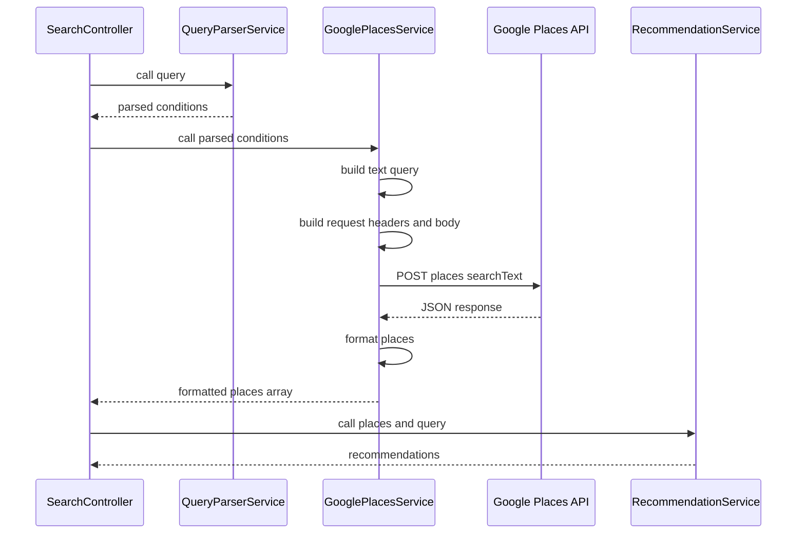
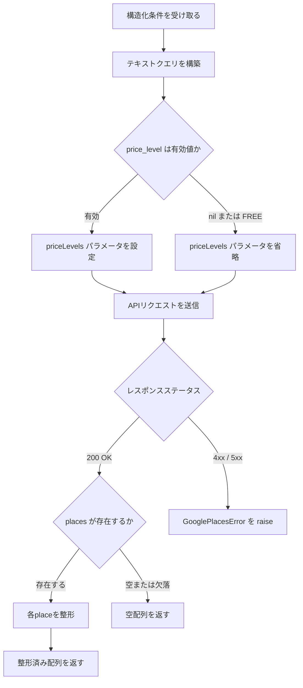

# Technical Design: google-places-service

## Overview

**Purpose**: GooglePlacesServiceは、構造化された検索条件をGoogle Places API (New) の Text Search エンドポイントに変換し、候補店舗リストを取得するバックエンドサービスを提供する。

**Users**: SearchController（Chunk 6統合時）が本サービスを呼び出し、QueryParserServiceの出力をRecommendationServiceの入力に変換するパイプラインの中間段として機能する。

### Goals
- QueryParserServiceの出力（構造化条件）からGoogle Places APIリクエストを構築し、店舗候補を取得する
- 後続のRecommendationServiceが利用しやすい統一フォーマットでレスポンスを返す
- 既存のサービスオブジェクトパターン（QueryParserService）と一貫した設計を維持する

### Non-Goals
- 写真・営業時間の取得（フィールドマスク最小化方針により除外。詳細は requirements.md の Design Decision 参照）
- ページネーション対応（初期は1ページ目のみ取得、最大20件）
- レート制限・リトライ機構（個人利用ツールのため初期スコープ外）
- SearchControllerへの統合（Chunk 6で実施）

## Architecture

### Existing Architecture Analysis

既存のサービスパターン（QueryParserService）の構造:
- 定数ベースの設定（`API_KEY_PATH`, `MODEL` 等）
- `call()` メソッドをエントリポイントとするサービスオブジェクト
- `File.read` によるAPIキー読み取り
- カスタムエラークラス（`QueryParserError < StandardError`）
- `Rails.logger.error` によるエラーログ記録
- `Faraday::Error` / `Errno::ENOENT` の例外キャッチ

### Architecture Pattern & Boundary Map



**Architecture Integration**:
- **Selected pattern**: サービスオブジェクトパターン（QueryParserServiceと同一）
- **Domain boundary**: GooglePlacesServiceはGoogle Places APIとの通信のみを責務とする。クエリ解析（QueryParserService）や推薦ロジック（RecommendationService）には関与しない
- **Existing patterns preserved**: 定数ベース設定、`call()` エントリポイント、カスタムエラークラス、ファイルベースAPIキー管理
- **New components**: `GooglePlacesService`（サービス）、`GooglePlacesError`（エラークラス）

### Technology Stack

| Layer | Choice / Version | Role in Feature | Notes |
|-------|------------------|-----------------|-------|
| Backend | Ruby on Rails 8.1 | サービスクラスのホスト | 既存 |
| HTTP Client | Faraday 2.14.1 | Google Places APIへのHTTPリクエスト | ruby-openaiのtransitive dependency。追加gem不要 |
| Testing | RSpec 7 + WebMock 3.24 | サービステスト + HTTPスタブ | 既存 |
| Infrastructure | Docker Compose | APIキーファイルのボリュームマウント | `docker-compose.yml` に追加 |

## System Flows

### 正常系フロー



**Key Decisions**:
- `PRICE_LEVEL_FREE` はGoogle Places APIのリクエストで使用不可のため、nilと同様にpriceLevelsパラメータを省略する（詳細は `research.md` の Design Decision 参照）
- テキストクエリはarea・genre・keywordのnil以外の値をスペース区切りで結合する

## Requirements Traceability

| Requirement | Summary | Components | Interfaces | Flows |
|-------------|---------|------------|------------|-------|
| 1.1, 1.2, 1.3 | テキストクエリ構築・priceLevels設定 | GooglePlacesService | `call()` | 正常系フロー |
| 1.4, 1.5 | APIエンドポイント・言語設定 | GooglePlacesService | `call()` 内部 | 正常系フロー |
| 2.1, 2.2 | フィールドマスク・pageSize設定 | GooglePlacesService | 定数 `FIELD_MASK`, `PAGE_SIZE` | — |
| 3.1, 3.2, 3.3 | レスポンス整形 | GooglePlacesService | `format_places()` | 正常系フロー |
| 4.1, 4.2 | 0件処理 | GooglePlacesService | `format_places()` | 正常系フロー |
| 5.1, 5.2, 5.3 | APIキー管理 | GooglePlacesService | `build_connection()` | — |
| 6.1, 6.2, 6.3, 6.4, 6.5 | エラーハンドリング | GooglePlacesService, GooglePlacesError | `call()` rescue | 正常系フロー |

## Components and Interfaces

| Component | Domain/Layer | Intent | Req Coverage | Key Dependencies | Contracts |
|-----------|--------------|--------|--------------|------------------|-----------|
| GooglePlacesService | Backend / Services | 構造化条件からGoogle Places APIを呼び出し整形済み店舗リストを返す | 1〜6 | Faraday (P0), Google Places API (P0) | Service |
| GooglePlacesError | Backend / Services | Google Places API関連エラーの専用例外クラス | 6.5 | — | — |
| docker-compose.yml | Infrastructure | APIキーファイルのボリュームマウント | 5.1 | — | — |

### Backend / Services

#### GooglePlacesService

| Field | Detail |
|-------|--------|
| Intent | 構造化検索条件をGoogle Places API Text Searchリクエストに変換し、整形済み店舗リストを返す |
| Requirements | 1.1, 1.2, 1.3, 1.4, 1.5, 2.1, 2.2, 3.1, 3.2, 3.3, 4.1, 4.2, 5.1, 5.2, 5.3, 6.1, 6.2, 6.3, 6.4, 6.5 |

**Responsibilities & Constraints**
- テキストクエリの構築（area, genre, keyword をスペース区切りで結合）
- Google Places API (New) Text Search への POST リクエスト送信
- レスポンスJSONの整形（キャメルケース → スネークケース、ネスト展開）
- エラーの捕捉・ログ記録・GooglePlacesError への変換

**Dependencies**
- Outbound: Google Places API (New) Text Search — 店舗検索 (P0)
- External: Faraday 2.14.1 — HTTPリクエスト送信 (P0)

**Contracts**: Service [x]

##### Service Interface

```ruby
# GooglePlacesService
#
# @param conditions [Hash] QueryParserServiceの出力
#   - :area [String, nil] エリア名
#   - :genre [String, nil] ジャンル名
#   - :price_level [String, nil] 価格帯（PRICE_LEVEL_* enum）
#   - :keyword [String, nil] キーワード
#
# @return [Array<Hash>] 整形済み店舗リスト
#   各要素:
#   - :name [String] 店舗名（displayName.text）
#   - :rating [Float, nil] 評価
#   - :price_level [String, nil] 価格帯
#   - :address [String] 住所
#   - :google_maps_url [String] Google Maps URL
#
# @raise [GooglePlacesError] API呼び出し失敗時
```

- **Preconditions**: `conditions` は `{ area:, genre:, price_level:, keyword: }` 形式のHash
- **Postconditions**: 0〜20件の整形済み店舗ハッシュの配列を返す。エラー時は `GooglePlacesError` を raise
- **Invariants**: Google Places APIへのリクエストには常に `X-Goog-FieldMask`, `X-Goog-Api-Key`, `Content-Type` ヘッダーが含まれる

##### 定数定義

```ruby
# API設定
API_ENDPOINT = "https://places.googleapis.com/v1/places:searchText"
API_KEY_PATH = "/google_places_apikey"

# フィールドマスク（Enterprise SKU: $35/1,000リクエスト）
FIELD_MASK = "places.displayName,places.rating,places.priceLevel,places.formattedAddress,places.googleMapsUri"

# 最大取得件数
PAGE_SIZE = 20

# リクエストで有効な価格帯（PRICE_LEVEL_FREE は除外）
VALID_PRICE_LEVELS = %w[
  PRICE_LEVEL_INEXPENSIVE
  PRICE_LEVEL_MODERATE
  PRICE_LEVEL_EXPENSIVE
  PRICE_LEVEL_VERY_EXPENSIVE
].freeze
```

##### 内部メソッド構成

| メソッド | 責務 | 対応要件 |
|---------|------|---------|
| `call(conditions)` | エントリポイント。リクエスト構築→送信→整形を実行 | 全要件 |
| `build_connection` | Faradayコネクションの構築（APIキー読み取り・ヘッダー設定・`raise_error` ミドルウェア設定） | 5.1, 5.2, 6.1, 6.2 |
| `build_request_body(conditions)` | テキストクエリとリクエストボディの構築 | 1.1, 1.2, 1.3, 1.5, 2.2 |
| `build_text_query(conditions)` | area・genre・keywordの結合 | 1.1, 1.3 |
| `format_places(response_body)` | APIレスポンスを整形済みハッシュ配列に変換 | 3.1, 3.2, 3.3, 4.1, 4.2 |
| `format_place(place)` | 1件の店舗データを整形 | 3.1, 3.2, 3.3 |

##### Google Places API リクエスト仕様

**リクエスト**:
```
POST https://places.googleapis.com/v1/places:searchText
Content-Type: application/json
X-Goog-Api-Key: <API_KEY>
X-Goog-FieldMask: places.displayName,places.rating,places.priceLevel,places.formattedAddress,places.googleMapsUri
```

**リクエストボディ（全フィールドあり）**:
```json
{
  "textQuery": "渋谷 イタリアン",
  "priceLevels": ["PRICE_LEVEL_INEXPENSIVE"],
  "languageCode": "ja",
  "pageSize": 20
}
```

**リクエストボディ（price_level が nil または PRICE_LEVEL_FREE）**:
```json
{
  "textQuery": "渋谷 イタリアン",
  "languageCode": "ja",
  "pageSize": 20
}
```

**レスポンス（正常）**:
```json
{
  "places": [
    {
      "displayName": { "text": "トラットリア XX", "languageCode": "ja" },
      "rating": 4.2,
      "priceLevel": "PRICE_LEVEL_MODERATE",
      "formattedAddress": "東京都渋谷区道玄坂...",
      "googleMapsUri": "https://maps.google.com/?cid=..."
    }
  ]
}
```

**レスポンス（0件）**:
```json
{}
```

##### レスポンスフィールドマッピング

| Google Places API フィールド | 出力ハッシュキー | 変換ロジック |
|----------------------------|-----------------|-------------|
| `displayName.text` | `:name` | ネストされた `text` を抽出 |
| `rating` | `:rating` | そのまま。欠落時は `nil` |
| `priceLevel` | `:price_level` | そのまま。欠落時は `nil` |
| `formattedAddress` | `:address` | そのまま |
| `googleMapsUri` | `:google_maps_url` | そのまま |

**Implementation Notes**
- **Integration**: `docker-compose.yml` に `./google_places_apikey:/google_places_apikey:ro` のボリュームマウントを追加
- **Validation**: `PRICE_LEVEL_FREE` は `VALID_PRICE_LEVELS` に含まれないため、自動的にpriceLevelsパラメータから除外される
- **Risks**: Google Places APIのレスポンス構造変更時はフィールドマッピングの更新が必要

#### GooglePlacesError

| Field | Detail |
|-------|--------|
| Intent | Google Places API関連エラーの専用例外クラス |
| Requirements | 6.5 |

`StandardError` を継承する単純なクラス。`QueryParserError` と同パターン。

## Error Handling

### Error Strategy

QueryParserServiceと同じパターンを踏襲する。全エラーを `GooglePlacesError` に変換し、`Rails.logger.error` でログを記録する。

**重要**: Faraday はデフォルトでは 4xx/5xx レスポンスで例外を raise しない。`build_connection` で `Faraday::Response::RaiseError` ミドルウェアを明示的に設定し、HTTPエラーレスポンス時に `Faraday::ClientError` / `Faraday::ServerError` が発生するようにする。QueryParserService では ruby-openai の `OpenAI::Client` が内部でこのミドルウェアを設定しているため不要だったが、Faraday を直接使用する本サービスでは必須である。

```ruby
# build_connection 内での設定
Faraday.new(url: API_ENDPOINT) do |f|
  f.response :raise_error  # 4xx/5xx で Faraday::Error を raise
end
```

### Error Categories and Responses

| エラー種別 | 捕捉する例外 | ログメッセージ | GooglePlacesError メッセージ | 対応要件 |
|-----------|-------------|---------------|----------------------------|---------|
| API 4xx/5xx | `Faraday::ClientError`, `Faraday::ServerError`（`raise_error` ミドルウェアにより発生） | `GooglePlacesService: {class} - {message}` | `Google Places API エラー: {message}` | 6.1, 6.2, 6.4 |
| ネットワークエラー | `Faraday::ConnectionFailed`, `Faraday::TimeoutError` | 同上 | `Google Places API エラー: {message}` | 6.3, 6.4 |
| JSONパースエラー | `JSON::ParserError` | 同上 | `Google Places API レスポンスの JSON パースエラー: {message}` | 6.4 |
| APIキーファイル不在 | `Errno::ENOENT` | 同上 | `API キーファイルが見つかりません: {message}` | 5.3, 6.4 |

## Testing Strategy

### Unit Tests（Service Spec）
テストファイル: `backend/spec/services/google_places_service_spec.rb`

WebMock で `POST https://places.googleapis.com/v1/places:searchText` をスタブし、`File.read` をモックする（QueryParserService specと同パターン）。

| テストケース | 入力 | 期待結果 | 対応要件 |
|-------------|------|---------|---------|
| 全フィールドありの正常系 | area, genre, price_level, keyword 全指定 | 整形済み店舗配列。textQuery に全要素結合、priceLevels 設定 | 1.1, 1.2, 2.1, 3.1, 3.3 |
| nilフィールドのスキップ | area のみ指定、他はnil | textQuery が area のみ、priceLevels なし | 1.3 |
| PRICE_LEVEL_FREE の処理 | price_level が PRICE_LEVEL_FREE | priceLevels パラメータなし（フィルタ省略） | 1.2 |
| rating/priceLevel 欠落 | APIレスポンスに rating/priceLevel なし | 該当フィールドが nil | 3.2 |
| 結果0件 | APIレスポンスが空オブジェクト `{}` | 空配列を返す | 4.1, 4.2 |
| API 4xxエラー | 400 Bad Request | GooglePlacesError が raise される | 6.1 |
| API 5xxエラー | 500 Internal Server Error | GooglePlacesError が raise される | 6.2 |
| タイムアウト | `stub_request.to_timeout` | GooglePlacesError が raise される | 6.3 |
| APIキーファイル不在 | File.read が Errno::ENOENT | GooglePlacesError が raise される | 5.3 |
| リクエストヘッダー検証 | 任意の入力 | X-Goog-FieldMask, X-Goog-Api-Key, Content-Type が正しく設定 | 2.1, 5.2 |
| languageCode 検証 | 任意の入力 | リクエストボディに `languageCode: "ja"` が含まれる | 1.5 |
| pageSize 検証 | 任意の入力 | リクエストボディに `pageSize: 20` が含まれる | 2.2 |
