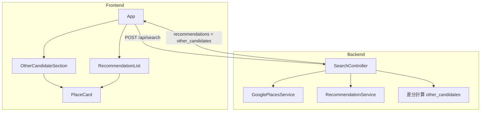
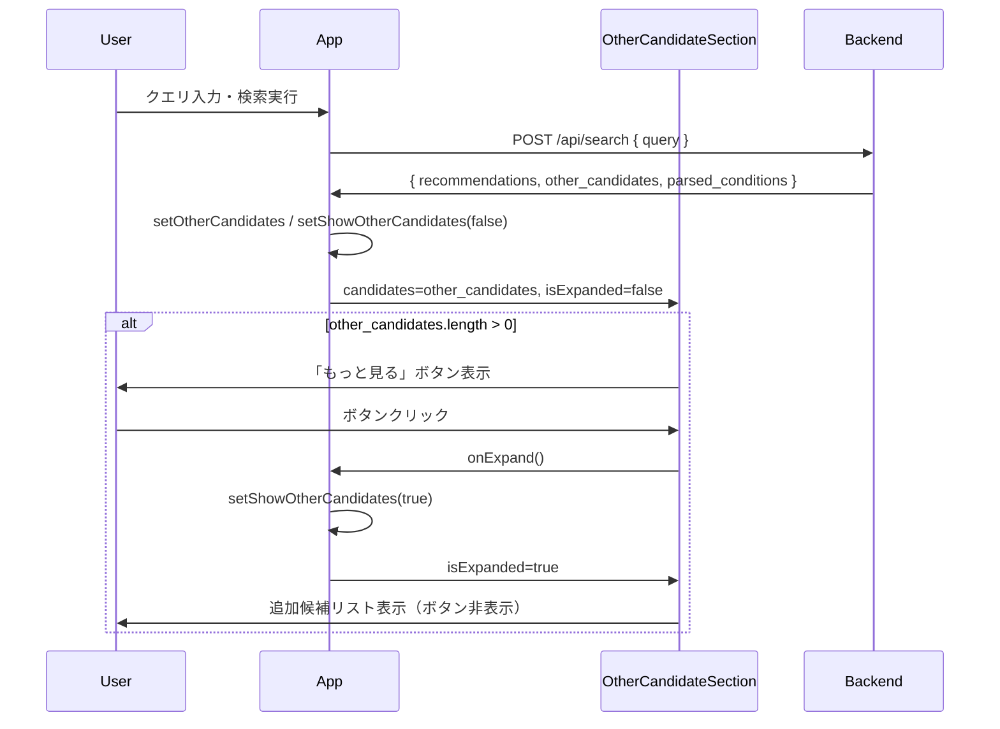

# テクニカルデザイン: load-more（もっと見る）機能

## Overview

本機能は、レストラン検索結果においてAIが選定した推薦店（3〜5件）に加え、Google Places APIが返した残りの候補店をユーザーが任意で閲覧できる「もっと見る」機能を提供する。既存の検索APIレスポンスに `other_candidates` フィールドを追加し、フロントエンドでは専用セクションとして表示する。追加のAPI呼び出しは不要であり、実装はアディティブかつ既存フローへの破壊的変更がない。

**対象ユーザー**: レストラン検索を行うすべてのユーザー。AIが選定しなかった候補店を自分の基準で比較・選択したい場合に本機能を利用する。

**影響範囲**: 検索APIレスポンスの拡張（`other_candidates` フィールド追加）、型定義の更新、フロントエンドUIの追加。既存の推薦表示フロー、ルーティング、サービス層には変更なし。

### Goals

- AIおすすめ以外の候補店を「もっと見る」ボタンで閲覧できる
- バックエンドのサービス層変更なしで `other_candidates` をレスポンスに含める
- 既存コンポーネントを最大限再利用し、UIの一貫性を保つ

### Non-Goals

- 追加候補のページネーション・無限スクロール（初回レスポンスに含まれる20件以内で完結）
- 追加候補専用のソート・フィルタリング機能
- 追加候補を別 API エンドポイントで取得する方式（APIコスト増のため）

---

## Architecture

### Existing Architecture Analysis

現在の `SearchController#create` は以下の順でデータを処理する：

```
GooglePlacesService → places[0..19]
  ↓ RecommendationService
  → recommendations[3..5]（AI選定・理由付き）
  ↓ コントローラー
  → { recommendations: [...], parsed_conditions: {...} }
  ※ 非選定の places は破棄
```

`RecommendationService#merge_recommendations` は `places` の名前をキーとして AI 選定結果とマージする。非選定の places は `filter_map` で除外され、コントローラーには選定結果のみが戻る。

### Architecture Pattern & Boundary Map



**Architecture Integration**:
- 選択パターン: 既存のコントローラー薄・サービス層厚パターンを維持。差分計算のみコントローラーに追加（3行程度）
- 境界: `OtherCandidateSection` が「もっと見る」ボタン＋候補リストの責務を担い、`App.tsx` のロジック増加を防ぐ
- 保持するパターン: Service Object パターン、`render json:` 直接レンダリング、React state のリフトアップ
- 既存コンポーネント再利用: `PlaceCard` の `reason` を optional 化することで両用途（推薦・追加候補）に対応

### Technology Stack

| Layer | Choice / Version | Role in Feature | Notes |
|-------|------------------|-----------------|-------|
| Frontend | React 19 + TypeScript 5 | 型定義更新・新規コンポーネント | `reason?: string` optional 化 |
| Backend | Ruby on Rails 8.1 | 差分計算・レスポンス拡張 | コントローラーのみ変更 |
| Styling | Tailwind CSS v4 | ボタン・セクションスタイル | 既存パターン踏襲 |
| Test | Vitest + RSpec | 新規コンポーネント・差分計算テスト | 既存テスト環境をそのまま使用 |

---

## System Flows



**フロー上の設計判断**:
- `other_candidates` は初回検索レスポンスに含まれるため、ボタンクリック時の追加 API 呼び出しは発生しない
- `showOtherCandidates` は `App.tsx` で管理し、新規検索開始時に `false` にリセットすることで検索ごとにトグル状態が確実にリセットされる
- 要件 4（ローディング・エラー状態）は初回検索の `isLoading` / `error` 状態で網羅される（`isLoading` 中はボタン非表示: 要件 1.3）

---

## Requirements Traceability

| 要件 | 概要 | コンポーネント | インターフェース | フロー |
|------|------|----------------|-----------------|--------|
| 1.1 | 追加候補ありの場合「もっと見る」ボタンを表示 | `OtherCandidateSection` | `candidates.length > 0 && !isExpanded` | — |
| 1.2 | 追加候補なしの場合ボタン非表示 | `OtherCandidateSection` | `candidates.length === 0` → null render | — |
| 1.3 | 検索中はボタン非表示 | `App.tsx` + `OtherCandidateSection` | `isSearchLoading` prop | 検索フロー |
| 1.4 | 全追加候補表示済みでボタン非表示 | `OtherCandidateSection` | `isExpanded === true` → ボタン非表示 | — |
| 1.5 | ボタンはリスト末尾に配置 | `App.tsx` render 順序 | `RecommendationList` の後に `OtherCandidateSection` | — |
| 2.1 | クリックで追加候補を表示 | `OtherCandidateSection` | `onExpand()` callback → `isExpanded=true` | シーケンス図 |
| 2.2 | 各候補に名前・評価・価格帯・住所・Maps リンクを表示 | `PlaceCard` | `PlaceCardProps`（Candidate フィールド） | — |
| 2.3 | 別セクション・見出し付きで表示 | `OtherCandidateSection` | セクションヘッダー「その他の候補」 | — |
| 2.4 | 推薦理由を表示しない | `PlaceCard` | `reason?: string`（undefined → 非表示） | — |
| 2.5 | AIおすすめリストを維持しつつ下部に追加 | `App.tsx` render 順序 | `RecommendationList` + `OtherCandidateSection` 並立 | — |
| 3.1 | `other_candidates` をレスポンスに含める | `SearchController` | `POST /api/search` レスポンス拡張 | — |
| 3.2 | `other_candidates` のフィールド構造 | `SearchController` | `Candidate` 型（reason なし） | — |
| 3.3 | AIおすすめを除いた候補のみ含める | `SearchController` | 差分計算（`recommended_names` Set） | — |
| 3.4 | 全候補がAIおすすめの場合は空配列 | `SearchController` | `places.reject` が空 → `[]` | — |
| 3.5 | Google Places API の返却順を維持 | `SearchController` | `places` 配列の順序保持 | — |
| 4.1 | 取得中はボタンをローディング状態 | `App.tsx` + `OtherCandidateSection` | `isSearchLoading=true` → null render | 検索フロー |
| 4.2 | 取得失敗時にエラーメッセージ | `App.tsx` | 既存の `error` state 表示 | — |
| 4.3 | ローディング完了後に追加候補表示 | `App.tsx` | `isLoading=false` → `OtherCandidateSection` 表示 | — |
| 4.4 | 連打防止 | `OtherCandidateSection` | `isExpanded=true` になるとボタン非表示 | — |

---

## Components and Interfaces

### コンポーネントサマリー

| Component | Domain/Layer | Intent | Req Coverage | Key Dependencies | Contracts |
|-----------|--------------|--------|--------------|------------------|-----------|
| `SearchController` | Backend / API | `other_candidates` 差分計算・レスポンス拡張 | 3.1〜3.5 | `GooglePlacesService`(P0), `RecommendationService`(P0) | API |
| `types/search.ts` | Frontend / Type | `Candidate`, `OtherCandidate`, `SearchResponse` 型定義 | 3.1, 3.2, 2.2 | — | Service |
| `PlaceCard` | Frontend / UI | 推薦・追加候補両方のカード表示（`reason` optional） | 2.2, 2.4 | `Candidate`(P0) | — |
| `OtherCandidateSection` | Frontend / UI | 「もっと見る」ボタン＋追加候補リスト | 1.1〜1.5, 2.1〜2.5, 4.4 | `PlaceCard`(P0), `OtherCandidate[]`(P0) | State |
| `App.tsx` | Frontend / App | `otherCandidates`・`showOtherCandidates` 状態管理 | 1.3, 2.5, 4.1〜4.3 | `OtherCandidateSection`(P0) | State |

---

### Backend

#### `Api::SearchController` (拡張)

| Field | Detail |
|-------|--------|
| Intent | `other_candidates` をコントローラーで差分計算し、レスポンスに追加する |
| Requirements | 3.1, 3.2, 3.3, 3.4, 3.5 |

**Responsibilities & Constraints**
- `recommendations` の名前集合（`Set`）を構築し、`places.reject` で非推薦候補を抽出する
- `other_candidates` は `places` の元順序を維持する
- `places.empty?` の早期リターン時も `other_candidates: []` を含める

**Dependencies**
- Inbound: `GooglePlacesService` — `places` 配列（P0）
- Inbound: `RecommendationService` — `recommendations` 配列（P0）

**Contracts**: API [x]

##### API Contract

| Method | Endpoint | Request | Response | Errors |
|--------|----------|---------|----------|--------|
| POST | /api/search | `{ query: string }` | `SearchApiResponse` | 422, 502, 500 |

**レスポンス構造（拡張後）**:
```
{
  recommendations: [
    { name, rating, price_level, address, google_maps_url, reason }
  ],
  other_candidates: [
    { name, rating, price_level, address, google_maps_url }
  ],
  parsed_conditions: { area, genre, price_level, keyword }
}
```

**差分計算ロジック（疑似コード）**:
```
recommended_names = recommendations.map { |r| r[:name] }.to_set
other_candidates  = places.reject { |p| recommended_names.include?(p[:name]) }
```

**Implementation Notes**
- Integration: `places.empty?` 早期リターンのパスにも `other_candidates: []` を追加すること
- Validation: 差分計算はコントローラーの責務範囲内。サービス層への変更なし
- Risks: 名前マッチングはハッシュキー一致による exact match。Google Places API と `RecommendationService` が同一の `name` を使用するため精度問題なし

---

### Frontend / Type

#### `types/search.ts` (拡張)

| Field | Detail |
|-------|--------|
| Intent | `Candidate` 基底型・`OtherCandidate`・`SearchResponse` の更新を行い、型安全性を確保する |
| Requirements | 3.1, 3.2, 2.2 |

**Contracts**: Service [x]

##### Service Interface

```typescript
/** 推薦理由を持たない店舗候補の基底型 */
export type Candidate = {
  name: string;
  rating: number | null;
  price_level: string | null;
  address: string;
  google_maps_url: string;
};

/** AIが推薦した店舗（理由付き） */
export type Recommendation = Candidate & {
  reason: string;
};

/** AIが選定しなかった追加候補 */
export type OtherCandidate = Candidate;

/** 検索APIレスポンス */
export type SearchResponse = {
  recommendations: Recommendation[];
  other_candidates: OtherCandidate[];
  parsed_conditions: ParsedConditions;
};
```

**Implementation Notes**
- `Recommendation` は `Candidate` の intersection 型とすることで、`PlaceCard` の props 互換性を型レベルで保証する
- `OtherCandidate = Candidate` の型エイリアスにより、将来的なフィールド拡張時に影響を局所化できる

---

### Frontend / UI

#### `PlaceCard` (変更)

| Field | Detail |
|-------|--------|
| Intent | `reason` を optional 化し、推薦・追加候補の両用途で再利用可能にする |
| Requirements | 2.2, 2.4 |

**Contracts**: なし（presentational component）

**Props 変更**:
```typescript
export type PlaceCardProps = Candidate & { reason?: string };
// 変更前: PlaceCardProps = Recommendation（reason: string 必須）
```

**Implementation Notes**
- `reason` が `undefined` の場合は `<p>` を非表示にする（`reason !== undefined && <p>{reason}</p>` または `reason && <p>{reason}</p>`）
- 既存の `PlaceCard.test.tsx` に `reason` なしケースのテストを追加する

---

#### `OtherCandidateSection` (新規)

| Field | Detail |
|-------|--------|
| Intent | 「もっと見る」ボタンと追加候補リストの表示制御を担う |
| Requirements | 1.1, 1.2, 1.3, 1.4, 1.5, 2.1, 2.2, 2.3, 2.4, 2.5, 4.4 |

**Responsibilities & Constraints**
- `candidates.length === 0` または `isSearchLoading === true` のとき null を返す（ボタン・リスト非表示）
- `isExpanded === false` のとき「もっと見る」ボタンを表示する
- `isExpanded === true` のときボタンを非表示にし、候補リストを表示する
- セクションヘッダー「その他の候補」を追加候補リストの上部に表示する

**Dependencies**
- Inbound: `App.tsx` — `candidates`, `isExpanded`, `onExpand`, `isSearchLoading` を props として受け取る（P0）
- Outbound: `PlaceCard` — 各候補カードの表示（P0）

**Contracts**: State [x]

##### State Management

- State model: `isExpanded: boolean`（`App.tsx` 管理）、`candidates: OtherCandidate[]`（`App.tsx` 管理）
- Persistence & consistency: 新規検索開始時に `App.tsx` が `showOtherCandidates = false`・`otherCandidates = null` にリセット
- Concurrency strategy: `isExpanded === true` になるとボタン非表示になるため、多重クリックを構造的に防ぐ

**Props インターフェース**:
```typescript
interface OtherCandidateSectionProps {
  candidates: OtherCandidate[];
  isExpanded: boolean;
  onExpand: () => void;
  isSearchLoading: boolean;
}
```

**実装上の注意**: `candidates` が `null` ではなく `OtherCandidate[]` を受け取る設計（`App.tsx` が `null` の場合は `OtherCandidateSection` をレンダリングしない）

**Implementation Notes**
- Integration: `App.tsx` の render 内で `otherCandidates !== null` を条件として `OtherCandidateSection` を表示する
- Validation: ボタンの `disabled` 属性は不要（`isExpanded=true` でボタン自体が消えるため）
- Risks: なし

---

#### `App.tsx` (拡張)

| Field | Detail |
|-------|--------|
| Intent | `otherCandidates` と `showOtherCandidates` 状態を追加し、`OtherCandidateSection` にバインドする |
| Requirements | 1.3, 1.5, 2.5, 4.1, 4.2, 4.3 |

**追加 State**:
```typescript
const [otherCandidates, setOtherCandidates] = useState<OtherCandidate[] | null>(null);
const [showOtherCandidates, setShowOtherCandidates] = useState<boolean>(false);
```

**`handleSearch` 変更点**:
- 検索開始時: `setOtherCandidates(null)`, `setShowOtherCandidates(false)`
- 検索成功時: `setOtherCandidates(response.other_candidates)`

**Render 追加**:
```
{otherCandidates !== null && (
  <OtherCandidateSection
    candidates={otherCandidates}
    isExpanded={showOtherCandidates}
    onExpand={() => setShowOtherCandidates(true)}
    isSearchLoading={isLoading}
  />
)}
```

**エッジケース: `recommendations.length === 0` かつ `other_candidates` あり**

`RecommendationService` が異常（AI応答ミスマッチ等）により `[]` を返した場合、全 places が `other_candidates` に入る。この場合、既存の「条件に合うレストランが見つかりませんでした」メッセージは表示せず、代わりに「AIのおすすめは見つかりませんでしたが、その他の候補があります」を表示する。

```
// 「見つかりませんでした」条件（既存）:
recommendations.length === 0 && otherCandidates === null

// 「AIおすすめなし・その他あり」条件（追加）:
recommendations.length === 0 && otherCandidates !== null && otherCandidates.length > 0
→ 「AIのおすすめは見つかりませんでしたが、その他の候補があります」を表示
```

**Implementation Notes**
- Integration: `OtherCandidateSection` は `RecommendationList` の後に配置する（要件 1.5）
- Integration: 「見つかりませんでした」表示条件を `recommendations.length === 0 && otherCandidates === null` に変更する（`otherCandidates` が存在する場合は上記エッジケースメッセージを表示）
- Risks: `RecommendationService` が `[]` を返す確率は極めて低いが、UIの一貫性のために処理を明示する

---

## Data Models

### Domain Model

本機能はデータベースへの変更を伴わない。ドメイン上の新概念は `OtherCandidate`（AI非選定の候補店）であり、バリューオブジェクトとして扱う。

### Data Contracts & Integration

**API レスポンス（拡張後）**:

```
SearchResponse:
  recommendations: Recommendation[]
    - name: string
    - rating: number | null
    - price_level: string | null
    - address: string
    - google_maps_url: string
    - reason: string
  other_candidates: OtherCandidate[]
    - name: string
    - rating: number | null
    - price_level: string | null
    - address: string
    - google_maps_url: string
  parsed_conditions: ParsedConditions
```

**後方互換性**: フロントエンドが古いバージョンのAPIを受け取った場合（`other_candidates` フィールドなし）は `undefined` になる。`App.tsx` の `setOtherCandidates(response.other_candidates ?? [])` でフォールバック可能だが、デプロイはバックエンド先行で同期的に行うため実質不要。

---

## Error Handling

### Error Strategy

本機能固有のエラーパスはない。`other_candidates` はバックエンドの差分計算（純粋なRuby配列操作）で生成されるため、外部APIエラーは既存の `rescue_from` ハンドラーで処理される。

### Error Categories and Responses

- **検索API失敗（502/500）**: 既存の `error` state によるエラーメッセージ表示。`otherCandidates` は `null` のまま → `OtherCandidateSection` は非表示（要件 4.2 対応）
- **`other_candidates` が空配列**: ボタン非表示（要件 1.2・3.4 対応）
- **ユーザー操作**: ボタンクリック後は `isExpanded=true` で再クリック不可（要件 4.4 対応）

---

## Testing Strategy

### Unit Tests（Backend）

- `Api::SearchController#create`: `other_candidates` が `recommendations` に含まれない places のみを含むこと
- `Api::SearchController#create`: `places` が空の場合 `other_candidates: []` を返すこと
- `Api::SearchController#create`: `other_candidates` の順序が Google Places API の返却順を維持すること
- `Api::SearchController#create`: 全 places が AI 推薦に含まれる場合 `other_candidates: []` を返すこと

### Unit Tests（Frontend）

- `PlaceCard`: `reason` あり・なし両方でレンダリングが正常に動作すること
- `OtherCandidateSection`: `candidates.length === 0` の場合ボタンを表示しないこと
- `OtherCandidateSection`: `isSearchLoading=true` の場合ボタンを表示しないこと
- `OtherCandidateSection`: ボタンクリックで `onExpand` が呼ばれ、`isExpanded=true` で候補リストが表示されること
- `OtherCandidateSection`: `isExpanded=true` でボタンが非表示になること

### Integration Tests

- `App.tsx`: 検索成功後に `other_candidates` がある場合「もっと見る」ボタンが表示されること
- `App.tsx`: 新規検索開始時にボタンおよび候補リストがリセットされること
- `App.tsx`: 検索エラー時に `OtherCandidateSection` が表示されないこと
