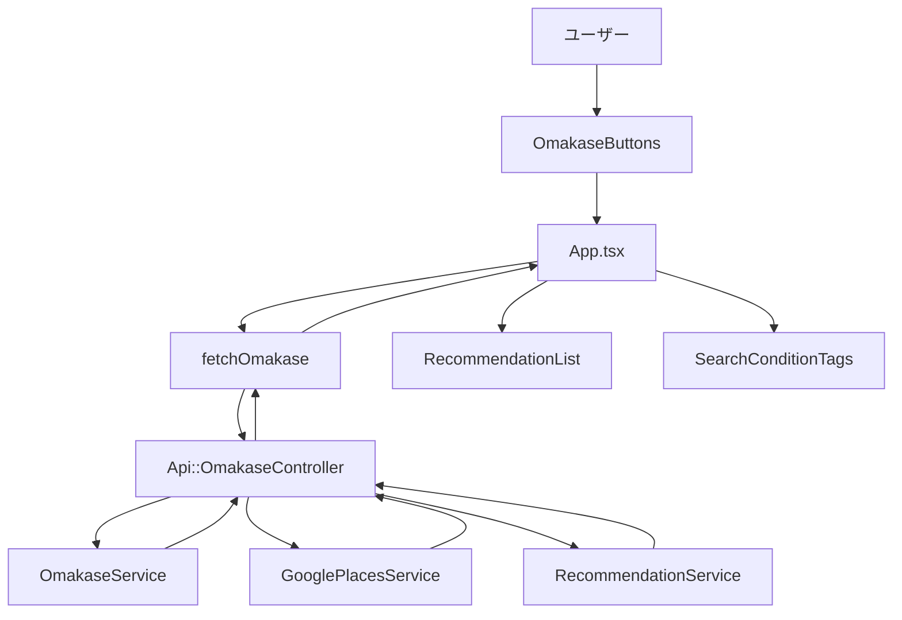
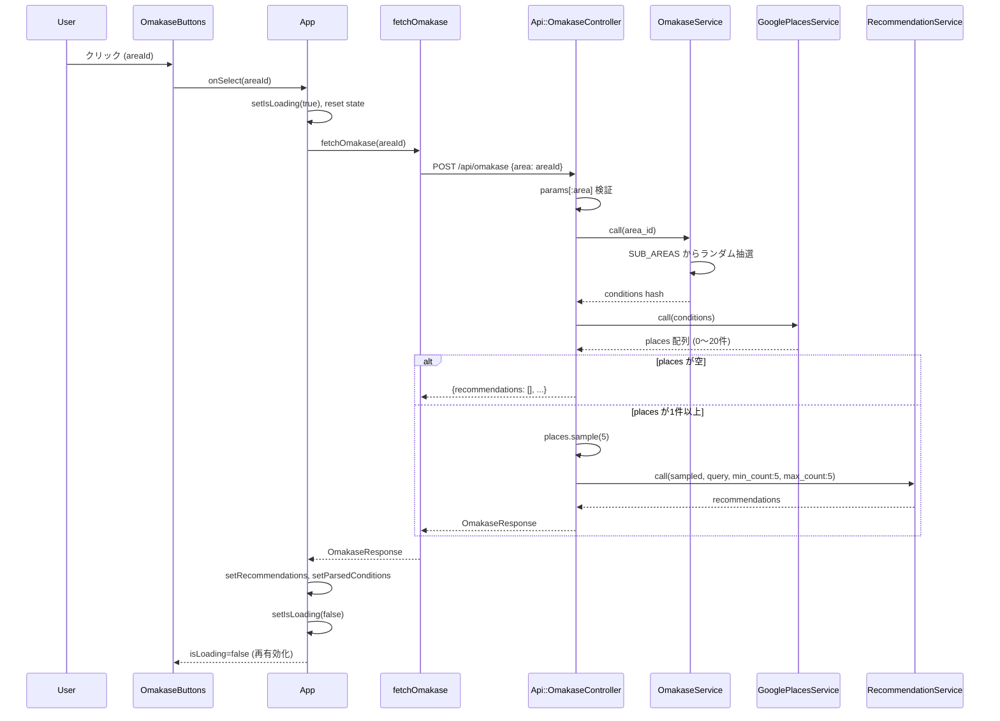

# 設計書 — omakase-4areas

## Overview

本機能は、Restaurant Discovery（新潟の夜の店探し個人アプリ）の「おまかせ」体験を、固定クエリからランダム選択する単一ボタンから、4エリア別の専用ボタン群へ刷新する。

ユーザーは「新潟駅前でおすすめ」「新潟駅南でおすすめ」「古町でおすすめ」「長岡でおすすめ」のいずれかのボタンをタップするだけで、毎回異なるサブエリアの夜向け店舗（居酒屋・バー）最大5件を AI 推薦理由付きで受け取る。自然文入力・履歴追加・QueryParser 呼び出しは行わない。

既存の `/api/search` エンドポイント・`RecommendationList`・`SearchConditionTags` は無改変で流用し、新規追加は `POST /api/omakase` エンドポイントと対応するフロントエンドコンポーネントに限定する。

### Goals

- 4エリア別おまかせボタンのワンタップ体験を実現する
- 毎回異なるサブエリア・店舗との出会いを提供する（偶然性の最大化）
- AI 推薦理由（最大5件）を既存 RecommendationList で表示する
- OpenAI 呼び出しを1リクエストあたり1回以内に抑える（QueryParser 省略）

### Non-Goals

- 検索履歴への追加
- ジャンルのランダム化（夜向け固定）
- other_candidates（追加候補）の表示
- 「今回のおまかせ: ○○エリア」専用ラベル表示
- 新潟県全域・4エリア以外の対応

---

## Boundary Commitments

### This Spec Owns

- `POST /api/omakase` エンドポイントの定義・実装・テスト
- `OmakaseService`（area_id → conditions 変換、サブエリア定数）
- `Api::OmakaseController`（バリデーション・パイプライン呼び出し・レスポンス組み立て）
- `OmakaseButtons` コンポーネント（4ボタン表示・disabled 制御）
- `omakaseAreas` 設定ファイル・`OmakaseAreaId` 型
- `fetchOmakase` API 関数・`OmakaseResponse`/`OmakaseMeta` 型
- 旧 `OmakaseButton` コンポーネント・`omakasePresets` 設定ファイルの削除
- `RecommendationService` への `min_count`/`max_count` keyword args 追加（後方互換維持）

### Out of Boundary

- `GooglePlacesService`（変更なし、そのまま利用）
- `RecommendationService` の公開インターフェース変更（オプション引数追加のみ、既存呼び出しに影響なし）
- `/api/search` エンドポイント（変更なし）
- `RecommendationList`・`SearchConditionTags`（変更なし、消費のみ）
- 検索履歴機能（`useSearchHistory`）

### Allowed Dependencies

- `GooglePlacesService` — 店舗検索（HTTP 呼び出し）
- `RecommendationService` — AI 推薦生成（OpenAI 呼び出し）
- `Api::BaseController` — コントローラー基底クラス
- `SearchResponse` 型（型継承のみ）

### Revalidation Triggers

- `GooglePlacesService#call` のシグネチャが変更された場合は `OmakaseController` を確認
- `RecommendationService#call` のシグネチャが変更された場合は `OmakaseController` を確認
- `SearchResponse` 型が変更された場合は `OmakaseResponse` を確認
- `SUB_AREAS` 定数のエリア名変更は `OmakaseService` テストの再実行を要する

---

## Architecture

### Architecture Pattern & Boundary Map



- 既存 Service Object パターンを踏襲（`ServiceName.new.call(args)` 形式）
- フロントはコンポーネント → App handler → API 関数 の一方向データフロー
- `OmakaseService` は純粋関数（HTTP・DB 呼び出しなし）として単体テスト容易性を確保

### System Flow（おまかせ検索パイプライン）



### Technology Stack

| Layer | 選択 | 役割 |
|-------|------|------|
| Frontend | React 19 + TypeScript strict | OmakaseButtons コンポーネント、App 改修 |
| API Client | fetch API | fetchOmakase 関数 |
| Backend | Rails 8.1 Ruby | Api::OmakaseController、OmakaseService |
| External API | Google Places API (Faraday) | 店舗テキスト検索（既存流用） |
| External API | OpenAI gpt-5-nano | AI 推薦生成（既存流用） |

---

## File Structure Plan

### Directory Structure

```
backend/
├── app/
│   ├── services/
│   │   └── omakase_service.rb          # [新規] area_id → conditions 変換（純粋関数）
│   └── controllers/
│       └── api/
│           └── omakase_controller.rb   # [新規] POST /api/omakase エンドポイント
├── config/
│   └── routes.rb                       # [修正] post "omakase" 追加
└── spec/
    ├── services/
    │   └── omakase_service_spec.rb     # [新規] OmakaseService 単体テスト
    ├── routing/
    │   └── api/
    │       └── omakase_routing_spec.rb # [新規] ルーティングテスト
    └── requests/
        └── api/
            └── omakase_spec.rb         # [新規] コントローラーリクエスト spec

frontend/src/
├── config/
│   └── omakaseAreas.ts                 # [新規] 4エリア定義・OmakaseAreaId 型
├── api/
│   ├── omakase.ts                      # [新規] fetchOmakase 関数
│   └── omakase.test.ts                 # [新規] API 関数テスト
├── components/
│   ├── OmakaseButtons.tsx              # [新規] 4ボタンコンポーネント
│   └── OmakaseButtons.test.tsx         # [新規] コンポーネントテスト
└── types/
    └── search.ts                       # [修正] OmakaseMeta, OmakaseResponse 型追加
```

### Modified Files

- `backend/app/services/recommendation_service.rb` — `SYSTEM_PROMPT` → `SYSTEM_PROMPT_TEMPLATE` 化、`call` に `min_count: 3, max_count: 5` keyword args 追加
- `backend/spec/services/recommendation_service_spec.rb` — `min_count`/`max_count` 指定時のプロンプト反映テストを新 context として追加
- `frontend/src/App.tsx` — `handleOmakase` 追加、`OmakaseButton` → `OmakaseButtons` 差し替え
- `frontend/src/App.test.tsx` — 旧 `OmakaseButton` 参照があれば更新（実装時確認）

### Deleted Files

- `frontend/src/components/OmakaseButton.tsx`
- `frontend/src/components/OmakaseButton.test.tsx`
- `frontend/src/config/omakasePresets.ts`

---

## Requirements Traceability

| 要件 | 概要 | コンポーネント | インターフェース | フロー |
|------|------|----------------|-----------------|--------|
| 1.1 | 4ボタンのラベル表示 | OmakaseButtons | OmakaseButtonsProps.areas | — |
| 1.2 | 横並び折り返し表示 | OmakaseButtons | CSS flex-wrap | — |
| 1.3 | タップ領域44px確保 | OmakaseButtons | min-h-[44px] | — |
| 1.4 | テキストフィールドクリア | App.handleOmakase | setQuery('') | handleOmakase |
| 2.1 | サブエリアランダム抽選 | OmakaseService | call(area_id) | omakase pipeline |
| 2.2 | 毎回異なる結果 | OmakaseService | Random.new + sample | — |
| 2.3 | ジャンル夜向け固定 | OmakaseService | NIGHT_GENRE定数 | — |
| 2.4 | 最大5件ランダム抽選 | Api::OmakaseController | places.sample(5) | omakase pipeline |
| 2.5 | 0件時は空リスト | Api::OmakaseController | places.empty? 分岐 | — |
| 3.1 | 推薦リスト表示 | RecommendationList（既存） | recommendations[] | — |
| 3.2 | サブエリア名表示 | SearchConditionTags（既存） | parsed_conditions.area | — |
| 3.3 | other_candidates空 | Api::OmakaseController | build_response固定 | — |
| 4.1 | 検索中ボタン無効化 | OmakaseButtons | isLoading prop | handleOmakase |
| 4.2 | ローディング表示 | App.tsx | isLoading state | — |
| 4.3 | 完了後ボタン再有効化 | App.handleOmakase | setIsLoading(false) | handleOmakase |
| 4.4 | エラーメッセージ表示 | App.tsx | error state + catch | handleOmakase |
| 5.1 | QueryParser不使用 | Api::OmakaseController | QueryParserService 非呼び出し | — |
| 5.2 | 履歴追加なし | App.handleOmakase | addToHistory 非呼び出し | — |
| 5.3 | 既存エンドポイント無改変 | routes.rb / SearchController | POST /api/search 維持 | — |

---

## Components and Interfaces

### コンポーネントサマリー

| コンポーネント | 層 | 役割 | 要件カバレッジ | 主要依存 |
|---------------|------|------|--------------|---------|
| OmakaseService | Backend Service | area_id → conditions 変換 | 2.1, 2.2, 2.3 | — |
| Api::OmakaseController | Backend Controller | おまかせパイプライン制御 | 2.4, 2.5, 3.3, 5.1 | OmakaseService (P0), GooglePlacesService (P0), RecommendationService (P0) |
| RecommendationService（拡張） | Backend Service | min/max count 可変化 | 3.1 | OpenAI API (P0) |
| omakaseAreas | Frontend Config | 4エリア定義 | 1.1 | — |
| fetchOmakase | Frontend API | POST /api/omakase 呼び出し | 2.1〜2.5 | fetch API (P0) |
| OmakaseButtons | Frontend Component | 4ボタン表示・disabled制御 | 1.1, 1.2, 1.3, 4.1, 4.3 | — |
| App.handleOmakase | Frontend Logic | おまかせ state 管理 | 1.4, 4.2, 4.3, 4.4, 5.2 | fetchOmakase (P0) |

---

### Backend Services

#### OmakaseService

| フィールド | 詳細 |
|----------|------|
| Intent | area_id 文字列を受け取り GooglePlacesService に渡す conditions Hash を返す純粋変換 |
| 要件 | 2.1, 2.2, 2.3 |

**Responsibilities & Constraints**
- `SUB_AREAS` 定数で4エリア（ekimae / ekinan / furumachi / nagaoka）とサブエリア名配列を管理
- `@random` コンストラクタ注入によりランダム性をテスト可能にする
- HTTP 呼び出し・DB 参照は一切行わない（純粋関数）

**Contracts**: Service [x]

##### Service Interface（Ruby）

```ruby
class OmakaseService
  UnknownArea = Class.new(StandardError)

  SUB_AREAS = {
    "ekimae"    => { prefix: "新潟市中央区", names: %w[万代 弁天 花園 東大通 万代シテイ 天神 明石] },
    "ekinan"    => { prefix: "新潟市中央区", names: %w[けやき通り 米山 笹口 天神尾 南笹口 鐙] },
    "furumachi" => { prefix: "新潟市中央区", names: %w[古町通 西堀 東堀 本町 上古町 古町8番町 古町9番町] },
    "nagaoka"   => { prefix: "長岡市",       names: %w[大手通 殿町 表町 城内町 坂之上町] }
  }.freeze

  NIGHT_GENRE = "居酒屋 バー"

  # @param area_id [String] "ekimae" | "ekinan" | "furumachi" | "nagaoka"
  # @return [Hash] { area:, genre:, price_level:, keyword:, sub_area:, area_id: }
  # @raise [OmakaseService::UnknownArea] 未知の area_id の場合
  def call(area_id)
```

- Preconditions: `area_id` は SUB_AREAS のキーである
- Postconditions: 返り値 Hash の `:area` は `"#{prefix} #{sub_area}"` 形式
- Invariants: NIGHT_GENRE は常に `"居酒屋 バー"`

**Implementation Notes**
- Integration: `OmakaseController` から `OmakaseService.new.call(area_id)` で呼び出す
- Validation: 不明エリアは `UnknownArea` を raise（コントローラーで422に変換）

---

#### Api::OmakaseController

| フィールド | 詳細 |
|----------|------|
| Intent | POST /api/omakase を処理し、おまかせ検索パイプラインを実行して JSON を返す |
| 要件 | 2.4, 2.5, 3.3, 4.4, 5.1 |

**Contracts**: API [x]

##### API Contract

| Method | Endpoint | Request Body | Response | Errors |
|--------|----------|-------------|----------|--------|
| POST | /api/omakase | `{ "area": "ekimae" \| "ekinan" \| "furumachi" \| "nagaoka" }` | OmakaseResponse | 422, 502, 500 |

**Request バリデーション**
- `area` が文字列でない、または空文字 → 422 `{ "error": "area must be a non-empty string" }`
- `area` が未知の値 → 422 `{ "error": "area must be one of ekimae/ekinan/furumachi/nagaoka" }`

**rescue_from 階層**
```
OmakaseService::UnknownArea → 422
GooglePlacesError / RecommendationError → 502
StandardError → 500
```

**Implementation Notes**
- `QueryParserService` を一切呼び出さない（要件 5.1）
- `places.sample(5)` でコントローラー内ランダム抽選（専用サービス不要）
- `other_candidates` は常に `[]` で固定

---

#### RecommendationService（拡張）

`min_count: 3, max_count: 5` のデフォルト keyword args を `call` に追加。

```ruby
def call(places, query, min_count: 3, max_count: 5)
  return [] if places.empty?
  prompt = format(SYSTEM_PROMPT_TEMPLATE, min: min_count, max: max_count)
  # ... 既存ロジック
end
```

おまかせ呼び出し: `call(sampled, query, min_count: 5, max_count: 5)`
既存呼び出し: `call(places, query)` → デフォルト値 3〜5 で後方互換

---

### Frontend

#### omakaseAreas（Config）

**Implementation Notes** — 静的設定ファイル。テスト不要（型チェックで十分）。

```typescript
// frontend/src/config/omakaseAreas.ts
export type OmakaseAreaId = 'ekimae' | 'ekinan' | 'furumachi' | 'nagaoka';

export type OmakaseArea = {
  id: OmakaseAreaId;
  label: string;
};

export const omakaseAreas: readonly OmakaseArea[] = [
  { id: 'ekimae',    label: '新潟駅前でおすすめ' },
  { id: 'ekinan',    label: '新潟駅南でおすすめ' },
  { id: 'furumachi', label: '古町でおすすめ' },
  { id: 'nagaoka',   label: '長岡でおすすめ' },
];
```

---

#### fetchOmakase（API Client）

**Contracts**: Service [x]

```typescript
// frontend/src/api/omakase.ts
import type { OmakaseResponse } from '../types/search';
import type { OmakaseAreaId } from '../config/omakaseAreas';

export async function fetchOmakase(areaId: OmakaseAreaId): Promise<OmakaseResponse>;
```

- Preconditions: `areaId` は `OmakaseAreaId` の4値のいずれか
- Postconditions: 200 時は `OmakaseResponse` を resolve、非200時は `Error` を throw

---

#### OmakaseButtons（Component）

| フィールド | 詳細 |
|----------|------|
| Intent | 4エリアボタンを横並びで表示し、クリック時に `onSelect(areaId)` を呼ぶ |
| 要件 | 1.1, 1.2, 1.3, 4.1, 4.3 |

**Contracts**: State [x]

```typescript
export interface OmakaseButtonsProps {
  areas: readonly OmakaseArea[];
  onSelect: (areaId: OmakaseAreaId) => void;
  isLoading: boolean;
}
```

**Implementation Notes**
- `flex flex-wrap gap-2` で横並び折り返し（要件 1.2）
- `min-h-[44px]` でタップ領域確保（要件 1.3）
- `isLoading` 時は全ボタン `disabled`（要件 4.1）
- `disabled` 状態でクリックしても `onSelect` を呼ばない

---

#### App.handleOmakase

```typescript
async function handleOmakase(areaId: OmakaseAreaId): Promise<void> {
  setIsLoading(true);
  setError(null);
  setRecommendations(null);
  setOtherCandidates(null);
  setShowOtherCandidates(false);
  setParsedConditions(null);
  setQuery('');  // テキストフィールドクリア（要件 1.4）
  try {
    const response = await fetchOmakase(areaId);
    setRecommendations(response.recommendations);
    setOtherCandidates(response.other_candidates);
    setParsedConditions(response.parsed_conditions);
    // addToHistory は呼ばない（要件 5.2）
  } catch (e) {
    setError(e instanceof Error ? e.message : 'おまかせ取得に失敗しました');
  } finally {
    setIsLoading(false);
  }
}
```

---

## Data Models

### API Data Transfer

**OmakaseResponse（TypeScript）**

```typescript
// frontend/src/types/search.ts への追加
export type OmakaseMeta = {
  area_id: string;
  sub_area: string;
};

export type OmakaseResponse = SearchResponse & {
  omakase: OmakaseMeta;
};
```

`SearchResponse` を継承するため `recommendations`・`other_candidates`・`parsed_conditions` は既存の型を流用。

**JSON レスポンス例**

```json
{
  "recommendations": [
    {
      "name": "居酒屋 万代 花太郎",
      "rating": 4.2,
      "price_level": "PRICE_LEVEL_MODERATE",
      "address": "新潟市中央区万代1-1-1",
      "google_maps_url": "https://maps.google.com/?cid=...",
      "reason": "万代エリアで評価が高く、コスパの良い居酒屋です"
    }
  ],
  "other_candidates": [],
  "parsed_conditions": {
    "area": "新潟市中央区 万代",
    "genre": "居酒屋 バー",
    "price_level": null,
    "keyword": null
  },
  "omakase": {
    "area_id": "ekimae",
    "sub_area": "万代"
  }
}
```

---

## Error Handling

### Error Strategy

| エラー種別 | 原因 | HTTP Status | レスポンス |
|-----------|------|------------|-----------|
| バリデーションエラー | `area` が空・null・数値 | 422 | `{ "error": "area must be a non-empty string" }` |
| 未知エリア | `area` が4値以外 | 422 | `{ "error": "area must be one of ekimae/ekinan/furumachi/nagaoka" }` |
| 外部 API エラー | GooglePlacesError / RecommendationError | 502 | `{ "error": "外部サービスとの通信に失敗しました" }` |
| 未分類例外 | StandardError | 500 | `{ "error": "内部エラーが発生しました" }` |
| 結果0件 | Places 検索ヒットなし | 200 | `{ "recommendations": [], ... }` |

**フロントエンド**:
- fetch が `!response.ok` → `throw new Error(`HTTP error: ${response.status}`)`
- `handleOmakase` の catch → `setError(message)` → DOM にエラーテキスト表示

---

## Testing Strategy

### Unit Tests（Backend）

1. **OmakaseService#call**: 4エリア各IDで `:area` / `:genre` / `:sub_area` / `:area_id` が正しく返る
2. **OmakaseService#call**: 未知 area_id で `OmakaseService::UnknownArea` を raise する
3. **OmakaseService#call**: `Random.new(固定seed)` 注入で再現可能なサブエリア選択を確認
4. **RecommendationService#call**: `min_count: 5, max_count: 5` 指定時にプロンプトに「5〜5 件」が反映される
5. **RecommendationService#call**: デフォルト呼び出し（引数なし）で「3〜5 件」が維持される

### Integration Tests（Backend）

6. **POST /api/omakase 正常系**: 4エリア各IDで 200 OK、レスポンスに `recommendations` / `other_candidates: []` / `parsed_conditions` / `omakase` を含む
7. **POST /api/omakase サンプリング**: Places 20件モック → RecommendationService に渡される件数 ≤ 5 を検証
8. **POST /api/omakase 0件**: Places 0件 → `recommendations: []` で 200
9. **POST /api/omakase QueryParser 非呼び出し**: `QueryParserService` が呼ばれないことを検証
10. **POST /api/omakase エラー系**: 不正 area → 422、GooglePlacesError → 502、StandardError → 500

### Unit Tests（Frontend）

11. **fetchOmakase**: 200 OK で `OmakaseResponse` を resolve する
12. **fetchOmakase**: 422 / 502 / ネットワークエラーで例外を throw する
13. **OmakaseButtons**: 4ボタンのラベルが正しく描画される
14. **OmakaseButtons**: `isLoading=true` で全ボタン disabled、クリックで `onSelect` が呼ばれない
15. **OmakaseButtons**: 各ボタンクリックで `onSelect` が対応する `areaId` で呼ばれる

### Integration Tests（Frontend）

16. **App × おまかせ**: エリアボタンクリック後に推薦結果が表示される（`fetchOmakase` をモック）
17. **App × おまかせ**: ローディング中は4ボタン全 disabled
18. **App × おまかせ**: エラー時にエラーメッセージが表示される
