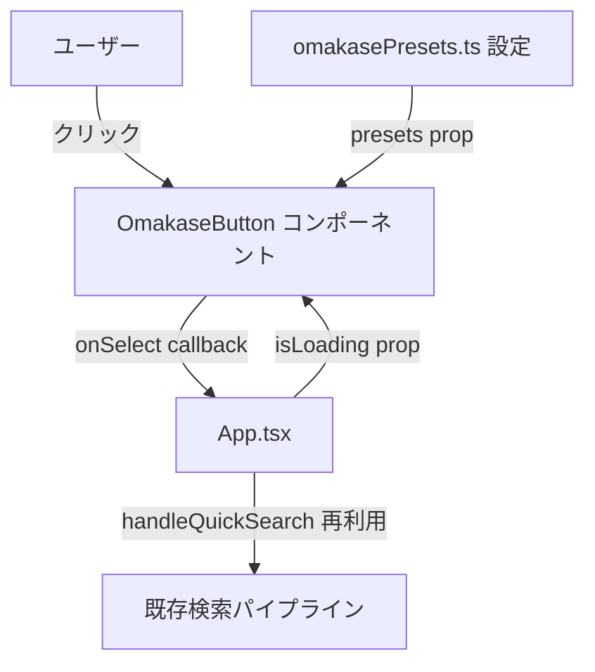
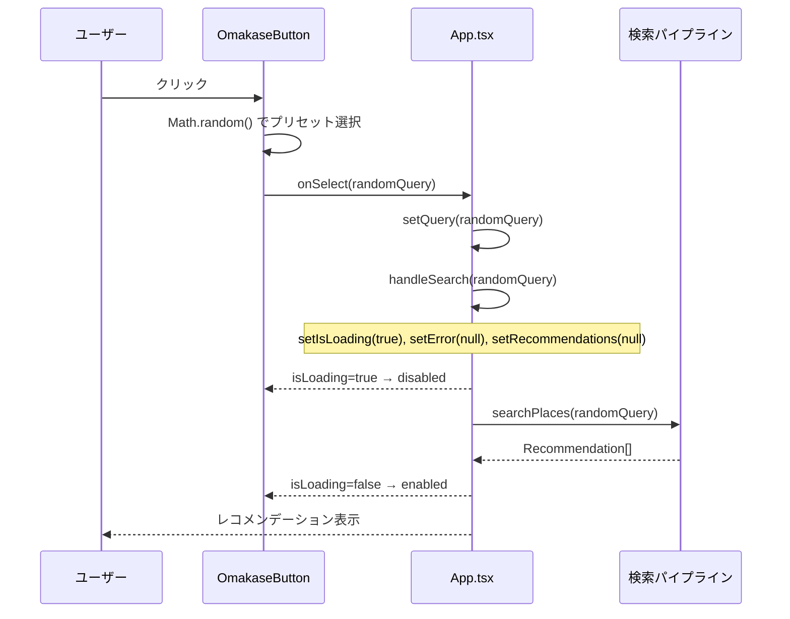

# 技術設計書: おまかせボタン

## Overview

「おまかせ」ボタン機能は、何を食べたいか迷っているユーザーに対して、ワンタップで新潟夜向けプリセットクエリからランダムに1件を選択し、既存の検索パイプライン（QueryParser → GooglePlaces → Recommendation）を即時実行する機能を提供する。

実装はフロントエンドのみで完結し、バックエンドへの変更は不要である。プリセットクエリは `frontend/src/config/omakasePresets.ts` で一元管理され、UIコードに触れることなく追加・変更・削除が可能な設計とする。

### Goals

- プリセットクエリをコンポーネントから分離した設定ファイルで管理し、運用コストを最小化する
- 既存の `handleQuickSearch` パターンを再利用して、最小変更でおまかせ動作を実現する
- `QuickSearchButtons` と統一したデザイントーン（Tailwind CSS v4）でボタンを実装し、UI一貫性を保つ

### Non-Goals

- バックエンドへの変更（新エンドポイント・DB変更を含む）
- ユーザー履歴や好みに基づくパーソナライズされたランダム選択
- 複数候補の同時提示や再選択UI

---

## Architecture

### Existing Architecture Analysis

`App.tsx` は `handleQuickSearch(presetQuery: string)` 関数を持ち、`setQuery` + `handleSearch` の2ステップで既存の検索パイプラインを実行する。`handleSearch` 内でローディング状態管理・エラークリア・レコメンデーションクリアがすべて実施される。おまかせボタンの動作はこのパターンと完全に同一であるため、新規ハンドラーの追加は不要である。

`QuickSearchButtons` + `quickSearchPresets.ts` が設計テンプレートとして機能する。Props 設計（`presets` / `onSelect` / `isLoading`）、スタイリング（Tailwind CSS v4）、テスト構造のいずれも本機能で踏襲する。

### Architecture Pattern & Boundary Map



**Architecture Integration**:
- 選択パターン: 既存 Props-driven コンポーネントパターン（QuickSearchButtons と同一）
- ドメイン境界: Config（プリセット定義）/ UI（ランダム選択+表示）/ Application（検索実行）の3層に分離
- 既存パターンの継承: `handleQuickSearch` を `onSelect` として再利用、`isLoading` state を共有
- 新規コンポーネントの根拠: 単一ボタンの固有動作（ランダム選択）のため独立コンポーネントとして責務分離
- Steering 準拠: TypeScript strict モード、Tailwind CSS v4、ビジネスロジックのコンポーネント外分離

### Technology Stack

| Layer | Choice / Version | Role in Feature | Notes |
|-------|------------------|-----------------|-------|
| Frontend | React 19 + TypeScript 5 strict | UIコンポーネント・Props定義 | 既存スタック |
| Styling | Tailwind CSS v4 | ボタンスタイリング・disabled状態表現 | QuickSearchButtonsと統一 |
| Config | TypeScript module | プリセット配列の静的管理 | 新規ファイル追加のみ |
| Test | Vitest 3 + Testing Library | 単体・結合テスト | vi.spyOn でMath.randomをモック |

---

## System Flows



クリックフロー上の重要な決定: `onSelect` はランダム選択結果（クエリ文字列）を1回だけ呼び出す。ローディング中は `isLoading=true` によりボタンが即時 disabled になるため、二重送信は `<button disabled>` の標準動作で防止される。

---

## Requirements Traceability

| Requirement | Summary | Components | Interfaces | Flows |
|-------------|---------|------------|------------|-------|
| 1.1 | プリセット定義を設定ファイルに集約 | omakasePresets.ts | `OmakasePreset` 型 | — |
| 1.2 | 文字列配列と型定義のexport | omakasePresets.ts | `OmakasePreset = string` | — |
| 1.3 | 4件の初期プリセット定義 | omakasePresets.ts | — | — |
| 2.1 | 検索フォーム付近に配置 | App.tsx（OmakaseButtonマウント位置） | `OmakaseButtonProps` | — |
| 2.2 | 「おまかせ」ラベル表示 | OmakaseButton | — | — |
| 2.3 | 統一デザイントーン | OmakaseButton | — | — |
| 3.1 | ランダムプリセット選択 | OmakaseButton | — | クリックフロー |
| 3.2 | クエリをテキストフィールドに設定 | App.tsx（handleQuickSearch） | — | クリックフロー |
| 3.3 | 即時検索実行 | App.tsx（handleQuickSearch） | — | クリックフロー |
| 3.4 | ローディング表示・既存結果クリア | App.tsx（handleSearch） | — | クリックフロー |
| 4.1 | ローディング中はdisabled | OmakaseButton | `isLoading: boolean` | — |
| 4.2 | 視覚的disabled表現 | OmakaseButton | — | — |
| 4.3 | 完了後に再有効化 | App.tsx（isLoading state） | — | — |
| 5.1 | button要素・キーボードフォーカス | OmakaseButton | — | — |
| 5.2 | disabled属性でキーボード無効化 | OmakaseButton | — | — |
| 5.3 | 44×44pxタップ領域 | OmakaseButton | — | — |

---

## Components and Interfaces

| Component | Domain/Layer | Intent | Req Coverage | Key Dependencies | Contracts |
|-----------|--------------|--------|--------------|------------------|-----------|
| `omakasePresets.ts` | Config | プリセットクエリの一元管理 | 1.1, 1.2, 1.3 | — | State |
| `OmakaseButton` | UI / Presentation | ランダム選択・検索トリガー・disabled制御 | 2.1–5.3 | App.tsx (P0), omakasePresets.ts (P0) | Service |
| `App.tsx`（変更） | Application | OmakaseButtonのマウントとonSelect/isLoading連携 | 2.1, 3.2–4.3 | OmakaseButton (P0), omakasePresets.ts (P0) | — |

### Config Layer

#### omakasePresets.ts

| Field | Detail |
|-------|--------|
| Intent | プリセットクエリを不変配列として一元定義し、コンポーネントから分離する |
| Requirements | 1.1, 1.2, 1.3 |

**Responsibilities & Constraints**
- `OmakasePreset` 型（string エイリアス）と `omakasePresets` 定数配列を export する
- 配列は `readonly` として定義し、実行時の変更を許容しない
- 各プリセットはクエリ文字列そのものであり、ラベルフィールドは持たない（ボタンラベルは「おまかせ」固定）

**Dependencies**: なし

**Contracts**: State [x]

##### State Management
- State model: `readonly OmakasePreset[]` — ファイルシステム上の静的定数（実行時変更なし）
- Persistence & consistency: ビルド時に静的解決される。動的更新・永続化は対象外

**型定義**:

```typescript
export type OmakasePreset = string;

export const omakasePresets: readonly OmakasePreset[];
// 初期値: 4件（要件1.3）
// - '新潟市 今夜のおすすめ居酒屋'
// - '古町 隠れ家的な店'
// - '万代 コスパの良い飲み屋'
// - '新潟駅前 〆のラーメン'
```

---

### UI Layer

#### OmakaseButton

| Field | Detail |
|-------|--------|
| Intent | クリック時にプリセットからランダム選択し `onSelect` を呼び出す単一ボタン |
| Requirements | 2.1, 2.2, 2.3, 3.1, 4.1, 4.2, 4.3, 5.1, 5.2, 5.3 |

**Responsibilities & Constraints**
- `presets` 配列から `Math.random()` を用いて1件をランダム選択し、`onSelect(query)` を呼び出す
- `isLoading === true` または `presets.length === 0` のとき `disabled` 属性を付与し、視覚的フィードバック（opacity低下・カーソル変更）を表示する
- `<button type="button">` 要素として実装し、キーボードフォーカスおよびEnterキーでの実行を保証する
- タップ領域として最低 44×44px を確保する
- ランダム選択のみ担当し、検索実行は親（App.tsx）に委譲する

**Dependencies**
- Inbound: App.tsx — `presets`, `onSelect`, `isLoading` を prop として受信 (P0)
- External: omakasePresets.ts — `OmakasePreset` 型の参照 (P0)

**Contracts**: Service [x]

##### Service Interface

```typescript
import type { OmakasePreset } from '../config/omakasePresets';

export interface OmakaseButtonProps {
  presets: readonly OmakasePreset[];
  onSelect: (query: string) => void;
  isLoading: boolean;
}
```

- Preconditions: `presets` は `readonly string[]`。空配列を受け取ることがあるが、その場合はクリックを無効化する
- Postconditions: クリック成功時、`onSelect` がプリセット配列内の1要素（文字列）で正確に1回呼ばれる
- Invariants: `isLoading === true` または `presets.length === 0` のとき `onSelect` は呼ばれない

**Implementation Notes**
- Integration: App.tsx の `handleQuickSearch` を `onSelect` として渡す（新規ハンドラー不要）
- Validation: `disabled` 条件は `isLoading || presets.length === 0` とする
- Risks: `Math.random()` の決定論的テストが困難 → `vi.spyOn(Math, 'random').mockReturnValue(N)` でモックし、インデックス対応を検証する

---

### Application Layer

#### App.tsx（変更箇所）

既存の Application コンポーネントに対して以下の変更のみを加える（新規コンポーネント作成なし）:

1. `OmakaseButton` を `./components/OmakaseButton` から import する
2. `omakasePresets` を `./config/omakasePresets` から import する
3. 検索フォーム付近（QuickSearchButtons と同じセクション）に `<OmakaseButton presets={omakasePresets} onSelect={handleQuickSearch} isLoading={isLoading} />` をマウントする

既存の `handleQuickSearch`, `handleSearch`, `isLoading` state は変更しない。

---

## Error Handling

### Error Strategy

おまかせボタン固有のエラーシナリオは2件。いずれも既存の仕組みで対処済みである。

### Error Categories and Responses

**ネットワーク・サービスエラー（5xx相当）**: 既存 `handleSearch` の `try/catch` でキャッチされ、`setError` が呼ばれる。`finally` ブロックで `setIsLoading(false)` が実行されるため、OmakaseButton は自動的に再有効化される。ユーザーには既存のエラーメッセージ表示UIが動作する。

**空プリセット**: `presets.length === 0` のとき `disabled` 属性を付与してクリックを防止する。初期プリセット4件が必ず存在するため、通常運用では発生しない防護的設計である。

### Monitoring

既存の検索エラー表示（`{error !== null && <p className="text-red-600">...`）がそのまま機能する。おまかせ経由の検索失敗も同一UIで表示される。

---

## Testing Strategy

### Unit Tests（OmakaseButton）

1. `isLoading=false` かつ `presets` が1件以上のとき、ボタンが enabled 状態でレンダリングされる
2. `isLoading=true` のとき、ボタンが `disabled` 属性付きでレンダリングされる
3. `presets` が空配列のとき、ボタンが `disabled` になる
4. クリック時に `onSelect` がプリセット配列内のいずれかのクエリ文字列で1回呼ばれる（`vi.spyOn(Math, 'random').mockReturnValue(0)` でインデックス0を固定して検証）
5. `disabled` 状態でクリックしても `onSelect` が呼ばれない
6. ボタンラベルに「おまかせ」が表示される

### Integration Tests（App.tsx）

1. OmakaseButton クリック後、検索テキストフィールドが選択されたプリセットクエリに更新される
2. OmakaseButton クリック中（isLoading=true）、ボタンが disabled 状態になる
3. 検索完了後（isLoading=false）、ボタンが再び enabled 状態になる
