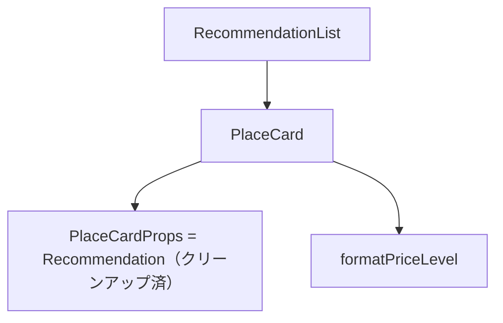

# 技術設計書: PlaceCard

## Overview

`PlaceCard` は、AI が推薦する1件の店舗情報をカード形式で表示するフロントエンド UI コンポーネントである。バックエンド API の `Recommendation` スキーマが提供する6フィールド（name / rating / price_level / address / google_maps_url / reason）を受け取り、一覧性の高いカード UI としてレンダリングする。

**Purpose**: 推薦結果の一覧表示において、1件の店舗情報を構造化されたカード UI で提供し、ユーザーが店舗の概要をひと目で把握できるようにする。
**Users**: エンドユーザーが推薦された店舗の基本情報・評価・価格帯を確認し、Google Maps へアクセスする。
**Impact**: `RecommendationList`（Chunk 10）内でのレンダリングブロックとして機能し、検索結果表示を完成させる。

### Goals

- 6フィールド（name / rating / price_level / address / google_maps_url / reason）をすべて正確に表示する
- `rating` / `price_level` の null 値を安全に処理する
- アクセシビリティ要件（外部リンク安全属性・見出しマークアップ）を満たす
- TypeScript strict モードに完全準拠した型定義を提供する
- `Recommendation` 型から `photo_url` / `opening_hours` / `OpeningHours` を削除し、型定義と API レスポンスを一致させる

### Non-Goals

- `photo_url` / `opening_hours` の表示（バックエンド API フィールドマスク最小化方針によりスコープ外）
- ユーザー操作（お気に入り登録・評価投稿など）
- `RecommendationList` コンテナの実装（Chunk 10 スコープ）
- `price_level` 変換ロジックの外部ユーティリティ化（現時点では YAGNI）

---

## Architecture

### Existing Architecture Analysis

既存の `SearchInput.tsx` がコンポーネント実装パターンを確立している。`PlaceCard` は同一パターンに従う。

- **コンポーネントファイル**: `PascalCase.tsx`、Props 型を同ファイルで export、デフォルト export
- **テストファイル**: 同階層に `*.test.tsx` を配置
- **型定義**: `frontend/src/types/search.ts` の `Recommendation` 型からスコープ外フィールド（`photo_url` / `opening_hours` / `OpeningHours`）を削除し、クリーンアップ後の `Recommendation` 型を `PlaceCardProps` として直接利用する（詳細: `research.md` — Props 設計判断）

### Architecture Pattern & Boundary Map



**Architecture Integration**:
- Selected pattern: 単一責任の関数コンポーネント（`SearchInput` と同一パターン）
- Domain boundary: カード表示のみ。データ取得・状態管理は上位コンポーネント（`RecommendationList`）が担う
- Existing patterns preserved: PascalCase コンポーネントファイル、同ファイル Props export、テストファイル同階層配置
- New components rationale: `Recommendation` 型をクリーンアップして `PlaceCardProps = Recommendation` とすることで、型ドリフトなしにインターフェース契約を明確化する
- Steering compliance: TypeScript strict モード準拠（`tech.md`）、疎結合設計、コンポーネントを `src/components/` に配置（`structure.md`）

### Technology Stack

| Layer | Choice / Version | Role | Notes |
|-------|-----------------|------|-------|
| Frontend | React 19 + TypeScript 5 | UI コンポーネント実装 | strict モード必須 |
| Build | Vite 6 | バンドル | 設定変更不要 |
| Test | Vitest 3 + Testing Library | コンポーネントテスト | 既存 `setup.ts` 利用 |

新規ライブラリの追加なし。

---

## Requirements Traceability

| 要件 | サマリー | コンポーネント | インターフェース |
|------|---------|--------------|----------------|
| 1.1 | name 表示 | PlaceCard JSX | `PlaceCardProps.name` |
| 1.2 | address 表示 | PlaceCard JSX | `PlaceCardProps.address` |
| 1.3 | reason 表示 | PlaceCard JSX | `PlaceCardProps.reason` |
| 1.4 | 3フィールド同時表示 | PlaceCard JSX | `PlaceCardProps` |
| 2.1 | rating 数値表示 | PlaceCard 条件分岐 | `PlaceCardProps.rating` |
| 2.2 | rating null 非表示 | PlaceCard 条件分岐 | `PlaceCardProps.rating` |
| 2.3 | `rating: number \| null` 型 | `PlaceCardProps` | — |
| 3.1 | price_level 表示 | PlaceCard + `formatPriceLevel` | `PlaceCardProps.price_level` |
| 3.2 | price_level null 非表示 | PlaceCard 条件分岐 | `PlaceCardProps.price_level` |
| 3.3 | `price_level: string \| null` 型 | `PlaceCardProps` | — |
| 4.1 | google_maps_url を href に設定 | PlaceCard JSX | `PlaceCardProps.google_maps_url` |
| 4.2 | `target="_blank"` | PlaceCard JSX | — |
| 4.3 | `google_maps_url: string` 型 | `PlaceCardProps` | — |
| 4.4 | 意味のあるリンクラベルテキスト | PlaceCard JSX | — |
| 5.1 | Props インターフェース定義（6フィールド） | `PlaceCardProps` | 全フィールド定義 |
| 5.2 | TypeScript strict 準拠 | `PlaceCardProps` + `PlaceCard` | — |
| 5.3 | 関数コンポーネントとして実装 | `PlaceCard` | — |
| 6.1 | `rel="noopener noreferrer"` | PlaceCard JSX | — |
| 6.2 | 店舗名を `<h3>` でマークアップ | PlaceCard JSX | — |
| 7.1 | `Recommendation` から `photo_url` 削除 | `search.ts` 修正 | `Recommendation` 型 |
| 7.2 | `Recommendation` から `opening_hours` 削除 | `search.ts` 修正 | `Recommendation` 型 |
| 7.3 | `OpeningHours` 型削除 | `search.ts` 修正 | — |
| 7.4 | TypeScript コンパイル確認 | `pnpm build` | — |

---

## Components and Interfaces

| コンポーネント | Domain/Layer | Intent | 要件カバレッジ | 主要依存 | Contracts |
|------------|-------------|--------|-------------|--------|-----------|
| `PlaceCard` | UI / Presentation | 1件の推薦店舗情報をカード形式で表示 | 1.1〜6.2 全要件 | なし（P0） | State |
| `formatPriceLevel` | UI / Utility | `PRICE_LEVEL_*` enum を ¥記号に変換 | 3.1, 3.2 | — | — |
| `Recommendation` 型クリーンアップ | Types | `photo_url`/`opening_hours`/`OpeningHours` を削除 | 7.1〜7.4 | `search.ts` | — |

### UI / Presentation レイヤー

#### PlaceCard

| Field | Detail |
|-------|--------|
| Intent | `PlaceCardProps` を受け取り、店舗情報カードをレンダリングする |
| Requirements | 1.1, 1.2, 1.3, 1.4, 2.1, 2.2, 2.3, 3.1, 3.2, 3.3, 4.1, 4.2, 4.3, 4.4, 5.1, 5.2, 5.3, 6.1, 6.2 |

**Responsibilities & Constraints**
- 6フィールドの Props を適切な HTML 要素でレンダリングする
- `rating` が null の場合は評価フィールドを非表示にする（要件 2.2）
- `price_level` が null の場合は価格帯フィールドを非表示にする（要件 3.2）
- データ取得・状態管理は行わない（ステートレスな純粋表示コンポーネント）
- `Recommendation` 型の `photo_url` / `opening_hours` は Props に含めない

**Dependencies**
- Inbound: `RecommendationList`（Chunk 10）— 親コンポーネントとして Props を渡す（P1）
- External: なし

**Contracts**: State [x]

##### Props Interface

```typescript
// Recommendation 型（search.ts）から photo_url / opening_hours / OpeningHours を削除済み（要件 7.x）
export type PlaceCardProps = Recommendation;
```

**制約**:
- `rating` / `price_level` は必須 Props だが `null` 許容
- `google_maps_url` は必須かつ非 null の `string` 型
- `Recommendation` 型クリーンアップにより `photo_url` / `opening_hours` は型から除外済みのため、Props に混入しない

##### State Management
- State model: なし（ステートレスな純粋表示コンポーネント）
- Persistence & consistency: 不要
- Concurrency strategy: 不要

**Implementation Notes**
- Integration: `PlaceCardProps = Recommendation` により、`RecommendationList` から `Recommendation` 型オブジェクトをスプレッドでそのまま渡せる（`photo_url` / `opening_hours` は型から除外済み）
- Validation: null チェックは JSX 内の条件式（`rating !== null && ...`）で実施する
- Risks: なし（`PlaceCardProps = Recommendation` により型ドリフトリスクは解消）

---

#### formatPriceLevel

| Field | Detail |
|-------|--------|
| Intent | `PRICE_LEVEL_*` enum 文字列を ¥ 記号表示に変換する純粋関数 |
| Requirements | 3.1, 3.2 |

**Responsibilities & Constraints**
- `PlaceCard.tsx` 内に同居させる（分離しない）
- `null` 入力は `null` を返し、呼び出し側の条件分岐で処理する

**変換マッピング**:

| 入力値 | 出力 |
|--------|------|
| `"PRICE_LEVEL_INEXPENSIVE"` | `"¥"` |
| `"PRICE_LEVEL_MODERATE"` | `"¥¥"` |
| `"PRICE_LEVEL_EXPENSIVE"` | `"¥¥¥"` |
| `"PRICE_LEVEL_VERY_EXPENSIVE"` | `"¥¥¥¥"` |
| `null` | `null`（表示しない） |
| その他（未知の値） | 入力値をそのまま返す（フォールバック） |

**Implementation Notes**
- Integration: `PlaceCard` コンポーネント内から直接呼び出す
- Risks: API が新しい `price_level` 値を追加した場合、フォールバックにより enum 文字列がそのまま表示される。モニタリングが必要な場合は console.warn を追加することを検討する。

---

## Data Models

### Data Contracts & Integration

PlaceCard が消費するデータはバックエンド API の `Recommendation` スキーマに依存する。

**消費するフィールド（6フィールド）**:

| フィールド | 型 | null 許容 | 表示処理 |
|----------|-----|---------|--------|
| `name` | string | No | そのまま `<h3>` で表示 |
| `rating` | number | Yes | null 時は非表示 |
| `price_level` | string | Yes | `formatPriceLevel` 変換後に表示。null 時は非表示 |
| `address` | string | No | そのまま表示 |
| `google_maps_url` | string | No | `<a href>` の href に設定 |
| `reason` | string | No | そのまま表示 |

**削除済みフィールド（要件 7.x によりクリーンアップ）**:
- `photo_url: string | null` — フィールドマスク最小化方針によりスコープ外。本 spec で `Recommendation` 型から削除する。
- `opening_hours: OpeningHours | null` — 同上。`OpeningHours` 型ごと削除する。

---

## Error Handling

### Error Strategy

PlaceCard はサーバーサイドエラーを直接扱わない。エラー状態の管理は上位コンポーネントが担う。

### Error Categories and Responses

- **Null フィールド**: `rating` / `price_level` が `null` の場合、該当 UI セクションを条件分岐で非表示にする（要件 2.2, 3.2）
- **未知の `price_level` 値**: `formatPriceLevel` のデフォルトケースで入力値をそのまま返し、UI が壊れないようにする

---

## Testing Strategy

### Unit Tests（PlaceCard.test.tsx）

**基本表示テスト**（要件 1.x）:
- `name` が表示される
- `address` が表示される
- `reason` が表示される
- 3フィールドが同時にレンダリングされる

**null 条件分岐テスト**（要件 2.x, 3.x）:
- `rating` が数値の場合に表示される
- `rating` が `null` の場合に表示されない
- `price_level` が文字列の場合に ¥ 記号変換後に表示される
- `price_level` が `null` の場合に表示されない

**Google Maps リンクテスト**（要件 4.x）:
- `google_maps_url` が `<a>` の `href` に設定される
- `target="_blank"` が付与される
- リンクに意味のあるラベルテキストが表示される（例: 「Google Maps で見る」）
- `rel="noopener noreferrer"` が付与される

**アクセシビリティテスト**（要件 6.x）:
- 店舗名が `<h3>`（heading level 3）としてレンダリングされる
- 外部リンクに `rel="noopener noreferrer"` が付与される

**formatPriceLevel ユニットテスト**:
- `PRICE_LEVEL_INEXPENSIVE` → `"¥"` に変換される
- `PRICE_LEVEL_MODERATE` → `"¥¥"` に変換される
- `PRICE_LEVEL_EXPENSIVE` → `"¥¥¥"` に変換される
- `PRICE_LEVEL_VERY_EXPENSIVE` → `"¥¥¥¥"` に変換される
- `null` 入力が `null` を返す
- 未知の入力値がそのまま返される（フォールバック）

**テスト実行コマンド**: `docker compose exec frontend pnpm test --run`
