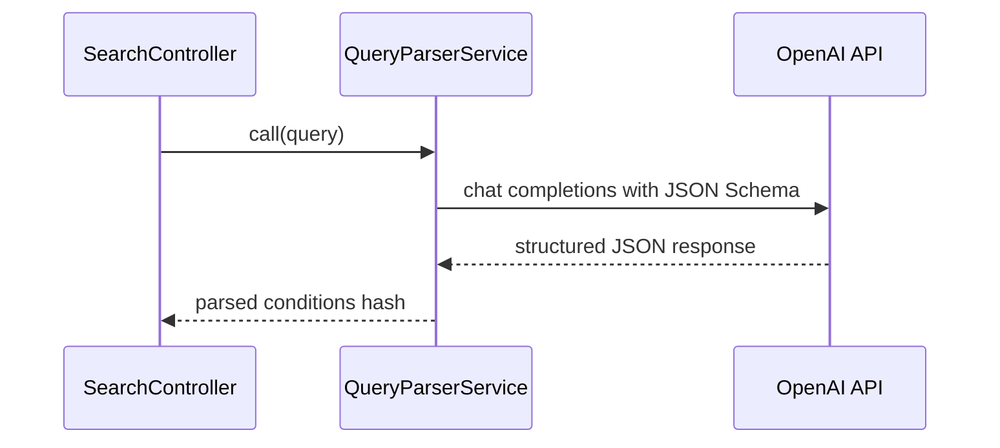
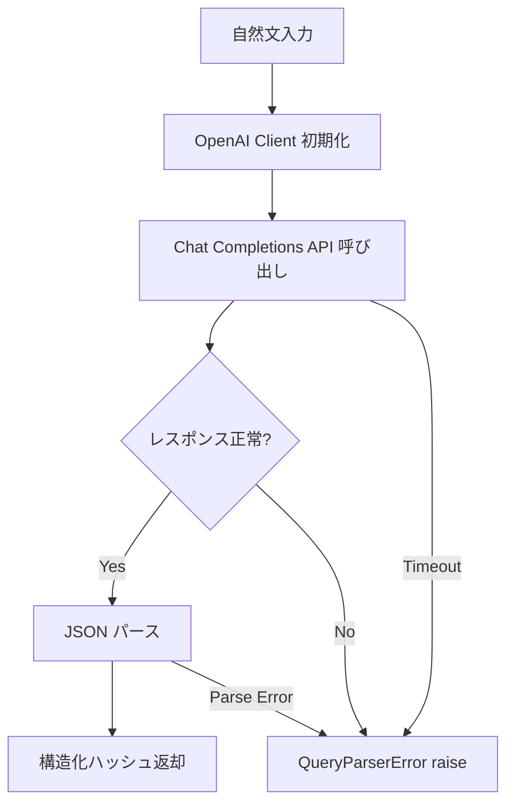

# Design Document: QueryParserService

## Overview

**Purpose**: 本機能は、ユーザーが入力した自然文をバックエンドで構造化された検索条件に変換する。後続の Google Places API 検索で正確な候補店舗を取得するための前段処理として機能する。

**Users**: SearchController（内部呼び出し元）が本サービスを利用し、自然文検索フローの条件解析ステップを実行する。

### Goals
- 自然文から area / genre / price_level / keyword の4フィールドを構造化抽出する
- OpenAI API の JSON Schema モード（Structured Outputs）でレスポンス構造を保証する
- エラーを明確なカスタム例外として呼び出し元に伝播する

### Non-Goals
- Google Places API の呼び出し（Chunk 4: GooglePlacesService の責務）
- 推薦ロジック（Chunk 5: RecommendationService の責務）
- SearchController との統合（Chunk 6 の責務）
- 自然言語処理の独自実装（OpenAI API に委譲）

## Architecture

### Existing Architecture Analysis

現在のバックエンド構成:
- `Api::BaseController < ActionController::API` — API コントローラの基底クラス
- `Api::SearchController` — `POST /api/search` のスタブ実装（固定レスポンス返却）
- `app/services/` ディレクトリは未作成 — 本機能で新設

### Architecture Pattern & Boundary Map



**Architecture Integration**:
- **Selected pattern**: Service Object（PORO）— Rails 慣習に沿ったシンプルなサービスクラス
- **Domain boundaries**: QueryParserService は「自然文解析」のみを担当。検索・推薦は別サービス
- **Existing patterns preserved**: 薄いコントローラ + サービスオブジェクトの責務分離パターン
- **New components**: `QueryParserService`（サービス）、`QueryParserError`（例外）
- **Steering compliance**: バックエンドのロジックはサービスオブジェクトに分離する方針に準拠

### Technology Stack

| Layer | Choice / Version | Role in Feature | Notes |
|-------|------------------|-----------------|-------|
| Backend | Ruby on Rails 8.1 | サービスホスト | 既存 |
| OpenAI Client | ruby-openai ~> 8.3 | OpenAI API 通信 | Gemfile に追加が必要 |
| HTTP Client | Faraday（ruby-openai 依存） | HTTP 通信・エラーハンドリング | ruby-openai が内部で使用 |

> 詳細な gem 選定理由は `research.md` の「Decision: ruby-openai gem の採用」を参照。

## System Flows



**Key Decisions**:
- API キーはファイル（`/openai_apikey`）から読み取り、`strip` して使用
- タイムアウト・HTTP エラー・JSON パースエラーはすべて `QueryParserError` にラップ

## Requirements Traceability

| Requirement | Summary | Components | Interfaces | Flows |
|-------------|---------|------------|------------|-------|
| 1.1 | JSON Schema モードで構造化抽出 | QueryParserService | `call` メソッド | Chat Completions フロー |
| 1.2 | 全フィールド含む文の正しい抽出 | QueryParserService | `call` メソッド | Chat Completions フロー |
| 1.3 | 一部条件のみの場合に nil 返却 | QueryParserService | `call` メソッド | JSON Schema の nullable 定義 |
| 1.4 | 空文字で全フィールド nil | QueryParserService | `call` メソッド | Chat Completions フロー |
| 2.1 | price_level の列挙値正規化 | QueryParserService | JSON Schema enum 定義 | プロンプト + Schema 制約 |
| 2.2 | 価格表現なしで nil | QueryParserService | JSON Schema nullable | プロンプト指示 |
| 3.1 | JSON Schema モード呼び出し | QueryParserService | OpenAI API | response_format パラメータ |
| 3.2 | gpt-5-nano モデル使用 | QueryParserService | OpenAI API | model パラメータ |
| 3.3 | API キーをファイルから読み取り | QueryParserService | ファイルシステム | 初期化フロー |
| 4.1 | API エラーで例外 raise | QueryParserError | rescue Faraday::Error | エラーフロー |
| 4.2 | タイムアウトで例外 raise | QueryParserError | rescue Faraday::TimeoutError | エラーフロー |
| 4.3 | スキーマ不適合で例外 raise | QueryParserError | rescue JSON::ParserError | エラーフロー |
| 5.1 | 入力は単一文字列 | QueryParserService | `call(query)` | — |
| 5.2 | 出力は4キーのハッシュ | QueryParserService | 戻り値の型 | — |
| 5.3 | 配置は app/services/ | QueryParserService | ファイルパス | — |

## Components and Interfaces

| Component | Domain/Layer | Intent | Req Coverage | Key Dependencies | Contracts |
|-----------|-------------|--------|--------------|------------------|-----------|
| QueryParserService | Backend / Service | 自然文を構造化検索条件に変換 | 1.1-1.4, 2.1-2.2, 3.1-3.3, 5.1-5.3 | OpenAI API (P0) | Service |
| QueryParserError | Backend / Error | OpenAI API エラーのラッパー例外 | 4.1-4.3 | — | — |

### Backend / Service Layer

#### QueryParserService

| Field | Detail |
|-------|--------|
| Intent | 自然文を OpenAI API で解析し、構造化された検索条件ハッシュを返す |
| Requirements | 1.1, 1.2, 1.3, 1.4, 2.1, 2.2, 3.1, 3.2, 3.3, 5.1, 5.2, 5.3 |

**Responsibilities & Constraints**
- 自然文の構造化解析のみを担当（検索・推薦は責務外）
- OpenAI API への通信を内部に閉じ込め、呼び出し元は API の詳細を意識しない
- ステートレス — インスタンス変数に状態を保持しない

**Dependencies**
- External: OpenAI API — Chat Completions エンドポイント (P0)
- External: ファイルシステム — `/openai_apikey` の読み取り (P0)

**Contracts**: Service [x]

##### Service Interface

```ruby
# app/services/query_parser_service.rb
class QueryParserService
  # @param query [String] ユーザーの自然文入力
  # @return [Hash] 構造化された検索条件
  #   {
  #     area: String | nil,
  #     genre: String | nil,
  #     price_level: String | nil,  # PRICE_LEVEL_* enum or nil
  #     keyword: String | nil
  #   }
  # @raise [QueryParserError] OpenAI API エラー時
  def call(query)
  end
end
```

- **Preconditions**: `query` は String 型（バリデーションは SearchController で実施済み）
- **Postconditions**: 戻り値は `:area`, `:genre`, `:price_level`, `:keyword` の4キーを持つ Hash
- **Invariants**: `price_level` が非 nil の場合、値は `PRICE_LEVEL_FREE` / `PRICE_LEVEL_INEXPENSIVE` / `PRICE_LEVEL_MODERATE` / `PRICE_LEVEL_EXPENSIVE` / `PRICE_LEVEL_VERY_EXPENSIVE` のいずれか

**Implementation Notes**
- OpenAI API の `response_format` に `type: "json_schema"` を指定し、出力スキーマを強制
- プロンプトは日本語で記述し、抽出対象フィールドの説明と具体例を含める
- `price_level` は JSON Schema の `enum` 制約で列挙値を限定
- 各フィールドは `nullable` として定義し、読み取れない場合に `null` を返すよう指示

### Backend / Error

#### QueryParserError

| Field | Detail |
|-------|--------|
| Intent | OpenAI API 関連のエラーをラップするカスタム例外 |
| Requirements | 4.1, 4.2, 4.3 |

**Responsibilities & Constraints**
- `Faraday::Error`、`Faraday::TimeoutError`、`JSON::ParserError` をラップ
- 元の例外を `cause` として保持し、デバッグ情報を維持

```ruby
# app/services/query_parser_error.rb
class QueryParserError < StandardError
end
```

## Data Models

本機能はデータベースを使用しない。入出力はすべてインメモリのハッシュで処理される。

### Data Contracts & Integration

**OpenAI API Request（Chat Completions）**:

```json
{
  "model": "gpt-5-nano",
  "messages": [
    {
      "role": "system",
      "content": "システムプロンプト（日本語）"
    },
    {
      "role": "user",
      "content": "渋谷で安くてうまいイタリアン"
    }
  ],
  "response_format": {
    "type": "json_schema",
    "json_schema": {
      "name": "parsed_query",
      "strict": true,
      "schema": {
        "type": "object",
        "properties": {
          "area": { "type": ["string", "null"] },
          "genre": { "type": ["string", "null"] },
          "price_level": {
            "type": ["string", "null"],
            "enum": [
              null,
              "PRICE_LEVEL_FREE",
              "PRICE_LEVEL_INEXPENSIVE",
              "PRICE_LEVEL_MODERATE",
              "PRICE_LEVEL_EXPENSIVE",
              "PRICE_LEVEL_VERY_EXPENSIVE"
            ]
          },
          "keyword": { "type": ["string", "null"] }
        },
        "required": ["area", "genre", "price_level", "keyword"],
        "additionalProperties": false
      }
    }
  }
}
```

**OpenAI API Response（パース後）**:

```ruby
{
  area: "渋谷",
  genre: "イタリアン",
  price_level: "PRICE_LEVEL_INEXPENSIVE",
  keyword: "うまい"
}
```

## Error Handling

### Error Strategy

すべての外部 API エラーを `QueryParserError` にラップし、呼び出し元に伝播する。

### Error Categories and Responses

| Error Source | Exception | Wrapped As | 上位での HTTP Status |
|-------------|-----------|------------|---------------------|
| OpenAI API 4xx | `Faraday::ClientError` | `QueryParserError` | 502 |
| OpenAI API 5xx | `Faraday::ServerError` | `QueryParserError` | 502 |
| 接続タイムアウト | `Faraday::TimeoutError` | `QueryParserError` | 502 |
| JSON パースエラー | `JSON::ParserError` | `QueryParserError` | 502 |
| API キーファイル欠如 | `Errno::ENOENT` | `QueryParserError` | 502 |

### Monitoring

- `QueryParserError` 発生時に `Rails.logger.error` でエラー内容と元の例外を出力
- 元の例外クラスとメッセージを含めてログに記録

## Testing Strategy

### Unit Tests（RSpec service spec）
1. エリア・ジャンル・価格帯・キーワードを含む自然文 → 全フィールドが正しく抽出される
2. エリアのみの自然文 → genre / price_level / keyword が nil
3. 空文字列 → 全フィールドが nil
4. price_level が正しい列挙値として返される
5. OpenAI API エラー → `QueryParserError` が raise される
6. タイムアウト → `QueryParserError` が raise される
7. 不正な JSON レスポンス → `QueryParserError` が raise される

### テストの方針
- OpenAI API 呼び出しは WebMock でモック
- `response_format` パラメータが正しく設定されていることをリクエストボディで検証
- 正常系ではモックレスポンスの JSON を返し、パース結果を検証
