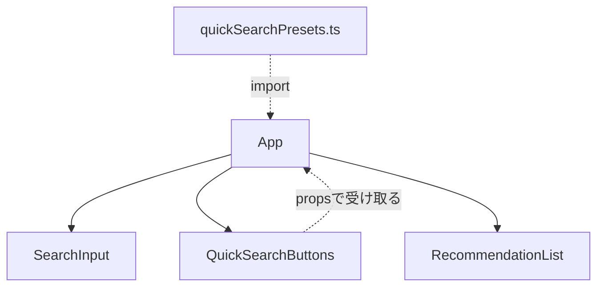
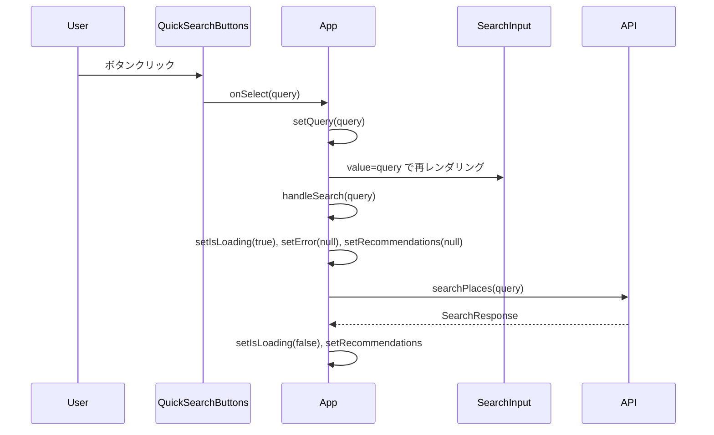

# 技術設計書：クイック検索ボタン

## Overview

クイック検索ボタン機能は、レストラン発見プラットフォームのフロントエンドに、よく使われる検索条件をプリセットボタンとして提供するUI拡張である。ユーザーはテキスト入力なしに1クリックで検索を実行でき、初回訪問者を含むすべてのユーザーの操作ステップを削減する。

プリセット内容は `frontend/src/config/quickSearchPresets.ts` に集約し、UIコンポーネントを変更せずに追加・変更・削除できる設計とする。本機能はフロントエンド完結であり、バックエンドへの変更を伴わない。

### Goals

- プリセット設定ファイルによりコンポーネントを変更せずにプリセットを管理できる
- ボタン1クリックでテキストフィールドへのクエリ設定と即時検索を実行する
- ローディング中はすべてのクイック検索ボタンを無効化し、誤操作を防ぐ
- アクセシビリティ（キーボード操作・44px タップ領域）とレスポンシブレイアウトを確保する

### Non-Goals

- バックエンドAPIの変更
- プリセットのサーバーサイド管理・動的取得
- ユーザー個別のプリセットカスタマイズ機能

## Architecture

### Existing Architecture Analysis

現在の `SearchInput` コンポーネントは `query` ステートを `useState<string>('')` で内部管理しており、外部からクエリ値を注入する手段がない。クイック検索ボタンクリック時にテキストフィールドへ値を反映させる要件（3.1）を満たすには、`App.tsx` に `query` ステートをリフトアップし、`SearchInput` を制御コンポーネントに変換する必要がある。

既存の `handleSearch(query: string)` 関数および `isLoading` ステートは変更なしに再利用できる。

### Architecture Pattern & Boundary Map



**Architecture Integration**:
- 選択パターン: ステートリフトアップ（Controlled Component）。`query` ステートを `App.tsx` に移動し、`SearchInput` を制御コンポーネント化する
- ドメイン境界: `QuickSearchButtons` は内部ステートを持たないプレゼンテーショナルコンポーネントとして設計し、ロジックを `App.tsx` に集約する
- 既存パターンの維持: `handleSearch` の呼び出し形式・エラーハンドリングは変更しない
- 新規コンポーネント: `QuickSearchButtons`（UIのみ）、`quickSearchPresets.ts`（設定ファイル）
- Steering準拠: ビジネスロジックをコンポーネントから分離し設定ファイルで管理、TypeScript strict モード遵守

### Technology Stack

| Layer | Choice / Version | Role in Feature | Notes |
|-------|------------------|-----------------|-------|
| Frontend | React 19 + TypeScript 5 (strict) | コンポーネント実装・型定義 | 既存スタック、新規依存なし |
| Styling | Tailwind CSS v4 | ボタンレイアウト・disabled スタイル | 既存パターン流用 |
| Testing | Vitest 3 + Testing Library | コンポーネントテスト | 既存テスト基盤 |

新規外部依存なし。

## System Flows



クイック検索フローでは、`setQuery` → `handleSearch` の順で同期的にステートを更新し即時検索を実行する。ローディング中はすべての `QuickSearchButtons` が `isLoading=true` を受け取り自動的に disabled になる。

## Requirements Traceability

| Requirement | Summary | Components | Interfaces | Flows |
|-------------|---------|------------|------------|-------|
| 1.1 | プリセット定義を設定ファイルに集約 | quickSearchPresets.ts | `QuickSearchPreset` 型 | — |
| 1.2 | 初期プリセット6件定義 | quickSearchPresets.ts | `quickSearchPresets` 配列 | — |
| 1.3 | `QuickSearchPreset` 型を export | quickSearchPresets.ts | `QuickSearchPreset` | — |
| 2.1 | プリセットをボタンとして表示 | QuickSearchButtons | `QuickSearchButtonsProps.presets` | — |
| 2.2 | `label` をボタン表示テキストに使用 | QuickSearchButtons | — | — |
| 2.3 | flex-wrap レイアウト | QuickSearchButtons | — | — |
| 3.1 | クリックでクエリをテキストフィールドに設定 | App, SearchInput | `SearchInputProps.value`, `SearchInputProps.onChange` | クイック検索フロー |
| 3.2 | クリックで即時検索実行 | App, QuickSearchButtons | `QuickSearchButtonsProps.onSelect` | クイック検索フロー |
| 3.3 | ローディング中に既存結果・エラークリア | App | `handleSearch` 内の既存ステートリセット | クイック検索フロー |
| 4.1 | 検索中にすべてのボタンを disabled | QuickSearchButtons | `QuickSearchButtonsProps.isLoading` | — |
| 4.2 | disabled ボタンの視覚的スタイル | QuickSearchButtons | Tailwind CSS disabled variant | — |
| 4.3 | 検索完了またはエラーでボタン再有効化 | App | `isLoading` ステートの false への復帰 | — |
| 5.1 | `<button>` 要素・キーボード操作対応 | QuickSearchButtons | — | — |
| 5.2 | disabled 時のキーボード操作無効化 | QuickSearchButtons | `disabled` 属性 | — |
| 5.3 | タップ領域 44×44px 以上 | QuickSearchButtons | `min-h-[44px]` | — |
| 5.4 | 既存コンポーネントと統一デザイン | QuickSearchButtons | Tailwind CSS v4 | — |

## Components and Interfaces

### Summary

| Component | Domain/Layer | Intent | Req Coverage | Key Dependencies (P0/P1) | Contracts |
|-----------|--------------|--------|--------------|--------------------------|-----------|
| quickSearchPresets.ts | Config | プリセット定義と型の単一管理点 | 1.1, 1.2, 1.3 | なし | State |
| QuickSearchButtons | UI | プリセットボタン群の表示と操作制御 | 2.1–2.3, 4.1–4.3, 5.1–5.4 | App (P0) | Service, State |
| SearchInput（変更） | UI | 制御コンポーネントへの変換 | 3.1 | App (P0) | State |
| App.tsx（変更） | Orchestrator | query ステートリフトアップとハンドラ統合 | 3.1–3.3 | QuickSearchButtons (P0), SearchInput (P0) | State |

### Config

#### quickSearchPresets.ts

| Field | Detail |
|-------|--------|
| Intent | プリセット定義の単一管理点として型定義と初期データを export する |
| Requirements | 1.1, 1.2, 1.3 |

**Responsibilities & Constraints**
- `QuickSearchPreset` 型と `quickSearchPresets` 配列を export する
- 配列は `readonly` として定義し、ランタイムでの変更を禁止する
- コンポーネントの変更なしにプリセットを追加・変更・削除できる唯一の変更箇所

**Contracts**: State [x]

##### State Management

```typescript
export type QuickSearchPreset = {
  label: string;
  query: string;
};

export const quickSearchPresets: readonly QuickSearchPreset[] = [
  { label: '駅前',   query: '新潟駅前の居酒屋' },
  { label: '駅南',   query: '新潟駅南の居酒屋' },
  { label: '古町',   query: '古町での居酒屋' },
  { label: '友達',   query: '新潟市で友達と飲み会' },
  { label: '一人飲み', query: '新潟市で一人飲み' },
  { label: 'デート', query: '新潟市で女性とデート' },
];
```

- State model: 不変配列（`readonly`）として定義。ランタイム変更なし
- Persistence: ソースコード管理のみ

**Implementation Notes**
- Integration: `App.tsx` が `quickSearchPresets` を import して `QuickSearchButtons` の `presets` prop として渡す
- Validation: TypeScript のコンパイル時型チェックのみ

### UI

#### QuickSearchButtons

| Field | Detail |
|-------|--------|
| Intent | プリセットボタン群を flex-wrap レイアウトで表示し、クリック時に `onSelect` コールバックを呼び出す |
| Requirements | 2.1, 2.2, 2.3, 4.1, 4.2, 4.3, 5.1, 5.2, 5.3, 5.4 |

**Responsibilities & Constraints**
- `presets` 配列の各要素に対して `<button>` 要素を生成し、`label` をボタンテキストとして表示する
- `isLoading` が `true` のとき全ボタンに `disabled` 属性を付与する
- 内部ステートを持たないプレゼンテーショナルコンポーネントとして実装する

**Dependencies**
- Inbound: App.tsx — `presets`、`onSelect`、`isLoading` を props として提供 (P0)

**Contracts**: Service [x] / State [x]

##### Service Interface

```typescript
import type { QuickSearchPreset } from '../config/quickSearchPresets';

export interface QuickSearchButtonsProps {
  presets: readonly QuickSearchPreset[];
  onSelect: (query: string) => void;
  isLoading: boolean;
}
```

- Preconditions: `presets` は空配列でもよい（ボタンが0件になるだけ）
- Postconditions: `onSelect(preset.query)` 呼び出し後の状態変更は App.tsx に委譲する

##### State Management

- State model: 内部ステートなし。`isLoading` が `true` のとき全ボタンが disabled になる
- Concurrency: `isLoading` prop の変化のみに依存。外部ステートで管理される

**Implementation Notes**
- Integration: `SearchInput` の下、`RecommendationList` の上に配置する。`App.tsx` から `quickSearchPresets` と `handleQuickSearch` を渡す
- Validation: `isLoading=true` のとき `disabled` 属性を付与することでキーボード・タップの両方を無効化する
- Risks: タップ領域 44px 確保のため各ボタンに `min-h-[44px]` を適用すること。`disabled:opacity-50 disabled:cursor-not-allowed` は既存の送信ボタンと統一したパターンで適用する

#### SearchInput（変更）

| Field | Detail |
|-------|--------|
| Intent | 外部から `value` を制御できる制御コンポーネントに変換する |
| Requirements | 3.1 |

**Responsibilities & Constraints**
- 内部の `useState<string>('')` を除去し、`value` と `onChange` を props で受け取る
- `onSubmit` 呼び出し前の空文字チェック（`value.trim() === ''`）は引き続き内部で行う

**Dependencies**
- Inbound: App.tsx — `value`、`onChange`、`onSubmit`、`isLoading` を提供 (P0)

**Contracts**: State [x]

##### State Management

```typescript
export interface SearchInputProps {
  value: string;
  onChange: (query: string) => void;
  onSubmit: (query: string) => void;
  isLoading?: boolean;
}
```

- State model: `query` ステートを App.tsx に移動済み。SearchInput は純粋な制御コンポーネント
- Persistence: ステートなし

**Implementation Notes**
- Integration: 既存の `App.tsx` の使用箇所を `<SearchInput value={query} onChange={setQuery} onSubmit={handleSearch} isLoading={isLoading} />` に更新する
- Validation: `onSubmit` 呼び出し前の `value.trim() === ''` チェックは SearchInput 内部で継続して行う
- Risks: `SearchInput.test.tsx` の既存テストは `value` / `onChange` props が必須になるため更新が必要

#### App.tsx（変更）

| Field | Detail |
|-------|--------|
| Intent | `query` ステートをリフトアップし、クイック検索ハンドラを追加する |
| Requirements | 3.1, 3.2, 3.3 |

**Responsibilities & Constraints**
- `query: string` ステートを追加し、`SearchInput` と `QuickSearchButtons` に渡す単一の管理点とする
- クイック検索ハンドラでクエリを設定した直後に `handleSearch` を呼び出す

**Dependencies**
- Outbound: SearchInput — `value`、`onChange` props (P0)
- Outbound: QuickSearchButtons — `presets`、`onSelect`、`isLoading` props (P0)
- Outbound: quickSearchPresets.ts — プリセットデータ import (P0)

**Contracts**: State [x]

##### State Management

```typescript
// 追加ステート
const [query, setQuery] = useState<string>('');

// 追加ハンドラ
function handleQuickSearch(presetQuery: string): void {
  setQuery(presetQuery);
  void handleSearch(presetQuery);
}
```

- State model: `query` を App が管理し、`SearchInput` と `QuickSearchButtons` の両方に渡す
- Concurrency: 既存の `handleSearch` 内の `setIsLoading(true)` が重複実行を事実上防止する

**Implementation Notes**
- Integration: `<QuickSearchButtons presets={quickSearchPresets} onSelect={handleQuickSearch} isLoading={isLoading} />` を `SearchInput` の直後に追加する
- Validation: `handleSearch` は `async` 関数のため、`handleQuickSearch` 内での呼び出しは `void` キャストで floating promise 警告を回避する
- Risks: `query` ステートの追加により `App.test.tsx` の更新が必要になる可能性がある

## Error Handling

### Error Strategy

クイック検索ボタンによる検索エラーは、既存の `App.tsx` のエラーハンドリング（`catch (e) → setError()`）がそのまま機能する。`handleQuickSearch` は `handleSearch` を呼び出すだけであり、追加のエラーハンドリングは不要。

### Error Categories and Responses

- **誤操作防止**: ローディング中に `isLoading=true` を `QuickSearchButtons` に渡すことで全ボタンが disabled になる（要件 4.1）
- **API エラー**: 既存の `setError()` → `<p className="text-red-600">` 表示フロー（変更なし）
- **結果0件**: 既存の「条件に合うレストランが見つかりませんでした」メッセージ（変更なし）

## Testing Strategy

### Unit Tests

- **quickSearchPresets.ts**: `QuickSearchPreset` 型のエクスポート確認、配列が6件のプリセットを含むこと、各要素に `label` と `query` が存在すること
- **QuickSearchButtons**:
  - `presets` の数だけボタンが描画されること
  - 各ボタンに `preset.label` が表示されること
  - `isLoading=false` のとき全ボタンが enabled であること
  - `isLoading=true` のとき全ボタンが disabled であること
  - ボタンクリック時に `onSelect(preset.query)` が呼ばれること
  - disabled 状態でボタンクリックしても `onSelect` が呼ばれないこと
- **SearchInput（変更後）**: `value` prop が入力フィールドの表示値として使われること、`onChange` が入力変更時に呼ばれること（既存テストの更新を含む）

### Integration Tests

- **App.tsx**: クイック検索ボタンクリック → `SearchInput` テキストフィールドに `query` が反映されること
- **App.tsx**: クイック検索ボタンクリック → `handleSearch` が実行されること（ローディング状態への遷移を確認）
- **App.tsx**: ローディング中は `QuickSearchButtons` 全ボタンが disabled、完了後に enabled に戻ること
