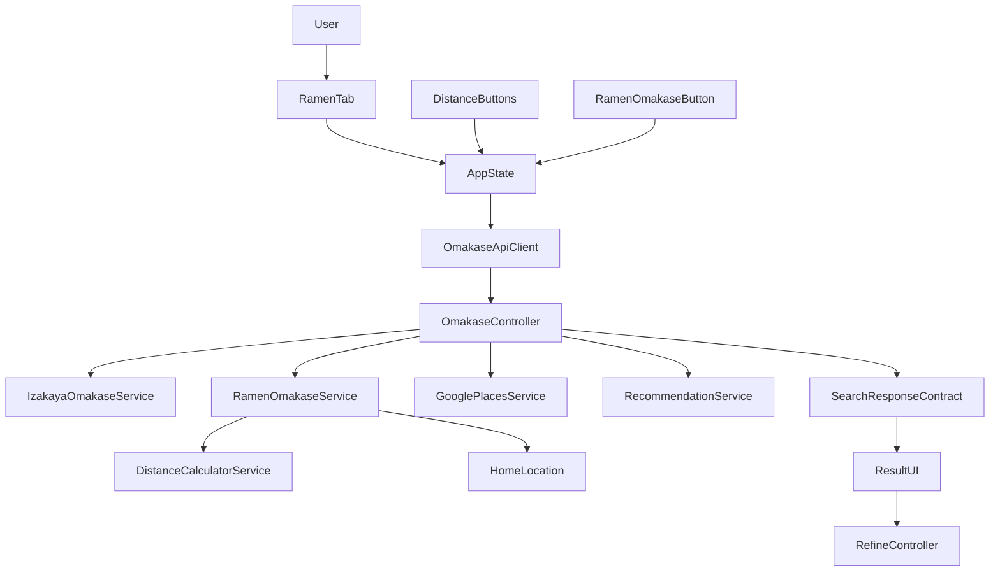
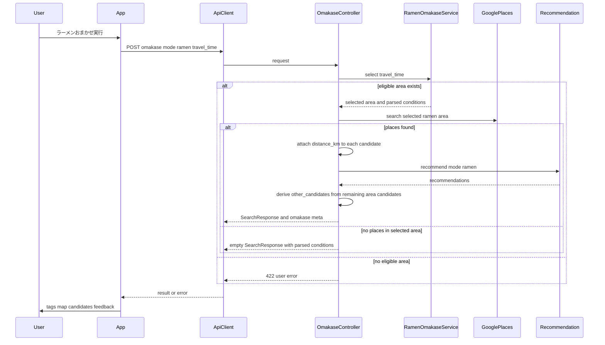

# 技術設計書

## Overview

本機能は、ラーメンタブから自由入力なしで AI 推薦を開始できる「ラーメンおまかせ」導線を追加する。ユーザーは既存の距離選択を保ったまま 1 回の操作で新潟周辺のラーメン激戦区からランダムに選ばれたエリアの候補を受け取り、通常ラーメン検索と同じ結果 UI で比較できる。あわせて、ラーメンタブの検索入力にはラーメン探索に自然な例示文言を表示し、居酒屋向け文言との不整合を解消する。

影響範囲は frontend の mode 別操作導線、検索入力の mode 別文言、`/api/omakase` の入力契約、backend のラーメン用エリア選定ロジックに限定する。検索結果表示、地図、追加候補、距離表示、再レコメンドは既存ラーメン検索の契約を再利用し、新規 UI / API を増やしすぎない。

### Goals
- ラーメンタブに距離フィルターと併用可能なラーメンおまかせ導線を追加する
- ラーメンタブの入力補助文言をラーメン向けの自然な例示へ揃える
- 距離条件に合うラーメン激戦区からランダムに 1 エリアを選び、ラーメン特化の AI 推薦を返す
- 選定エリア・候補一覧・距離表示・再レコメンドを既存ラーメン体験と同じ結果面で継続利用できるようにする

### Non-Goals
- 味噌・醤油・塩・つけ麺などサブジャンル別おまかせ
- ラーメン激戦区カタログの管理 UI / DB 化
- 居酒屋 4 エリアおまかせの表示ラベルや挙動変更
- 通常ラーメン検索の QueryParser / search API 契約変更

## Boundary Commitments

### This Spec Owns
- ラーメンタブでのおまかせ起動 UI と loading / error 制御
- ラーメンタブ時の検索入力プレースホルダーをラーメン向け文言へ切り替えること
- 距離条件に応じたラーメン激戦区の候補絞り込みとランダム選定
- `/api/omakase` の ramen mode 契約
- 選定済みエリアを `parsed_conditions` に反映して結果表示と再レコメンドへ引き継ぐこと

### Out of Boundary
- 居酒屋 mode の area 指定 UI と 4 エリア選定ロジックの仕様変更
- ラーメン検索の自由入力検索そのものの解析ロジック変更
- 地図、カード、追加候補、タグ表示の新規専用 UI 追加
- 管理画面、運用ツール、外部設定ストアの導入

### Allowed Dependencies
- frontend は既存 `App.tsx` 状態管理、`SearchConditionTags`、`RecommendationList`、`OtherCandidateSection`、`MapPanel`、`FeedbackInput` に依存してよい
- backend は既存 `GooglePlacesService`、`RecommendationService`、`DistanceCalculatorService`、`HOME_LOCATION` に依存してよい
- ramen mode の area catalog は backend の静的コード定義にのみ依存してよい
- ramen mode のおまかせは `QueryParserService` に依存してはならない

### Revalidation Triggers
- `/api/omakase` request / response shape が変わる
- `parsed_conditions.area` の意味を「選定エリア」以外へ変える
- 距離区分 (`within_30min`, `within_1hour`, `1_to_2_hours`) やホーム座標の扱いを変える
- ラーメン激戦区カタログの責務を frontend や DB へ移す

## Architecture

### Existing Architecture Analysis
- frontend は `App.tsx` が mode 切替・検索・おまかせ・再レコメンド・地図選択を集約し、表示は部品へ分離している。
- backend は薄い API controller と service object の構成で、`/api/search`・`/api/omakase`・`/api/refine` が同じ `SearchResponse` 系 JSON を返す。
- ラーメン通常検索は `SearchController` で `distance_km` 付与と距離フィルターを行い、結果表示は既存 `PlaceCard` / `MapPanel` が処理する。
- 居酒屋おまかせは `OmakaseService` が居酒屋専用条件を返す設計であり、ラーメン特有の前処理を混在させない方が境界が明確になる。

### Architecture Pattern & Boundary Map



**Architecture Integration**:
- Selected pattern: 既存 endpoint を維持した mode-aware orchestration。API 表面は 1 本に保ち、backend service で izakaya / ramen の責務を分ける。
- Domain/feature boundaries: frontend は「起動と状態遷移」、backend controller は「mode 切替とレスポンス整形」、`RamenOmakaseService` は「激戦区選定と条件生成」を担当する。
- Existing patterns preserved: `App.tsx` 集約、thin controller、service object、共通 `SearchResponse` 形、`parsed_conditions` 再利用。
- New components rationale: ラーメン用ボタンは UI 責務分離、`RamenOmakaseService` は居酒屋ロジックと異なる入力・距離判定・静的カタログ責務を隔離するために必要。
- Steering compliance: frontend strict typing を保ち、backend は service object へロジックを寄せ、controller は JSON 契約整形に留める。

### Technology Stack

| Layer | Choice / Version | Role in Feature | Notes |
|-------|------------------|-----------------|-------|
| Frontend | React 19 + TypeScript 5 strict | ラーメンおまかせ起動 UI、state orchestration、API request 型定義 | `any` は使わず discriminated union を使う |
| Backend | Rails 8.1 + Ruby service objects | mode-aware `/api/omakase`、ラーメン激戦区選定、結果整形 | controller は薄く保つ |
| External API | Google Places Text Search | 選定エリアに基づく候補店取得 | 既存 `GooglePlacesService` を再利用 |
| External API | OpenAI Recommendation | ラーメン特化の推薦理由生成 | 既存 `mode: "ramen"` prompt を再利用 |
| Runtime | HOME_LOCATION initializer + static area catalog | 距離判定と候補エリア絞り込み | 新規 DB は導入しない |

## File Structure Plan

### Directory Structure
```text
frontend/src/
├── App.tsx                              # ラーメンタブの起動導線と mode-aware omakase 呼び出し
├── api/
│   └── omakase.ts                       # discriminated union request で /api/omakase を呼ぶ
├── components/
│   ├── SearchInput.tsx                  # mode-aware placeholder を受ける汎用検索入力
│   ├── OmakaseButtons.tsx               # 居酒屋 4 エリア UI をそのまま維持
│   ├── DistanceFilterButtons.tsx        # ラーメン距離フィルターをそのまま再利用
│   └── RamenOmakaseButton.tsx           # ラーメンタブ専用の単一おまかせ操作
├── types/
│   └── search.ts                        # mode-aware omakase request / response 型
└── components/SearchInput.test.tsx      # placeholder props と loading 状態を検証

backend/app/
├── controllers/api/
│   └── omakase_controller.rb            # izakaya / ramen request の分岐、エラー整形、SearchResponse 生成
└── services/
    ├── omakase_service.rb               # 居酒屋 4 エリア条件生成を維持
    ├── ramen_omakase_service.rb         # ラーメン激戦区カタログ、距離絞り込み、ランダム選定
    ├── distance_calculator_service.rb   # ホーム座標からエリア中心までの距離計算を再利用
    ├── google_places_service.rb         # 候補店取得を再利用
    └── recommendation_service.rb        # ラーメン mode 推薦理由生成を再利用

backend/spec/
├── requests/api/omakase_spec.rb         # izakaya / ramen 両 mode の request 契約
└── services/ramen_omakase_service_spec.rb # ラーメン激戦区選定ロジック
```

### Modified Files
- `frontend/src/App.tsx` — ラーメンタブ時に `RamenOmakaseButton` を表示し、距離選択値を ramen mode request として送る。loading / reset / error 制御は既存 `handleOmakase` 系に統合する。
- `frontend/src/components/SearchInput.tsx` — 固定プレースホルダーをやめ、mode-aware な文言を props で受け取れるようにする。
- `frontend/src/api/omakase.ts` — `fetchOmakase(areaId)` から `fetchOmakase(request)` へ拡張し、`izakaya` と `ramen` の request body を型安全に分岐する。
- `frontend/src/types/search.ts` — `OmakaseRequest` discriminated union、`OmakaseMeta` の拡張、`RefineRequest` の `origin` 識別子を追加する。
- `backend/app/controllers/api/omakase_controller.rb` — 入力バリデーション、mode 分岐、候補エリアゼロ時の 422、選定済み area を含む `parsed_conditions` 整形、`distance_km` 付与、`other_candidates` 生成を担う。
- `backend/app/controllers/api/refine_controller.rb` — `origin` 識別子を用いて ramen おまかせ由来の `parsed_conditions.area` を再レコメンド時に維持し、追加要望だけを差分反映する。
- `backend/spec/requests/api/omakase_spec.rb` — ramen mode の request / response / error / empty path を追加し、既存 izakaya path を壊さないことを固定する。
- `frontend/src/App.test.tsx` — ラーメンおまかせ起動、loading、エラー、再レコメンド継続、居酒屋非回帰を検証する。
- `frontend/src/components/SearchInput.test.tsx` — 居酒屋 / ラーメンの placeholder 表示と loading 中の挙動を検証する。
- `frontend/src/api/omakase.test.ts` — mode-aware request body と error path を検証する。

### New Files
- `frontend/src/components/RamenOmakaseButton.tsx` — 単一ボタンの描画、disabled 制御、クリック通知のみを担当する。
- `frontend/src/components/RamenOmakaseButton.test.tsx` — ラベル表示、loading 時 disabled、click event を固定する。
- `backend/app/services/ramen_omakase_service.rb` — ラーメン激戦区カタログ、travel_time 絞り込み、ランダム選定、Places 検索条件生成を担当する。
- `backend/spec/services/ramen_omakase_service_spec.rb` — 距離区分別の eligible area、ランダム選定、候補ゼロ error を固定する。

### Referenced Existing Files
- `frontend/src/components/SearchConditionTags.tsx` — `parsed_conditions.area` と `genre` をそのまま表示し、選定エリアの可視化を担う。
- `frontend/src/components/OtherCandidateSection.tsx` — おまかせ結果の追加候補表示を再利用する。
- `frontend/src/components/MapPanel.tsx` — recommendation / other candidate の地図表示を再利用する。
- `frontend/src/components/PlaceCard.tsx` — `distance_km` バッジを含む候補カード表示を再利用する。
- `frontend/src/components/SearchInput.tsx` — 通常検索入力の既存 UI を再利用し、mode に応じた文言差し替えだけを追加する。
- `frontend/src/api/search.ts` — 通常ラーメン検索の既存契約を維持し、本 spec では変更しない比較基準として扱う。
- `frontend/src/config/omakaseAreas.ts` — 居酒屋 4 エリア表示の固定データを維持する。
- `backend/app/controllers/api/refine_controller.rb` — 選定済み `parsed_conditions` を受けてラーメン refine を継続する既存境界。

## System Flows



- 距離条件は `RamenOmakaseService` の前段絞り込みにのみ適用し、selected area 決定後はその area に固定する。
- selected area 決定後の候補店舗には `Api::OmakaseController` が `distance_km` を付与し、recommendations / other_candidates の両方で既存ラーメン検索と同じ距離表示契約を満たす。
- ramen おまかせ由来の refine では `parsed_conditions.area` をロックし、追加要望が area を示唆しても selected area を上書きしない。
- empty path は別条件へフォールバックしない。Requirement 3.4 に従い、選ばれた area のまま空結果を返す。

## Requirements Traceability

| Requirement | Summary | Components | Interfaces | Flows |
|-------------|---------|------------|------------|-------|
| 1.1 | ラーメンタブでおまかせボタンを表示 | `RamenOmakaseButton`, `App.tsx` | UI state props | ラーメンおまかせ起動 |
| 1.2 | 距離選択とおまかせボタンを同時利用 | `DistanceFilterButtons`, `RamenOmakaseButton`, `App.tsx` | frontend state composition | ラーメンおまかせ起動 |
| 1.3 | 自由入力なしで推薦開始 | `RamenOmakaseButton`, `fetchOmakase`, `Api::OmakaseController` | `OmakaseRequest` | ラーメンおまかせ起動 |
| 1.4 | 処理中の loading と重複防止 | `App.tsx`, `RamenOmakaseButton`, `Api::OmakaseController` | UI loading state | ラーメンおまかせ起動 |
| 2.1 | 事前定義激戦区から 1 エリア選定 | `RamenOmakaseService` | service contract | ラーメンおまかせ起動 |
| 2.2 | 距離条件に合うエリアだけを対象化 | `RamenOmakaseService`, `DistanceCalculatorService` | `travel_time` input | ラーメンおまかせ起動 |
| 2.3 | 距離指定なしなら全エリアを対象化 | `RamenOmakaseService` | optional `travel_time` | ラーメンおまかせ起動 |
| 2.4 | 条件に合うエリアがないことを通知 | `RamenOmakaseService`, `Api::OmakaseController`, `App.tsx` | 422 error envelope | ラーメンおまかせ起動 |
| 3.1 | 選定エリア関連の店だけを返す | `RamenOmakaseService`, `Api::OmakaseController`, `GooglePlacesService` | SearchResponse | ラーメンおまかせ起動 |
| 3.2 | 味や特徴を含む推薦理由 | `RecommendationService` | recommendation contract | ラーメンおまかせ起動 |
| 3.3 | 選定エリアを結果情報へ反映 | `Api::OmakaseController`, `SearchConditionTags` | `parsed_conditions`, `omakase` meta | ラーメンおまかせ起動 |
| 3.4 | 選定エリアで候補なしでも別条件へ逃がさない | `Api::OmakaseController` | empty SearchResponse | ラーメンおまかせ起動 |
| 4.1 | 地図表示を継続利用 | `App.tsx`, `MapPanel` | existing candidate contract | 結果表示継続 |
| 4.2 | 追加候補を継続利用 | `App.tsx`, `OtherCandidateSection` | existing candidate contract | 結果表示継続 |
| 4.3 | 距離情報を継続表示 | `Api::OmakaseController`, `PlaceCard` | candidate `distance_km` | 結果表示継続 |
| 4.4 | ラーメン mode と選定条件を保った再レコメンド | `App.tsx`, `RefineController`, `SearchConditionTags` | `parsed_conditions`, `mode` | 結果表示継続 |
| 4.5 | ラーメンタブでラーメン向けプレースホルダーを表示 | `App.tsx`, `SearchInput` | placeholder props | 入力導線整合 |
| 5.1 | 居酒屋タブの既存おまかせ維持 | `OmakaseButtons`, `OmakaseService`, `Api::OmakaseController` | izakaya request path | izakaya 維持 |
| 5.2 | 4 エリア表示を変更しない | `OmakaseButtons`, `frontend/src/config/omakaseAreas.ts` | existing props contract | izakaya 維持 |
| 5.3 | 通常ラーメン検索と距離フィルターを妨げない | `App.tsx`, `searchPlaces`, `DistanceFilterButtons` | existing search API | 既存検索継続 |

## Components and Interfaces

| Component | Domain/Layer | Intent | Req Coverage | Key Dependencies | Contracts |
|-----------|--------------|--------|--------------|------------------|-----------|
| `RamenOmakaseButton` | Frontend UI | ラーメンタブ専用のおまかせ起動を描画する | 1.1, 1.2, 1.4 | `App.tsx` (P0) | State |
| `SearchInput` mode-aware placeholder | Frontend UI | mode に応じた検索例示文言を表示する | 4.5, 5.3 | `App.tsx` (P0) | State |
| `fetchOmakase` + `OmakaseRequest` | Frontend API | mode-aware omakase request を型安全に送信する | 1.3, 2.2, 2.3, 5.1 | `/api/omakase` (P0) | Service, API |
| `App.tsx` ramen omakase branch | Frontend runtime | loading/reset/result reuse と mode 別入力文言を既存検索体験へ統合する | 1.2, 1.4, 3.3, 4.1, 4.2, 4.4, 4.5, 5.3 | `fetchOmakase` (P0), result UI (P1) | State |
| `Api::OmakaseController` | Backend API | izakaya / ramen request を分岐し SearchResponse を返す | 1.3, 2.4, 3.1, 3.3, 3.4, 4.3, 5.1 | `OmakaseService` (P0), `RamenOmakaseService` (P0), `GooglePlacesService` (P0), `RecommendationService` (P0) | Service, API |
| `Api::RefineController` ramen area-lock | Backend API | ramen おまかせ起点の再レコメンドで selected area を保持する | 4.4 | `QueryParserService` (P0), `GooglePlacesService` (P0), `RecommendationService` (P0) | Service, API |
| `RamenOmakaseService` | Backend domain | 激戦区カタログと距離条件から selected area を決定する | 2.1, 2.2, 2.3, 2.4, 3.1 | `DistanceCalculatorService` (P0), `HOME_LOCATION` (P1) | Service |

### Frontend UI / Runtime

#### RamenOmakaseButton

| Field | Detail |
|-------|--------|
| Intent | ラーメンタブで単一のラーメンおまかせ起動ボタンを提供する |
| Requirements | 1.1, 1.2, 1.4 |

**Responsibilities & Constraints**
- ラーメンタブ専用ラベルを描画する
- `isLoading` 中は disabled にして重複実行を防ぐ
- 距離選択 state は持たず、クリック通知のみ行う

**Dependencies**
- Inbound: `App.tsx` — loading と click handler 注入 (P0)
- Outbound: なし
- External: React — rendering (P2)

**Contracts**: Service [ ] / API [ ] / Event [ ] / Batch [ ] / State [x]

##### State Management
- State model: stateless
- Persistence & consistency: state を持たず props に従う
- Concurrency strategy: `isLoading=true` で UI 二重送信を抑止

**Implementation Notes**
- Integration: `DistanceFilterButtons` と同じ block 内に並べるが、責務は混ぜない
- Validation: component test でラベル・disabled・click を固定する
- Risks: 居酒屋用 `OmakaseButtons` を流用すると props 意味が曖昧になるため別コンポーネントにする

#### SearchInput mode-aware placeholder

| Field | Detail |
|-------|--------|
| Intent | 検索入力 UI を再利用したまま、mode に応じて例示文言だけを切り替える |
| Requirements | 4.5, 5.3 |

**Responsibilities & Constraints**
- placeholder は `SearchInput` の内部固定値ではなく props で受ける
- ラーメンタブではラーメン向け例示文言を表示する
- 居酒屋タブでは既存の居酒屋向け例示文言を維持する
- aria-label や loading 挙動は既存のまま変えない

**Dependencies**
- Inbound: `App.tsx` — activeTab に応じた placeholder 注入 (P0)
- Outbound: なし
- External: React — rendering (P2)

**Contracts**: Service [ ] / API [ ] / Event [ ] / Batch [ ] / State [x]

##### State Management
- State model: stateless
- Persistence & consistency: placeholder の表示は props のみで決定する
- Concurrency strategy: `isLoading` 時も placeholder 自体は維持される

**Implementation Notes**
- Integration: `SearchInputProps` に `placeholder: string` を追加し、mode ロジックは `App.tsx` 側へ寄せる
- Validation: `SearchInput.test.tsx` で placeholder props の反映、`App.test.tsx` でタブ切替時の文言差し替えを確認する
- Risks: component 内で mode を持つと UI 再利用性が下がるため避ける

#### fetchOmakase + OmakaseRequest

| Field | Detail |
|-------|--------|
| Intent | izakaya / ramen の request shape を型で分離し、単一 endpoint へ送る |
| Requirements | 1.3, 2.2, 2.3, 5.1 |

**Responsibilities & Constraints**
- request body を discriminated union で表現する
- izakaya path は既存 `area` 必須契約を保つ
- ramen path は `mode: "ramen"` と optional `travel_time` を送る

**Dependencies**
- Inbound: `App.tsx` — mode ごとの request 生成 (P0)
- Outbound: `/api/omakase` — POST request (P0)
- External: Fetch API — transport (P2)

**Contracts**: Service [x] / API [x] / Event [ ] / Batch [ ] / State [ ]

##### Service Interface
```typescript
type IzakayaOmakaseRequest = {
  mode?: 'izakaya'
  area: OmakaseAreaId
}

type RamenOmakaseRequest = {
  mode: 'ramen'
  travel_time?: TravelTime
}

type OmakaseRequest = IzakayaOmakaseRequest | RamenOmakaseRequest

declare function fetchOmakase(request: OmakaseRequest): Promise<OmakaseResponse>
```
- Preconditions:
  - `mode` が `ramen` のとき `area` を送らない
  - `mode` が `izakaya` または未指定のとき `area` を送る
- Postconditions:
  - 成功時は `recommendations`, `other_candidates`, `parsed_conditions`, `omakase` を返す
  - 失敗時は HTTP status 由来の Error を投げる
- Invariants:
  - frontend から `any` や未定義 shape の request を送らない

##### API Contract
| Method | Endpoint | Request | Response | Errors |
|--------|----------|---------|----------|--------|
| POST | `/api/omakase` | `{ area }` or `{ mode: "ramen", travel_time? }` | `OmakaseResponse` | 422, 502, 500 |

**Implementation Notes**
- Integration: `App.tsx` が mode ごとに request を組み立てる
- Validation: API client test で body 差分と error path を固定する
- Risks: request union が曖昧だと izakaya path を壊しやすいため discriminant を明示する

#### App.tsx ramen omakase branch

| Field | Detail |
|-------|--------|
| Intent | ラーメンおまかせの起動、loading、結果 reuse、refine 継続、mode 別 placeholder を既存画面に統合する |
| Requirements | 1.2, 1.4, 3.3, 4.1, 4.2, 4.4, 4.5, 5.3 |

**Responsibilities & Constraints**
- ラーメンタブで距離フィルターとおまかせボタンを同時表示する
- `activeTab` に応じて `SearchInput` のプレースホルダー文言を切り替える
- おまかせ開始時に query 入力必須を解除し、既存 reset 動作を再利用する
- 成功時は `parsed_conditions` と候補一覧を既存 result UI に流す
- ramen おまかせ成功時は refine 用 state に `origin: "ramen_omakase"` を保持する
- refine 時は `mode: "ramen"`、選定済み `parsed_conditions`、必要時のみ `origin: "ramen_omakase"` を送る

**Dependencies**
- Inbound: `ModeTabs`, `DistanceFilterButtons`, `RamenOmakaseButton`, `SearchInput` (P0)
- Outbound: `fetchOmakase`, `refinePlaces` (P0)
- Outbound: `SearchConditionTags`, `RecommendationList`, `OtherCandidateSection`, `MapPanel`, `FeedbackInput` (P1)

**Contracts**: Service [ ] / API [ ] / Event [ ] / Batch [ ] / State [x]

##### State Management
- State model:
  - `activeTab`
  - `distanceFilter`
  - `isLoading`
  - `recommendations`
  - `otherCandidates`
  - `parsedConditions`
  - `refineOrigin`
  - `error`
- Persistence & consistency:
  - ラーメンタブ切替時に `distanceFilter` を初期化する
  - おまかせ開始時に `query` は空でもよいが、旧結果と選択状態は必ずリセットする
  - ramen おまかせ結果から再レコメンドへ遷移する間だけ `refineOrigin="ramen_omakase"` を保持し、通常検索やタブ切替では解除する
- Concurrency strategy:
  - `isLoading` 中は `RamenOmakaseButton` と居酒屋 `OmakaseButtons` を無効化する

**Implementation Notes**
- Integration: 既存 `handleOmakase` を mode-aware に拡張し、izakaya / ramen の request 組み立てだけを分ける。placeholder 文字列も `App.tsx` で mode ごとに決める
- Integration: ramen おまかせ成功時のみ `refineOrigin` を設定し、`refinePlaces` 呼び出し時の request body に `origin` を含める
- Validation: App test で placeholder、loading、tag 表示、refine origin 送信、居酒屋非回帰を確認する
- Risks: query 検索と同じ state を共有するため、reset 漏れがあると旧結果が残る

### Backend API / Domain

#### Api::OmakaseController

| Field | Detail |
|-------|--------|
| Intent | mode-aware omakase request を受け、共通 SearchResponse へ整形する |
| Requirements | 1.3, 2.4, 3.1, 3.3, 3.4, 4.3, 5.1 |

**Responsibilities & Constraints**
- izakaya path は既存 `area` 必須契約を保つ
- ramen path は `travel_time` の妥当性を検証し、`RamenOmakaseService` を呼ぶ
- ramen path では Places 取得後に各候補へ `distance_km` を付与する
- recommendation に含まれなかった同一 area 候補を `other_candidates` として返す
- selected area の `parsed_conditions` と `omakase` meta を返す
- 候補エリアゼロと候補店舗ゼロを別扱いにする

**Dependencies**
- Inbound: `/api/omakase` route — POST request (P0)
- Outbound: `OmakaseService` — izakaya 条件生成 (P0)
- Outbound: `RamenOmakaseService` — ramen 条件生成 (P0)
- Outbound: `GooglePlacesService` — 候補取得 (P0)
- Outbound: `RecommendationService` — 推薦理由生成 (P0)
- External: Rails logger — no-result / error 記録 (P2)

**Contracts**: Service [x] / API [x] / Event [ ] / Batch [ ] / State [ ]

##### Service Interface
```ruby
# POST /api/omakase
# izakaya: { area: String, mode?: "izakaya" }
# ramen:   { mode: "ramen", travel_time: String | nil }
#
# returns:
# {
#   recommendations: Array<Hash>,
#   other_candidates: Array<Hash>,
#   parsed_conditions: { area:, genre:, price_level:, keyword: },
#   omakase: { mode:, area_id:, sub_area:, travel_time: }
# }
```
- Preconditions:
  - izakaya path は `area` が既知の値
  - ramen path の `travel_time` は既存 3 区分または未指定
- Postconditions:
  - 成功時は共通 `SearchResponse` 形を返す
  - ramen success path では `recommendations` / `other_candidates` の双方に `distance_km` を含める
  - ramen empty path でも selected area を含む `parsed_conditions` を返す
- Invariants:
  - ramen path で `QueryParserService` を呼ばない
  - 別条件への暗黙フォールバックを行わない
  - `other_candidates` は selected area 内かつ recommendation 非採用の候補だけで構成する

##### API Contract
| Method | Endpoint | Request | Response | Errors |
|--------|----------|---------|----------|--------|
| POST | `/api/omakase` | `{ area, mode?: "izakaya" }` | 既存居酒屋 `OmakaseResponse` | 422, 502, 500 |
| POST | `/api/omakase` | `{ mode: "ramen", travel_time?: TravelTime }` | ラーメン `OmakaseResponse` | 422, 502, 500 |

**Implementation Notes**
- Integration: 住所フィルタは izakaya / ramen の双方で controller 側 helper として再利用してよい
- Integration: ramen path では address filter 後の候補に対して `DistanceCalculatorService` と `HOME_LOCATION` を使い `distance_km` を付与し、その後 recommendation 抽出と `other_candidates` 生成を行う
- Validation: request spec で request body、422、empty response、距離付き response、`other_candidates`、居酒屋互換を固定する
- Risks: `omakase` meta の形を崩すと frontend test と downstream spec に影響する

#### Api::RefineController ramen area-lock

| Field | Detail |
|-------|--------|
| Intent | ramen おまかせ起点の再レコメンドで selected area を保持し、追加要望は area 以外へ反映する |
| Requirements | 4.4 |

**Responsibilities & Constraints**
- `origin == "ramen_omakase"` のときだけ `parsed_conditions.area` を refine 中も保持する
- `QueryParserService` が area を返しても、`origin == "ramen_omakase"` なら selected area を優先する
- `genre=ラーメン` と selected area を保ったまま追加要望だけをマージする

**Dependencies**
- Inbound: `App.tsx` / `refinePlaces` — feedback, mode, parsed_conditions (P0)
- Outbound: `QueryParserService` — delta condition parsing (P0)
- Outbound: `GooglePlacesService` — selected area 内での再検索 (P0)
- Outbound: `RecommendationService` — feedback-aware ramen recommendation (P0)

**Contracts**: Service [x] / API [x] / Event [ ] / Batch [ ] / State [ ]

##### Service Interface
```ruby
# POST /api/refine
# ramen omakase refine: {
#   mode: "ramen",
#   origin: "ramen_omakase",
#   feedback:,
#   parsed_conditions: { area:, genre:, ... }
# }
#
# behavior:
# - preserve parsed_conditions.area only when origin == "ramen_omakase"
# - merge non-area delta conditions only
```
- Preconditions:
  - `origin == "ramen_omakase"` の場合のみ `parsed_conditions.area` は selected area を意味する
- Postconditions:
  - `origin == "ramen_omakase"` の場合、`parsed_conditions.area` は response でも不変
  - 再取得候補は selected area 内に限定される
- Invariants:
  - `origin == "ramen_omakase"` の request 以外には area-lock を適用しない
  - ramen おまかせ由来の selected area を追加要望で暗黙変更しない

**Implementation Notes**
- Integration: 判定は `origin` を single source of truth とし、`origin == "ramen_omakase"` の場合に限り `parsed_conditions.area` をロックする
- Validation: request spec か controller spec で ramen refine 時の area 維持と、通常ラーメン refine では area-lock しないことを固定する
- Risks: `origin` を omit したとき area-lock が働かないため、frontend 側で ramen おまかせ成功からの refine にだけ確実に付与する

#### RamenOmakaseService

| Field | Detail |
|-------|--------|
| Intent | ラーメン激戦区カタログと距離条件から selected area を決定し、Places 検索条件を返す |
| Requirements | 2.1, 2.2, 2.3, 2.4, 3.1 |

**Responsibilities & Constraints**
- backend 内の静的カタログを正として保持する
- `travel_time` 指定時はホーム座標からエリア中心までの距離で eligible area を絞る
- eligible area から 1 件をランダム選定し、Google Places / address filter 用の条件を返す
- eligible area が 0 件なら domain error を返す

**Dependencies**
- Inbound: `Api::OmakaseController` — ramen request orchestration (P0)
- Outbound: `DistanceCalculatorService` — area center distance 計算 (P0)
- External: `HOME_LOCATION` — 起点座標 (P1)
- External: `Random` — testable random selection (P1)

**Contracts**: Service [x] / API [ ] / Event [ ] / Batch [ ] / State [ ]

##### Service Interface
```ruby
# call(travel_time: String | nil) -> {
#   area: String,
#   genre: "ラーメン",
#   price_level: nil,
#   keyword: nil,
#   sub_area: String,
#   area_id: String,
#   area_names: Array<String>,
#   travel_time: String | nil
# }
```
- Preconditions:
  - `travel_time` は既存 3 区分または nil
  - カタログには `area_id`, `label`, `query_area`, `filter_terms`, `center_lat`, `center_lng` が定義されている
- Postconditions:
  - 正常系では selected area の検索条件を返す
  - eligible area なしでは `NoEligibleArea` を送出する
- Invariants:
  - `genre` は常に `ラーメン`
  - `query_area` と `filter_terms` は同一 area を指す

##### State Management
- State model: 永続状態なし。静的カタログ + method local selection のみ
- Persistence & consistency: カタログ変更はコードレビュー対象
- Concurrency strategy: stateless なので request 間共有状態を持たない

**Implementation Notes**
- Integration: 初期カタログは brief に挙がる東区、西区、燕三条、長岡生姜醤油エリアなど新潟周辺の激戦区を含める
- Validation: service spec で距離区分ごとの eligible area と `Random` 注入の決定性を確認する
- Risks: エリア中心点が粗いと境界判定がぶれるため、各 area entry に説明可能な中心座標を持たせる

## Data Models

### Domain Model
- **`OmakaseRequest`**: `izakaya` と `ramen` を識別する API 入力 value object
- **`RamenBattleArea`**: backend 静的カタログの 1 エントリ
  - `area_id`
  - `label`
  - `query_area`
  - `filter_terms`
  - `center_lat`
  - `center_lng`
- **`RamenOmakaseSelection`**: selected area と検索条件を束ねた返却値
- **`RefineOrigin`**: refine の起点を識別する value object（`"ramen_omakase"` | `null`）
- **Invariant**:
  - `genre` は常に `ラーメン`
  - `filter_terms` は `query_area` と同じ area を指す語だけで構成する
  - `travel_time=nil` は「全 area 対象」を意味する
  - `origin == "ramen_omakase"` の refine では `parsed_conditions.area` が selected area の canonical value になる

### Logical Data Model

**Structure Definition**:
- 永続 DB は追加しない
- ラーメン激戦区は `RamenOmakaseService` 内の不変配列として保持する
- `parsed_conditions` は既存 JSON shape を維持し、`area` に selected area 名を格納する
- `omakase` meta は `mode`, `area_id`, `sub_area`, `travel_time` を返す
- `distance_km` は `Api::OmakaseController` が candidate 単位で付与し、response の recommendation / other candidate の双方に含める
- `origin` は `RefineRequest` にのみ含め、初回検索やおまかせ response には含めない

**Consistency & Integrity**:
- request 単位で selection を完結させ、後続 refine は `parsed_conditions` を正とする
- `origin == "ramen_omakase"` の refine では `parsed_conditions.area` を immutable 扱いにする
- area catalog は controller / frontend に複製しない

### Data Contracts & Integration

**API Data Transfer**
- ramen request:

| Field | Type | Required | Notes |
|-------|------|----------|-------|
| `mode` | `"ramen"` | yes | discriminant |
| `travel_time` | `TravelTime` | no | 未指定時は全 area 対象 |

- refine request:

| Field | Type | Required | Notes |
|-------|------|----------|-------|
| `feedback` | `string` | yes | 既存どおり |
| `mode` | `SearchMode` | no | 既存どおり |
| `parsed_conditions` | `ParsedConditions \| null` | yes | 既存どおり |
| `origin` | `"ramen_omakase"` | no | ramen おまかせ成功からの refine でのみ付与 |

- ramen response:

| Field | Type | Notes |
|-------|------|-------|
| `recommendations` | `Recommendation[]` | `reason`, `distance_km` を含む |
| `other_candidates` | `Candidate[]` | recommendation 以外の同一 area 候補 |
| `parsed_conditions.area` | `string` | selected area 表示名 |
| `parsed_conditions.genre` | `"ラーメン"` | refine 継続用 |
| `omakase.mode` | `SearchMode` | `ramen` or `izakaya` |
| `omakase.area_id` | `string` | stable id |
| `omakase.sub_area` | `string` | user-visible selected area 名 |
| `omakase.travel_time` | `TravelTime \| null` | request echo |

**Cross-Service Data Management**
- `GooglePlacesService` には selected area 条件だけを渡す
- `Api::OmakaseController` は address filter 後の候補へ `distance_km` を付与し、recommendations と `other_candidates` に同じ candidate contract を適用する
- `RecommendationService` には ramen mode と selected area 反映済み `parsed_conditions` を渡す
- `App.tsx` は ramen おまかせ成功からの refine にだけ `origin: "ramen_omakase"` を送る
- `RefineController` は `origin` と `parsed_conditions` を受け取り、`origin == "ramen_omakase"` のときだけ selected area を維持して再検索する

## Error Handling

### Error Strategy
- 候補エリアが 0 件のときは 422 と明示的な user-facing message を返す
- selected area に候補店が 0 件のときは 200 空配列を返し、既存空状態 UI に乗せる
- 外部 API 失敗は既存と同じ 502 を返す
- 予期しない例外は 500 を返すが、mode と selected area をログに残す

### Error Categories and Responses
- **User Errors (422)**:
  - ramen mode で無効な `travel_time`
  - 選択距離に合うラーメン激戦区が存在しない
- **System Errors (502)**:
  - Google Places / OpenAI 連携失敗
- **Business Logic Errors (200 empty)**:
  - selected area に candidate が存在しない
  - address filter 後に 0 件になった

### Monitoring
- `Api::OmakaseController` は `mode`, `area_id`, `sub_area`, `travel_time`, empty path をログに残す
- ramen empty path は「eligible area 0」と「places 0」を区別して記録する

## Testing Strategy

### Unit Tests
- `RamenOmakaseService` が `travel_time=nil` で全激戦区を候補に含める
- `RamenOmakaseService` が `within_30min` / `within_1hour` / `1_to_2_hours` で eligible area を正しく絞る
- `RamenOmakaseService` が `Random` 注入で決定的に selected area を返す
- `RamenOmakaseService` が eligible area 0 件時に domain error を返す

### Integration Tests
- `POST /api/omakase` が izakaya request を既存どおり処理する
- `POST /api/omakase` が ramen request で `parsed_conditions.area=selected area`, `genre=ラーメン` を返す
- `POST /api/omakase` が ramen request で recommendation / other_candidates の双方へ `distance_km` を返す
- `POST /api/omakase` が ramen request で recommendation 非採用候補を `other_candidates` に返す
- ramen mode で候補エリアゼロ時に 422 と明示エラー文言を返す
- ramen mode で candidate 0 件時に別条件へ逃がさず空 `SearchResponse` を返す
- ramen mode で `RecommendationService` に `mode: "ramen"` が渡る
- `POST /api/refine` が ramen おまかせ起点では `parsed_conditions.area` を維持する

### E2E/UI Tests
- ラーメンタブで距離フィルターとラーメンおまかせボタンが同時表示される
- ラーメンタブへ切り替えると検索欄プレースホルダーがラーメン向け文言へ変わり、居酒屋タブでは既存文言を維持する
- ラーメンおまかせ実行中はボタンが disabled になり重複実行できない
- 成功時に `SearchConditionTags` へ selected area と `ラーメン` が表示される
- 結果表示後も地図、追加候補、距離バッジ、再レコメンドが利用できる
- 居酒屋タブの 4 エリアおまかせ表示と request body が変わらない

## Performance & Scalability

- 1 request あたりの外部呼び出し回数は既存おまかせと同じく Google Places 1 回 + Recommendation 1 回に維持する
- 候補エリア絞り込みは静的配列と距離計算のみで完結し、外部 I/O を増やさない
- area catalog は小規模固定データのため DB 導入は不要
