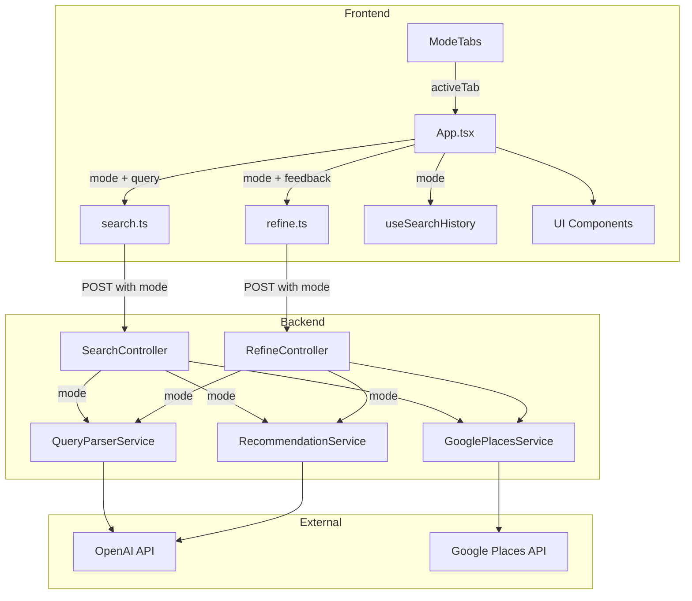
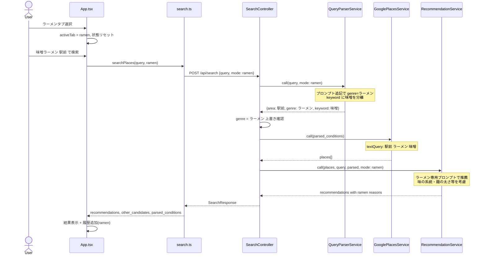
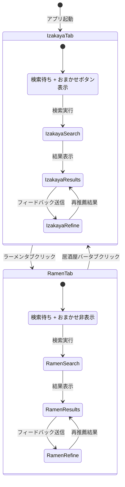

# 技術設計書

## Overview

本機能は、既存の居酒屋・バー検索アプリにラーメン検索モードを追加する。画面上部のタブ UI で「居酒屋・バー」と「ラーメン」を切り替え、ラーメンタブでは自然文検索にジャンル「ラーメン」が自動付与され、AI がラーメン固有の特徴（味の系統・麺の太さ・スープの種類）を考慮した推薦理由を提示する。

**Users**: 個人ユーザーが新潟県内のラーメン屋を自然文で検索し、AI 推薦を受ける。
**Impact**: 既存の検索パイプラインに `mode` パラメータを追加し、サービス層でモード別のプロンプト切り替えを実現する。既存機能への変更は最小限に抑える。

### Goals
- タブ UI による居酒屋・バー / ラーメンのモード切り替え
- ラーメンモードでの自然文検索とジャンル自動付与
- ラーメン固有の特徴を考慮した AI 推薦
- 全既存機能（フィードバック再レコメンド・食べログリンク・地図表示・もっと見る・検索条件タグ）のラーメンタブ対応
- タブ別検索履歴管理
- 居酒屋・バーモードの完全な後方互換性

### Non-Goals
- 距離フィルター（Phase 2 distance-filter で対応）
- ラーメンおまかせ機能（Phase 3 ramen-omakase で対応）
- 自宅位置の設定（Phase 2 で対応）
- ラーメンのサブジャンル別フィルター
- 新規 API エンドポイントの作成

## Boundary Commitments

### This Spec Owns
- タブ UI コンポーネント（`ModeTabs`）と App.tsx のタブ状態管理
- `mode` パラメータの API 契約への追加（search / refine）
- ラーメンモード時の `QueryParserService` プロンプト拡張とジャンル上書き
- ラーメンモード時の `RecommendationService` プロンプト切り替え
- 検索履歴の localStorage キー分離（`useSearchHistory` のモード対応）
- タブ切り替え時の状態リセットロジック
- おまかせボタンのタブ別表示/非表示制御

### Out of Boundary
- `OmakaseController` / `OmakaseService` の変更（ラーメンおまかせは Phase 3）
- 新規 API エンドポイントの作成
- Google Places API の呼び出しロジック変更（`GooglePlacesService` は変更不要）
- データベーススキーマの変更
- 距離・位置ベースのフィルタリング

### Allowed Dependencies
- 既存 `SearchController` / `RefineController` のパイプライン
- 既存 `QueryParserService` / `GooglePlacesService` / `RecommendationService`
- 既存フロントエンドコンポーネント（`SearchInput`, `PlaceCard`, `MapPanel` 等）
- localStorage API（検索履歴）
- OpenAI API（gpt-5-nano / gpt-4-turbo）
- Google Places Text Search API v1

### Revalidation Triggers
- `SearchResponse` / `RefineResponse` のレスポンス形状変更
- `QueryParserService` のプロンプト構造変更
- `RecommendationService` のプロンプト構造変更
- `useSearchHistory` フックの API 変更
- `SearchMode` 型への新規モード追加

## Architecture

### Existing Architecture Analysis
- 検索パイプライン: `QueryParserService` → `GooglePlacesService` → `RecommendationService` の3段階
- フロントエンド: `App.tsx` が状態オーケストレーター、`src/components/` が表示責務
- API: `POST /api/search`, `POST /api/refine`, `POST /api/omakase` の3エンドポイント
- 状態管理: `App.tsx` の `useState` + `useSearchHistory` カスタムフック
- 拡張ポイント: コントローラーのパラメータ追加、サービスのメソッドシグネチャ拡張

### Architecture Pattern & Boundary Map



**Architecture Integration**:
- **Selected pattern**: 既存パイプラインへの `mode` パラメータ注入（Strategy-lite）
- **Domain boundaries**: フロントエンドがモード状態を管理し、API リクエストに `mode` を含める。バックエンドはモードに応じてプロンプトを切り替える
- **Existing patterns preserved**: Service Object パターン、コントローラーでの直接 JSON レンダリング、App.tsx への状態集約
- **New components rationale**: `ModeTabs` のみ新規追加（タブ UI の表示責務）
- **Steering compliance**: 型安全優先（TypeScript strict）、Service Object パターン、疎結合構成を維持

### Technology Stack

| Layer | Choice / Version | Role in Feature | Notes |
|-------|------------------|-----------------|-------|
| Frontend | React 19 + TypeScript 5 | タブ UI、状態管理、API 呼び出し | 既存スタック活用 |
| Backend | Ruby on Rails 8.1 | mode パラメータ処理、プロンプト切り替え | 既存スタック活用 |
| External API | OpenAI gpt-5-nano / gpt-4-turbo | クエリ解析 / 推薦生成 | プロンプト変更のみ |
| External API | Google Places Text Search v1 | 店舗候補取得 | 変更なし |
| Storage | localStorage | タブ別検索履歴 | キー分離で対応 |

## File Structure Plan

### New Files
```
frontend/src/components/
└── ModeTabs.tsx           # タブ切り替え UI コンポーネント
└── ModeTabs.test.tsx      # ModeTabs のユニットテスト
```

### Modified Files
- `frontend/src/App.tsx` — `activeTab` 状態追加、モード別 UI 切り替え、API 呼び出しへの mode 付与、タブ切り替え時の状態リセット
- `frontend/src/types/search.ts` — `SearchMode` 型定義追加、`SearchRequest` 型追加、`RefineRequest` に `mode` フィールド追加
- `frontend/src/api/search.ts` — `searchPlaces` の引数に `mode` 追加、リクエストボディに `mode` 含める
- `frontend/src/api/refine.ts` — `RefineRequest` に `mode` 追加、リクエストボディに `mode` 含める
- `frontend/src/hooks/useSearchHistory.ts` — `mode` パラメータ受け取り、モード別 localStorage キー使用
- `backend/app/controllers/api/search_controller.rb` — `mode` パラメータ受け取り、サービス呼び出し時に mode 伝播、ラーメンモード時のジャンル上書き
- `backend/app/controllers/api/refine_controller.rb` — `mode` パラメータ受け取り、条件マージ後のジャンル上書き、サービス呼び出し時に mode 伝播
- `backend/app/services/query_parser_service.rb` — `call` メソッドに `mode` パラメータ追加、ラーメンモード時のプロンプト追記
- `backend/app/services/recommendation_service.rb` — `call` メソッドに `mode` パラメータ追加、ラーメンモード時の専用プロンプト使用

## System Flows

### ラーメンモード検索フロー



### タブ切り替えフロー



## Requirements Traceability

| Requirement | Summary | Components | Interfaces | Flows |
|-------------|---------|------------|------------|-------|
| 1.1 | デフォルトで居酒屋タブ選択 | App.tsx, ModeTabs | ModeTabsProps | タブ切り替え |
| 1.2 | ラーメンタブ切り替え時の状態リセット | App.tsx, ModeTabs | ModeTabsProps | タブ切り替え |
| 1.3 | 居酒屋タブ切り替え時の状態リセット | App.tsx, ModeTabs | ModeTabsProps | タブ切り替え |
| 1.4 | 居酒屋タブでおまかせボタン表示 | App.tsx | — | タブ切り替え |
| 1.5 | ラーメンタブでおまかせボタン非表示 | App.tsx | — | タブ切り替え |
| 2.1 | ラーメンタブでジャンル自動付与 | SearchController, QueryParserService | Search API | ラーメン検索 |
| 2.2 | ジャンル未指定時もラーメン設定 | SearchController, QueryParserService | Search API | ラーメン検索 |
| 2.3 | エリア・価格帯・キーワードとの組み合わせ | SearchController, QueryParserService, GooglePlacesService | Search API | ラーメン検索 |
| 2.4 | 検索条件タグにラーメン表示 | SearchConditionTags | ParsedConditions | ラーメン検索 |
| 3.1 | ラーメン固有特徴の推薦理由 | RecommendationService | Recommendation API | ラーメン検索 |
| 3.2 | 既存と同形式の推薦結果 | RecommendationService | SearchResponse | ラーメン検索 |
| 4.1 | フィードバック再レコメンド | RefineController, App.tsx | Refine API | ラーメン検索 |
| 4.2 | 食べログリンク表示 | PlaceCard | — | — |
| 4.3 | 地図マーカー表示 | MapPanel | — | — |
| 4.4 | もっと見るセクション | OtherCandidateSection | — | — |
| 4.5 | 検索条件タグ表示 | SearchConditionTags | ParsedConditions | — |
| 5.1 | ラーメンタブでラーメン履歴のみ表示 | useSearchHistory, SearchHistoryChips | — | — |
| 5.2 | 居酒屋タブで居酒屋履歴のみ表示 | useSearchHistory, SearchHistoryChips | — | — |
| 5.3 | ラーメンタブ検索をラーメン履歴に追加 | useSearchHistory | — | — |
| 5.4 | 居酒屋タブ検索を居酒屋履歴に追加 | useSearchHistory | — | — |
| 5.5 | 既存履歴を居酒屋タブ履歴として表示 | useSearchHistory | — | — |
| 6.1 | 居酒屋タブで従来動作維持 | App.tsx, SearchController, RefineController | — | — |
| 6.2 | mode 未指定時は居酒屋デフォルト | SearchController, RefineController | Search/Refine API | — |
| 6.3 | 全既存機能の維持 | — | — | — |

## Components and Interfaces

| Component | Domain/Layer | Intent | Req Coverage | Key Dependencies | Contracts |
|-----------|-------------|--------|--------------|------------------|-----------|
| ModeTabs | UI | タブ切り替え UI | 1.1, 1.2, 1.3 | App.tsx (P0) | State |
| App.tsx (変更) | UI/Orchestration | モード状態管理、条件付きレンダリング | 1.1-1.5, 4.1-4.5, 6.1, 6.3 | ModeTabs (P0), API clients (P0), useSearchHistory (P0) | State |
| search.ts (変更) | API Client | mode 付き検索リクエスト | 2.1-2.4 | SearchController (P0) | API |
| refine.ts (変更) | API Client | mode 付きリファインリクエスト | 4.1 | RefineController (P0) | API |
| useSearchHistory (変更) | Hook | モード別履歴管理 | 5.1-5.5 | localStorage (P0) | State |
| SearchController (変更) | Backend/Controller | mode パラメータ処理、ジャンル上書き | 2.1-2.4, 6.2 | QueryParserService (P0), GooglePlacesService (P0), RecommendationService (P0) | API |
| RefineController (変更) | Backend/Controller | mode パラメータ処理、マージ後ジャンル上書き | 4.1, 6.2 | QueryParserService (P0), GooglePlacesService (P0), RecommendationService (P0) | API |
| QueryParserService (変更) | Backend/Service | ラーメンモード時のプロンプト拡張 | 2.1-2.3 | OpenAI API (P0) | Service |
| RecommendationService (変更) | Backend/Service | ラーメン専用推薦プロンプト | 3.1, 3.2 | OpenAI API (P0) | Service |

### Frontend / UI Layer

#### ModeTabs

| Field | Detail |
|-------|--------|
| Intent | 「居酒屋・バー」と「ラーメン」の切り替えタブを表示する |
| Requirements | 1.1, 1.2, 1.3 |

**Responsibilities & Constraints**
- 2つのタブを水平に並べて表示
- アクティブタブのビジュアル状態を管理（スタイル変更）
- タブクリック時に `onTabChange` コールバックを呼び出す
- 状態管理は行わない（Controlled Component）

**Contracts**: State [x]

##### State Management
```typescript
type SearchMode = 'izakaya' | 'ramen';

type ModeTabsProps = {
  activeTab: SearchMode;
  onTabChange: (mode: SearchMode) => void;
};
```

**Implementation Notes**
- Tailwind CSS でアクティブ/非アクティブのスタイルを切り替え
- アクセシビリティ: `role="tablist"` / `role="tab"` / `aria-selected` を使用

#### App.tsx (変更)

| Field | Detail |
|-------|--------|
| Intent | モード状態管理、タブ切り替え時の状態リセット、条件付きレンダリング |
| Requirements | 1.1-1.5, 4.1-4.5, 6.1, 6.3 |

**Responsibilities & Constraints**
- `activeTab` 状態を `useState<SearchMode>('izakaya')` で管理
- タブ切り替え時に `query`, `recommendations`, `otherCandidates`, `parsedConditions`, `error`, `showOtherCandidates` をリセット
- `activeTab` を `searchPlaces`, `refinePlaces`, `useSearchHistory` に伝播
- `activeTab === 'izakaya'` の場合のみ `OmakaseButtons` を表示
- `activeTab === 'ramen'` の場合は `OmakaseButtons` を非表示

**Contracts**: State [x]

##### State Management
```typescript
// 新規追加状態
const [activeTab, setActiveTab] = useState<SearchMode>('izakaya');

// タブ切り替えハンドラー
const handleTabChange = (mode: SearchMode): void => {
  setActiveTab(mode);
  setQuery('');
  setRecommendations(null);
  setOtherCandidates(null);
  setParsedConditions(null);
  setError(null);
  setShowOtherCandidates(false);
  setSelectedGoogleMapsUrl(null);
  setInfoWindowVisible(false);
};

// 検索ハンドラー（mode 付き）
const handleSearch = async (searchQuery: string): Promise<void> => {
  // ... existing logic ...
  const result = await searchPlaces(searchQuery, activeTab);
  history.addToHistory(searchQuery);
  // ... rest unchanged ...
};

// リファインハンドラー（mode 付き）
const handleRefine = async (feedback: string): Promise<void> => {
  // ... existing logic ...
  const result = await refinePlaces({
    feedback,
    original_query: query,
    parsed_conditions: parsedConditions,
    mode: activeTab,
  });
  // ... rest unchanged ...
};
```

**Implementation Notes**
- `useSearchHistory` は `activeTab` を引数に取る形に変更
- フィードバック入力は既存の `FeedbackInput` をそのまま利用（mode の伝播は App.tsx 側で吸収）

### Frontend / API Client Layer

#### search.ts (変更)

| Field | Detail |
|-------|--------|
| Intent | 検索 API 呼び出しに mode パラメータを追加 |
| Requirements | 2.1-2.4 |

**Contracts**: API [x]

##### API Contract
| Method | Endpoint | Request | Response | Errors |
|--------|----------|---------|----------|--------|
| POST | /api/search | `{ query: string; mode?: SearchMode }` | SearchResponse | 422, 502, 500 |

```typescript
async function searchPlaces(
  query: string,
  mode: SearchMode = 'izakaya'
): Promise<SearchResponse> {
  const response = await fetch('/api/search', {
    method: 'POST',
    headers: { 'Content-Type': 'application/json' },
    body: JSON.stringify({ query, mode }),
  });
  // ... error handling unchanged ...
};
```

#### refine.ts (変更)

| Field | Detail |
|-------|--------|
| Intent | リファイン API 呼び出しに mode パラメータを追加 |
| Requirements | 4.1 |

**Contracts**: API [x]

##### API Contract
| Method | Endpoint | Request | Response | Errors |
|--------|----------|---------|----------|--------|
| POST | /api/refine | `{ feedback: string; original_query: string; parsed_conditions: ParsedConditions \| null; mode?: SearchMode }` | RefineResponse | 422, 502, 500 |

```typescript
type RefineRequest = {
  feedback: string;
  original_query: string;
  parsed_conditions: ParsedConditions | null;
  mode?: SearchMode;
};
```

### Frontend / Hook Layer

#### useSearchHistory (変更)

| Field | Detail |
|-------|--------|
| Intent | モード別 localStorage キーによる検索履歴管理 |
| Requirements | 5.1-5.5 |

**Responsibilities & Constraints**
- `mode` パラメータに応じて異なる localStorage キーを使用
- `izakaya`: `restaurant_search_history`（既存キーを維持 → 要件 5.5 対応）
- `ramen`: `ramen_search_history`
- 各モード独立で最大10件を管理
- `mode` が変わると自動的にそのモードの履歴を返す

**Contracts**: State [x]

##### State Management
```typescript
const STORAGE_KEYS: Record<SearchMode, string> = {
  izakaya: 'restaurant_search_history',
  ramen: 'ramen_search_history',
};

function useSearchHistory(mode: SearchMode): {
  history: HistoryEntry[];
  addToHistory: (query: string) => void;
  removeFromHistory: (query: string) => void;
  clearHistory: () => void;
};
```

**Implementation Notes**
- `mode` 変更時に `useEffect` で対応する localStorage から履歴を再読み込み
- 既存の `restaurant_search_history` キーの既存データはそのまま izakaya 用として参照される（マイグレーション不要）

### Backend / Controller Layer

#### SearchController (変更)

| Field | Detail |
|-------|--------|
| Intent | mode パラメータの受け取りとサービス層への伝播 |
| Requirements | 2.1-2.4, 6.2 |

**Responsibilities & Constraints**
- リクエストから `mode` パラメータを取得（デフォルト: `"izakaya"`）
- `mode` を `QueryParserService.call` と `RecommendationService.call` に伝播
- `mode == "ramen"` の場合、`QueryParserService` の結果の `genre` を `"ラーメン"` に上書き

**Contracts**: API [x] / Service [x]

##### API Contract
| Method | Endpoint | Request | Response | Errors |
|--------|----------|---------|----------|--------|
| POST | /api/search | `{ query: string, mode?: string }` | SearchResponse | 422, 502, 500 |

- `mode` は省略可能。省略時は `"izakaya"` として処理
- レスポンス形状は変更なし（`SearchResponse` 互換）

##### Service Interface
```ruby
# コントローラー内の処理フロー
mode = params[:mode] || "izakaya"
parsed = QueryParserService.new.call(query, mode: mode)
parsed[:genre] = "ラーメン" if mode == "ramen"
places = GooglePlacesService.new.call(parsed)
recommendations = RecommendationService.new.call(places, query, parsed_conditions: parsed, mode: mode)
```

#### RefineController (変更)

| Field | Detail |
|-------|--------|
| Intent | mode パラメータの受け取り、条件マージ後のジャンル上書き |
| Requirements | 4.1, 6.2 |

**Responsibilities & Constraints**
- リクエストから `mode` パラメータを取得（デフォルト: `"izakaya"`）
- 条件マージ後に `mode == "ramen"` なら `merged[:genre] = "ラーメン"` で上書き
- `mode` を `RecommendationService.call` に伝播

**Contracts**: API [x] / Service [x]

##### API Contract
| Method | Endpoint | Request | Response | Errors |
|--------|----------|---------|----------|--------|
| POST | /api/refine | `{ feedback: string, original_query: string, parsed_conditions: object, mode?: string }` | RefineResponse | 422, 502, 500 |

##### Service Interface
```ruby
mode = params[:mode] || "izakaya"
delta = QueryParserService.new.call(feedback, mode: mode)
merged = merge_conditions(original_conditions, delta)
merged[:genre] = "ラーメン" if mode == "ramen"
places = GooglePlacesService.new.call(merged)
recommendations = RecommendationService.new.call(places, original_query, parsed_conditions: merged, mode: mode, feedback: feedback)
```

### Backend / Service Layer

#### QueryParserService (変更)

| Field | Detail |
|-------|--------|
| Intent | ラーメンモード時のプロンプト拡張でキーワード分離を改善 |
| Requirements | 2.1-2.3 |

**Responsibilities & Constraints**
- `mode` パラメータを受け取り、ラーメンモード時にシステムプロンプトへ追記
- ラーメンモード追記内容: genre を常に「ラーメン」とし、ラーメン特徴（味噌、豚骨等）を keyword に分離するよう指示
- 既存プロンプト構造は変更しない（追記のみ）

**Contracts**: Service [x]

##### Service Interface
```ruby
# メソッドシグネチャ
def call(query, mode: "izakaya")
  # ... existing parsing logic ...
  prompt = base_system_prompt
  prompt += ramen_addendum if mode == "ramen"
  # ... API call with prompt ...
end

# ラーメンモード追記
RAMEN_ADDENDUM = <<~PROMPT

  ## 追加指示（ラーメン検索モード）
  このクエリはラーメン検索です。以下を守ってください:
  - genre は常に「ラーメン」としてください
  - ラーメンの特徴（味噌、豚骨、醤油、塩、つけ麺、太麺、細麺など）は keyword フィールドに含めてください
PROMPT
```

- Preconditions: `query` が非空文字列、`mode` が `"izakaya"` または `"ramen"`
- Postconditions: `ParsedConditions` を返す。ラーメンモード時は `genre` が `"ラーメン"`
- Invariants: レスポンス形状（area, genre, price_level, keyword）は mode に関わらず同一

#### RecommendationService (変更)

| Field | Detail |
|-------|--------|
| Intent | ラーメンモード時に専用プロンプトで推薦し、ラーメン固有特徴を理由に含める |
| Requirements | 3.1, 3.2 |

**Responsibilities & Constraints**
- `mode` パラメータを受け取り、ラーメンモード時に専用のシステムプロンプトを使用
- ラーメン専用プロンプトの選定基準: 条件一致度 → ラーメン特徴（味の系統・麺の太さ・スープの種類）→ 評価
- 推薦理由（reason）にラーメン固有の特徴を含めるよう指示
- レスポンス形状は既存と同一（`name` + `reason`）

**Contracts**: Service [x]

##### Service Interface
```ruby
# メソッドシグネチャ（既存キーワード引数を維持し mode を追加）
def call(places, query, min_count: 3, max_count: 5, parsed_conditions: nil, feedback: nil, mode: "izakaya")
  prompt = mode == "ramen" ? ramen_system_prompt : build_system_prompt(min_count, max_count, feedback)
  prompt += feedback_addendum(feedback) if feedback && mode == "ramen"
  # ... API call with prompt ...
end

# ラーメン専用プロンプト（概要）
# - 選定基準: 条件一致度 → ラーメン特徴 → 評価
# - reason に味の系統、麺の太さ、スープの特徴を含める
# - 出力規則は既存と同一（name そのまま使用、reason 日本語1-2文）
```

- Preconditions: `places` が非空配列、`mode` が `"izakaya"` または `"ramen"`
- Postconditions: `[{name, reason}]` を返す。ラーメンモード時は reason にラーメン特徴を含む
- Invariants: レスポンス形状は mode に関わらず同一

## Error Handling

### Error Strategy
既存のエラーハンドリングパターンをそのまま活用する。mode パラメータの追加によって新しいエラーカテゴリは発生しない。

### Error Categories and Responses
- **mode パラメータ不正**: `mode` は省略可能で、不正値の場合は `"izakaya"` にフォールバック。バリデーションエラーは発生させない（後方互換性優先）
- **既存エラー**: `QueryParserError`, `GooglePlacesError`, `RecommendationError` → 502。`StandardError` → 500。変更なし

## Testing Strategy

### Unit Tests
- **ModeTabs**: 2つのタブが表示される。アクティブタブが正しくハイライトされる。タブクリックで `onTabChange` が呼ばれる（1.1-1.3）
- **useSearchHistory(ramen)**: `ramen_search_history` キーで読み書きされる。mode 切り替えで履歴が切り替わる（5.1-5.4）
- **useSearchHistory(izakaya)**: `restaurant_search_history` キーで読み書きされる。既存データがそのまま表示される（5.5）
- **QueryParserService(mode: ramen)**: プロンプトにラーメン追記が含まれる。結果のジャンルに関わらず呼び出し元でジャンル上書きが動作する（2.1-2.2）
- **RecommendationService(mode: ramen)**: ラーメン専用プロンプトが使用される。推薦理由にラーメン特徴のキーワードが含まれる（3.1）

### Integration Tests
- **SearchController(mode: ramen)**: リクエストに mode=ramen を含めると、レスポンスの `parsed_conditions.genre` が `"ラーメン"` になる（2.1, 2.4）
- **RefineController(mode: ramen)**: リクエストに mode=ramen を含めると、マージ後の `parsed_conditions.genre` が `"ラーメン"` を維持する（4.1）
- **SearchController(mode 未指定)**: 既存のリクエスト形式（mode なし）で従来通りの結果が返る（6.2）
- **RefineController(mode 未指定)**: 既存のリクエスト形式で従来通りの結果が返る（6.2）

### E2E Tests
- タブ切り替え: 居酒屋タブ → ラーメンタブに切り替えると検索結果がリセットされ、おまかせボタンが消える（1.2, 1.4, 1.5）
- ラーメン検索: ラーメンタブで「味噌ラーメン 駅前」を検索すると、検索条件タグに「ラーメン」が表示される（2.1, 2.4）
- ラーメンフィードバック: ラーメン検索結果に対してフィードバックを送ると、ラーメンモードで再推薦される（4.1）
- 検索履歴分離: ラーメンタブで検索 → 居酒屋タブに切り替え → ラーメンの履歴が表示されない（5.1, 5.2）
- 後方互換: 居酒屋タブで検索・おまかせ・フィードバックが従来通り動作する（6.1, 6.3）
