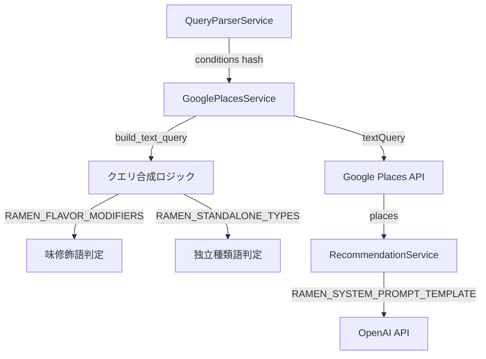
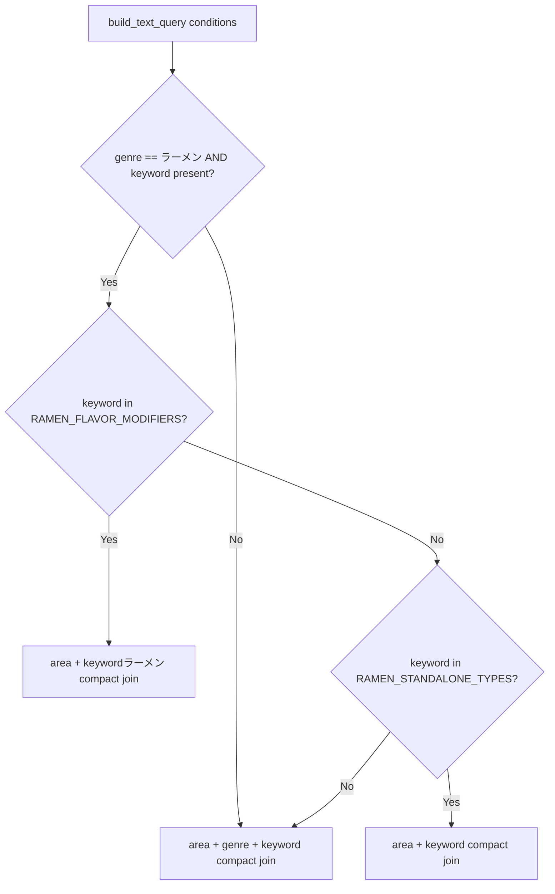

# Design Document: ramen-search-precision

## Overview

ラーメン検索精度向上（Tier 1: APIコスト変更なし）。
Google Placesへのクエリ合成ロジックとLLMプロンプトを改善し、ラーメンモードで味・種類を指定した検索において意図しない店の混入を減らす。
変更対象は2ファイル（`google_places_service.rb` / `recommendation_service.rb`）のみ。既存APIインターフェースは維持する。

### Goals
- `build_text_query` にラーメン向けクエリ合成ロジックを追加し、Google Placesへの検索クエリ精度を上げる
- `RAMEN_SYSTEM_PROMPT_TEMPLATE` を更新し、LLMが味・種類の合致度を最優先基準として推薦・除外できるようにする
- 居酒屋・バーモードの既存動作に一切影響を与えない

### Non-Goals
- Google Places APIの追加フィールド取得（editorialSummary, reviews 等）
- フロントエンド変更
- QueryParserServiceのキーワード抽出ロジック変更
- ラーメン以外のジャンルへの適用

## Boundary Commitments

### This Spec Owns
- `GooglePlacesService#build_text_query` — ラーメンジャンル + 味修飾語/独立種類語を合成クエリに変換するロジック
- `RAMEN_FLAVOR_MODIFIERS` / `RAMEN_STANDALONE_TYPES` 定数の定義と管理
- `RAMEN_SYSTEM_PROMPT_TEMPLATE` の内容（選定基準・除外基準・出力規則の文字列）

### Out of Boundary
- `build_text_query` 以外の GooglePlacesService メソッド
- `RAMEN_SYSTEM_PROMPT_TEMPLATE` 以外の RecommendationService ロジック
- QueryParserService のキーワード抽出・正規化ロジック
- Google Places FIELD_MASK の変更
- フロントエンドの検索UIや結果表示

### Allowed Dependencies
- `QueryParserService` が抽出した `conditions[:keyword]` が生のキーワード文字列として渡されること（例: "塩"、"まぜそば"）
- `conditions[:genre]` が "ラーメン" 文字列であること（ramen-search-mode が確立した契約）
- OpenAI API（LLMプロンプト実行） — 既存依存関係

### Revalidation Triggers
- `RAMEN_FLAVOR_MODIFIERS` / `RAMEN_STANDALONE_TYPES` の定数値を追加・削除した場合
- `conditions[:keyword]` の形式または正規化ルールが変更された場合
- `RAMEN_SYSTEM_PROMPT_TEMPLATE` のフォーマット変数（`%<min>d`, `%<max>d`）が変更された場合

## Architecture

### Existing Architecture Analysis

現在の `build_text_query` は `[conditions[:area], conditions[:genre], conditions[:keyword]].compact.join(" ")` のみ。ラーメン固有のロジックなし。

`RAMEN_SYSTEM_PROMPT_TEMPLATE` は存在するが、選定基準の優先1位が `area/price_level` であり、味・種類の合致度が主基準として明示されていない。除外基準に「味・種類と明らかに異なる店を除外する」指示もない。

両変更とも：
- パブリックインターフェース（メソッドシグネチャ）は変更しない
- 既存テスト（`build_text_query` の compact 動作テスト、`mode: 'ramen'` のプロンプトテスト）は引き続きパス

### Architecture Pattern & Boundary Map



Key decisions:
- `build_text_query` 内で `conditions[:genre] == "ラーメン"` を gate として使用（モードパラメータ追加不要）
- 定数はクラス定数として定義（フレームワーク慣例に準拠）

### Technology Stack

| Layer | Choice / Version | Role | Notes |
|-------|-----------------|------|-------|
| Backend | Ruby / Rails 8.1 | サービスロジック変更 | 既存スタック。新依存関係なし |
| External | Google Places API | textQuery 受信 | フィールドマスク変更なし |
| External | OpenAI API gpt-5-nano | プロンプト実行 | モデル・呼び出し方法変更なし |

## File Structure Plan

### Modified Files
- `backend/app/services/google_places_service.rb` — `RAMEN_FLAVOR_MODIFIERS`, `RAMEN_STANDALONE_TYPES` 定数追加; `build_text_query` にラーメン条件分岐を追加
- `backend/app/services/recommendation_service.rb` — `RAMEN_SYSTEM_PROMPT_TEMPLATE` の選定基準・除外基準・出力規則を更新

新規ファイル作成なし。

## System Flows

`build_text_query` の分岐ロジック:



- ゲート条件: `genre == "ラーメン"` でない場合、または `keyword` が nil/空の場合は既存の compact join（Req 1.3, 1.4）
- 定数未登録キーワードも Req 1.3 fallback として既存動作にルーティング

## Requirements Traceability

| Requirement | Summary | Component | Interface | Flow |
|-------------|---------|-----------|-----------|------|
| 1.1 | 味修飾語 → synthesized query | GooglePlacesService | build_text_query | C→D |
| 1.2 | 独立種類語 → genre-free query | GooglePlacesService | build_text_query | E→G |
| 1.3 | 未知キーワード / fallback | GooglePlacesService | build_text_query | E→F |
| 1.4 | 非ラーメンモード → 既存動作不変 | GooglePlacesService | build_text_query | B→F |
| 2.1 | 味/種類合致度最優先 | RecommendationService | RAMEN_SYSTEM_PROMPT_TEMPLATE | — |
| 2.2 | 明らかに異なる店を除外 | RecommendationService | RAMEN_SYSTEM_PROMPT_TEMPLATE | — |
| 2.3 | reason に味・種類の根拠を含める | RecommendationService | RAMEN_SYSTEM_PROMPT_TEMPLATE | — |
| 2.4 | rating/price 基準を維持 | RecommendationService | RAMEN_SYSTEM_PROMPT_TEMPLATE | — |

## Components and Interfaces

| Component | Domain | Intent | Req Coverage | Key Dependencies | Contracts |
|-----------|--------|--------|--------------|------------------|-----------|
| GooglePlacesService | Search | クエリ合成 + Places API 呼び出し | 1.1, 1.2, 1.3, 1.4 | Google Places API (P0) | Service |
| RecommendationService | Recommendation | LLMプロンプト生成 + 推薦選定 | 2.1, 2.2, 2.3, 2.4 | OpenAI API (P0) | Service |

### Backend / Services

#### GooglePlacesService（クエリ合成拡張）

| Field | Detail |
|-------|--------|
| Intent | ラーメンジャンル + 味/種類キーワードを合成クエリに変換し、Google Placesへの検索精度を向上 |
| Requirements | 1.1, 1.2, 1.3, 1.4 |

**Responsibilities & Constraints**
- `RAMEN_FLAVOR_MODIFIERS` / `RAMEN_STANDALONE_TYPES` 定数はこのクラスが唯一のオーナー
- `build_text_query` のシグネチャ（`conditions Hash → String`）は変更しない
- ジャンル判定は `"ラーメン"` リテラル比較のみ（大文字小文字の正規化は QueryParserService の責務）

**Dependencies**
- Inbound: SearchController → conditions Hash (P0)
- Outbound: Google Places API → textQuery (P0)

**Contracts**: Service [x]

##### Service Interface（Ruby）
```ruby
# 既存シグネチャ（変更なし）
# @param conditions [Hash] { area: String|nil, genre: String|nil, keyword: String|nil, ... }
# @return [String]
def build_text_query(conditions)

# 追加定数（クラス定数）
RAMEN_FLAVOR_MODIFIERS = %w[塩 醤油 味噌 豚骨 鶏白湯 鶏清湯 あっさり こってり 辛].freeze
RAMEN_STANDALONE_TYPES = %w[まぜそば つけ麺 担々麺 油そば].freeze
```

- Preconditions: `conditions[:genre] == "ラーメン"` かつ `conditions[:keyword].present?` の場合に合成ロジックを適用
- Postconditions: 返り値は常に空白区切りの文字列。nil フィールドは compact で除去される
- Invariants: 居酒屋・バーモード（genre != "ラーメン"）は既存の compact join と同一結果を返す

**Implementation Notes**
- 合成クエリは array + compact + join パターンで一貫して組み立てる（nil area を安全に扱うため）
  - 味修飾語: `[area, "#{keyword}ラーメン"].compact.join(" ")`
  - 独立種類語: `[area, keyword].compact.join(" ")`
  - Fallback: `[area, genre, keyword].compact.join(" ")` （既存コードと同一）
- Risks: RAMEN_FLAVOR_MODIFIERS に「辛」が含まれるが、QueryParserService が「辛口」「激辛」等の形で返す場合は fallback に入る。現時点では許容範囲とする（Tier 1 の制約内）

#### RecommendationService（プロンプト更新）

| Field | Detail |
|-------|--------|
| Intent | ラーメン推薦時に味・種類の合致度を最優先基準としてLLMに明示し、除外精度と推薦理由の質を向上 |
| Requirements | 2.1, 2.2, 2.3, 2.4 |

**Responsibilities & Constraints**
- `RAMEN_SYSTEM_PROMPT_TEMPLATE` の文字列内容はこのクラスが唯一のオーナー
- `build_prompt` メソッドのシグネチャ・動作は変更しない
- `%<min>d` / `%<max>d` フォーマット変数は維持する
- フィードバック付加ロジック（`feedback.present?` 以降の処理）は変更しない

**Dependencies**
- Inbound: SearchController → places, query, mode="ramen" (P0)
- Outbound: OpenAI API → system prompt (P0)

**Contracts**: Service [x]

**プロンプト変更差分**

選定基準（変更前 → 変更後）:
```
【変更前】
1. 条件との一致度: conditions が提供された場合は area/price_level との一致を最優先
2. ラーメン特徴: 味の系統・麺の太さ・スープの種類を考慮
3. 評価（rating）: ...

【変更後】
1. 条件との一致度（最優先）
   - keyword で指定された味/種類（塩・醤油・味噌・豚骨・まぜそば等）を
     看板メニューまたは主力商品としている可能性が高い店を優先
   - 店名・特徴から指定の味と明らかに異なると判断できる場合は候補から外す
2. 評価（rating）: 4.0以上を優秀、3.5〜4.0を普通、3.5未満は他に代替がなければ避ける（変更なし）
3. 価格帯（price_level）: conditions で価格帯が指定されている場合は必ず一致させる（変更なし）
```

除外基準（追記）:
```
追記:
- keyword で指定された味/種類を提供していないことが店名・情報から明らかな場合は除外
  （例: 塩ラーメン検索でまぜそば専門店、醤油ラーメン検索でつけ麺専門店）
- 条件に合致する可能性が高い候補がある場合、合致度が不確かな候補より優先すること
```

出力規則（変更前 → 変更後）:
```
【変更前】reason: 味の系統・麺の太さ・スープの特徴を含めて1〜2文で説明
【変更後】reason: 指定された味/種類が看板メニューである根拠（店名・既知の評判など）を含める。
          根拠が不明な場合はその旨を明記した上で推薦する
```

**Implementation Notes**
- プロンプト文字列の置き換えのみ。`format()` 呼び出し（`%<min>d`, `%<max>d`）に影響なし
- Risks: 除外強化により候補が `min_count` を下回る可能性。ただし `min_count: 3` のガードは `RecommendationService#call` 側で維持されており、プロンプト変更の影響範囲外

## Testing Strategy

### Unit Tests（バックエンド）

**GooglePlacesService — `build_text_query` (Req 1.1–1.4)**
- 味修飾語 "塩" × genre "ラーメン" → `"新潟市中央区 塩ラーメン"` (1.1)
- 味修飾語 "味噌" × genre "ラーメン" → `"新潟市中央区 味噌ラーメン"` (1.1)
- 独立種類語 "まぜそば" × genre "ラーメン" → `"新潟市中央区 まぜそば"` (1.2)
- 独立種類語 "つけ麺" × genre "ラーメン" → `"新潟市中央区 つけ麺"` (1.2)
- 未知キーワード "太麺" × genre "ラーメン" → `"新潟市中央区 ラーメン 太麺"` (1.3 fallback)
- keyword nil × genre "ラーメン" → `"新潟市中央区 ラーメン"` (1.3 fallback: compact 動作)
- keyword "塩" × genre "居酒屋" → `"新潟市中央区 居酒屋 塩"` (1.4: 既存動作不変)

**RecommendationService — `RAMEN_SYSTEM_PROMPT_TEMPLATE` (Req 2.1–2.4)**
- プロンプトに味/種類優先化指示が含まれること（"看板メニュー" または "主力" キーワードの存在）(2.1)
- プロンプトに味/種類不一致の除外指示が含まれること（"明らか" かつ "除外" の文字列）(2.2)
- プロンプトに reason への根拠記載要求が含まれること（"根拠" の文字列）(2.3)
- プロンプトに rating 3.5 閾値が含まれること（既存基準維持）(2.4)
- プロンプトに価格帯除外基準が含まれること（"価格帯" かつ "除外" の文字列）(2.4)
- `mode: 'ramen'` 時に更新後のプロンプトが LLM に渡されること（統合: webmock スタブで確認）
