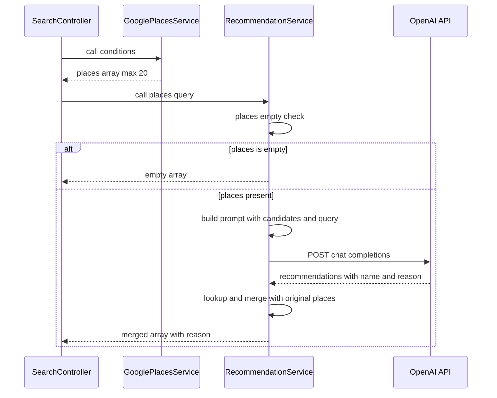
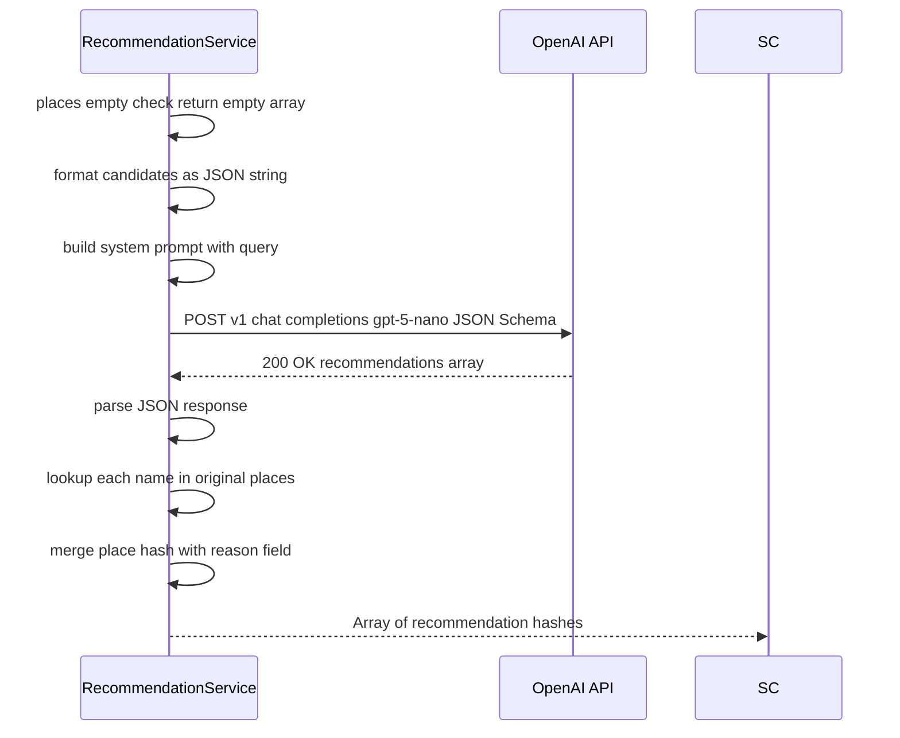

# Technical Design: recommendation-service

## Overview

**Purpose**: RecommendationService は、GooglePlacesService が返す候補店リスト（最大 20 件）とユーザーの元の自然文クエリを OpenAI API に渡し、最適な 3〜5 件の店舗を厳選して日本語の推薦理由付きで返すバックエンドサービスを提供する。

**Users**: SearchController（Chunk 6 統合時）が本サービスを呼び出し、GooglePlacesService の出力を最終レスポンスの `recommendations` 配列に変換するパイプラインの最終段として機能する。

**Impact**: 既存の `QueryParserService` と同一のサービスオブジェクトパターンを踏襲した新規ファイルの追加のみ。既存ファイルへの変更なし。

### Goals

- GooglePlacesService の出力（最大 20 件）からユーザーの意図に合致した 3〜5 件を AI が厳選する
- 各推薦店舗に日本語のおすすめ理由（`reason` フィールド）を付加する
- QueryParserService と一貫したエラー処理・APIキー管理パターンを維持する

### Non-Goals

- SearchController への統合（Chunk 6 で実施）
- 写真・営業時間の取得（フィールドマスク最小化方針により除外。`google-places-service/requirements.md` 参照）
- レート制限・リトライ機構（個人利用ツールのため初期スコープ外）
- 候補 0 件時の OpenAI API 呼び出し

---

## Architecture

### Existing Architecture Analysis

既存の `QueryParserService` が直接の実装テンプレートとなる。以下のパターンが確立されている：

- 定数ベースの設定（`MODEL`, `API_KEY_PATH`, `SYSTEM_PROMPT`, `RESPONSE_SCHEMA`）
- `call()` メソッドをエントリポイントとするサービスオブジェクト
- `File.read(API_KEY_PATH).strip` による OpenAI APIキー読み取り（`/openai_apikey`）
- `OpenAI::Client.new(access_token:)` によるクライアント構築（`ruby-openai ~> 8.3`）
- `Faraday::Error`, `JSON::ParserError`, `Errno::ENOENT` を `rescue` で捕捉し、専用エラークラスに変換
- `Rails.logger.error` によるエラーログ記録

### Architecture Pattern & Boundary Map



**Architecture Integration**:
- Selected pattern: サービスオブジェクト（`QueryParserService` と同一）。`call()` をエントリポイントとし、副作用を持たない
- Domain boundaries: 推薦ロジックのみを担当。候補取得・コントローラロジックとは完全分離
- Existing patterns preserved: 定数ベース設定 + rescue チェーンパターン（`QueryParserService` と同一）
- New components rationale: 責務分離のため `QueryParserService` とは別ファイルで作成（`research.md` 参照）
- Steering compliance: コントローラを薄く保ち、ロジックをサービスオブジェクトへ集約（`structure.md` 原則）

### Technology Stack

| Layer | Choice / Version | Role in Feature | Notes |
|-------|------------------|-----------------|-------|
| Backend / Services | Ruby on Rails 8.1 | サービスオブジェクト配置 | 既存スタック |
| External API | OpenAI API（`gpt-5-nano`） | 店舗厳選・推薦理由生成 | `ruby-openai ~> 8.3` は Gemfile インストール済み |
| HTTP Client | `ruby-openai` 内部 Faraday | OpenAI API 呼び出し | 追加インストール不要 |
| Runtime | Docker Compose | コンテナ実行環境 | `/openai_apikey` マウント設定済み |

---

## System Flows



**フロー上の主要判断:**
- 候補 0 件の早期リターンにより、不要な OpenAI API 呼び出しを回避する（要件 4.1）
- AI が返す `name` で元の `places` 配列を検索し、一致しない名前はスキップする（`research.md` Decision 2 参照）

---

## Requirements Traceability

| Requirement | Summary | Components | Interfaces | Flows |
|-------------|---------|------------|------------|-------|
| 1.1 | 候補1件以上 → OpenAI API で3〜5件厳選 | `RecommendationService#call` | Service Interface | places存在チェック → API呼び出し |
| 1.2 | 候補3件未満でも正常終了 | `RecommendationService#call` | Service Interface | 名前不一致スキップで対応 |
| 1.3 | 出力ハッシュ構造（6キー） | `RecommendationService#call` | Service Interface | places と reason の結合 |
| 2.1 | `reason` フィールドに日本語推薦理由 | `SYSTEM_PROMPT` | OpenAI JSON Schema | プロンプトで `reason` を指定 |
| 2.2 | クエリ・評価・価格帯を考慮した理由 | `SYSTEM_PROMPT` | — | プロンプトに candidates 情報を含める |
| 3.1 | Structured Outputs（JSON Schema） | `RESPONSE_SCHEMA` | OpenAI API | `response_format:` パラメータ |
| 3.2 | `gpt-5-nano` 使用 | `MODEL` 定数 | — | — |
| 3.3 | 候補全件をプロンプトに含める | `SYSTEM_PROMPT` | — | candidates JSON 埋め込み |
| 3.4 | `/openai_apikey` からAPIキー読み取り | `API_KEY_PATH` | — | `File.read` |
| 4.1 | places 空配列 → API 未呼び出しで `[]` 返却 | `RecommendationService#call` | — | places.empty? guard |
| 4.2 | 候補0件でも例外なし | `RecommendationService#call` | — | 正常終了 |
| 5.1〜5.7 | エラーハンドリング（全エラー種別） | rescue チェーン + `RecommendationError` | — | Error Handling セクション参照 |
| 6.1 | 入力: `places` 配列 + `query` 文字列 | `call(places, query)` | Service Interface | — |
| 6.2 | 出力: 6キーハッシュ配列 | `RecommendationService#call` | Service Interface | — |
| 6.3 | 配置: `app/services/recommendation_service.rb` | ファイルパス | — | — |

---

## Components and Interfaces

| Component | Domain/Layer | Intent | Req Coverage | Key Dependencies | Contracts |
|-----------|--------------|--------|--------------|-----------------|-----------|
| `RecommendationService` | Backend / Services | 候補店を AI で厳選し推薦理由を付加 | 1〜6 全要件 | `ruby-openai` (P0), `GooglePlacesService` 出力型 (P1) | Service |
| `RecommendationError` | Backend / Services | 専用例外クラス | 5.7 | — | — |

### Backend / Services

#### RecommendationService

| Field | Detail |
|-------|--------|
| Intent | OpenAI API を用いて候補店リストから 3〜5 件を厳選し、日本語推薦理由を付加した配列を返す |
| Requirements | 1.1, 1.2, 1.3, 2.1, 2.2, 3.1, 3.2, 3.3, 3.4, 4.1, 4.2, 5.1〜5.7, 6.1, 6.2, 6.3 |

**ファイルパス**: `app/services/recommendation_service.rb`

**Responsibilities & Constraints**
- 候補店リストと自然文クエリを受け取り、推薦結果配列を返す。外部状態は変更しない
- OpenAI API からの応答は JSON Schema によって構造が保証されるが、`name` の完全一致前提のルックアップを行う
- `places` が空の場合は OpenAI API を呼び出さない（コスト最適化）

**Dependencies**
- Inbound: `SearchController`（Chunk 6）— `call(places, query)` を呼び出す（P0）
- Outbound: `OpenAI::Client` — Chat Completions API（P0）
- External: `ruby-openai ~> 8.3` — OpenAI API HTTP クライアント（P0）

**Contracts**: Service [x]

##### Service Interface

```ruby
# 入力
# places: GooglePlacesService#call の戻り値（Array of Hash）
#   各ハッシュ: { name: String, rating: Float|nil, price_level: String|nil,
#                address: String, google_maps_url: String }
# query: ユーザーの元の自然文（String）
#
# 出力: Array of Hash（0〜5件）
#   各ハッシュ: { name: String, rating: Float|nil, price_level: String|nil,
#                address: String, google_maps_url: String, reason: String }
#
# 例外: RecommendationError — OpenAI API エラー / タイムアウト /
#       JSONパースエラー / APIキーファイル不在
def call(places, query)
```

- Preconditions: `places` は Array（空配列も許容）、`query` は String
- Postconditions: `places` が空なら `[]` を返す。正常時は `reason: String` が追加されたハッシュの配列
- Invariants: 返り値の各ハッシュの `name`/`address`/`google_maps_url` は元の `places` 入力から変更されない

**定数定義**

```ruby
MODEL         = "gpt-5-nano"
API_KEY_PATH  = "/openai_apikey"

SYSTEM_PROMPT = <<~PROMPT
  あなたはレストラン推薦アシスタントです。
  ユーザーのクエリと候補店リスト（candidates）を受け取り、最も適した 3〜5 件を選んでください。

  選定基準: クエリとの関連性、評価（rating）、価格帯（price_level）
  出力: candidates に含まれる name をそのまま使用してください（変更しないこと）
  reason: 各店舗を推薦する理由を日本語で簡潔に説明してください
PROMPT

RESPONSE_SCHEMA = {
  type: "json_schema",
  json_schema: {
    name: "recommendations",
    strict: true,
    schema: {
      type: "object",
      properties: {
        recommendations: {
          type: "array",
          items: {
            type: "object",
            properties: {
              name:   { type: "string" },
              reason: { type: "string" }
            },
            required: %w[name reason],
            additionalProperties: false
          }
        }
      },
      required: %w[recommendations],
      additionalProperties: false
    }
  }
}.freeze
```

**User メッセージには以下を含める（system ロールには `SYSTEM_PROMPT` 定数を使用）：**
- `query: "渋谷で安くてうまいイタリアン"`
- `candidates:` — `places` 配列を JSON 文字列化したもの（`name`, `rating`, `price_level`, `address` フィールドのみ）

**Implementation Notes**
- Integration: AI 応答の `recommendations` 配列の各 `name` で元の `places` 配列を検索し、一致した店舗に `reason` を付加して返す
- Validation: JSON Schema により `name`/`reason` の存在は保証済み。`name` 不一致はスキップで処理（例外なし）
- Risks: AI が `name` を微変形した場合にルックアップ失敗 → `SYSTEM_PROMPT` に「name を変更しないこと」を明記することで軽減

#### RecommendationError

| Field | Detail |
|-------|--------|
| Intent | `RecommendationService` 専用の例外クラス。すべての内部エラーをこの型にラップして raise する |
| Requirements | 5.7 |

**ファイルパス**: `app/services/recommendation_error.rb`

**Responsibilities & Constraints**
- `StandardError` を継承する
- `RecommendationService` 内のすべての rescue ブロックがこの例外クラスを使用する

---

## Error Handling

### Error Strategy

`QueryParserService` と同一の rescue チェーンパターンを使用する。全エラーを `RecommendationError` にラップし、エラー種別とメッセージを `Rails.logger.error` に記録する。

### Error Categories and Responses

| エラー種別 | 条件 | 対応 | 要件 |
|-----------|------|------|------|
| `Faraday::ClientError` (4xx) | OpenAI API が 4xx を返した | `RecommendationError` を raise | 5.1 |
| `Faraday::ServerError` (5xx) | OpenAI API が 5xx を返した | `RecommendationError` を raise | 5.2 |
| `Faraday::ConnectionFailed` / `Faraday::TimeoutError` | タイムアウト・接続失敗 | `RecommendationError` を raise | 5.3 |
| `JSON::ParserError` | レスポンスが不正 JSON | `RecommendationError` を raise | 5.4 |
| `Errno::ENOENT` | APIキーファイル不在 | `RecommendationError` を raise | 5.5 |

### Monitoring

`Rails.logger.error("RecommendationService: #{e.class} - #{e.message}")` を全 rescue ブロックで記録する（要件 5.6）。

---

## Testing Strategy

### Unit Tests（RSpec service spec）

`spec/services/recommendation_service_spec.rb` に WebMock + `allow(File).to receive(:read)` パターンで実装する。

**正常系:**
1. 候補 10 件 + クエリ → 3〜5 件が返る（`reason` フィールドが付加されている）
2. AI が 5 件推薦し全名前が一致 → 5 件返却
3. AI が推薦した一部の名前が一致しない → 一致した分のみ返す（スキップ動作確認）

**境界条件:**
4. 候補 0 件 → OpenAI API 未呼び出しで `[]` が返る（`WebMock::NetConnectNotAllowedError` が発生しないことで確認）
5. 候補 3 件未満（例: 2 件）→ 全件返却

**エラー系（全て `RecommendationError` を raise することを検証）:**
6. OpenAI API が 4xx → `RecommendationError`
7. OpenAI API が 5xx → `RecommendationError`
8. タイムアウト（`stub_request.to_timeout`）→ `RecommendationError`
9. 不正 JSON レスポンス → `RecommendationError`
10. APIキーファイル不在（`Errno::ENOENT`）→ `RecommendationError`

**リクエスト検証:**
11. `gpt-5-nano` モデルが指定されている
12. `response_format` に正しい JSON Schema が含まれる（`name: "recommendations"`, `strict: true`）
13. リクエストボディのユーザーメッセージに `query` と candidates が含まれる
14. `Authorization: Bearer <key>` ヘッダーが正しい

### Error Class Test

`spec/services/recommendation_error_spec.rb` — `RecommendationError` が `StandardError` を継承することを確認。
