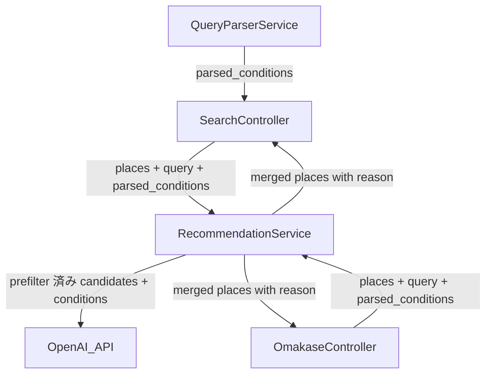
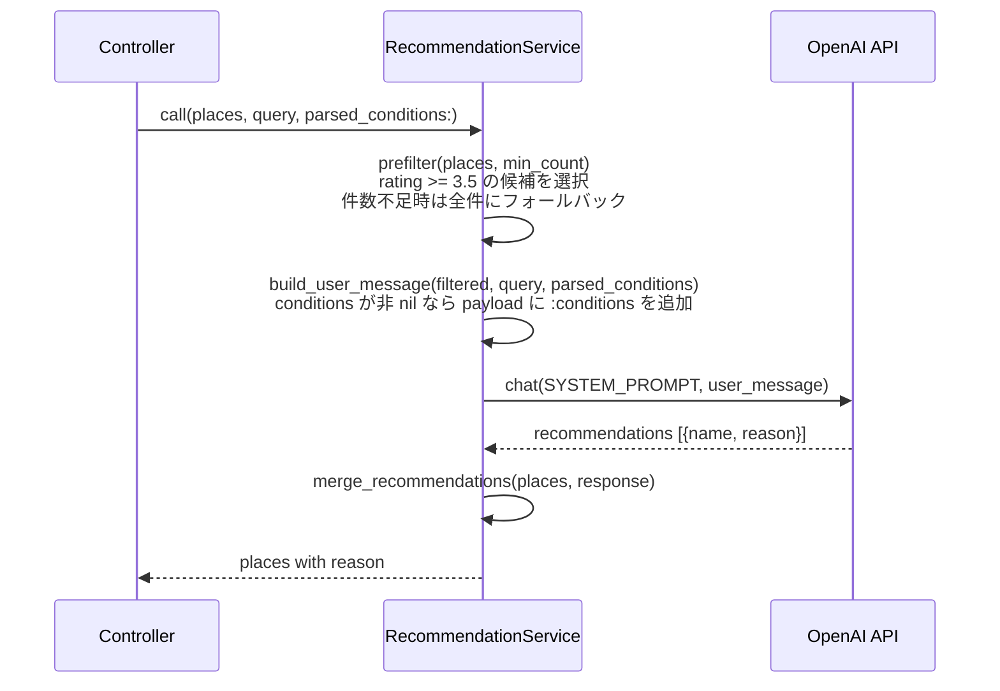

# Design Document: recommendation-tuning

## Overview

`RecommendationService` の推薦精度を3つの改修で向上させる。変更はバックエンドの `RecommendationService`（主）と2つのコントローラー呼び出し箇所に限定され、フロントエンドへの変更は不要。

**Purpose**: `QueryParserService` が構造化した条件をAIに届け、プロンプトの選定基準を明示し、低品質候補を事前除外することで、推薦の一致精度と推薦理由の質を向上させる。

**Users**: レストラン検索ユーザー（検索・おまかせ機能の利用者）。

**Impact**: `RecommendationService#call` のシグネチャ変更（後方互換）、`SYSTEM_PROMPT_TEMPLATE` の差し替え、`prefilter` の追加。

### Goals
- `QueryParserService` の出力をAIリクエストに含め、クエリ再解釈による情報劣化を排除する
- システムプロンプトに選定基準の優先順・rating 閾値・除外基準・推薦理由の品質基準を明示する
- rating 3.5 未満の低品質候補を AI 送信前に除外し、選定品質とトークン効率を向上させる

### Non-Goals
- フィードバックUI（別途 `recommendation-feedback` spec で仕様化）
- `QueryParserService` 自体の変更
- `GooglePlacesService` の変更
- フロントエンドコンポーネントの変更

---

## Boundary Commitments

### This Spec Owns
- `RecommendationService#call` のシグネチャ変更（`parsed_conditions:` キーワード引数追加）
- `SYSTEM_PROMPT_TEMPLATE` 定数の置き換え
- `build_user_message` の拡張（`parsed_conditions` をペイロードに追加）
- `prefilter` private メソッドの追加
- `SearchController` / `OmakaseController` の `RecommendationService` 呼び出し箇所の更新

### Out of Boundary
- `QueryParserService` の実装（依存するが変更しない）
- `GooglePlacesService` の実装
- フロントエンドコンポーネント（`PlaceCard.tsx` 等）
- フィードバックUI機能

### Allowed Dependencies
- `QueryParserService` の戻り値: `{ area:, genre:, price_level:, keyword: }` (シンボルキー Hash)
- OpenAI API (`gpt-5-nano`, Structured Outputs — 既存契約を維持)
- 既存の `RecommendationError` クラス

### Revalidation Triggers
- `QueryParserService` の戻り値キー構造が変わった場合、`build_user_message` の `:conditions` ペイロードを再確認すること
- `RecommendationService#call` のシグネチャが再度変わった場合、両コントローラーの呼び出し箇所を再確認すること

---

## Architecture

### Existing Architecture Analysis

現在の `SearchController` は `QueryParserService` の結果を生成するが `RecommendationService` に渡していない。

```
現状:
QueryParserService → parsed_conditions → [捨てられる]
                                          ↓
SearchController → RecommendationService.call(places, query)  ← 条件なし
```

```
改修後:
QueryParserService → parsed_conditions ──────────────────┐
                                                          ↓
SearchController → RecommendationService.call(places, query, parsed_conditions:)
```

### Architecture Pattern & Boundary Map



### Technology Stack

| Layer | Choice | Role |
|-------|--------|------|
| Backend / Service | Ruby on Rails 8.1 / `recommendation_service.rb` | 変更の中心（シグネチャ・プロンプト・フィルタ） |
| External API | OpenAI gpt-5-nano（既存） | プロンプト内容のみ変更、モデル・スキーマは維持 |

---

## File Structure Plan

### Modified Files
- `backend/app/services/recommendation_service.rb` — `call` シグネチャに `parsed_conditions:` 追加、`SYSTEM_PROMPT_TEMPLATE` を詳細版に置き換え、`build_user_message` に条件追加ロジック組み込み、`prefilter` private メソッド追加
- `backend/app/controllers/api/search_controller.rb` — `RecommendationService.new.call` 呼び出しに `parsed_conditions:` を追加（1行変更）
- `backend/app/controllers/api/omakase_controller.rb` — `parsed_conditions` をハッシュで手動生成し `RecommendationService.new.call` に渡す
- `backend/spec/services/recommendation_service_spec.rb` — `parsed_conditions` あり/なしのペイロード検証テスト、`prefilter` 境界値テストを追加

新規ファイルは不要。

---

## System Flows



---

## Requirements Traceability

| Requirement | Summary | Component | 実現方法 |
|-------------|---------|-----------|---------|
| 1.1 | parsed_conditions をオプション引数として受け付ける | RecommendationService | `call` シグネチャに `parsed_conditions: nil` 追加 |
| 1.2 | AI ペイロードに parsed_conditions を含める | RecommendationService | `build_user_message` で `:conditions` キーを追加 |
| 1.3 | SearchController が parsed_conditions を渡す | SearchController | 既存の `parsed_conditions` 変数を `call` に渡す |
| 1.4 | OmakaseController が parsed_conditions を渡す | OmakaseController | 手動生成した Hash を `call` に渡す |
| 1.5 | nil 時は従来動作を維持 | RecommendationService | `if parsed_conditions` の条件分岐で保護 |
| 2.1 | 条件一致度を最優先とする選定基準 | RecommendationService | `SYSTEM_PROMPT_TEMPLATE` に「選定基準（優先順）」セクション追加 |
| 2.2 | rating の評価基準（閾値）を明示 | RecommendationService | 同上（4.0以上=優秀、3.5〜4.0=普通、3.5未満=回避） |
| 2.3 | 除外基準を明示 | RecommendationService | 同上（除外基準セクション） |
| 2.4 | 他候補との比較を含む推薦理由 | RecommendationService | 同上（reason の生成指示を改訂） |
| 2.5 | name を変更しない制約 | RecommendationService | 同上（既存制約を維持・強化） |
| 3.1 | rating 3.5 未満を除外 | RecommendationService | `prefilter`: `p[:rating] && p[:rating] >= 3.5` |
| 3.2 | フィルタ後 >= min_count ならフィルタ済みのみ送信 | RecommendationService | `rated.size >= min_count ? rated : places` |
| 3.3 | フィルタ後 < min_count なら全件送信 | RecommendationService | 同上（フォールバック） |
| 3.4 | places 空なら AI 呼び出しなしで空配列 | RecommendationService | 既存の `return [] if places.empty?` を維持 |

---

## Components and Interfaces

| Component | Domain/Layer | Intent | Req Coverage | Key Dependencies |
|-----------|-------------|--------|-------------|-----------------|
| RecommendationService | Backend / Service | 構造化条件・改善プロンプト・前処理フィルタリングを統合 | 1.1–1.5, 2.1–2.5, 3.1–3.4 | QueryParserService 戻り値 (P1), OpenAI API (P0) |
| SearchController | Backend / Controller | parsed_conditions を RecommendationService に渡す | 1.3 | QueryParserService (P0), RecommendationService (P0) |
| OmakaseController | Backend / Controller | parsed_conditions を手動生成して RecommendationService に渡す | 1.4 | RecommendationService (P0) |

### Backend / Service

#### RecommendationService

| Field | Detail |
|-------|--------|
| Intent | AI推薦品質向上のため構造化条件引き渡し・プロンプト改善・前処理フィルタリングを担う |
| Requirements | 1.1, 1.2, 1.5, 2.1, 2.2, 2.3, 2.4, 2.5, 3.1, 3.2, 3.3, 3.4 |

**Contracts**: Service [x]

**Service Interface**

```ruby
# 公開メソッド
def call(
  places,                  # Array<Hash>: { name:, rating:, price_level:, address:, ... }
  query,                   # String
  parsed_conditions: nil,  # Hash | nil: { area:, genre:, price_level:, keyword: }
  min_count: 3,            # Integer
  max_count: 5             # Integer
) -> Array<Hash>           # places の要素に reason: String を付加したもの

# Private
def prefilter(places, min_count) -> Array<Hash>
def build_user_message(places, query, parsed_conditions) -> String  # JSON
```

- Preconditions: `places` は `Array`（空可）、`query` は `String`
- Postconditions: 戻り値の各要素は `reason:` フィールドを持つ。`places` に含まれる `name` のみが返される
- Invariants: AI が推薦した `name` が `places` に存在しない場合はスキップ（既存動作を維持）

**SYSTEM_PROMPT_TEMPLATE（更新後の契約）**

```
あなたはレストラン推薦アシスタントです。
ユーザーの検索条件（conditions）と候補店リスト（candidates）を受け取り、
最も適した %<min>d〜%<max>d 件を選んでください。

## 選定基準（優先順）
1. 条件との一致度: conditions の area/genre/price_level との一致を最優先にしてください
2. 評価（rating）: 4.0以上を優秀、3.5〜4.0を普通、3.5未満は他に代替がなければ避けてください
3. 価格帯（price_level）: conditions で価格帯が指定されている場合は必ず一致させてください

## 除外基準
- rating が null かつ同等の評価済み候補がある場合は除外
- conditions の価格帯と明確に合わない場合は除外

## 出力規則
- candidates に含まれる name をそのまま使用してください（変更・省略・翻訳不可）
- reason: 他の候補と比べてなぜこの店を推薦するか、条件への合致点を含めて日本語で1〜2文で説明
```

**Implementation Notes**
- `build_user_message` の変更箇所: `payload[:conditions] = parsed_conditions if parsed_conditions` を `{ query:, candidates: }` の後に追加
- `prefilter` の実装: `rated = places.select { |p| p[:rating] && p[:rating] >= 3.5 }; rated.size >= min_count ? rated : places`
- `call` での呼び出し順序: `places = prefilter(places, min_count)` → `build_user_message(places, query, parsed_conditions)` の順

### Backend / Controller

#### SearchController（更新箇所のみ）

**Implementation Notes**
- 変更箇所は1行のみ: `RecommendationService.new.call(places, query)` → `RecommendationService.new.call(places, query, parsed_conditions: parsed_conditions)`
- `parsed_conditions` は既に `QueryParserService.new.call(query)` で生成済みのため、追加のロジックは不要

#### OmakaseController（更新箇所のみ）

**Implementation Notes**
- おまかせ用の `parsed_conditions` を手動生成: `{ area: conditions[:sub_area], genre: "居酒屋・バー", price_level: nil, keyword: nil }`
- `conditions[:sub_area]` はコントローラー内で既に利用されている変数
- `QueryParserService` を呼び直すのはトークンの無駄になるため手動生成を選択（research.md に記録）

---

## Error Handling

### Error Strategy
既存の `RecommendationError` rescue チェーン（`Faraday::ClientError` / `ServerError` / `ConnectionFailed` / `TimeoutError` / `JSON::ParserError` / `Errno::ENOENT`）に変更なし。

`prefilter` は純粋な `Array` 操作のため例外は発生しない。`parsed_conditions: nil` のデフォルト値により後方互換エラーは発生しない。

---

## Testing Strategy

### Unit Tests（`recommendation_service_spec.rb` に追加）

1. **parsed_conditions ありのペイロード検証**: `parsed_conditions: { area: "渋谷", genre: "イタリアン", price_level: nil, keyword: nil }` を渡したとき、OpenAI リクエストボディに `:conditions` キーが含まれること
2. **parsed_conditions なしのペイロード検証（後方互換）**: `parsed_conditions` を渡さない場合、リクエストボディに `:conditions` キーが含まれないこと
3. **prefilter 通常ケース**: rating 3.5 以上の候補が min_count 以上あるとき、rating < 3.5 の候補が AI リクエストに含まれないこと
4. **prefilter フォールバック**: フィルタ後の件数が min_count 未満のとき、全候補が AI に送信されること
5. **prefilter 境界値**: rating が正確に 3.5 の候補が除外されないこと（`>=` の確認）
