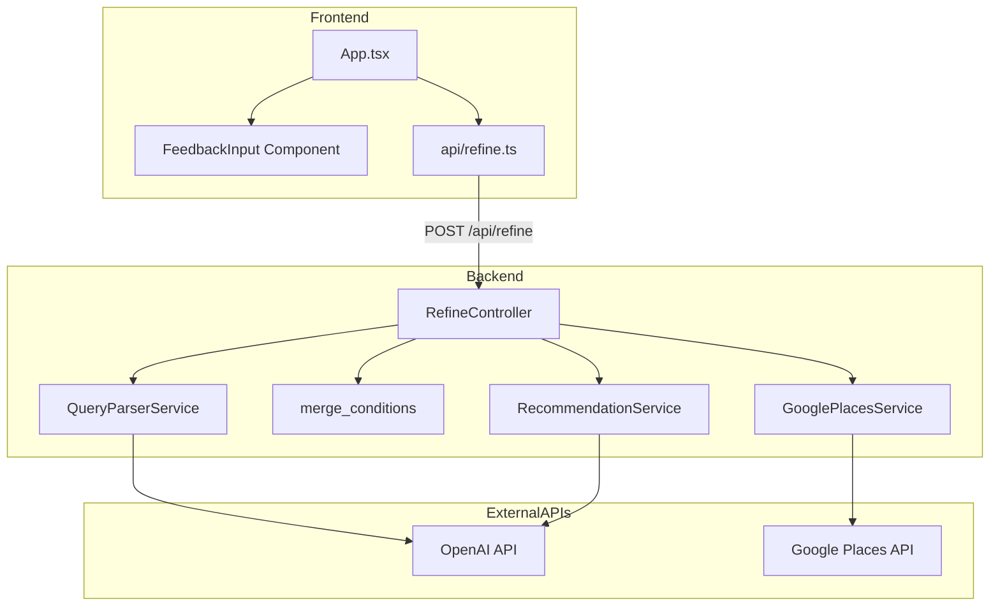
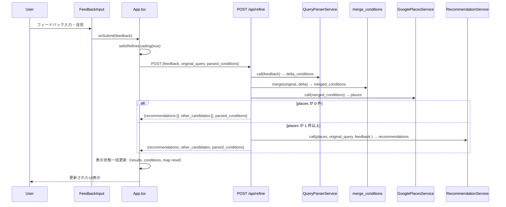

# Design Document: refine-recommendation

## Overview

本機能は既存のAI検索パイプラインに「再レコメンド（フィードバック付き絞り込み）」機能を追加する。ユーザーがAIレコメンド結果を受け取った後に自然文フィードバックを入力すると、そのフィードバックを元の検索条件にマージして Google Places で新しい候補を取得し、フィードバックを最優先に反映した再選別結果を返す。

新規バックエンドエンドポイント（POST /api/refine）と新規フロントエンドコンポーネント（FeedbackInput）を追加し、既存の QueryParserService・GooglePlacesService・RecommendationService を再利用する拡張構成をとる。DB変更・新規外部依存は発生しない。

**Users**: レストランを探しているユーザー（初回検索後、推薦結果をより自分の好みに絞り込みたいユーザー）  
**Impact**: 既存の `RecommendationService` に `feedback:` 引数を追加するが、既存の呼び出しコードへの変更は不要（nil デフォルト）。

### Goals
- フィードバックを元に条件をマージして Google Places で新候補を取得し、フィードバック最優先でAI再選別する
- 既存サービスを最大限再利用し、変更箇所を最小化する
- 再レコメンド後のUI状態（結果表示・条件タグ・地図状態）を正しく更新する

### Non-Goals
- フィードバック履歴の永続化・表示
- おまかせ機能への再レコメンド適用
- ユーザー認証・セッション管理
- 推薦モデルの継続的学習・改善

---

## Boundary Commitments

### This Spec Owns
- `POST /api/refine` エンドポイントの定義・実装・エラーハンドリング
- フィードバックを構造化条件（delta）に変換し元条件にマージするロジック（`RefineController#merge_conditions`）
- `RecommendationService` への `feedback:` キーワード引数の追加（nil デフォルト、後方互換）
- `FeedbackInput` コンポーネント（フィードバック入力UI）
- App.tsx への `handleRefine` ハンドラーと `FeedbackInput` 組み込み
- `RefineRequest` 型定義（`types/search.ts` への追加）
- `api/refine.ts` API クライアント関数

### Out of Boundary
- `QueryParserService`・`GooglePlacesService` の内部ロジック変更（呼び出し方は変更しない）
- `SearchController`・`OmakaseController` の変更
- `SearchConditionTags` コンポーネントの変更（既存 `parsedConditions` 表示をそのまま利用）
- フィードバック履歴の保存・管理
- おまかせ機能への再レコメンド機能追加

### Allowed Dependencies
- `QueryParserService` — フィードバックの構造化条件変換（既存の `.new.call(text)` インターフェース）
- `GooglePlacesService` — マージ済み条件での店舗候補取得（既存の `.new.call(conditions)` インターフェース）
- `RecommendationService` — AI再選別（`feedback:` 引数追加後のインターフェース）
- `ParsedConditions` 型・`SearchResponse` 型（`types/search.ts`）

### Revalidation Triggers
- `ParsedConditions` 型の形状変更（フィールド追加・変更）
- `SearchResponse` 型の形状変更
- `RecommendationService.call` のインターフェース変更（引数名・戻り値）
- `QueryParserService.call` の戻り値スキーマ変更

---

## Architecture

### Existing Architecture Analysis

既存の AI 検索パイプライン（`SearchController`）:
```
POST /api/search
  → QueryParserService.call(query) → parsed_conditions
  → GooglePlacesService.call(parsed_conditions) → places
  → RecommendationService.call(places, query, parsed_conditions:) → recommendations
  → render json: { recommendations, other_candidates, parsed_conditions }
```

再レコメンド機能はこのパターンを拡張する:
```
POST /api/refine
  → QueryParserService.call(feedback) → delta_conditions
  → merge_conditions(original, delta) → merged_conditions
  → GooglePlacesService.call(merged_conditions) → places
  → RecommendationService.call(places, original_query, parsed_conditions: merged_conditions, feedback:) → recommendations
  → render json: { recommendations, other_candidates, parsed_conditions: merged_conditions }
```

### Architecture Pattern & Boundary Map



### Technology Stack

| Layer | 選択 / バージョン | 役割 | 備考 |
|-------|-----------------|------|------|
| Frontend | React 19 + TypeScript 5 (strict) | FeedbackInput UI、App.tsx 統合 | 変更なし |
| Backend | Rails 8.1, ruby-openai 8.3 | RefineController、RecommendationService 拡張 | 変更なし |
| AI Model (Recommendation) | `gpt-5.4-nano` | AI再選別（ranking精度向上） | `gpt-5-nano` から変更（理由: research.md #3参照） |
| AI Model (QueryParser) | `gpt-5-nano` | フィードバックの構造化変換 | 変更なし |
| 外部API | Google Places API | マージ済み条件での店舗取得 | 変更なし |

---

## File Structure Plan

### 新規作成ファイル

```
backend/
├── app/controllers/api/
│   └── refine_controller.rb      # POST /api/refine ハンドラー、マージロジック
└── spec/requests/api/
    └── refine_spec.rb             # リクエストスペック

frontend/src/
├── api/
│   └── refine.ts                  # refinePlaces(request) API クライアント関数
└── components/
    ├── FeedbackInput.tsx           # フィードバック入力フォームコンポーネント
    └── FeedbackInput.test.tsx      # コンポーネントテスト
```

### 変更ファイル

- `backend/config/routes.rb` — `post "refine"` を namespace :api ブロックに追加
- `backend/app/services/recommendation_service.rb` — `feedback: nil` キーワード引数追加、`build_system_prompt` プライベートメソッド追加、モデルを `gpt-5.4-nano` に変更
- `backend/spec/services/recommendation_service_spec.rb` — `feedback:` 引数のテストケース追加
- `frontend/src/types/search.ts` — `RefineRequest` 型追加（`RefineResponse = SearchResponse` エイリアス）
- `frontend/src/App.tsx` — `isRefineLoading` state追加、`handleRefine` 追加、`FeedbackInput` 組み込み

---

## System Flows

### 再レコメンドフロー（正常系）



---

## Requirements Traceability

| Requirement | Summary | Components | Interfaces / Flows |
|-------------|---------|------------|-------------------|
| 1.1 | レコメンド1件以上でフォーム表示 | FeedbackInput, App.tsx | State: `recommendations` |
| 1.2 | 空入力で送信ボタン無効 | FeedbackInput | Props: `isLoading`, callback |
| 1.3 | 処理中UI | FeedbackInput, App.tsx | State: `isRefineLoading` |
| 1.4 | 未取得状態でフォーム非表示 | App.tsx | State: `recommendations` |
| 2.1 | POST /api/refine 正常 200 | RefineController, api/refine.ts | API Contract |
| 2.2 | 空 feedback で 422 | RefineController | バリデーション |
| 2.3 | 外部サービス失敗で 502 | RefineController | rescue_from |
| 2.4 | all_candidates 不要 | RefineController | リクエスト設計 |
| 3.1 | フィードバック構造化変換 | RefineController (QueryParser呼び出し) | Refine Flow |
| 3.2 | null 以外でマージ | RefineController (merge_conditions) | Merge Logic |
| 3.3 | 全 null フォールバック | RefineController | Merge Logic |
| 4.1 | マージ済み条件で再取得 | RefineController (GooglePlaces呼び出し) | Refine Flow |
| 4.2 | 0 件時の早期レスポンス | RefineController | Refine Flow（分岐） |
| 5.1 | AI再選別 3〜5 件 | RecommendationService | Service Interface |
| 5.2 | フィードバック最優先 | RecommendationService (build_system_prompt) | Service Interface |
| 6.1 | 表示一括更新 | App.tsx (handleRefine) | State Update |
| 6.2 | もっと見るリセット | App.tsx (handleRefine) | State Update |
| 6.3 | 地図状態リセット | App.tsx (handleRefine) | State Update |
| 7.1 | API エラー表示 | App.tsx (handleRefine, error state) | Error Flow |
| 7.2 | ネットワークエラー表示 | App.tsx (handleRefine) | Error Flow |
| 7.3 | エラー時表示維持 | App.tsx (handleRefine) | Error Flow |

---

## Components and Interfaces

### コンポーネント一覧

| Component | Layer | Intent | Req Coverage | Key Dependencies |
|-----------|-------|--------|--------------|-----------------|
| `RefineController` | Backend / Controller | POST /api/refine 処理、マージロジック | 2.1–2.4, 3.1–3.3, 4.1–4.2, 5.1 | QueryParser(P0), GooglePlaces(P0), RecommendationSvc(P0) |
| `RecommendationService`（拡張） | Backend / Service | feedback 引数追加、プロンプト拡張 | 5.1, 5.2 | OpenAI API(P0) |
| `api/refine.ts` | Frontend / API | HTTP クライアント関数 | 2.1 | fetch(P0) |
| `FeedbackInput` | Frontend / UI | フィードバック入力フォーム | 1.1–1.4 | App.tsx(P0) |
| `App.tsx`（拡張） | Frontend / Root | handleRefine, isRefineLoading, FeedbackInput 組み込み | 1.1–1.4, 6.1–6.3, 7.1–7.3 | FeedbackInput(P1), api/refine.ts(P0) |

---

### Backend / Controller

#### RefineController

| Field | Detail |
|-------|--------|
| Intent | POST /api/refine を処理し、フィードバックを条件にマージして再レコメンドを返す |
| Requirements | 2.1, 2.2, 2.3, 2.4, 3.1, 3.2, 3.3, 4.1, 4.2, 5.1 |

**Responsibilities & Constraints**
- `feedback` の存在・非空チェック
- `QueryParserService` でフィードバックを構造化条件（delta）に変換
- `merge_conditions(original, delta)` で null でない delta 値のみ上書き（3.2, 3.3）
- `GooglePlacesService` でマージ済み条件を使って店舗候補を再取得
- 候補 0 件時に早期レスポンス（4.2）
- `RecommendationService.call(places, query, parsed_conditions:, feedback:)` で再選別
- `SearchController` と同一の `rescue_from` パターンを採用

**Dependencies**
- Outbound: `QueryParserService` — フィードバック解析 (P0)
- Outbound: `GooglePlacesService` — 店舗取得 (P0)
- Outbound: `RecommendationService` — AI再選別 (P0)

**Contracts**: API [x]

##### API Contract

| Method | Endpoint | Request | Response (200) | Errors |
|--------|----------|---------|---------------|--------|
| POST | /api/refine | `RefineRequestParams` | `RefineResponseBody` | 422, 502, 500 |

**Request params:**
```
feedback:          String  （必須、非空）
original_query:    String
parsed_conditions: { area:, genre:, price_level:, keyword: }  （各 String | null）
```

**Response body (200):**
```
recommendations:   Array[{ name, rating, price_level, address, google_maps_url, lat, lng, reason }]
other_candidates:  Array[{ name, rating, price_level, address, google_maps_url, lat, lng }]
parsed_conditions: { area, genre, price_level, keyword }
```

**Error responses:**
- `422` — `{ error: "feedback must be a non-empty string" }`
- `502` — `{ error: "外部サービスとの通信に失敗しました" }`
- `500` — `{ error: "内部エラーが発生しました" }`

**Implementation Notes**
- `merge_conditions` はプライベートメソッド: `base.merge(delta.reject { |_, v| v.nil? })`
- `parse_conditions` は `raw.permit(...)` + `symbolize_keys`（SearchController と同パターン）

---

#### RecommendationService（拡張）

| Field | Detail |
|-------|--------|
| Intent | `feedback:` 引数を追加し、フィードバックを最優先で反映したプロンプトを構築する |
| Requirements | 5.1, 5.2 |

**Responsibilities & Constraints**
- `feedback: nil` をキーワード引数として追加（既存コールは変更不要）
- `build_system_prompt(min, max, feedback)` プライベートメソッドで条件分岐
- feedback 非 nil の場合: プロンプト末尾に「ユーザーフィードバック（必ず最優先で反映）」セクションを追記
- モデルを `gpt-5.4-nano` に変更（ranking精度・知識カットオフ向上）

**Contracts**: Service [x]

##### Service Interface（変更後）

```ruby
# 変更後シグネチャ
def call(places, query, min_count: 3, max_count: 5, parsed_conditions: nil, feedback: nil)

# 追加プライベートメソッド
def build_system_prompt(min, max, feedback)
  base = format(SYSTEM_PROMPT_TEMPLATE, min: min, max: max)
  return base if feedback.blank?
  base + "\n\n## ユーザーフィードバック（必ず最優先で反映してください）\n" \
        "前回の推薦に対して、ユーザーから以下のフィードバックがありました:\n" \
        "「#{feedback}」\n\n" \
        "このフィードバックを他の選定基準より優先して反映してください。"
end
```

**Implementation Notes**
- 既存の `SearchController`・`OmakaseController` は `feedback:` を省略したまま呼べるため変更不要
- `SYSTEM_PROMPT_TEMPLATE` の定数変更は不要（プロンプト拡張はメソッド内で完結）

---

### Frontend / API

#### api/refine.ts

| Field | Detail |
|-------|--------|
| Intent | POST /api/refine を呼び出し、RefineResponse を返す API クライアント関数 |
| Requirements | 2.1 |

**Contracts**: Service [x]

##### Service Interface

```typescript
// frontend/src/api/refine.ts
import type { RefineRequest, RefineResponse } from '../types/search';

export async function refinePlaces(request: RefineRequest): Promise<RefineResponse>;
```

- Preconditions: `request.feedback` が非空文字列
- Error: レスポンスが ok でない場合 `Error` をスロー（既存 searchPlaces と同パターン）

---

### Frontend / Types

#### types/search.ts（追加型）

```typescript
// 追加
export type RefineRequest = {
  feedback: string;
  original_query: string;
  parsed_conditions: ParsedConditions | null;
};

export type RefineResponse = SearchResponse;
```

---

### Frontend / UI

#### FeedbackInput

| Field | Detail |
|-------|--------|
| Intent | フィードバックテキストの入力と送信を管理するフォームコンポーネント |
| Requirements | 1.1, 1.2, 1.3 |

**Contracts**: State [x]

##### State Management

```typescript
// Props
type FeedbackInputProps = {
  onSubmit: (feedback: string) => void;
  isLoading: boolean;
};
```

- Controlled input（value + onChange）
- 送信後は入力値をリセット
- `SearchInput.tsx` と同一のデザインパターンを踏襲

**Implementation Notes**
- placeholder: 「個室があると良い」「もっとカジュアルな雰囲気が良い」など
- 送信ボタンラベル: 通常 → 「再レコメンド」、isLoading=true → 「絞り込み中...」
- any 型不使用、strict TypeScript 準拠

---

#### App.tsx（拡張）

| Field | Detail |
|-------|--------|
| Intent | handleRefine を追加し、FeedbackInput を組み込む |
| Requirements | 1.1, 1.4, 6.1, 6.2, 6.3, 7.1, 7.2, 7.3 |

**追加 State:**
```typescript
const [isRefineLoading, setIsRefineLoading] = useState<boolean>(false);
```

**handleRefine フロー:**
1. `setIsRefineLoading(true)`, `setError(null)`
2. `refinePlaces({ feedback, original_query: query, parsed_conditions: parsedConditions })`
3. 成功: `setRecommendations`, `setOtherCandidates`, `setParsedConditions`, `setShowOtherCandidates(false)`, `setSelectedGoogleMapsUrl(null)`, `setInfoWindowVisible(false)`
4. 失敗: `setError(message)`
5. Finally: `setIsRefineLoading(false)`

**FeedbackInput 表示条件（JSX）:**
```tsx
{recommendations !== null && recommendations.length > 0 && !isLoading && (
  <FeedbackInput onSubmit={handleRefine} isLoading={isRefineLoading} />
)}
```

---

## Data Models

本機能はDB変更なし。データコントラクトは Components and Interfaces の API Contract セクションに記載。

---

## Error Handling

### Error Strategy

バックエンドは `rescue_from` で外部サービスエラーを一元処理（SearchController パターン）。フロントエンドはエラー時に既存の `error` ステートを更新し、表示済みの recommendations を維持する。

### Error Categories

| 種別 | 発生条件 | HTTP | フロントエンド対応 |
|------|---------|------|------------------|
| バリデーションエラー | feedback が空 / 非文字列 | 422 | setError(message) |
| 外部サービスエラー | QueryParser/GooglePlaces/Recommendation 失敗 | 502 | setError(message) |
| システムエラー | 予期しない例外 | 500 | setError(message) |
| ネットワークエラー | fetch 失敗 | — | setError(message) |

**エラー時の UI 要件（7.3）**: `setRecommendations` / `setOtherCandidates` を更新せず、表示中の結果を維持する（try/catch の catch ブロックで recommendations state を変更しない）。

---

## Testing Strategy

### Backend Unit Tests（RSpec）

**`spec/requests/api/refine_spec.rb`:**
1. 有効な feedback を送信 → 200 + recommendations/other_candidates/parsed_conditions を返す（2.1）
2. feedback が空文字 → 422 + エラーメッセージ（2.2）
3. feedback が nil → 422 + エラーメッセージ（2.2）
4. GooglePlacesService が 0 件を返す → 200 + recommendations: [] / other_candidates: []（4.2）
5. GooglePlacesService が例外 → 502（2.3）
6. フィードバックが全 null に変換される場合 → merged = original（3.3）

**`spec/services/recommendation_service_spec.rb`:**
1. `feedback:` ありの場合、プロンプトにフィードバックテキストが含まれる（5.2）
2. `feedback: nil`（デフォルト）の場合、既存動作を維持する（後方互換確認）

### Frontend Component Tests（Vitest + Testing Library）

**`FeedbackInput.test.tsx`:**
1. 空入力時に送信ボタンが disabled であること（1.2）
2. テキスト入力後に送信ボタンが enabled になること（1.2）
3. `isLoading=true` 時にボタンが disabled かつローディング表示になること（1.3）
4. 送信時に `onSubmit(feedback)` コールバックが入力値で呼び出されること
5. 送信後に入力フィールドがリセットされること

### E2E / 手動検証シナリオ

1. 「古町の居酒屋」で検索 → 3〜5件表示確認
2. `FeedbackInput` に「個室があるお店が良い」入力 → 再レコメンドリクエスト送信確認（Network: POST /api/refine）
3. `SearchConditionTags` に `keyword: 個室` が表示されることを確認（3.2）
4. 再レコメンド後に「もっと見る」が非表示にリセットされることを確認（6.2）
5. さらに「もっと安い店が良い」→ `price_level` が条件に反映されることを確認（3.2）
6. フィードバックが全 null に解析される場合（「雰囲気が良い」）→ 元条件が維持されて再検索されることを確認（3.3）
