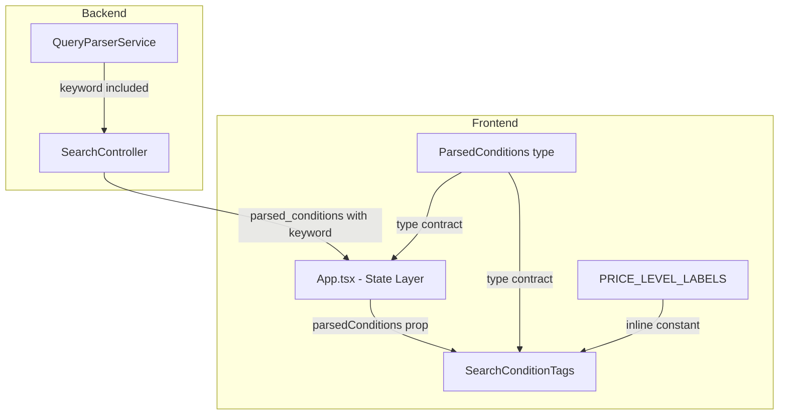
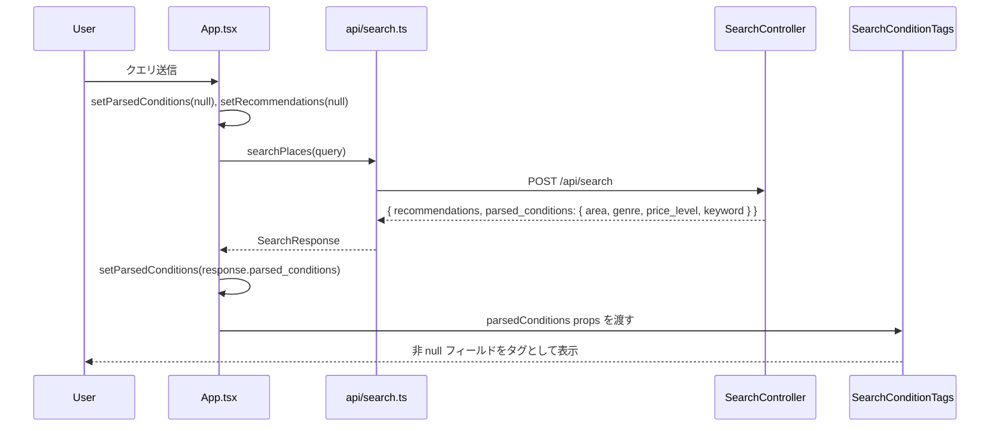

# 技術設計書: 解析条件タグ表示（search-condition-tags）

## 概要

本機能「解析条件タグ表示」は、AIが自然文クエリから抽出した検索条件（エリア・ジャンル・価格帯・キーワード）を、検索結果画面にタグ（チップ）として視覚的に提示する。ユーザーはAIの解釈を即座に確認でき、検索体験の透明性が向上する。

現状、バックエンドの `QueryParserService` はクエリから `area`・`genre`・`price_level`・`keyword` の4フィールドを抽出しているが、`SearchController` のレスポンスに `keyword` が含まれておらず、フロントエンドの `ParsedConditions` 型にも存在しない。また解析条件はUIに一切表示されていない。本機能はこれらのギャップを最小限の変更で解消する。

変更スコープは、バックエンド1ファイル（コントローラ修正）、フロントエンド1型ファイル修正・1コンポーネント新規作成・1ルートコンポーネント拡張の4点にとどまる。

### Goals

- バックエンドAPIレスポンスの `parsed_conditions` に `keyword` フィールドを追加し、全解析条件を返却する
- フロントエンドの `ParsedConditions` 型を TypeScript strict モードで完全な型安全性を維持しながら更新する
- 検索結果画面に解析条件タグを視覚的に表示し、AI解釈の透明性を提供する
- 価格帯列挙値を日本語ラベルに変換してユーザーに提示する

### Non-Goals

- `QueryParserService` 自体の変更（既に `keyword` を正しく抽出している）
- 解析条件タグのインタラクティブ操作（クリックで絞り込み等）
- タグの永続化・履歴保存
- `RecommendationCard` 等への `price_level` 表示改善（本機能のスコープ外）

---

## アーキテクチャ

### 既存アーキテクチャ分析

```
自然文クエリ
  → QueryParserService（OpenAI: area/genre/price_level/keyword を抽出）
  → SearchController（レスポンス構築: keyword を現在除外中）
  → frontend/src/api/search.ts（SearchResponse 型で受信）
  → App.tsx（parsed_conditions を現在無視）
  → 表示なし
```

本機能の変更後:

```
自然文クエリ
  → QueryParserService（変更なし）
  → SearchController（keyword を parsed_conditions に追加）
  → frontend/src/api/search.ts（型更新により自動対応）
  → App.tsx（parsedConditions state を保持）
  → SearchConditionTags（タグとして表示）
```

既存の制約として、フロントエンドは TypeScript strict モード（`noUnusedLocals` 等）を採用しており、型変更は即座に型チェックに影響する。バックエンドは `render json:` で直接レスポンスを構築しており、変更箇所が明確。

### Architecture Pattern & Boundary Map



**アーキテクチャ統合**:
- 採用パターン: Option C ハイブリッド（「小さな修正は既存ファイルに、新責務は新ファイルに」）
- 既存パターン踏襲: Service Object パターン（変更なし）、`render json:` 直接レンダリング、Tailwind CSS チップスタイル（`SearchHistoryChips.tsx` 参照）
- 新規コンポーネントの根拠: `SearchConditionTags` は検索結果とは独立した責務（AI解釈の可視化）を持つため、既存コンポーネントへの埋め込みは単一責任原則に反する
- Steering 準拠: TypeScript strict、疎結合構成、コントローラを薄く保つ方針

### Technology Stack

| レイヤー | 選択 / バージョン | 本機能での役割 | 備考 |
|---------|----------------|-------------|------|
| Frontend / UI | React 19 + TypeScript 5 strict | `SearchConditionTags` コンポーネント、型更新 | 新規外部依存なし |
| Frontend / Style | Tailwind CSS v4 | チップのスタイリング | `SearchHistoryChips.tsx` の既存パターン踏襲 |
| Frontend / Test | Vitest 3 + Testing Library | `SearchConditionTags.test.tsx` | globals 有効 |
| Backend / API | Ruby on Rails 8.1 | `SearchController` のレスポンス拡張 | `render json:` 直接変更 |
| Backend / Test | RSpec Rails 7 | `search_spec.rb` のアサーション更新 | Webmock 使用 |

---

## 要件トレーサビリティ

| 要件 | サマリー | コンポーネント | インターフェース | フロー |
|------|---------|-------------|----------------|------|
| 1.1 | `parsed_conditions` に `keyword` を含める | `SearchController` | API Contract | — |
| 1.2 | `keyword` が null の場合は null を返却 | `SearchController` | API Contract | — |
| 1.3 | 空結果・通常レスポンス両方に適用 | `SearchController` | API Contract | — |
| 2.1 | `ParsedConditions` に `keyword: string \| null` を追加 | `ParsedConditions` type | Service Interface | — |
| 2.2 | TypeScript strict モードで型チェックを通過 | `ParsedConditions` type, `App.tsx`, `SearchConditionTags` | — | — |
| 3.1 | 非 null フィールドが存在する場合にタグを表示 | `App.tsx`, `SearchConditionTags` | State Management | Search → Display |
| 3.2–3.5 | 各フィールドを個別タグとして表示 | `SearchConditionTags` | Props Contract | — |
| 3.6 | 全フィールド null 時は非表示 | `SearchConditionTags` | Props Contract | — |
| 3.7 | ローディング中は非表示 | `App.tsx` | State Management | — |
| 3.8 | 新検索時にタグをクリア | `App.tsx` | State Management | — |
| 4.1–4.5 | 価格帯列挙値を日本語ラベルに変換 | `SearchConditionTags` / `PRICE_LEVEL_LABELS` | — | — |
| 5.1–5.3 | チップスタイル・横並びレイアウト・ラベル付き表示 | `SearchConditionTags` | — | — |

---

## システムフロー

### 検索実行からタグ表示までのシーケンス



**フロー上の判断ポイント**:
- `setParsedConditions(null)` は `handleSearch` 冒頭（`setRecommendations(null)` と同タイミング）で呼ぶことで要件3-8を満たす
- `App.tsx` は `isLoading === false && parsedConditions !== null` のときのみ `SearchConditionTags` をレンダリングする（要件3-7）

---

## コンポーネントとインターフェース

### コンポーネントサマリー

| コンポーネント | ドメイン/レイヤー | 役割 | 要件カバレッジ | 主要依存 | コントラクト |
|------------|--------------|------|------------|--------|----------|
| `SearchController` | Backend / API | `keyword` をレスポンスに追加 | 1.1, 1.2, 1.3 | `QueryParserService` (P0) | API |
| `ParsedConditions` (type) | Frontend / Types | 型定義に `keyword` を追加 | 2.1, 2.2 | — | Service Interface |
| `App.tsx` | Frontend / State | `parsedConditions` state 管理、表示制御 | 3.7, 3.8 | `SearchConditionTags` (P0), `searchPlaces` (P0) | State |
| `SearchConditionTags` | Frontend / UI | 解析条件を視覚的タグとして表示 | 3.1–3.6, 4.1–4.5, 5.1–5.3 | `ParsedConditions` (P0) | Props |

---

### Backend / API

#### SearchController

| フィールド | 詳細 |
|---------|------|
| Intent | `parsed_conditions` レスポンスに `keyword` フィールドを追加する |
| Requirements | 1.1, 1.2, 1.3 |

**責務と制約**:
- `parsed_conditions` ハッシュの構築箇所（空結果パスと通常パスの2箇所）に `keyword: parsed_conditions[:keyword]` を追加する
- `QueryParserService` の戻り値から `keyword` を直接参照する（変換なし）
- null 値の場合はそのまま `null` として返却する（Ruby `nil` → JSON `null`）

**依存関係**:
- Inbound: Rails Router — POST /api/search (P0)
- Outbound: `QueryParserService` — クエリ解析結果の取得（変更なし）(P0)

**Contracts**: API [x]

##### API Contract

| Method | Endpoint | Request | Response | Errors |
|--------|----------|---------|----------|--------|
| POST | /api/search | `{ query: string }` | `SearchResponse` | 422, 502, 500 |

`SearchResponse` のレスポンス構造（変更後）:

```
{
  "recommendations": [...],
  "parsed_conditions": {
    "area": string | null,
    "genre": string | null,
    "price_level": string | null,
    "keyword": string | null    ← 追加
  }
}
```

**Implementation Notes**:
- 変更箇所: `search_controller.rb` の2つの `render json:` ブロック（L31–38, L44–50）
- テスト: `search_spec.rb:48` の `not_to have_key("keyword")` を `to have_key("keyword")` に反転する

---

### Frontend / Types

#### ParsedConditions

| フィールド | 詳細 |
|---------|------|
| Intent | 解析条件の型定義に `keyword` を追加する |
| Requirements | 2.1, 2.2 |

**Contracts**: Service Interface [x]

##### Service Interface

```typescript
export type ParsedConditions = {
  area: string | null;
  genre: string | null;
  price_level: string | null;
  keyword: string | null;   // 追加
};
```

- 事前条件: バックエンドAPIが4フィールド全てを返却している
- 事後条件: TypeScript strict モードで型チェックが通過する
- 不変条件: 全フィールドは `string | null`（`undefined` は許容しない）

**Implementation Notes**:
- `App.test.tsx` のテストフィクスチャに `keyword` フィールドを追加する必要がある（型エラー防止）

---

### Frontend / State

#### App.tsx

| フィールド | 詳細 |
|---------|------|
| Intent | `parsedConditions` state を追加し、検索ライフサイクルを通じてタグの表示制御を担う |
| Requirements | 3.7, 3.8 |

**責務と制約**:
- `parsedConditions: ParsedConditions | null` の state を追加する
- 検索開始時（`handleSearch` 冒頭）に `setParsedConditions(null)` を呼ぶ（要件3-8）
- 検索成功後に `setParsedConditions(response.parsed_conditions)` を呼ぶ
- `isLoading === false && parsedConditions !== null` のときのみ `SearchConditionTags` をレンダリングする（要件3-7）

**依存関係**:
- Outbound: `SearchConditionTags` — `parsedConditions` props を渡す (P0)
- Outbound: `searchPlaces` (api/search.ts) — `SearchResponse` 取得 (P0)

**Contracts**: State [x]

##### State Management

- State モデル: `parsedConditions: ParsedConditions | null` — 初期値 `null`、検索開始時に `null`、成功時にレスポンス値をセット
- 永続化: なし（セッション内のみ）
- 並行性: React の単一スレッドモデルにより競合なし

**Implementation Notes**:
- `handleSearch` の変更は `setRecommendations(null)` と `setParsedConditions(null)` の同時呼び出しのみ
- エラー時（catch ブロック）での追加クリアは不要。`handleSearch` 冒頭で `setParsedConditions(null)` を呼ぶ設計のため、API 呼び出し前に state は必ず null になっており、エラー後も前回タグが残留することはない

---

### Frontend / UI

#### SearchConditionTags

| フィールド | 詳細 |
|---------|------|
| Intent | 解析条件を横並びの視覚的タグとして表示する純粋表示コンポーネント |
| Requirements | 3.1–3.6, 4.1–4.5, 5.1–5.3 |

**責務と制約**:
- `parsedConditions` の各フィールドを走査し、null でないフィールドのみチップとして表示する
- `price_level` フィールドは `PRICE_LEVEL_LABELS` 定数でラベル変換し、変換できない値の場合は元の値をそのまま表示する
- 全フィールドが null の場合は `null` を返し何も表示しない（要件3-6）
- Props は読み取り専用。ユーザーインタラクション（クリック等）は持たない

**依存関係**:
- Inbound: `App.tsx` — `parsedConditions` props (P0)
- External: `ParsedConditions` 型 (P0)

**Contracts**: Props [x]

##### Props Interface

```typescript
interface SearchConditionTagsProps {
  parsedConditions: ParsedConditions;
}
```

```typescript
const PRICE_LEVEL_LABELS: Partial<Record<string, string>> = {
  PRICE_LEVEL_FREE: '無料',
  PRICE_LEVEL_INEXPENSIVE: 'リーズナブル',
  PRICE_LEVEL_MODERATE: '普通',
  PRICE_LEVEL_EXPENSIVE: '高め',
  PRICE_LEVEL_VERY_EXPENSIVE: '超高級',
};
```

各タグの表示形式:

| フィールド | ラベル | 表示例 |
|---------|------|------|
| `area` | エリア | `エリア: 渋谷` |
| `genre` | ジャンル | `ジャンル: イタリアン` |
| `price_level` | 価格帯 | `価格帯: リーズナブル` |
| `keyword` | キーワード | `キーワード: テラス席` |

**Tailwind レイアウト**: `flex flex-wrap gap-2 mt-2`（`SearchHistoryChips.tsx` の横並びパターン準拠）  
**チップスタイル**: `px-3 py-1 rounded-full border border-gray-300 bg-white text-sm`

**Implementation Notes**:
- `PRICE_LEVEL_LABELS` は `SearchConditionTags.tsx` のモジュールスコープに定数として定義する（YAGNI: 現時点では他コンポーネントで使用しない）
- 全フィールドが null のガードは、4フィールドを明示的に列挙したチェックで実装する（`Object.values()` は将来の型変更に脆弱なため不使用）: `if (area === null && genre === null && price_level === null && keyword === null) return null;`
- テストファイル: `SearchConditionTags.test.tsx`（同階層に配置）

---

## データモデル

### データコントラクト & 統合

**APIペイロード（変更後）**:

```
POST /api/search
Request:  { "query": string }
Response: {
  "recommendations": Recommendation[],
  "parsed_conditions": {
    "area":        string | null,
    "genre":       string | null,
    "price_level": string | null,
    "keyword":     string | null   ← 新規追加
  }
}
```

- シリアライズ形式: JSON
- バリデーション: `query` は非空文字列（既存バリデーション変更なし）
- `keyword` の null セマンティクス: QueryParserService がキーワードを抽出できなかった場合に null

---

## エラーハンドリング

### エラー戦略

本機能は既存の検索フローを拡張するものであり、新規エラーシナリオは限定的。

### エラーカテゴリと対応

| エラー種別 | シナリオ | 対応 |
|---------|---------|------|
| バックエンド (502) | `QueryParserService` / `GooglePlacesService` 通信失敗 | 既存の `rescue_from` で処理済み。`parsed_conditions` は返却されないため `parsedConditions` state は null のまま |
| フロントエンド (UI) | 全フィールドが null | `SearchConditionTags` はコンポーネント自体を非表示にする（要件3-6） |
| フロントエンド (UI) | `price_level` が未知の enum 値 | `PRICE_LEVEL_LABELS[value] ?? value` でフォールバック表示 |

---

## テスト戦略

### バックエンド Unit / Integration Tests

- `search_spec.rb`: `parsed_conditions` に `keyword` が含まれることを検証（L48 のアサーション反転）
- ケース1: `keyword` が非 null 値の場合のレスポンス検証
- ケース2: `keyword` が null の場合のレスポンス検証
- ケース3: 空結果レスポンスパスでも `keyword` が含まれることを検証

### フロントエンド Unit Tests（SearchConditionTags.test.tsx）

- 全フィールド非 null: 4つのタグが全て表示されることを検証
- 一部フィールド null: null フィールドのタグが表示されないことを検証
- 全フィールド null: コンポーネントが何も表示しないことを検証
- `price_level` 変換: 各 enum 値が正しい日本語ラベルに変換されることを検証（5パターン）
- 未知の `price_level` 値: フォールバックで元の値が表示されることを検証

### フロントエンド Integration Tests（App.test.tsx）

- `App.test.tsx` フィクスチャに `keyword` フィールドを追加（型エラー修正）
- 検索成功後に `SearchConditionTags` が表示されることを検証
- 新検索開始時に前回のタグがクリアされることを検証（要件3-8）
- ローディング中にタグが表示されないことを検証（要件3-7）
