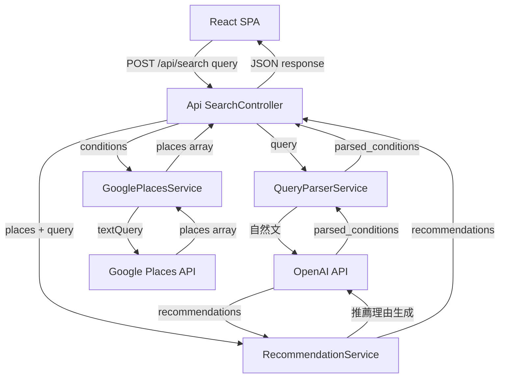
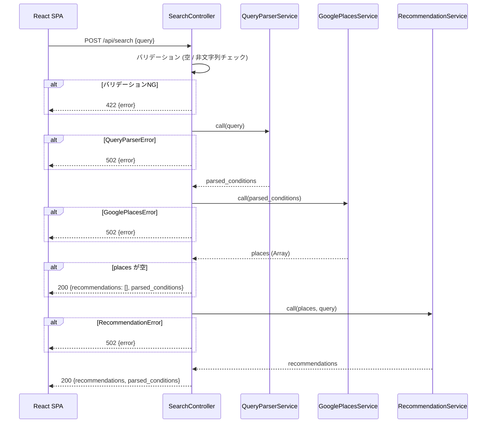

# 設計ドキュメント: SearchController 統合

## Overview

本機能は `POST /api/search` エンドポイントの SearchController スタブを、実際の外部 API 連携フローへ置き換える。SearchController が QueryParserService・GooglePlacesService・RecommendationService を順に呼び出し、ユーザーの自然文クエリから AI 厳選のレストラン推薦リストを生成する。

**Purpose**: 自然文入力から 3〜5 件のレストラン推薦（理由付き）を返す API を完成させる。
**Users**: React フロントエンドが `POST /api/search` を呼び出し、推薦結果をユーザーへ表示する。
**Impact**: SearchController の固定スタブ（空の `recommendations` を返す）を実サービス連携に置き換える。

### Goals

- QueryParserService → GooglePlacesService → RecommendationService の直列フローを SearchController に実装する
- 各サービスの例外を適切な HTTP ステータス（502/500）へ変換する
- 候補店 0 件のとき RecommendationService への不要 API コールを省略する

### Non-Goals

- サービスクラス（QueryParserService・GooglePlacesService・RecommendationService）の実装変更
- 検索履歴の永続化・データベース操作
- フロントエンドの変更
- 認証・レート制限

---

## Requirements Traceability

| Requirement | Summary | Components | Interfaces | Flows |
|-------------|---------|------------|------------|-------|
| 1.1 〜 1.5 | エンドツーエンド検索フロー | SearchController | `create` アクション | 検索フロー図 |
| 2.1 | 候補 0 件時のスキップ | SearchController | `create` アクション | 検索フロー図（分岐） |
| 3.1 〜 3.3 | 入力バリデーション | SearchController | `create` アクション | — |
| 4.1 〜 4.5 | 外部 API エラーハンドリング | SearchController | `rescue_from` | — |
| 5.1 〜 5.4 | レスポンスデータ整合性 | SearchController | API Contract | — |

---

## Architecture

### Existing Architecture Analysis

- `Api::BaseController < ActionController::API` — 現在ロジックなし
- `Api::SearchController < BaseController` — スタブ実装済み（バリデーション + 固定レスポンス）
- 3 サービスは完全実装済み。各サービスはサービス固有のエラークラスを raise する

### Architecture Pattern & Boundary Map



**Architecture Integration**:
- 選択パターン: Facade（SearchController が 3 サービスを直列オーケストレーション）
- 既存パターン維持: Rails の薄いコントローラ原則、サービスオブジェクトパターン
- 新規コンポーネント: なし（SearchController の実装置き換えのみ）
- Steering compliance: `バックエンドはコントローラを薄く保ち、ロジックはサービスオブジェクトへ` に準拠

### Technology Stack

| Layer | 技術 / バージョン | 本機能での役割 | 備考 |
|-------|-----------------|--------------|------|
| Backend | Rails 8.1 / Ruby | SearchController の実装 | 既存スタック |
| Backend | `rescue_from` (Rails 組み込み) | サービス例外 → HTTP ステータス変換 | 新規ライブラリ不要 |

---

## System Flows

### 検索フロー（正常系・エラー系）



**Key Decisions**:
- `places` が空のとき RecommendationService を呼ばずに即レスポンス（不要な OpenAI コスト削減）
- エラー種別ごとに `rescue_from` で HTTP ステータスを確定させる（inline rescue より可読性が高い）

---

## Components and Interfaces

### コンポーネントサマリー

| Component | Layer | Intent | Req Coverage | Key Dependencies | Contracts |
|-----------|-------|--------|--------------|-----------------|-----------|
| SearchController | Controller | クエリ受信・サービス直列呼び出し・レスポンス整形 | 1.1〜1.5, 2.1, 3.1〜3.3, 4.1〜4.5, 5.1〜5.4 | QueryParserService (P0), GooglePlacesService (P0), RecommendationService (P0) | API |

### Controller Layer

#### SearchController

| Field | Detail |
|-------|--------|
| Intent | `POST /api/search` を受け取り、3 サービスを順に呼び出してレスポンスを返す |
| Requirements | 1.1, 1.2, 1.3, 1.4, 1.5, 2.1, 3.1, 3.2, 3.3, 4.1, 4.2, 4.3, 4.4, 4.5, 5.1, 5.2, 5.3, 5.4 |

**Responsibilities & Constraints**
- `query` パラメータのバリデーション（型チェック・空文字チェック）
- QueryParserService → GooglePlacesService → RecommendationService の直列呼び出し
- `places` が空の場合、RecommendationService の呼び出しをスキップ
- `QueryParserError` / `GooglePlacesError` / `RecommendationError` → 502 に変換
- それ以外の `StandardError` → 500 に変換（ログ出力必須）
- `parsed_conditions` は QueryParserService の戻り値から `area` / `genre` / `price_level` の 3 フィールドのみを抽出する（`keyword` は除外）

**Dependencies**
- Outbound: `QueryParserService` — 自然文 → 構造化条件（P0）
- Outbound: `GooglePlacesService` — 構造化条件 → 候補店リスト（P0）
- Outbound: `RecommendationService` — 候補店 → 推薦リスト（P0）

**Contracts**: API [x]

##### API Contract

| Method | Endpoint | Request Body | Response (200) | Errors |
|--------|----------|-------------|----------------|--------|
| POST | /api/search | `{ "query": String }` | `SearchResponse` | 422, 502, 500 |

**Request バリデーション**:
- `query` キーが存在しない → 422
- `query` が String 以外（数値・配列・オブジェクト） → 422
- `query` が空文字（空白のみを含む） → 422

**SearchResponse スキーマ**:
```
{
  recommendations: Array<Recommendation>,
  parsed_conditions: ParsedConditions
}

Recommendation {
  name:           String
  rating:         Float | null
  price_level:    String | null
  address:        String
  google_maps_url: String
  reason:         String
}

ParsedConditions {
  area:        String | null
  genre:       String | null
  price_level: String | null
}
```

**エラーレスポンススキーマ**（全エラーに共通）:
```
{ "error": String }
```

**Implementation Notes**
- `rescue_from QueryParserError, GooglePlacesError, RecommendationError` を SearchController に定義し、502 を返す
- `rescue_from StandardError` を同 SearchController に定義し、500 を返す（`Rails.logger.error` でログ必須）
- `parsed_conditions` の組み立て時、`QueryParserService` の戻り値に含まれる `keyword` は除外する
- `recommendations` の各要素は `RecommendationService` の戻り値をそのまま使用（`name` / `rating` / `price_level` / `address` / `google_maps_url` / `reason`）

---

## Data Models

### Data Contracts & Integration

**API データ転送**（再掲: API Contract と同一）
- リクエスト: `{ query: String }`
- レスポンス: `SearchResponse`（上記スキーマ参照）
- シリアライズ形式: JSON
- バリデーション: コントローラ側で型チェックと空文字チェックを実施

本機能はデータベースを使用しない（ステートレス）。ドメインモデル・物理データモデルの記述は不要。

---

## Error Handling

### Error Strategy

コントローラの `rescue_from` で例外種別ごとに HTTP ステータスを確定させる。エラーメッセージは `exception.message` をそのまま返し、Rails ログに詳細を記録する。

### Error Categories and Responses

| カテゴリ | 例外クラス | HTTP ステータス | レスポンス |
|--------|----------|---------------|---------|
| 入力バリデーションエラー | — | 422 | `{ error: "..." }` |
| 外部 API エラー（OpenAI） | `QueryParserError` / `RecommendationError` | 502 | `{ error: "..." }` |
| 外部 API エラー（Google Places） | `GooglePlacesError` | 502 | `{ error: "..." }` |
| 予期しない例外 | `StandardError` | 500 | `{ error: "内部エラーが発生しました" }` |

**Monitoring**: `StandardError` rescue 時は `Rails.logger.error` でクラス名・メッセージを出力する。

---

## Testing Strategy

### Request Spec（統合テスト）

`spec/requests/api/search_spec.rb` の既存スタブテストを削除し、以下に置き換える。

- **正常系**:
  - 3 サービスをモックし、200 + `SearchResponse` 構造が返ることを確認
  - `parsed_conditions` に `area` / `genre` / `price_level` が含まれ `keyword` が除外されていることを確認
- **候補 0 件**:
  - `GooglePlacesService` が `[]` を返すとき、200 + `recommendations: []` が返り、`RecommendationService` が呼ばれないことを確認
- **バリデーション異常系**（既存テスト継続）:
  - `query` なし / 空文字 / 非文字列 → 422
- **エラー異常系**:
  - `QueryParserService` が `QueryParserError` を raise → 502
  - `GooglePlacesService` が `GooglePlacesError` を raise → 502
  - `RecommendationService` が `RecommendationError` を raise → 502
  - 予期しない例外（StandardError サブクラス） → 500

### モック方針

- `QueryParserService`, `GooglePlacesService`, `RecommendationService` を `instance_double` または `allow_any_instance_of` でモック
- 外部 HTTP 通信は発生させない（サービス単体テストで担保済み）

---

## Security Considerations

- `query` パラメータはサービス層で OpenAI/Google API に渡されるのみで、DB クエリ・シェルコマンドには使用しない。SQLインジェクション・コマンドインジェクションリスクなし
- API キーはコンテナ内のファイル（`/openai_apikey` / `/google_places_apikey`）から読み込み、コントローラ層には露出しない

---

## Supporting References

詳細な設計判断の根拠・代替案比較は `.kiro/specs/search-controller-integration/research.md` を参照。
