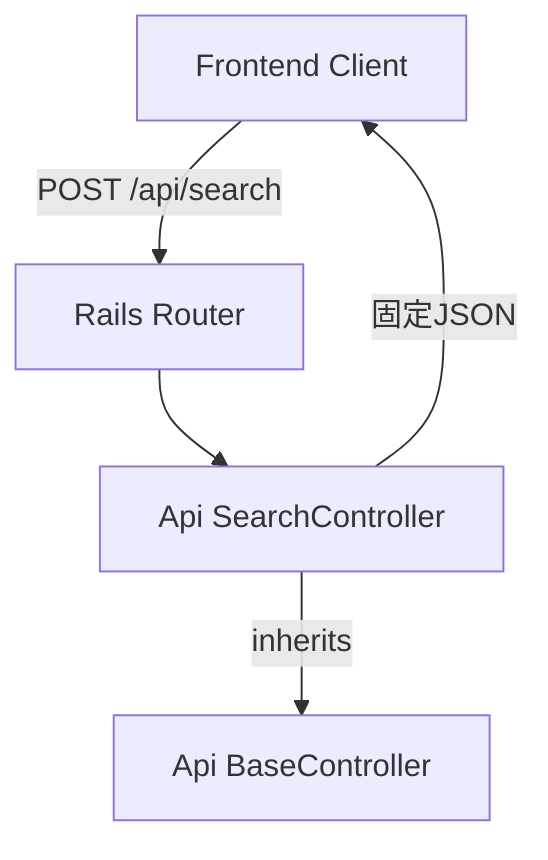
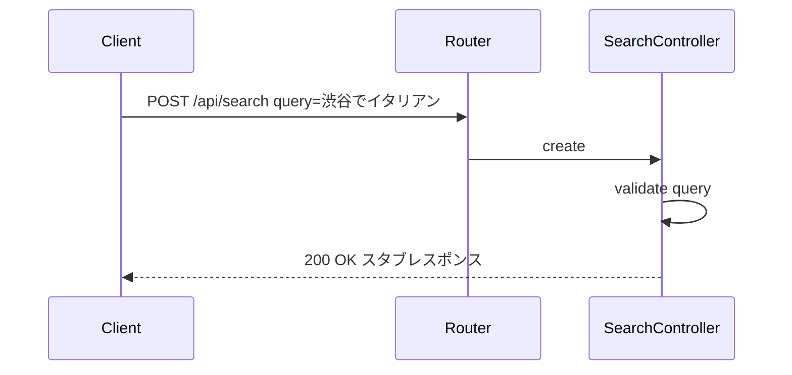
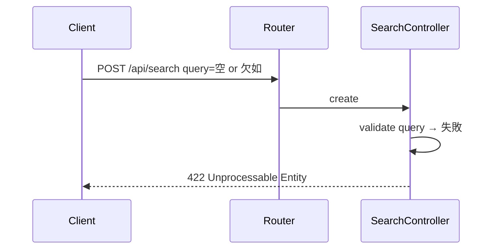

# Design Document: SearchController スタブ

## Overview

**Purpose**: `POST /api/search` エンドポイントを固定レスポンスで提供し、後続 Chunk（3〜6）でサービス層を統合する際の API インターフェースの土台を構築する。

**Users**: フロントエンド開発者がこのエンドポイントに対して開発・テストを進める。

### Goals
- `POST /api/search` エンドポイントを確立し、固定スタブレスポンスを返す
- `query` パラメータのバリデーションを実装し、不正入力に 422 を返す
- API 名前空間の基盤（ルーティング・基底コントローラ）を整備する

### Non-Goals
- サービス層（QueryParserService, GooglePlacesService, RecommendationService）の呼び出し
- 外部 API（OpenAI, Google Places）との連携
- データベースへの読み書き

## Architecture

### Architecture Pattern & Boundary Map



**Architecture Integration**:
- Selected pattern: Rails 標準の名前空間付きコントローラ。シンプルかつ後続拡張に対応可能
- Domain boundaries: `Api::` 名前空間で API コントローラを分離
- Existing patterns preserved: Rails ルーティング規約に準拠
- New components rationale: `Api::BaseController` は API 専用の基底クラスとして後続 Chunk でも再利用

### Technology Stack

| Layer | Choice / Version | Role in Feature | Notes |
|-------|------------------|-----------------|-------|
| Backend | Ruby on Rails 8.1 | コントローラ・ルーティング | 既存スタック |
| Runtime | Docker Compose | コンテナ実行環境 | 既存構成 |

## Requirements Traceability

| Requirement | Summary | Components | Interfaces | Flows |
|-------------|---------|------------|------------|-------|
| 1.1 | 正常リクエストで 200 を返す | SearchController | API Contract | 正常系フロー |
| 1.2 | 固定 JSON レスポンス構造 | SearchController | API Contract | 正常系フロー |
| 1.3 | Content-Type が application/json | SearchController | API Contract | — |
| 2.1 | 空文字 query で 422 | SearchController | API Contract | バリデーションフロー |
| 2.2 | query 欠如で 422 | SearchController | API Contract | バリデーションフロー |
| 2.3 | query が文字列以外で 422 | SearchController | API Contract | バリデーションフロー |
| 2.4 | バリデーションエラーの JSON レスポンス | SearchController | API Contract | バリデーションフロー |
| 3.1 | POST /api/search のルーティング | Rails Router | — | — |
| 3.2 | 不正 HTTP メソッドのエラー | Rails Router | — | — |

## Components and Interfaces

| Component | Domain/Layer | Intent | Req Coverage | Key Dependencies | Contracts |
|-----------|--------------|--------|--------------|------------------|-----------|
| Api::BaseController | Backend / Controller | API コントローラの基底クラス | — | ActionController::API (P0) | — |
| Api::SearchController | Backend / Controller | 検索リクエストの受付・バリデーション・スタブレスポンス返却 | 1.1, 1.2, 1.3, 2.1, 2.2, 2.3, 2.4 | Api::BaseController (P0) | API |
| Routes | Backend / Config | ルーティング定義 | 3.1, 3.2 | — | — |

### Backend / Controller

#### Api::BaseController

| Field | Detail |
|-------|--------|
| Intent | API コントローラ群の共通基底クラス |
| Requirements | — (インフラストラクチャ) |

**Responsibilities & Constraints**
- `ActionController::API` を継承し、API に不要なミドルウェア（CSRF、セッション）を除外
- 後続 Chunk で共通エラーハンドリングを追加する拡張ポイント

**Implementation Notes**
- ファイルパス: `app/controllers/api/base_controller.rb`
- 初期実装は空のクラス定義のみ

#### Api::SearchController

| Field | Detail |
|-------|--------|
| Intent | `POST /api/search` を受け付け、query のバリデーション後に固定レスポンスを返す |
| Requirements | 1.1, 1.2, 1.3, 2.1, 2.2, 2.3, 2.4 |

**Responsibilities & Constraints**
- `query` パラメータのバリデーション（存在チェック・型チェック・空文字チェック）
- バリデーション通過時に固定スタブ JSON を返却
- サービス層は呼び出さない（スタブとして固定値を返す）

**Dependencies**
- Inbound: Frontend Client — POST リクエスト送信 (P0)
- Outbound: なし（スタブのため外部呼び出しなし）

**Contracts**: API [x]

##### API Contract

| Method | Endpoint | Request | Response | Errors |
|--------|----------|---------|----------|--------|
| POST | /api/search | SearchRequest | SearchStubResponse | 422 |

**SearchRequest**:
```
Content-Type: application/json
Body: { "query": string }
```

**SearchStubResponse** (200 OK):
```json
{
  "recommendations": [],
  "parsed_conditions": {
    "area": null,
    "genre": null,
    "price_level": null
  }
}
```

**Error Response** (422 Unprocessable Entity):
```json
{
  "error": "バリデーションエラーメッセージ"
}
```

**Implementation Notes**
- ファイルパス: `app/controllers/api/search_controller.rb`
- アクション: `create`
- バリデーション: `query` の存在・型・空文字を `create` アクション冒頭でチェック
- Chunk 6 でサービス層統合時に `create` メソッド内部を差し替え

### Backend / Config

#### Routes

| Field | Detail |
|-------|--------|
| Intent | API エンドポイントのルーティング定義 |
| Requirements | 3.1, 3.2 |

**Implementation Notes**
- `namespace :api` ブロック内に `resource :search, only: [:create]` を定義
- POST のみ許可し、他の HTTP メソッドは Rails のデフォルトで 404 を返す

## System Flows

### 正常系フロー



### バリデーションエラーフロー



## Error Handling

### Error Categories and Responses

| カテゴリ | 条件 | ステータス | レスポンス |
|----------|------|-----------|-----------|
| query 欠如 | `query` パラメータが存在しない | 422 | `{ "error": "query is required" }` |
| query 空文字 | `query` が空文字 | 422 | `{ "error": "query can't be blank" }` |
| query 型不正 | `query` が文字列以外 | 422 | `{ "error": "query must be a string" }` |

## Testing Strategy

### Request Spec（RSpec）
1. **正常系**: `POST /api/search` に `query` を含むリクエスト → 200 OK + スタブ JSON 構造を検証
2. **query 欠如**: `query` なしリクエスト → 422 + エラー JSON
3. **query 空文字**: `query: ""` → 422 + エラー JSON
4. **query 型不正**: `query` が文字列以外 → 422 + エラー JSON
5. **Content-Type**: レスポンスの Content-Type が `application/json` であることを検証

### Routing Spec（RSpec）
1. **POST /api/search**: `Api::SearchController#create` にルーティングされることを検証
2. **不正メソッド**: GET/PUT/DELETE `/api/search` がルーティングエラーとなることを検証
