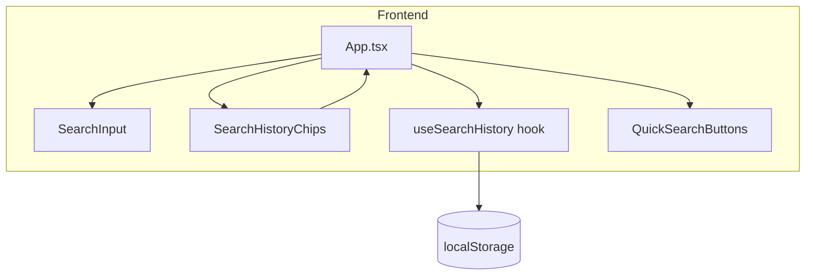
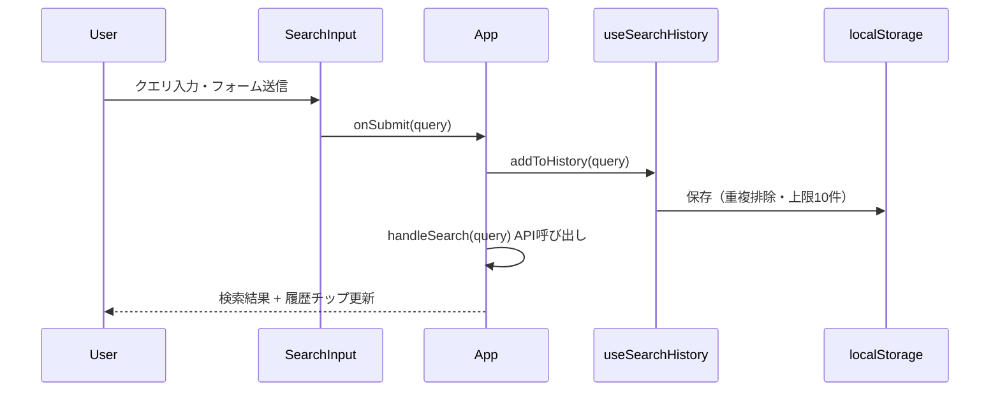
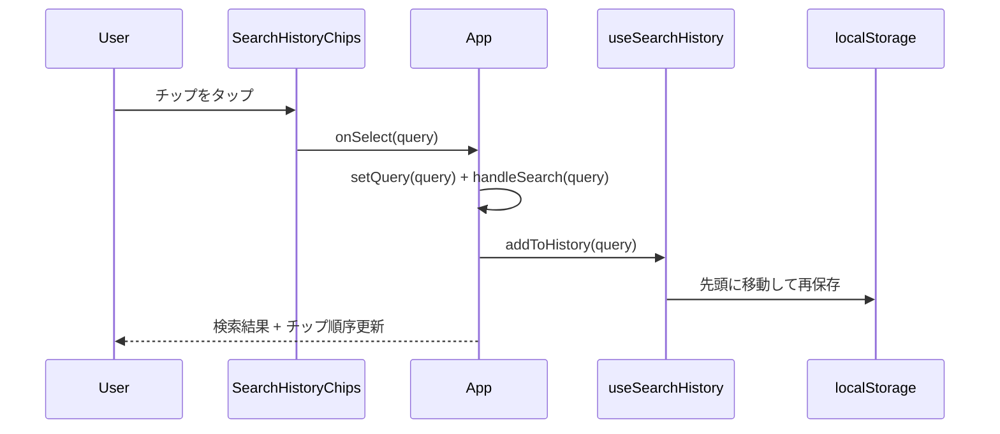

# 技術設計書：検索履歴機能

## Overview

検索履歴機能は、ユーザーが過去に実行した検索クエリを `localStorage` に自動保存し、チップ形式で一覧表示することで、ワンタップでの再検索を可能にする。バックエンド変更・外部 API コスト増なしに、フロントエンド完結で実現する。

**Purpose**: ユーザーが繰り返し使う検索条件を手動で入力する手間を省き、素早い再検索体験を提供する。  
**Users**: レストランを日常的に検索するエンドユーザーが、検索バー付近の履歴チップから過去のクエリを再利用する。  
**Impact**: 既存の `App.tsx` に `useSearchHistory` フックを統合し、`SearchInput` 直下に `SearchHistoryChips` コンポーネントを追加する。バックエンドおよびデータベースへの変更は発生しない。

### Goals

- 検索実行のたびに `localStorage` へクエリを自動保存し、最大 10 件を維持する
- 検索バー直下に履歴チップを新しい順で表示し、ワンタップ再検索を提供する
- 個別削除・全件クリアで履歴を管理できる
- `localStorage` 障害時もアプリ全体の機能を損なわない

### Non-Goals

- バックエンド API を使った履歴のサーバーサイド永続化
- ユーザー認証・アカウント単位の履歴管理
- 検索履歴の検索・フィルタリング
- 検索結果ページへの履歴サイドバー表示

---

## Architecture

### Architecture Pattern & Boundary Map



**Architecture Integration**:
- Selected pattern: フック + UI コンポーネント分離（ロジックをカスタムフックへ、表示を専用コンポーネントへ）
- Domain/feature boundaries: `useSearchHistory` が localStorage の読み書きを完全に所有。`SearchHistoryChips` は表示に専念し、直接 localStorage に触れない
- Existing patterns preserved: `App.tsx` による一元的なステート管理、`QuickSearchButtons` と同形式のコールバック Props 設計
- New components rationale: `useSearchHistory`（localStorage ロジック分離・テスト容易化）、`SearchHistoryChips`（履歴 UI の単一責任）
- Steering compliance: 「ビジネスロジックはカスタムフック・サービス層へ分離」「型安全優先（TypeScript strict）」準拠

**ファイル配置**:
- `src/hooks/useSearchHistory.ts` — カスタムフック（`src/hooks/` を新設する。structure.md にも `src/hooks/` ディレクトリを追記すること）
- `src/components/SearchHistoryChips.tsx` — UIコンポーネント
- `src/types/search.ts` — `SearchHistoryEntry` 型を追加（既存ファイルに追記）

### Technology Stack

| Layer | Choice / Version | Role in Feature | Notes |
|-------|-----------------|-----------------|-------|
| Frontend | React 19 + TypeScript 5 (strict) | フック・コンポーネント実装 | 既存スタック |
| スタイリング | Tailwind CSS v4 | チップ・ボタンのスタイル | 既存パターンを流用 |
| Storage | Web Storage API (localStorage) | 履歴の永続化 | 外部依存なし |
| テスト | Vitest 3 + Testing Library | フック・コンポーネントの単体テスト | 既存スタック |

---

## System Flows

### 検索実行フロー（履歴保存）



### 履歴チップからの再検索フロー



> 再検索フローは `handleQuickSearch` と同一パターンを踏む。`handleSearch` 先頭での `addToHistory` 呼び出しにより、要件 3.2（先頭移動）が自動的に満たされる。

---

## Requirements Traceability

| 要件 | 概要 | コンポーネント | インターフェース | フロー |
|------|------|----------------|-----------------|--------|
| 1.1 | 検索実行時に保存 | `useSearchHistory`, `App` | `addToHistory` | 検索実行フロー |
| 1.2 | 重複排除・先頭移動 | `useSearchHistory` | `addToHistory` | — |
| 1.3 | 最大10件維持（FIFO） | `useSearchHistory` | `addToHistory` | — |
| 1.4 | 空文字列は保存しない | `useSearchHistory` | `addToHistory` | — |
| 2.1 | 最大10件のチップ表示 | `SearchHistoryChips` | `SearchHistoryChipsProps.history` | — |
| 2.2 | 新しい順に表示 | `SearchHistoryChips` | `history` 配列順序 | — |
| 2.3 | 0件時は履歴エリア非表示 | `SearchHistoryChips` | `history.length` | — |
| 2.4 | チップにクエリ＋×ボタン | `SearchHistoryChips` | `onRemove` | — |
| 2.5 | 1件以上でクリアボタン表示 | `SearchHistoryChips` | `onClear` | — |
| 3.1 | チップタップで再検索 | `SearchHistoryChips`, `App` | `onSelect` | 再検索フロー |
| 3.2 | 再検索で履歴先頭に移動 | `useSearchHistory`, `App` | `addToHistory` | 再検索フロー |
| 4.1 | ×タップで個別削除 | `SearchHistoryChips`, `useSearchHistory` | `onRemove`, `removeFromHistory` | — |
| 4.2 | 削除で0件→非表示 | `SearchHistoryChips` | `history.length` | — |
| 5.1 | クリアボタンで全削除 | `SearchHistoryChips`, `useSearchHistory` | `onClear`, `clearHistory` | — |
| 5.2 | 全クリアで非表示 | `SearchHistoryChips` | `history.length` | — |
| 6.1 | localStorage 永続化 | `useSearchHistory` | localStorage API | — |
| 6.2 | バックエンドAPI不使用 | `useSearchHistory` | — | — |
| 6.3 | 読み込み失敗時は空履歴 | `useSearchHistory` | try/catch フォールバック | — |

---

## Components and Interfaces

### Summary Table

| Component | Domain/Layer | Intent | Req Coverage | Key Dependencies | Contracts |
|-----------|--------------|--------|--------------|-----------------|-----------|
| `useSearchHistory` | フック / ロジック | localStorage を介した履歴の CRUD と状態管理 | 1.1–1.4, 6.1–6.3 | localStorage (P0) | State |
| `SearchHistoryChips` | UI / 表示 | 履歴チップの描画・操作イベント発行 | 2.1–2.5, 3.1, 4.1–4.2, 5.1–5.2 | `useSearchHistory` (P0), Tailwind (P1) | State |
| `App.tsx`（修正） | Orchestration | フックと UI コンポーネントの統合 | 1.1, 3.1–3.2 | `useSearchHistory` (P0), `SearchHistoryChips` (P0) | — |

---

### ロジック層

#### `useSearchHistory`

| Field | Detail |
|-------|--------|
| Intent | `localStorage` への検索履歴の読み書き・状態管理を一元担当する |
| Requirements | 1.1, 1.2, 1.3, 1.4, 6.1, 6.2, 6.3 |

**Responsibilities & Constraints**
- `localStorage` キー `restaurant_search_history` を唯一のストレージ所有者として管理する
- 追加・削除・クリア操作時は必ず `localStorage` と React ステートを同期させる
- 読み書き失敗時は例外を握りつぶして空配列で動作を継続する

**Dependencies**
- External: Web Storage API (`localStorage`) — 履歴の永続化 (P0)

**Contracts**: State [x]

##### State Management

`SearchHistoryEntry` 型は `src/types/search.ts` に定義し、`useSearchHistory` と `SearchHistoryChips` の両方がそこからインポートする。

```typescript
// src/types/search.ts に追加
export type SearchHistoryEntry = {
  query: string;
};
```

```typescript
// src/hooks/useSearchHistory.ts
import type { SearchHistoryEntry } from '../types/search';

interface UseSearchHistoryReturn {
  history: readonly SearchHistoryEntry[];
  addToHistory: (query: string) => void;
  removeFromHistory: (query: string) => void;
  clearHistory: () => void;
}
```

- State model: `history: readonly SearchHistoryEntry[]`（先頭インデックスが最新。配列順が唯一の順序根拠）
- Persistence & consistency: 変更のたびに `JSON.stringify` で `localStorage` へ全件書き込む
- Concurrency strategy: シングルタブ想定（マルチタブ同期は対象外）

定数（フック内に定義）:
- `STORAGE_KEY = 'restaurant_search_history'`
- `MAX_HISTORY_SIZE = 10`

**Implementation Notes**
- File: `src/hooks/useSearchHistory.ts`
- Integration: `App.tsx` が `useSearchHistory()` を呼び出し、`addToHistory` を `handleSearch` 先頭で実行する
- Validation: `addToHistory` は `query.trim() === ''` の場合に即リターンする（要件 1.4）
- Risks: `localStorage` が使用不可の環境（プライベートブラウジング・クォータ超過）では `try/catch` で空配列にフォールバックする（要件 6.3）

---

### UI 層

#### `SearchHistoryChips`

| Field | Detail |
|-------|--------|
| Intent | 履歴チップの一覧表示、個別削除、全件クリア、再検索イベントの発行 |
| Requirements | 2.1, 2.2, 2.3, 2.4, 2.5, 3.1, 4.1, 4.2, 5.1, 5.2 |

**Responsibilities & Constraints**
- `history` が空の場合はコンポーネント全体（チップリスト・クリアボタン）をレンダリングしない（要件 2.3, 4.2, 5.2）
- `localStorage` へは直接アクセスしない。すべての操作はコールバック Props を通じて `App` → `useSearchHistory` に委譲する

**Dependencies**
- Inbound: `App.tsx` — Props としてイベントハンドラと履歴データを受け取る (P0)
- External: Tailwind CSS v4 — チップおよびボタンのスタイリング (P1)

**Contracts**: State [x]

##### State Management

```typescript
// src/types/search.ts の SearchHistoryEntry をインポートして使用
import type { SearchHistoryEntry } from '../types/search';

interface SearchHistoryChipsProps {
  history: readonly SearchHistoryEntry[];
  onSelect: (query: string) => void;
  onRemove: (query: string) => void;
  onClear: () => void;
  isLoading: boolean;
}
```

- State model: ローカルステートなし。表示は `history` Props のみに依存する
- Persistence & consistency: 親コンポーネント（`App`）の `useSearchHistory` が一元管理

**Implementation Notes**
- Integration: `SearchInput` の直下に配置する。`history.length === 0` の場合は `null` を返す
- Validation: ×ボタンの `onClick` は `event.stopPropagation()` を呼び出してチップのクリックイベントと競合しないようにする
- Risks: ローディング中は `isLoading` Props を参照してチップおよびクリアボタンを `disabled` にし、`QuickSearchButtons` と一貫したUXを維持する

---

### `App.tsx`（修正）

既存ファイルへの変更のみ。新しい境界は導入しない。

**変更内容**:
1. `useSearchHistory` フックを呼び出す
2. `handleSearch` 先頭で `addToHistory(query)` を実行する（1.1）
3. `handleHistorySelect(query: string)` 関数を追加し、`setQuery` + `handleSearch` を呼ぶ（3.1）
4. `<SearchHistoryChips>` を `<QuickSearchButtons>` の前（`<SearchInput>` 直後）に配置する

---

## Data Models

### Domain Model

検索履歴は値オブジェクトの集合として扱う。

- **SearchHistoryEntry**: `query`（検索文字列）+ `timestamp`（保存時刻）
- **Invariants**:
  - `query` は空文字列でない
  - コレクション内に同一 `query` は存在しない（重複排除済み）
  - コレクションのサイズは 0 〜 10

### Logical Data Model

**localStorage エントリ**:

| Key | Type | Description |
|-----|------|-------------|
| `query` | `string` | 検索クエリ文字列（トリム済み、非空） |

**Storage Layout**:
- Key: `restaurant_search_history`
- Value: `SearchHistoryEntry[]` を `JSON.stringify` した文字列
- 先頭インデックスが最新エントリ（`addToHistory` が先頭に挿入する）。`timestamp` は不使用。順序は配列インデックスのみで管理する。

---

## Error Handling

### Error Strategy

フロントエンド完結機能のため、エラーは全てローカルに処理する。アプリ全体の機能を損なわないことを最優先とする。

### Error Categories and Responses

| エラー種別 | 発生条件 | 対応 |
|-----------|----------|------|
| localStorage 読み込み失敗 | プライベートブラウジング・クォータ超過 | `try/catch` で捕捉し `[]` を返す（要件 6.3） |
| localStorage 書き込み失敗 | クォータ超過 | `try/catch` で捕捉し、React ステートのみ更新（次回ロード時に復元されないが即時 UI は正常動作） |
| JSON パース失敗 | localStorage 値が破損 | `catch` ブロックで `[]` にフォールバック |

### Monitoring

このフィーチャーはクライアントサイド完結のため、サーバーサイドのモニタリング対象外。localStorage 操作エラーは開発時のみ `console.warn` で記録する（本番では握りつぶし）。

---

## Testing Strategy

### Unit Tests — `useSearchHistory`

- `addToHistory`: 通常保存・重複排除・最大10件制限・空文字除外
- `removeFromHistory`: 対象クエリの削除・存在しないクエリへの操作（no-op）
- `clearHistory`: 全件削除と空配列への遷移
- `localStorage` 読み込み失敗時のフォールバック（`localStorage.getItem` をモック）

### Unit Tests — `SearchHistoryChips`

- `history` が空のとき何もレンダリングされない（要件 2.3）
- チップクリックで `onSelect` が正しいクエリで呼ばれる（要件 3.1）
- ×ボタンクリックで `onRemove` が呼ばれ、チップクリックは発火しない（要件 4.1）
- クリアボタンクリックで `onClear` が呼ばれる（要件 5.1）
- `isLoading=true` のときチップとクリアボタンが disabled になる

### Integration Tests — `App.tsx`

- 検索実行後に履歴チップが表示される（要件 1.1, 2.1）
- 同一クエリの再実行で重複チップが生じない（要件 1.2）
- 履歴チップをクリックすると検索バーにクエリが入り、検索が実行される（要件 3.1）
- ×ボタンクリックで対象チップが消える（要件 4.1）
- クリアボタンクリックで全チップが消える（要件 5.1）
- ページリロード相当（`localStorage` に事前データ投入）で履歴が復元される（要件 6.1）
