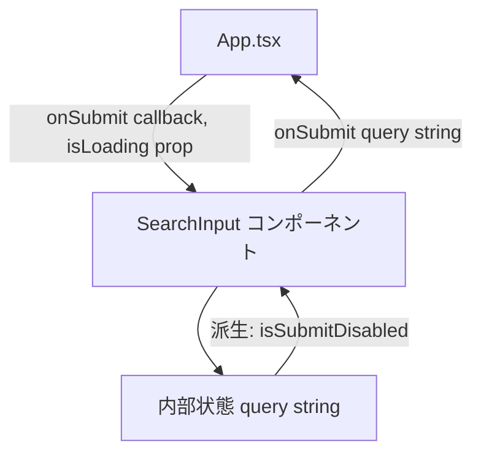
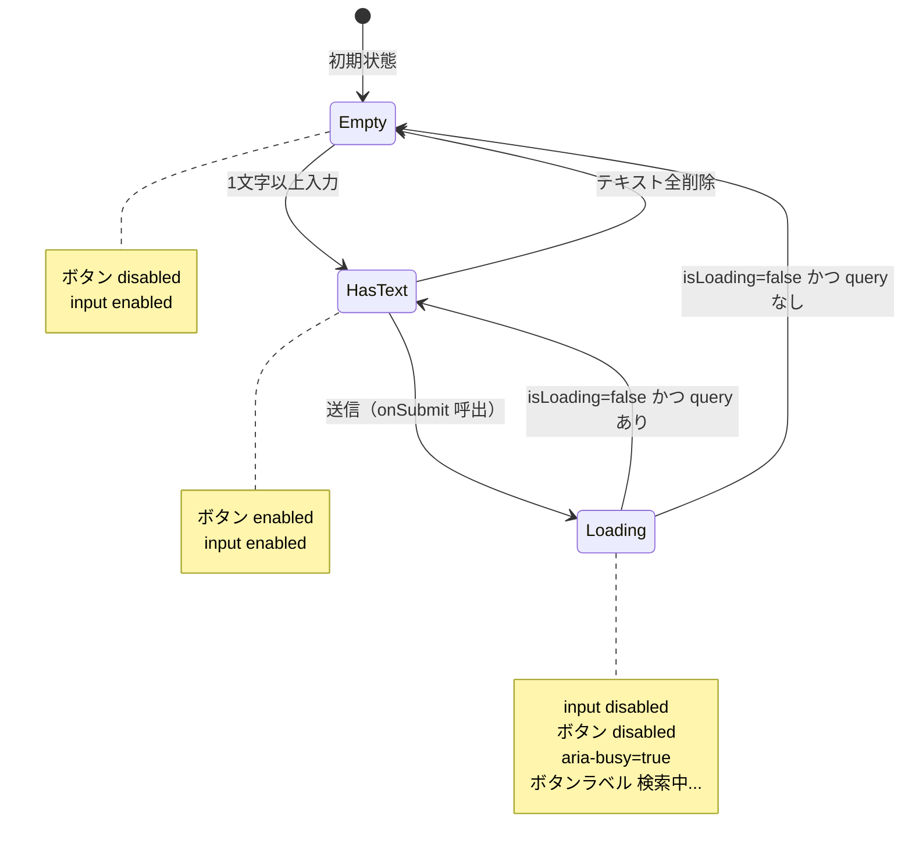

# 技術設計書: SearchInput

## Overview

`SearchInput` は、ユーザーが自然文でレストラン検索条件を入力するフォームコンポーネントである。テキスト入力フィールドと送信ボタンで構成され、入力値のバリデーション・ローディング状態の制御・親コンポーネントへのコールバック通知を担う。

**利用者**: フロントエンド開発者がこのコンポーネントを `App.tsx` に組み込み、`onSubmit` コールバックを通じて検索クエリを取得する。

**影響**: `frontend/src/components/` ディレクトリを新設し、プロジェクト初の React コンポーネントテストパターン（`@testing-library/react` + `fireEvent`）を確立する。

### Goals

- 自然文入力フィールドと送信ボタンを持つアクセシブルなフォームコンポーネントを提供する
- 空入力・ローディング中の誤送信を防ぐ制御ロジックを実装する
- TypeScript strict モード準拠の明確な Props インターフェースを定義する

### Non-Goals

- 入力サジェスト・オートコンプリート機能（将来の Chunk で検討）
- スタイリングフレームワーク（Tailwind 等）の導入（プロジェクト未導入のため対象外）
- `App.tsx` への統合（Chunk 10 のスコープ）
- 送信後の入力クリア（App.tsx の責務）

---

## Requirements Traceability

| 要件 | サマリー | コンポーネント | インターフェース | フロー |
|------|---------|--------------|--------------|------|
| 1.1 | `input[type=text]` 表示 | SearchInput | HTML 要素 | - |
| 1.2 | `button` 表示 | SearchInput | HTML 要素 | - |
| 1.3 | リアルタイム入力反映 | SearchInput | `onChange → useState` | - |
| 1.4 | placeholder 表示 | SearchInput | `placeholder` 属性 | - |
| 2.1 | 空/空白時 button disabled | SearchInput | `isSubmitDisabled` 派生値 | Empty state |
| 2.2 | 有効文字入力時 button enabled | SearchInput | `isSubmitDisabled` 派生値 | HasText state |
| 2.3 | 全削除時 button disabled | SearchInput | `isSubmitDisabled` 派生値 | Empty state |
| 2.4 | 空白のみ button disabled | SearchInput | `trim()` チェック | Empty state |
| 3.1 | `isLoading=true` 時 input disabled | SearchInput | `isLoading` prop | Loading state |
| 3.2 | `isLoading=true` 時 button disabled | SearchInput | `isSubmitDisabled` | Loading state |
| 3.3 | `isLoading=false` で状態復元 | SearchInput | `isLoading` prop（反応的） | HasText/Empty state |
| 3.4 | `isLoading` オプション（デフォルト `false`） | SearchInput | `isLoading?: boolean` | - |
| 4.1 | ボタンクリック → `onSubmit` 呼出 | SearchInput | `button onClick` | - |
| 4.2 | Enter キー → `onSubmit` 呼出 | SearchInput | `form onSubmit` | - |
| 4.3 | `onSubmit` 必須 Props | SearchInput | `SearchInputProps` | - |
| 4.4 | disabled 時 `onSubmit` 呼出禁止 | SearchInput | ガード条件 | - |
| 4.5 | `isLoading` 時 `onSubmit` 呼出禁止 | SearchInput | ガード条件 | - |
| 5.1 | Props インターフェース定義 | SearchInput | `SearchInputProps` 型 | - |
| 5.2 | TypeScript strict 準拠 | SearchInput | `any` 禁止、strict mode | - |
| 5.3 | 関数コンポーネント | SearchInput | React FC パターン | - |
| 6.1 | input に `aria-label` | SearchInput | `aria-label` 属性 | - |
| 6.2 | ボタンラベルテキスト（「探す」） | SearchInput | ボタン内テキスト | - |
| 6.3 | ローディング中の視覚・セマンティック表示 | SearchInput | `aria-busy` + ラベル変更 | Loading state |

---

## Architecture

### Architecture Pattern & Boundary Map



**Architecture Integration**:
- 選択パターン: Controlled Component（React 標準フォームパターン）。`input` の値を `useState` で管理し、派生値として `isSubmitDisabled` を計算する。
- 境界: SearchInput は入力状態を自己管理し、確定されたクエリのみ `onSubmit` を通じて外部へ通知する。
- 既存パターン踏襲: 相対 import、PascalCase ファイル名（steering 規約）。
- 新規コンポーネントの根拠: App.tsx との責務分離により単体テストを可能にする（gap-analysis.md Option B 採用）。

### Technology Stack

| レイヤー | 選択 / バージョン | 役割 | 備考 |
|---------|----------------|------|------|
| Frontend | React 19 + TypeScript 5 | UIコンポーネント実装 | strict モード必須、`any` 禁止 |
| Test | Vitest 3 + jsdom + @testing-library/react 16 | コンポーネント単体テスト | `fireEvent` 使用（`user-event` 未導入）|
| Style | プレーン CSS / インラインスタイル | 最小限のスタイリング | CSS フレームワーク未導入のため |

---

## System Flows



ローディング状態は外部（App.tsx）から `isLoading` prop として注入され、コンポーネント内部で `disabled` 属性と `aria-busy` に変換される。送信後のクエリクリアは App.tsx の責務であり SearchInput のスコープ外である。

---

## Components and Interfaces

| コンポーネント | ドメイン/レイヤー | 役割 | 要件カバレッジ | 主要依存 (P0/P1) | コントラクト |
|--------------|----------------|------|--------------|----------------|------------|
| SearchInput | UI / Presentation | フォーム入力・送信制御 | 1.1–6.3 全件 | App.tsx (P0), react (P0) | State |

### UI / Presentation

#### SearchInput

| フィールド | 詳細 |
|-----------|------|
| Intent | 自然文クエリの入力・バリデーション・親コンポーネントへのコールバック通知 |
| Requirements | 1.1, 1.2, 1.3, 1.4, 2.1, 2.2, 2.3, 2.4, 3.1, 3.2, 3.3, 3.4, 4.1, 4.2, 4.3, 4.4, 4.5, 5.1, 5.2, 5.3, 6.1, 6.2, 6.3 |

**Responsibilities & Constraints**

- テキスト入力値を `useState<string>` で管理する（Controlled Component）
- `query.trim() === ''` または `isLoading === true` の場合に送信・入力を無効化する
- `onSubmit` の呼出時にガード条件（`isSubmitDisabled`）を確認する
- 送信後の入力クリアはスコープ外（App.tsx が管理）

**Dependencies**

- Inbound: `App.tsx` — `onSubmit` コールバックおよび `isLoading` を Props として注入（P0）
- External: `react` — `useState`, FC パターン（P0）

**Contracts**: State [x]

##### State Management

Props インターフェース:

```typescript
interface SearchInputProps {
  onSubmit: (query: string) => void;
  isLoading?: boolean;  // デフォルト: false
}
```

内部状態と派生値:

- 内部状態: `query: string`（`useState<string>('')` で管理）
- 派生値: `isSubmitDisabled: boolean = query.trim() === '' || (isLoading ?? false)`

状態の説明:
- **永続化**: コンポーネントローカル状態のみ。外部ストアなし。
- **整合性**: `isLoading=true` 中はイベントハンドラのガード条件によって重複 `onSubmit` 呼出を防止する。
- **並行戦略**: `isLoading` prop の変化に対してリアクティブに再レンダリングする（React の通常の再レンダリングサイクル）。

**Implementation Notes**

- **Integration**: `App.tsx` から `import SearchInput from './components/SearchInput'` でインポートする。`SearchInputProps` 型をコンポーネントファイルから名前付きエクスポートする。
- **Validation**: クライアント側バリデーションは `trim()` による空白チェックのみ。深い検証はバックエンドの責務。
- **Risks**: `@testing-library/user-event` 未導入のため、テストは `fireEvent` で実施する（`research.md` の「Design Decision: テストは fireEvent を使用する」参照）。

---

## Data Models

### Domain Model

エンティティなし（ステートレスなフォームコンポーネント）。

- 値オブジェクト: `query: string`（入力テキスト、コンポーネントローカル）
- 外部値: `isLoading: boolean`（App.tsx から注入、読み取り専用）

### Data Contracts & Integration

**Props（コンポーネント境界）**:

| Prop | 型 | 必須 | デフォルト | 説明 |
|------|----|------|-----------|------|
| `onSubmit` | `(query: string) => void` | ✓ | - | 送信時に呼ばれるコールバック。引数は現在の入力値（trim 前の文字列）。 |
| `isLoading` | `boolean` | - | `false` | API リクエスト処理中を示すフラグ。`true` の間、input と button を disabled にする。 |

---

## Error Handling

### Error Strategy

コンポーネント境界でのエラー処理は最小限とする。入力バリデーションは `isSubmitDisabled` による操作禁止で実装し、エラーメッセージの表示は不要。

### Error Categories and Responses

- **User Errors**: 空入力・空白のみ → `isSubmitDisabled=true` によりボタン disabled（エラーメッセージ不要）
- **System Errors**: `onSubmit` コールバック内でのエラーは親コンポーネント（App.tsx）が管理する。SearchInput はエラー状態を持たず、エラー表示も行わない。

---

## Testing Strategy

### Unit Tests

コンポーネントの表示・状態に関するテスト（`@testing-library/react` + `fireEvent`）:

1. 初期表示: `input[type=text]` と `button` が描画される
2. 空入力時: button が `disabled` 属性を持つ
3. 1文字以上入力時: button が `disabled` でなくなる
4. 空白のみ入力時: button が `disabled` を維持する
5. 全削除後: button が再び `disabled` になる

### Integration Tests

コールバックと Props 連携のテスト:

1. ボタンクリック: `onSubmit` が入力値を引数として呼ばれる
2. Enter キー: フォーム送信により `onSubmit` が呼ばれる
3. `isLoading=true`: `input` と `button` の両方が `disabled`
4. `isLoading=true` 時にボタンクリック: `onSubmit` が呼ばれない
5. `isLoading=false` 復帰: 入力がある場合、button が `enabled` に戻る

### Accessibility Tests

1. `aria-label`: `input` に `aria-label` 属性が設定されている
2. ローディング中: `aria-busy="true"` が付与されている（またはボタンラベルが「検索中...」に変わる）

---

## Security Considerations

フォームから送信されたクエリ文字列はバックエンドが検証・サニタイズする。コンポーネント側では `trim()` のみを行い、XSS リスクのある処理（`dangerouslySetInnerHTML` 等）は使用しない。
