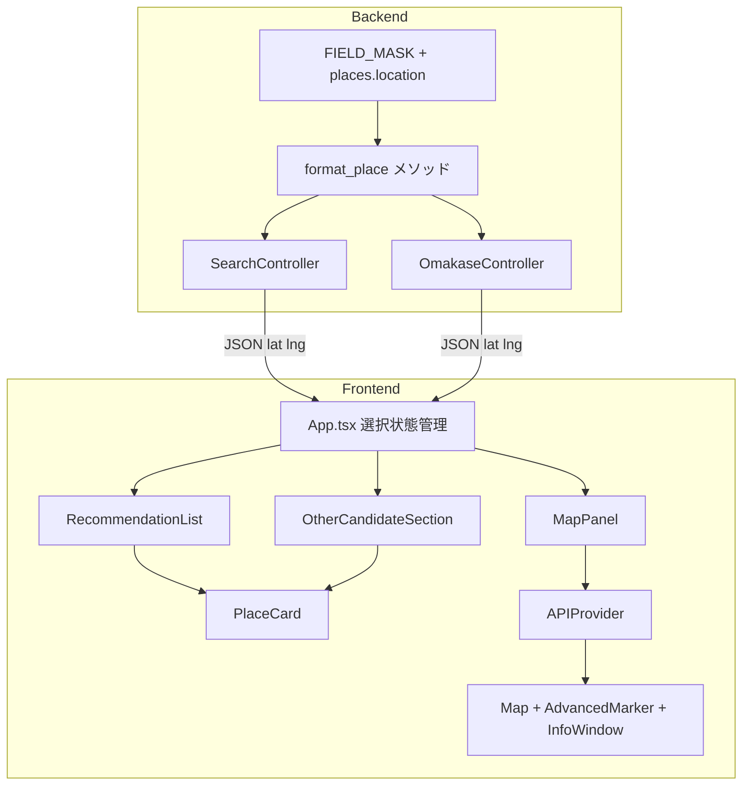
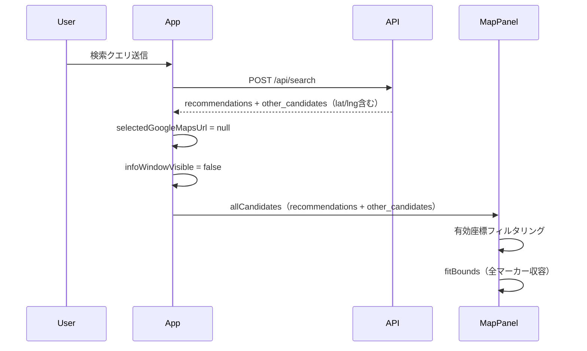
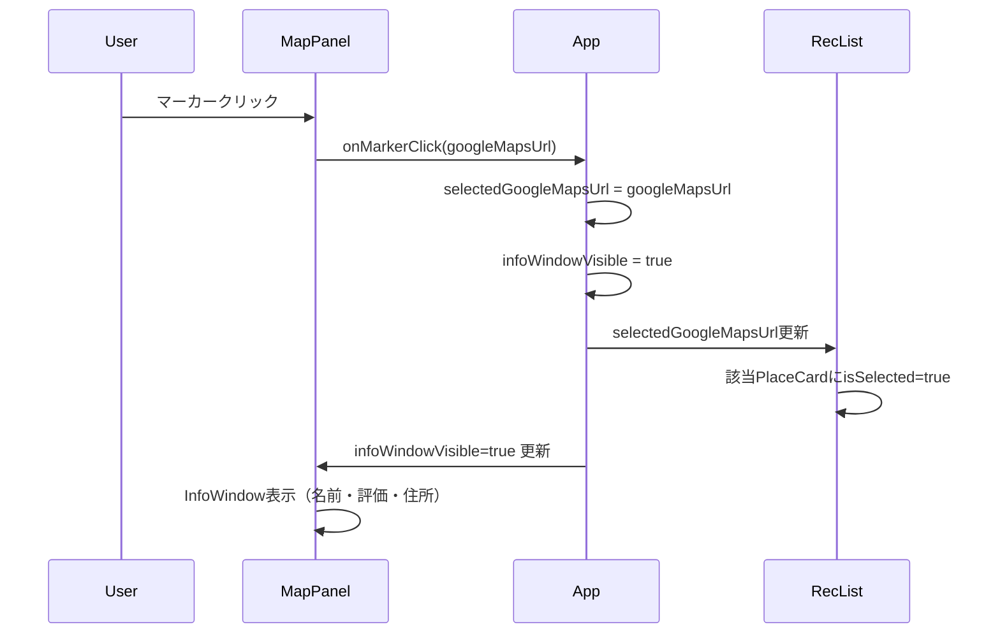
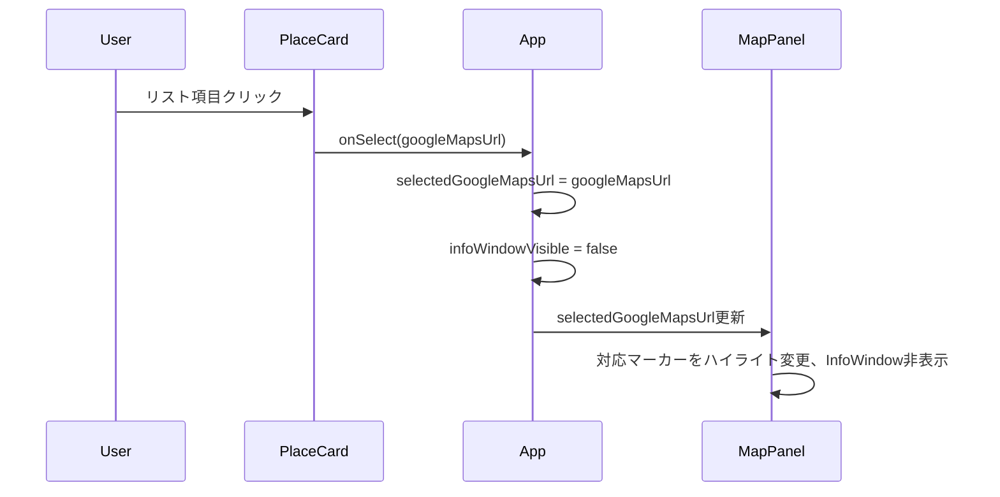

# 設計ドキュメント: search-result-map

## Overview

`search-result-map`機能は、デスクトップ向け検索結果画面にGoogle Mapsを統合し、ヒットした全店舗を地図上のマーカーで表示する。ユーザーはリスト項目と地図マーカーを相互クリックしてハイライト同期でき、マーカークリックでInfoWindow（店舗名・評価・住所）を確認できる。バックエンドはGoogle Places APIのレスポンスに座標情報（`lat`/`lng`）を追加して提供する。

本機能はバックエンドとフロントエンドの2層にわたる拡張機能である。バックエンドは`GooglePlacesService`の`FIELD_MASK`と`format_place`を小修正し、フロントエンドは型定義・レイアウト・新規`MapPanel`コンポーネント・双方向選択状態管理を追加する。既存のリスト表示ロジックは選択状態propsの注入という最小限の変更にとどめ、破壊的変更を避ける。

### Goals

- `/api/search`・`/api/omakase`のレスポンスに各候補の`lat`/`lng`座標を含める
- PCデスクトップで検索結果リスト（左）と地図パネル（右）の2カラムレイアウトを実現する
- 有効座標を持つ全候補のマーカーを地図上に表示し、全マーカーが収まるようにビューポートを調整する
- リスト↔マーカー間の双方向選択ハイライトを実現する（識別子: `google_maps_url`）
- マーカークリック時に店舗名・評価・住所を含むInfoWindowを表示する

### Non-Goals

- 地図上からの新規検索・絞り込み
- 経路案内・ルート表示
- マーカークラスタリング
- モバイル・レスポンシブ対応
- `PlaceCard`の既存表示ロジック（名前・評価・住所・価格帯表示）の変更
- `RecommendationService`の変更

---

## Boundary Commitments

### This Spec Owns

- Google Places API `places.location`フィールドの取得（FIELD_MASK変更）
- `format_place`メソッドへの`lat`/`lng`フィールド出力
- フロントエンドの`Candidate`型への`lat: number | null`・`lng: number | null`追加
- デスクトップ向け2カラムレイアウトの表示条件制御（`App.tsx`）
- `MapPanel`コンポーネント（マーカー表示・InfoWindow・エラー表示・fitBounds）
- 選択状態（`selectedGoogleMapsUrl`・`infoWindowVisible`）のApp.tsx管理
- `PlaceCard`への`isSelected`・`onSelect` propsの追加
- `RecommendationList`・`OtherCandidateSection`への選択状態propsの伝播
- `OtherCandidateSection`のother-candidate選択時の自動展開
- Maps APIキー（`VITE_GOOGLE_MAPS_API_KEY`）・MapId（`VITE_GOOGLE_MAPS_MAP_ID`）の環境変数定義

### Out of Boundary

- `PlaceCard`の既存表示ロジック（ハイライトスタイル追加のみ許容）
- マーカークラスタリング実装
- モバイル・レスポンシブ対応
- Google Cloudプロジェクト設定・APIキーのHTTP referrer制限（Google Cloud Console手動作業）
- `RecommendationService`の変更（LLMプロンプトへの座標送出はスコープ外）
- データベース変更

### Allowed Dependencies

- 既存: `GooglePlacesService`（修正対象）
- 既存: `Candidate`型、`RecommendationList`、`OtherCandidateSection`、`PlaceCard`（修正対象）
- 新規: `@vis.gl/react-google-maps` ~1.x（Google公式ReactラッパーライブラリでReact 19対応）
- 既存: Tailwind CSS v4（レイアウト・ハイライトスタイリング）
- 既存: Vitest + Testing Library（テスト）

### Revalidation Triggers

- `Candidate`型への`lat`/`lng`追加は`Candidate`を利用する全コンポーネント・テストに影響する（TypeScriptコンパイルで検出可能）
- `format_place`出力スキーマ変更は、バックエンドのモックデータを参照する全テストで更新が必要
- `RecommendationList`・`OtherCandidateSection`の新規propsは既存テストのprops型チェックに影響する
- `docker-compose.yml`への`VITE_GOOGLE_MAPS_API_KEY`・`VITE_GOOGLE_MAPS_MAP_ID`追加は環境構築手順の変更を要する

---

## Architecture

### Existing Architecture Analysis

フロントエンドはシンプルなフラットコンポーネント構成で、`App.tsx`が全検索状態（`recommendations`・`otherCandidates`等）を保持し、`RecommendationList`・`OtherCandidateSection`・`PlaceCard`がPresentational Componentとして機能する。バックエンドはService Objectパターンで`GooglePlacesService`がPlaces APIを呼び出し、コントローラーが`render json:`で結果をそのまま返す。

現状の制約:
- `App.tsx`は`max-w-3xl mx-auto`の単一カラムレイアウト（変更が必要）
- `Candidate`型に座標フィールドなし（拡張が必要）
- `OtherCandidateSection`は初期状態で折りたたまれている（マーカー連動のために自動展開が必要）
- フロントエンドにGoogle Mapsライブラリ未導入

### Architecture Pattern & Boundary Map



**アーキテクチャ統合**:
- **選択パターン**: `selectedGoogleMapsUrl: string | null`（App.tsx）を全リスト・MapPanelに流下させ、`google_maps_url`を一意識別子として双方向選択を実現
- **地図統合パターン**: `MapPanel`が`APIProvider`・`Map`・マーカー・InfoWindowを完全カプセル化。`App.tsx`はpropsのみで制御し、地図ライフサイクルから分離される
- **既存パターン維持**: Service Objectパターン（バックエンド）・Presentationalコンポーネント+App.tsx中央集権型状態管理（フロントエンド）
- **ステアリング準拠**: TypeScript strictモード（`any`不使用）、単一責任、疎結合

### Technology Stack

| レイヤー | 選択 / バージョン | 本機能での役割 | 備考 |
|---|---|---|---|
| Frontend | `@vis.gl/react-google-maps` ~1.x | `APIProvider`・`Map`・`AdvancedMarker`・`InfoWindow`提供 | Google/vis.gl公式、React 19対応 |
| Frontend | Tailwind CSS v4 | 2カラムレイアウト・ハイライトスタイリング | 既存スタック |
| Frontend Env | `VITE_GOOGLE_MAPS_API_KEY` | Maps JS APIキーのビルド時埋め込み | docker-compose.ymlに追加 |
| Frontend Env | `VITE_GOOGLE_MAPS_MAP_ID` | AdvancedMarker使用のためのMap ID | Google Cloud Consoleで無償作成 |
| Backend | Google Places API `places.location` | 座標取得（`location.latitude`/`location.longitude`） | 既存FIELD_MASKへの追加 |

---

## File Structure Plan

### Directory Structure

```
backend/
└── app/
    └── services/
        └── google_places_service.rb    # FIELD_MASK に places.location 追加、format_place に lat/lng 追加

frontend/
└── src/
    ├── types/
    │   └── search.ts                   # Candidate 型に lat/lng フィールド追加
    ├── components/
    │   ├── MapPanel.tsx                # 新規: Google Maps パネル全体のカプセル化
    │   ├── PlaceCard.tsx               # isSelected・onSelect props 追加
    │   ├── RecommendationList.tsx      # selectedGoogleMapsUrl・onSelect props 追加
    │   └── OtherCandidateSection.tsx   # selectedGoogleMapsUrl・onSelect・isExpanded・onExpandChange props 追加
    └── App.tsx                         # selectedGoogleMapsUrl・infoWindowVisible state追加、2カラムレイアウト、MapPanel組み込み
```

### Modified Files

- `backend/app/services/google_places_service.rb` — `FIELD_MASK`に`places.location`追加、`format_place`に`lat: place.dig("location", "latitude")`・`lng: place.dig("location", "longitude")`追加
- `backend/spec/services/google_places_service_spec.rb` — `format_place`テストに`lat`/`lng`フィールドを追加（正常系・nil系の両方）
- `backend/spec/requests/api/search_spec.rb` — プレイスモックデータに`lat`/`lng`追加
- `backend/spec/requests/api/omakase_spec.rb` — 同上
- `frontend/src/types/search.ts` — `Candidate`型に`lat: number | null`・`lng: number | null`を追加
- `frontend/src/components/PlaceCard.tsx` — `isSelected?: boolean`・`onSelect?: () => void`追加、`isSelected`時のTailwindハイライト条件付き適用
- `frontend/src/components/RecommendationList.tsx` — `selectedGoogleMapsUrl: string | null`・`onSelect: (url: string) => void`追加、各PlaceCardに伝播
- `frontend/src/components/OtherCandidateSection.tsx` — `selectedGoogleMapsUrl`・`onSelect`・`isExpanded`・`onExpandChange`追加
- `frontend/src/App.tsx` — `selectedGoogleMapsUrl`・`infoWindowVisible`state追加、検索結果あり時の2カラムレイアウト、`MapPanel`組み込み
- `frontend/package.json` / `pnpm-lock.yaml` — `@vis.gl/react-google-maps`追加
- `docker-compose.yml` — frontendサービスの`environment`に`VITE_GOOGLE_MAPS_API_KEY`・`VITE_GOOGLE_MAPS_MAP_ID`追加

---

## System Flows

### 検索→地図描画フロー



### マーカークリック→InfoWindow + 双方向ハイライトフロー



### リストクリック→マーカーハイライトフロー



---

## Requirements Traceability

| 要件 | サマリー | コンポーネント | インターフェース | フロー |
|---|---|---|---|---|
| 1.1 | /api/searchレスポンスにlat/lng | GooglePlacesService, Candidate型 | format_placeハッシュ出力 | 検索→地図描画 |
| 1.2 | /api/omakaseレスポンスにlat/lng | GooglePlacesService, Candidate型 | format_placeハッシュ出力 | 検索→地図描画 |
| 1.3 | 座標取得不可時にnull返却 | GooglePlacesService | `place.dig()`のnil安全アクセス | — |
| 2.1 | 2カラムレイアウト | App.tsx | 結果あり時のflex分岐 | 検索→地図描画 |
| 2.2 | 初期状態は地図非表示 | App.tsx | `recommendations === null`条件 | — |
| 2.3 | 0件時は地図非表示 | App.tsx | `recommendations.length === 0`条件 | — |
| 2.4 | デスクトップ専用 | App.tsx | レスポンシブクラス不使用 | — |
| 3.1 | 全マーカー表示 | MapPanel | `candidates`prop（lat/lng非nullフィルタ後） | 検索→地図描画 |
| 3.2 | ビューポート自動調整 | MapPanel | `fitBounds(LatLngBounds)` | 検索→地図描画 |
| 3.3 | null座標候補を除外 | MapPanel | `candidates.filter(c => c.lat !== null && c.lng !== null)` | — |
| 4.1 | リストクリック→マーカーハイライト | PlaceCard, MapPanel | `onSelect`, `selectedGoogleMapsUrl` | リストクリックフロー |
| 4.2 | マーカークリック→リストハイライト | MapPanel, PlaceCard | `onMarkerClick`, `isSelected` | マーカークリックフロー |
| 4.3 | 選択切替時に旧ハイライト解除 | App.tsx | `selectedGoogleMapsUrl`差し替え | 両フロー |
| 4.4 | 同時選択は常に1件 | App.tsx | `selectedGoogleMapsUrl: string \| null` | 両フロー |
| 5.1 | マーカークリック→InfoWindow | MapPanel | `infoWindowVisible`, InfoWindow | マーカークリックフロー |
| 5.2 | 別マーカークリック→InfoWindow切替 | MapPanel | 新`selectedGoogleMapsUrl`でInfoWindow更新 | マーカークリックフロー |
| 5.3 | InfoWindow閉じる→選択維持 | App.tsx, MapPanel | `onInfoWindowClose`: `infoWindowVisible=false`のみ | — |
| 6.1 | Maps API失敗→エラーメッセージ | MapPanel | `useApiLoadingStatus() === 'FAILED'` | — |
| 6.2 | Maps API失敗→リスト継続表示 | App.tsx | MapPanelはリストと独立 | — |

---

## Components and Interfaces

### コンポーネントサマリー

| コンポーネント | ドメイン/レイヤー | 責務 | 要件カバレッジ | 主要依存 | コントラクト |
|---|---|---|---|---|---|
| GooglePlacesService | Backend / Service | Places APIからlat/lngを取得しformat_placeで出力 | 1.1, 1.2, 1.3 | Google Places API (P0) | API |
| MapPanel | Frontend / UI | Google Maps統合・マーカー・InfoWindow・エラー表示・fitBounds | 3.1-3.3, 4.1-4.4, 5.1-5.3, 6.1, 6.2 | @vis.gl/react-google-maps (P0) | State |
| App.tsx | Frontend / Orchestration | 選択状態管理・2カラムレイアウト制御 | 2.1-2.4, 4.3, 4.4, 5.3, 6.2 | MapPanel, RecList (P0) | State |
| Candidate型 | Frontend / Types | lat/lngフィールドを持つ候補データ型 | 1.1, 1.2, 1.3 | — | — |
| PlaceCard | Frontend / UI | ハイライトスタイルの条件付き適用 | 4.1, 4.2 | — | — |
| RecommendationList | Frontend / UI | 選択状態をPlaceCardへ伝播 | 4.1, 4.2, 4.3 | PlaceCard (P0) | — |
| OtherCandidateSection | Frontend / UI | 選択状態をPlaceCardへ伝播・other候補選択時の自動展開 | 4.1, 4.2, 4.3 | PlaceCard (P0) | — |

### Backend / Service

#### GooglePlacesService

| フィールド | 詳細 |
|---|---|
| Intent | Google Places APIのtextSearch結果を`{name, rating, price_level, address, google_maps_url, lat, lng}`形式に変換する |
| 要件 | 1.1, 1.2, 1.3 |

**責務と制約**
- `FIELD_MASK`定数に`places.location`を追加し、APIレスポンスの`location.latitude`/`location.longitude`を取得する
- `format_place`の出力ハッシュに`lat`（`place.dig("location", "latitude")`）と`lng`（`place.dig("location", "longitude")`）を追加する
- `place.dig()`はキー不在時に`nil`を返すため、Googleが座標を返さない場合の要件1.3を満たす
- `RecommendationService`が`slice(:name, :rating, :price_level, :address)`でLLM送信フィールドを絞るため`lat`/`lng`はLLMプロンプトに混入しない

**依存**
- 外部: Google Places API `searchText`エンドポイント（P0）— `places.location`フィールドの追加取得

**コントラクト**: API [x]

##### API Contract

`format_place`メソッドの出力スキーマ変更:

| フィールド | 型 | 変更 |
|---|---|---|
| `name` | `String` | 変更なし |
| `rating` | `Float \| nil` | 変更なし |
| `price_level` | `String \| nil` | 変更なし |
| `address` | `String` | 変更なし |
| `google_maps_url` | `String` | 変更なし |
| `lat` | `Float \| nil` | **追加** |
| `lng` | `Float \| nil` | **追加** |

**実装ノート**
- `place.dig("location", "latitude")` / `place.dig("location", "longitude")`で安全にアクセス
- コントローラーは`render json:`でハッシュをそのまま返すため変更不要

### Frontend / Types

#### Candidate型（`src/types/search.ts`）

`lat: number | null`と`lng: number | null`を既存`Candidate`型に追加する。`Recommendation`（`Candidate`の拡張）と`OtherCandidate`（エイリアス）は型拡張によって自動継承する。

```typescript
type Candidate = {
  name: string;
  rating: number | null;
  price_level: string | null;
  address: string;
  google_maps_url: string;
  lat: number | null;  // 追加
  lng: number | null;  // 追加
};
```

### Frontend / UI

#### MapPanel（`src/components/MapPanel.tsx`）

| フィールド | 詳細 |
|---|---|
| Intent | Google Mapsの統合をカプセル化し、マーカー・InfoWindow・エラー表示・fitBoundsを管理する |
| 要件 | 3.1, 3.2, 3.3, 4.1, 4.2, 4.3, 4.4, 5.1, 5.2, 5.3, 6.1, 6.2 |

**責務と制約**
- `APIProvider`でGoogle Maps JSの読み込みを管理し、`useApiLoadingStatus()`に応じてエラー/マップを切り替える
- 有効座標（`lat`/`lng`非null）を持つ候補のみマーカーを描画する（3.3）
- `candidates` propが変化したとき`fitBounds`で全マーカーが収まるようビューポートを調整する（3.2）
- `selectedGoogleMapsUrl`と一致するマーカーは`PinElement`の`background`色を変更して視覚的に区別する（4.1, 4.2）
- `infoWindowVisible`がtrueかつ`selectedGoogleMapsUrl`が非nullの場合にInfoWindowを表示する（5.1, 5.2）
- `onInfoWindowClose`はInfoWindowのみ閉じ、選択状態を変更しない（5.3）
- Maps API読み込み失敗時は地図エリア全体にエラーdivを表示する（6.1）

**依存**
- 外部: `@vis.gl/react-google-maps`（APIProvider、Map、AdvancedMarker、PinElement、InfoWindow） (P0)
- 受信: App.tsx — candidates、selectedGoogleMapsUrl、infoWindowVisible、onMarkerClick、onInfoWindowClose (P0)
- 外部: `VITE_GOOGLE_MAPS_API_KEY`・`VITE_GOOGLE_MAPS_MAP_ID`環境変数（ビルド時埋め込み） (P0)

**コントラクト**: State [x]

##### State Management

```typescript
interface MapPanelProps {
  candidates: Candidate[];
  selectedGoogleMapsUrl: string | null;
  infoWindowVisible: boolean;
  onMarkerClick: (googleMapsUrl: string) => void;
  onInfoWindowClose: () => void;
}
```

内部状態:
- `useApiLoadingStatus()`: `'LOADING' | 'LOADED' | 'FAILED' | 'NOT_LOADED'` — API読み込み状態（選択状態・InfoWindow表示はすべてprops経由）

**実装ノート**
- **2層コンポーネント構造（必須）**: `useApiLoadingStatus()` は `APIProvider` の子コンポーネント内でのみ有効なため、`MapPanel` を以下の2層に分割する。
  - `MapPanel`（外側）: `APIProvider` を返すだけの薄いラッパー
  - `MapPanelContent`（内側）: `APIProvider` 内でレンダーされ、`useApiLoadingStatus()` の呼び出し・マーカー・InfoWindow・エラー表示を担う
  - `MapPanel` は全 props を `MapPanelContent` にそのまま渡す
- **mapId必須**: `Map`コンポーネントに`mapId={import.meta.env.VITE_GOOGLE_MAPS_MAP_ID}`を渡す。`AdvancedMarker`はmapIdなしで描画されない。Map IDはGoogle Cloud Consoleで無償作成
- **fitBounds**: `useMap()`で取得したマップインスタンスに対し`useEffect([map, candidates])`で実行。有効候補が1件の場合は過度なズームを防ぐため`map.setCenter()`+`map.setZoom(15)`を使用。**有効座標を持つ候補が0件の場合は`fitBounds`をスキップし、地図をデフォルト表示のまま維持する**（`if (validCandidates.length === 0) return;`でガード）
- **AdvancedMarker/PinElement**: `PinElement`の`background`prop — 選択時`'#FF6B35'`、非選択時はデフォルト
- **InfoWindow配置**: 選択マーカーの座標にInfoWindowをpositionとして配置。名前・評価（nullの場合は非表示）・住所を表示
- **エラー表示**: `MapPanelContent`内で`useApiLoadingStatus() === 'FAILED'`の場合、高さと幅が親要素いっぱいのdivにエラーメッセージを表示

#### App.tsx修正

| フィールド | 詳細 |
|---|---|
| Intent | 選択状態を管理し、2カラムレイアウトの表示条件を制御する |
| 要件 | 2.1, 2.2, 2.3, 2.4, 4.3, 4.4, 5.3, 6.2 |

**責務と制約**
- `selectedGoogleMapsUrl: string | null`と`infoWindowVisible: boolean`をstateとして保持する
- 検索実行時に`selectedGoogleMapsUrl`を`null`・`infoWindowVisible`を`false`にリセットする
- `recommendations !== null && recommendations.length > 0`の場合のみ2カラムレイアウトを適用する（2.2, 2.3）
- `MapPanel`に渡す`candidates`は`recommendations`と`otherCandidates`を結合したフラット配列とする

**ハンドラー定義**:

```typescript
// リストクリック: 選択更新、InfoWindow閉じる
const handleListSelect = (googleMapsUrl: string): void => {
  setSelectedGoogleMapsUrl(googleMapsUrl);
  setInfoWindowVisible(false);
};

// マーカークリック: 選択更新、InfoWindow開く
const handleMarkerClick = (googleMapsUrl: string): void => {
  setSelectedGoogleMapsUrl(googleMapsUrl);
  setInfoWindowVisible(true);
};

// InfoWindow閉じる: 選択状態を変更しない
const handleInfoWindowClose = (): void => {
  setInfoWindowVisible(false);
};
```

**2カラムレイアウト構造**（デスクトップ専用・レスポンシブクラス不使用）:

```
<div className="flex h-screen overflow-hidden">
  <div className="w-1/2 overflow-y-auto p-4">  // 左: 検索UI + リスト（スクロール可）
  <div className="w-1/2 h-full">               // 右: MapPanel（全高固定）
```

**実装ノート**
- `MapPanel`はリストと独立しているため、Maps APIロード失敗時でもリスト表示は継続される（6.2）
- other-candidateが`selectedGoogleMapsUrl`に一致する場合、`OtherCandidateSection`の`isExpanded`を`true`にセットすることで自動展開する

#### PlaceCard修正

`isSelected?: boolean`（ハイライトスタイルの条件付き適用）と`onSelect?: () => void`（クリックハンドラー）を追加する。`isSelected`が`true`の場合にTailwindの`ring-2 ring-orange-400`等のclassを条件付きで適用する。既存の表示ロジックは変更しない。

#### RecommendationList修正

`selectedGoogleMapsUrl: string | null`と`onSelect: (url: string) => void` propsを追加する。各`PlaceCard`に`isSelected={item.google_maps_url === selectedGoogleMapsUrl}`と`onSelect={() => onSelect(item.google_maps_url)}`を渡す。

#### OtherCandidateSection修正

`selectedGoogleMapsUrl: string | null`・`onSelect: (url: string) => void` propsを追加する。既存の `isExpanded: boolean` は維持し、`onExpand: () => void` を `onExpandChange: (expanded: boolean) => void` にリネーム・シグネチャ変更する。

**`onExpand` → `onExpandChange` へのリネーム理由**: マーカー選択によるauto-expand（強制`true`）とユーザー操作によるcollapse（`false`への切り替え）の両方を1つのコールバックで表現するため、真偽値を引数に取る `onExpandChange: (expanded: boolean) => void` に変更する。`() => void` のままでは折りたたみを表現できない。

other候補のマーカーが選択された場合（`selectedGoogleMapsUrl`がother_candidatesのいずれかに一致する場合）、App.tsxから`isExpanded=true`が渡され自動展開される。ユーザーが手動で折りたたむと `onExpandChange(false)` が呼ばれ App.tsx の state が更新されるが、その後も同じother候補が選択中のままであれば App.tsx は再び `isExpanded=true` を渡す（ハイライト対象が非表示になることを防ぐため）。

---

## Data Models

### Data Contracts & Integration

**APIレスポンス変更**（`/api/search` および `/api/omakase`の各候補オブジェクト）:

変更前:
```json
{ "name": "...", "rating": 4.2, "price_level": "PRICE_LEVEL_MODERATE", "address": "...", "google_maps_url": "..." }
```

変更後:
```json
{ "name": "...", "rating": 4.2, "price_level": "PRICE_LEVEL_MODERATE", "address": "...", "google_maps_url": "...", "lat": 35.6812, "lng": 139.7671 }
```

`lat`/`lng`は座標取得不可時に`null`となる。

---

## Error Handling

### Error Strategy

グレースフルデグラデーション: Maps API失敗時でもリスト機能を維持する。座標なし候補はマーカー除外するがリスト表示は継続する。

### Error Categories and Responses

| エラー種別 | 発生箇所 | 対応 |
|---|---|---|
| Google Places API座標なし（1.3） | `format_place` | `lat: nil, lng: nil`で返却（リクエスト失敗させない） |
| Google Maps JS API読み込み失敗（6.1） | `MapPanel` | `useApiLoadingStatus() === 'FAILED'`でエラーdiv表示、リスト継続（6.2） |
| `lat`/`lng` null候補のマーカー除外（3.3） | `MapPanel` | `candidates.filter(c => c.lat !== null && c.lng !== null)`で除外、他マーカーに影響しない |
| `VITE_GOOGLE_MAPS_API_KEY`未設定 | `MapPanel` | Maps APIロード失敗→エラーdiv表示にフォールバック |
| `VITE_GOOGLE_MAPS_MAP_ID`未設定 | `MapPanel` | `AdvancedMarker`が描画されない（マーカーなし状態でmap自体は表示） |

---

## Testing Strategy

### ユニットテスト（バックエンド）

- `GooglePlacesService#format_place`: `location`あり時に`lat`/`lng`が正しい数値で出力されること（1.1, 1.2）
- `GooglePlacesService#format_place`: `location`フィールドなし時に`lat: nil, lng: nil`が出力されること（1.3）

### ユニットテスト（フロントエンド）

- `MapPanel`: `useApiLoadingStatus()`が`'FAILED'`の時、エラーメッセージが表示されること（6.1）
- `PlaceCard`: `isSelected=true`時にハイライトクラスが適用されること（4.1, 4.2）
- `PlaceCard`: `onSelect`クリック時にコールバックが呼ばれること（4.1）

### インテグレーションテスト（バックエンド）

- `POST /api/search`レスポンスの各候補に`lat`/`lng`フィールドが含まれること（1.1）
- `POST /api/omakase`レスポンスの各候補に`lat`/`lng`フィールドが含まれること（1.2）
- 座標なし候補のレスポンスに`lat: null, lng: null`が含まれること（1.3）

### インテグレーションテスト（フロントエンド）

- `RecommendationList`にonSelectを渡し、PlaceCardクリックでonSelectが呼ばれること（4.1）
- `OtherCandidateSection`にonSelectを渡し、PlaceCardクリックでonSelectが呼ばれること（4.1）

### E2Eテスト（UI動作確認）

- 検索結果あり時に2カラムレイアウトが表示されること（2.1）
- 検索前・0件時に地図パネルが非表示であること（2.2, 2.3）
- マーカークリック時にInfoWindowが表示され、リスト項目がハイライトされること（5.1, 4.2）
- InfoWindowの×クリック後にリストのハイライト状態が維持されること（5.3）
- リスト項目クリック後にInfoWindowが表示されないこと（5.1の対比）

---

## Security Considerations

- `VITE_GOOGLE_MAPS_API_KEY`はViteビルドによりJavaScriptバンドルに埋め込まれる（ブラウザ公開）。Google Cloud ConsoleでHTTP referrer制限を設定することを推奨（本スコープ外の手動作業）
