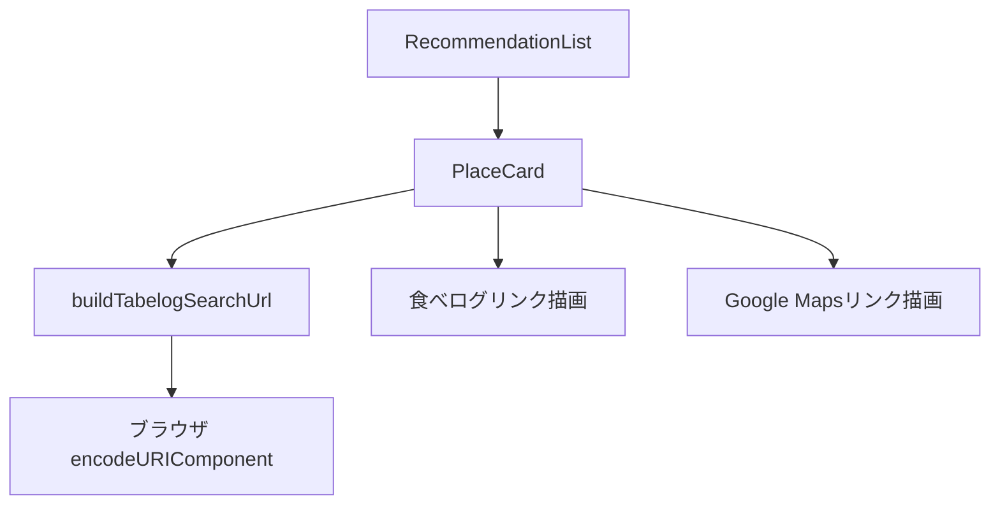

# 技術設計書: 食べログリンク自動生成

## Overview

本機能は、レストラン検索結果の各 `PlaceCard` コンポーネントに「食べログで見る」リンクを追加する。
店名をキーに食べログ新潟の検索 URL を `encodeURIComponent` でクライアントサイド生成し、既存の Google Maps リンクと横並びで表示することで、ユーザーの食べログ確認ワークフローを1クリックに短縮する。

対象ユーザーは新潟市内で夜の店探しをする個人ユーザー。食べログでのブックマーク管理が日常ワークフローに組み込まれているため、本機能との連携が直接的な利便性向上に直結する。

変更対象はフロントエンドの `PlaceCard.tsx` 単一ファイル。バックエンド・型定義・API 通信に変更はない。

### Goals

- 各 PlaceCard に食べログ新潟への検索リンクを1件ずつ表示する
- 店名を `encodeURIComponent` でエンコードした検索 URL を自動生成する
- 既存レイアウトを崩さずに Google Maps リンクと横並び表示する

### Non-Goals

- 食べログの店舗直接リンク（食べログ公式 API の利用）
- 新潟以外のエリア対応
- バックエンドによる URL 生成・保存
- 食べログの評価・口コミデータの取得・表示

---

## Architecture

### Existing Architecture Analysis

`PlaceCard` はプレゼンテーション専用コンポーネントで、`Recommendation` 型の Props（`name`, `rating`, `price_level`, `address`, `google_maps_url`, `reason`）を受け取り表示する。`name` は `string`（非 nullable）として型定義済み。

ファイル内には `formatPriceLevel` という純粋関数が既に定義されており、URL 生成ロジックも同パターンで追加可能。外部サービスや状態管理への依存はない。Google Maps リンクには `target="_blank" rel="noopener noreferrer"` パターンが実装済みであり、食べログリンクでもそのまま踏襲する。

### Architecture Pattern & Boundary Map



- 選択パターン: **コンポーネント内インライン純粋関数**（単一利用・追加ファイル不要）
- 既存パターン踏襲: `target="_blank" + rel="noopener noreferrer"` 属性、`formatPriceLevel` と同様の純粋関数定義
- 新規コンポーネント: なし（`PlaceCard.tsx` 内のみ変更）
- Steering 適合: `src/components/` への配置、推測的抽象化の回避

### Technology Stack

| Layer | Choice / Version | Role | Notes |
|-------|-----------------|------|-------|
| Frontend | TypeScript 5 + React 19 | URL 生成ロジック・リンク描画 | 既存スタック。新規依存なし |
| スタイリング | Tailwind CSS v4 | リンク色・並列レイアウト | 既存スタック。新規クラス追加のみ |
| ブラウザ API | `encodeURIComponent` | 日本語・記号のパーセントエンコード | ブラウザ標準 API。外部ライブラリ不要 |

---

## Requirements Traceability

| 要件 | 概要 | コンポーネント | インターフェース |
|------|------|--------------|----------------|
| 1.1 | PlaceCard に「食べログで見る」リンクを表示 | `PlaceCard` | リンク描画ブロック |
| 1.2 | 他の店舗情報と視覚的に区別（`text-orange-500`） | `PlaceCard` | リンク描画ブロック |
| 1.3 | Google Maps リンクと並列表示・レイアウト崩れなし | `PlaceCard` | リンク描画ブロック |
| 1.4 | 0件時はリンク非表示 | `RecommendationList`（既存） | — |
| 2.1 | `https://tabelog.com/niigata/rstLst/?vs=1&sk={encoded}` の URL 生成 | `PlaceCard` | `buildTabelogSearchUrl` |
| 2.2 | 日本語・スペース・記号の `encodeURIComponent` エンコード | `PlaceCard` | `buildTabelogSearchUrl` |
| 2.3 | `/niigata/` 固定パス | `PlaceCard` | `buildTabelogSearchUrl` |
| 2.4 | 空文字時はリンク非表示（`null` 返却） | `PlaceCard` | `buildTabelogSearchUrl` |
| 3.1 | `target="_blank"` で新タブ開く | `PlaceCard` | リンク描画ブロック |
| 3.2 | `rel="noopener noreferrer"` でセキュリティ確保 | `PlaceCard` | リンク描画ブロック |
| 3.3 | リンクテキスト「食べログで見る」を表示 | `PlaceCard` | リンク描画ブロック |

> 要件 1.4 は `RecommendationList` が空配列時に `PlaceCard` を描画しない既存実装によって構造上満たされる。`PlaceCard` 自身の変更は不要。

---

## Components and Interfaces

| コンポーネント | ドメイン/レイヤー | Intent | 要件カバレッジ | 主要依存 | コントラクト |
|---|---|---|---|---|---|
| `PlaceCard` | UI / Presentation | 店舗情報と外部リンクを表示 | 1.1, 1.2, 1.3, 2.1–2.4, 3.1–3.3 | `Recommendation` 型 (P0) | State |
| `buildTabelogSearchUrl` | UI / ロジック | 店名から食べログ検索 URL を生成 | 2.1, 2.2, 2.3, 2.4 | ブラウザ `encodeURIComponent` (P0) | Service |

### UI / Presentation

#### PlaceCard

| Field | Detail |
|-------|--------|
| Intent | 店舗情報（名称・住所・評価・価格帯・推薦理由）と外部リンク（Google Maps・食べログ）を表示 |
| Requirements | 1.1, 1.2, 1.3, 2.1, 2.2, 2.3, 2.4, 3.1, 3.2, 3.3 |

**Responsibilities & Constraints**

- `buildTabelogSearchUrl(name)` を呼び出して食べログ URL を取得する
- 返却値が `null` の場合は食べログリンク要素を DOM に出力しない（条件付きレンダリング）
- Google Maps リンクと食べログリンクを `div.flex.flex-wrap.gap-3.mt-2` で横並び配置し、要件 1.3 を満たす
- 食べログリンクには `text-orange-500` を使用し、Google Maps リンク（`text-blue-600`）と視覚的に区別する（要件 1.2）

**Dependencies**

- Inbound: `RecommendationList` — PlaceCard をレンダリング（P0）
- Outbound: `buildTabelogSearchUrl` — URL 生成（P0）
- External: ブラウザ `encodeURIComponent` — パーセントエンコード（P0）

**Contracts**: State [x]

##### State Management

- State model: プレゼンテーション専用（ローカル状態なし）
- Persistence & consistency: `name` から派生した URL は純粋関数で算出（副作用なし）
- Concurrency strategy: 非同期処理なし

**Implementation Notes**

- Integration: 既存の `<a href={safeMapsUrl} ...>` を `div.flex.flex-wrap.gap-3.mt-2` で囲み、食べログリンクを隣接配置する。既存の `block mt-2` クラスは div に移動し `<a>` 側からは除去する
- Validation: `buildTabelogSearchUrl` の戻り値が `null` かどうかのチェックのみ（`{tabelogUrl && <a ...>}`）
- Risks: 食べログ URL 形式の仕様変更時は `buildTabelogSearchUrl` 内の定数修正のみで対応可能

---

### UI / ロジック

#### buildTabelogSearchUrl

| Field | Detail |
|-------|--------|
| Intent | 店名を受け取り食べログ新潟検索 URL を生成する。空文字の場合は `null` を返す |
| Requirements | 2.1, 2.2, 2.3, 2.4 |

**Contracts**: Service [x]

##### Service Interface

```typescript
function buildTabelogSearchUrl(name: string): string | null;
```

- Preconditions: `name` は `string` 型（TypeScript 型保証。`undefined` は来ない）
- Postconditions:
  - `name.trim() === ''` → `null` を返す（要件 2.4）
  - `name.trim() !== ''` → `https://tabelog.com/niigata/rstLst/?vs=1&sk=${encodeURIComponent(name.trim())}` を返す（要件 2.1〜2.3）
- Invariants: 返却値は常に `null` または `https://` で始まる文字列

**Implementation Notes**

- Integration: `PlaceCard.tsx` のモジュールスコープで定義（`export` なし）。`formatPriceLevel` と同じ配置パターン
- Validation: `name.trim()` で前後空白を除去してから空文字判定。TypeScript strict モードで `string` 型が保証されるため `undefined` チェックは不要
- Risks: なし（ブラウザ標準 API のみ使用）

---

## Error Handling

### Error Strategy

本機能に例外を発生させるパスはない。すべてのエラーケースは条件分岐で吸収する。

### Error Categories and Responses

| カテゴリ | 条件 | 対応 |
|---------|------|------|
| 空文字入力 | `name.trim() === ''` | `buildTabelogSearchUrl` が `null` を返す → リンク非表示 |
| 0件検索結果 | `recommendations` 配列が空 | `RecommendationList` が `PlaceCard` を描画しない（既存実装） |
| 不正 URL（Google Maps） | `google_maps_url` が `https://` で始まらない | 既存の `safeMapsUrl` ロジックが `#` にフォールバック（食べログ URL は自身で生成するため非該当） |

---

## Testing Strategy

### Unit Tests（`PlaceCard.test.tsx` への追加）

1. `name` が通常文字列の場合、「食べログで見る」リンクが表示される
2. `name` が空文字 `''` の場合、食べログリンクが表示されない
3. `name` が空白のみ `'   '` の場合、食べログリンクが表示されない
4. 食べログリンクに `target="_blank"` が付与される
5. 食べログリンクに `rel="noopener noreferrer"` が付与される
6. 日本語店名が `encodeURIComponent` でエンコードされた URL が href に設定される（例: `居酒屋` → `https://tabelog.com/niigata/rstLst/?vs=1&sk=%E5%B1%85%E9%85%92%E5%B1%8B`）
7. 既存の「Google Mapsで見る」リンクと「食べログで見る」リンクが同時に表示される（要件 1.3）

> 設定ファイルへのテスト追加は行わない。型チェックで十分（プロジェクトのフィードバックメモリ参照）。

---

## Supporting References

- `research.md` — 配置オプション評価（Option A vs. B）、スタイリング方針の詳細
- `gap-analysis.md` — 既存コードの詳細分析、要件フィージビリティ分析
