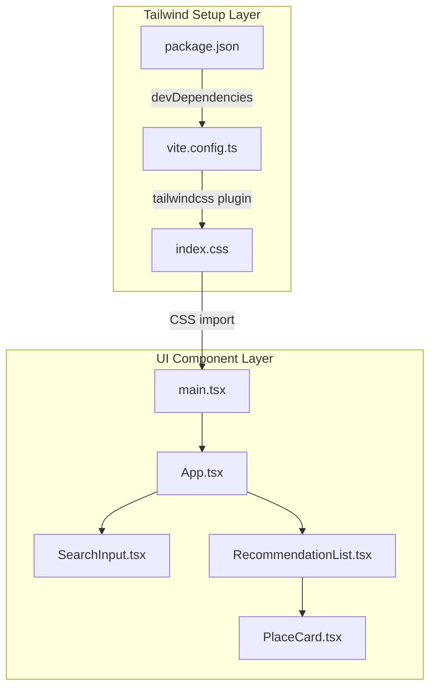

# 技術設計書: tailwind-ui-styling

## Overview

本フィーチャーは、Restaurant Discovery フロントエンドアプリケーションに Tailwind CSS v4 を導入し、全コンポーネントの視覚的スタイリングを完成させる。これによりエンドユーザーは、整ったレイアウト・レスポンシブグリッド・明確な状態表示を持つ完全なUI体験を得る。

現状のコンポーネント群（`App.tsx`・`SearchInput.tsx`・`PlaceCard.tsx`・`RecommendationList.tsx`）はスタイルが未適用のスキャフォールド状態であり、本フィーチャーで Tailwind ユーティリティクラスを追加することでその状態を解消する。コンポーネントのロジック・状態管理・API 連携は一切変更しない。

### Goals

- Tailwind CSS v4 (`@tailwindcss/vite` + `tailwindcss`) を Vite 6 環境に統合する
- 全 UI コンポーネントにユーティリティクラスを適用し、要件のスタイル仕様を満たす
- モバイル・タブレット・デスクトップのレスポンシブデザインを実現する
- 既存のビルド（`pnpm build`）とテスト（`pnpm test --run`）を継続してパスさせる

### Non-Goals

- コンポーネントのロジック・状態管理・API 通信の変更
- 新しい React コンポーネントの追加
- アニメーション・トランジション効果
- ダークモード対応
- カスタム Tailwind テーマ・`tailwind.config.js` の作成
- バックエンドへの変更

---

## Architecture

### Existing Architecture Analysis

フロントエンドは React 19 + TypeScript（strict モード）+ Vite 6 で構成されており、4つのコンポーネントが既存のファイル構造に存在する。`vite.config.ts` には `@vitejs/plugin-react` のみが登録されている。グローバルCSSファイル（`index.css`）は未存在であり、`main.tsx` に CSS インポートは記述されていない。既存の統合境界（Props 型定義・API 層）は変更せずにそのまま保持する。

### Architecture Pattern & Boundary Map

本フィーチャーは**スタイリング拡張パターン**を採用する。既存コンポーネント群に `className` を追加する単方向の変更のみであり、新規のロジック境界・状態管理・外部 API 統合は発生しない。Tailwind CSS は Vite プラグインとして統合され、ビルド時に CSS ユーティリティクラスを生成する。

**Architecture Integration**:
- Selected pattern: スタイリング拡張（既存境界を維持した className 追加）
- Domain boundaries: UI コンポーネント層のみ。ロジック・API 層は不変
- Existing patterns preserved: Props 型定義・状態管理パターン・テスト構造すべて保持
- New components rationale: Tailwind Setup Layer のみ新規（設定ファイル群）
- Steering compliance: TypeScript strict モード維持・疎結合構成維持

### Technology Stack

| Layer | Choice / Version | Role in Feature | Notes |
|-------|------------------|-----------------|-------|
| フロントエンド | React 19 + TypeScript 5 | 既存 UI コンポーネント | 変更なし（className 追加のみ） |
| ビルドツール | Vite 6 | Tailwind プラグインホスト | `plugins` 配列に `tailwindcss()` 追加 |
| スタイリング | Tailwind CSS v4 | ユーティリティクラス生成 | 新規追加。設定ファイル不要 |
| Vite プラグイン | `@tailwindcss/vite` | Tailwind の Vite ネイティブ統合 | 新規 devDependency |
| パッケージマネージャ | pnpm | 依存パッケージ管理 | 変更なし |

詳細なバージョン選定根拠は `research.md` の「Tailwind CSS v4 + Vite 6 の統合パターン」を参照。

---

## Requirements Traceability

| 要件 | 概要 | 対象コンポーネント | コントラクト | フロー |
|------|------|-------------------|-------------|--------|
| 1.1 | `@tailwindcss/vite` / `tailwindcss` を devDependencies に追加 | Tailwind Setup | package.json | — |
| 1.2 | Vite プラグインとして Tailwind を `vite.config.ts` に登録 | Tailwind Setup | vite.config.ts | — |
| 1.3 | `index.css` に `@import "tailwindcss"` を記述し `main.tsx` からインポート | Tailwind Setup | index.css, main.tsx | — |
| 1.4 | `pnpm build` がエラーなく完了 | Tailwind Setup + 全 UI | ビルド検証 | — |
| 1.5 | `pnpm test --run` が全件パス | 全 UI コンポーネント | テスト検証 | — |
| 2.1 | `min-h-screen` + グレー背景 | App | App.tsx className | — |
| 2.2 | `max-w-*` + `mx-auto` + パディング | App | App.tsx className | — |
| 2.3 | `h1` フォントサイズ・ウェイト強調 | App | App.tsx className | — |
| 2.4 | モバイルで1カラム・横スクロールなし | App, RecommendationList | レスポンシブ className | — |
| 2.5 | タブレット以上で最大幅制限 + 余白確保 | App | App.tsx className | — |
| 3.1 | 入力フィールドに枠線・角丸・パディング・フォーカスリング | SearchInput | SearchInput.tsx className | — |
| 3.2 | 検索ボタンに背景色・テキスト色・ホバー時色変化 | SearchInput | SearchInput.tsx className | — |
| 3.3 | `isLoading=true` 時に opacity 低下 / カーソル変化 | SearchInput | SearchInput.tsx className | — |
| 3.4 | 入力フィールドとボタンを `flex` 横並び | SearchInput | SearchInput.tsx className | — |
| 3.5 | モバイルでフォームが画面幅いっぱいに広がる | SearchInput | SearchInput.tsx className | — |
| 4.1 | カードに白背景・角丸・シャドウ・パディング | PlaceCard | PlaceCard.tsx className | — |
| 4.2 | レストラン名 `h3` を大きめフォント・太字 | PlaceCard | PlaceCard.tsx className | — |
| 4.3 | 住所をグレー系小さめテキスト | PlaceCard | PlaceCard.tsx className | — |
| 4.4 | おすすめ理由を通常テキスト・適切な余白 | PlaceCard | PlaceCard.tsx className | — |
| 4.5 | `rating` が非 null のときバッジで視覚区別 | PlaceCard | PlaceCard.tsx className | — |
| 4.6 | `price_level` が非 null のときバッジで表示 | PlaceCard | PlaceCard.tsx className | — |
| 4.7 | Google Maps リンクにリンク色・ホバーアンダーライン | PlaceCard | PlaceCard.tsx className | — |
| 5.1 | カード一覧を `list-none` で表示 | RecommendationList | RecommendationList.tsx className | — |
| 5.2 | モバイルで1カラム縦並び | RecommendationList | RecommendationList.tsx className | — |
| 5.3 | タブレット（768px〜）で2カラムグリッド | RecommendationList | RecommendationList.tsx className | — |
| 5.4 | デスクトップ（1024px〜）で3カラムグリッド | RecommendationList | RecommendationList.tsx className | — |
| 5.5 | カード間に適切な `gap` | RecommendationList | RecommendationList.tsx className | — |
| 6.1 | `isLoading=true` 時にグレー系斜体または視覚表現 | App | App.tsx className | — |
| 6.2 | エラー発生時に赤系警告色テキスト | App | App.tsx className | — |
| 6.3 | 検索結果0件時に中央寄せ・グレー系テキスト | App | App.tsx className | — |

---

## Components and Interfaces

### コンポーネントサマリー

| Component | Domain/Layer | Intent | Req Coverage | Key Dependencies | Contracts |
|-----------|--------------|--------|--------------|-----------------|-----------|
| Tailwind CSS Setup | Infrastructure | CSS ユーティリティクラスを Vite ビルドに統合する | 1.1–1.5 | `@tailwindcss/vite`、`tailwindcss` | State |
| App | UI / Layout | ページ全体レイアウトとローディング・エラー・空状態の表示 | 2.1–2.5, 6.1–6.3 | SearchInput、RecommendationList | — |
| SearchInput | UI / Form | 検索フォームのスタイリングと無効状態の視覚表現 | 3.1–3.5 | — | — |
| PlaceCard | UI / Card | レストラン情報をカード形式で表示 | 4.1–4.7 | `Recommendation` 型 | — |
| RecommendationList | UI / List | レスポンシブグリッドでカードを一覧表示 | 5.1–5.5 | PlaceCard | — |

---

### Infrastructure Layer

#### Tailwind CSS Setup

| Field | Detail |
|-------|--------|
| Intent | Tailwind CSS v4 を Vite 6 のプラグインとして統合し、CSS ユーティリティクラスをビルドに提供する |
| Requirements | 1.1, 1.2, 1.3, 1.4, 1.5 |

**Responsibilities & Constraints**

- `package.json` の `devDependencies` に `tailwindcss` と `@tailwindcss/vite` を追加する
- `vite.config.ts` の `plugins` 配列に `@tailwindcss/vite` の `tailwindcss()` を登録する
- `frontend/src/index.css` を新規作成し、`@import "tailwindcss"` を記述する
- `main.tsx` の先頭に `import './index.css'` を追加する
- `tailwind.config.js` や `postcss.config.js` は作成しない（v4 ゼロコンフィグ）

**Dependencies**

- Outbound: Vite 6 ビルドシステム — プラグイン登録先（P0 必須）
- Outbound: 全 UI コンポーネント — ユーティリティクラスの消費先（P0 必須）
- External: `tailwindcss` v4 — ユーティリティクラス提供ライブラリ（P0 必須）
- External: `@tailwindcss/vite` — Vite ネイティブ統合プラグイン（P0 必須）

**Contracts**: State [x]

##### State Management

- **設定状態**:
  - `package.json` の `devDependencies` に `"tailwindcss": "..."` と `"@tailwindcss/vite": "..."` が存在する
  - `vite.config.ts` の `plugins` 配列に `tailwindcss()` が含まれる
  - `frontend/src/index.css` が存在し、ファイル先頭に `@import "tailwindcss"` が記述されている
  - `main.tsx` が `import './index.css'` を含む
- **Persistence**: 設定ファイルおよびソースファイルとして Git リポジトリに永続化
- **Concurrency strategy**: 該当なし（静的設定）

**Implementation Notes**

- Integration: `vite.config.ts` の `plugins` は `[tailwindcss(), react()]` の順序で登録する（Tailwind を先に宣言）
- Validation: セットアップ完了後に `pnpm build` および `pnpm test --run` を実行してエラーがないことを確認
- Risks: Tailwind v4 と Vite 6 の互換性は `@tailwindcss/vite` が保証。`pnpm install` 時に依存解決エラーが出た場合はバージョン指定を確認

---

### UI Component Layer

#### App

| Field | Detail |
|-------|--------|
| Intent | ページ全体のレイアウト構造と、ローディング・エラー・空状態の視覚表現を担う |
| Requirements | 2.1, 2.2, 2.3, 2.4, 2.5, 6.1, 6.2, 6.3 |

**Implementation Notes**

- ルート `
` に `min-h-screen` + グレー背景（例: `bg-gray-100`）を適用（2.1）
- コンテンツラッパーに `max-w-3xl mx-auto px-4 py-8` 相当のクラスを適用（2.2, 2.5）
- `<h1>` に `text-3xl font-bold` 相当のクラスを適用（2.3）
- `isLoading` 時の `
` に `text-gray-500 italic` 相当を適用（6.1）
- `error` 時の `
` に `text-red-600` 相当を適用（6.2）
- 結果0件時の `
` に `text-center text-gray-400` 相当を適用（6.3）
- コンポーネントのロジック・状態管理は変更しない

---

#### SearchInput

| Field | Detail |
|-------|--------|
| Intent | 検索フォームをスタイリングし、ローディング時の無効状態を視覚的に表現する |
| Requirements | 3.1, 3.2, 3.3, 3.4, 3.5 |

**Implementation Notes**

- `<form>` に `flex w-full gap-2` 相当のクラスを適用（3.4, 3.5）
- `<input>` に `flex-1 border rounded-md px-3 py-2 focus:ring-2 focus:ring-blue-500 focus:outline-none` 相当を適用（3.1）
- `<button>` に `bg-blue-600 text-white px-4 py-2 rounded-md hover:bg-blue-700` 相当を適用（3.2）
- `disabled` 属性が付与されるとブラウザおよび Tailwind の `disabled:opacity-50 disabled:cursor-not-allowed` で無効状態を表現（3.3）
- 既存の `disabled` 属性制御ロジックは変更しない

---

#### PlaceCard

| Field | Detail |
|-------|--------|
| Intent | レストラン1件の情報をカードとして表示し、評価・価格帯をバッジで視覚区別する |
| Requirements | 4.1, 4.2, 4.3, 4.4, 4.5, 4.6, 4.7 |

**Implementation Notes**

- ルート `
` に `bg-white rounded-lg shadow p-4` 相当を適用（4.1）
- `<h3>` に `text-lg font-bold mb-1` 相当を適用（4.2）
- 住所 `
` に `text-sm text-gray-500 mb-2` 相当を適用（4.3）
- 理由 `
` に `text-base mb-3` 相当を適用（4.4）
- `rating` バッジ `` に `inline-block bg-yellow-100 text-yellow-800 text-sm px-2 py-0.5 rounded` 相当を適用（4.5）
- `price_level` バッジ `` に `inline-block bg-green-100 text-green-800 text-sm px-2 py-0.5 rounded ml-2` 相当を適用（4.6）
- Google Maps `<a>` に `text-blue-600 hover:underline text-sm` 相当を適用（4.7）
- `formatPriceLevel` ロジックおよび `safeMapsUrl` ロジックは変更しない

---

#### RecommendationList

| Field | Detail |
|-------|--------|
| Intent | 複数の PlaceCard をレスポンシブグリッドで一覧表示する |
| Requirements | 5.1, 5.2, 5.3, 5.4, 5.5 |

**Implementation Notes**

- `<ul>` に `list-none p-0 grid gap-4 grid-cols-1 md:grid-cols-2 lg:grid-cols-3` 相当を適用（5.1–5.5）
- `grid-cols-1`（モバイル） → `md:grid-cols-2`（768px〜） → `lg:grid-cols-3`（1024px〜） のレスポンシブ設計（5.2–5.4）
- `gap-4` でカード間の余白を確保（5.5）
- `<li>` のマーカーは `list-none` で除去。追加クラス不要
- コンポーネントの内部ロジック・key 設定は変更しない

---

## Error Handling

### Error Strategy

本フィーチャーはUIスタイリングのみであり、新たなエラー境界は導入しない。既存の `App.tsx` が持つ `error` state に基づく条件レンダリングに、エラー状態を視覚的に強調する Tailwind クラスを適用する。

### Error Categories and Responses

**User Errors**: 検索クエリの空入力 → `SearchInput` の `disabled` 属性（既存）が `button` を非活性化。Tailwind の `disabled:opacity-50` で視覚的に強調。

**System Errors**: API 通信失敗 → `App.tsx` の `error` state に `text-red-600` 相当のクラスを付与したエラーメッセージを表示（要件 6.2）。

**Loading State**: `isLoading=true` → 検索フォームの入力・ボタンを `disabled` にし（既存ロジック）、`text-gray-500 italic` で「読み込み中...」を表示（要件 6.1）。

---

## Testing Strategy

### Unit Tests（既存テストの継続パス確認）

- `SearchInput.test.tsx`: `disabled` 属性・`aria-busy`・ボタンラベルの検証（className 変更の影響なし）
- `PlaceCard.test.tsx`: レストラン名・評価値・価格帯テキストの DOM 存在確認
- `App.test.tsx`: ローディング・エラー・空状態のテキスト表示確認

### Integration Tests（ビルド・動作確認）

- `pnpm build`: Tailwind セットアップ後に型エラーなくビルドが完了すること（要件 1.4）
- `pnpm test --run`: 全テストケースがパスすること（要件 1.5）

### UI 動作確認（手動）

- モバイル幅（375px）でカードが1カラム縦並びになること（要件 5.2）
- タブレット幅（768px）でカードが2カラムグリッドになること（要件 5.3）
- デスクトップ幅（1024px）でカードが3カラムグリッドになること（要件 5.4）
- `isLoading` 時に検索フォームが視覚的無効状態になること（要件 3.3）
